Python Pandas 数据清洗
<a name="TIgn2"></a>
## 1、处理数据中的空值
在处理真实的数据时，往往会有很多缺少的的特征数据，就是所谓的空值，必须要进行处理才能进行下一步分析<br />空值的处理方式有很多种，一般是删除或者填充<br />Excel通过“查找和替换”功能实现空值的统一替换：<br />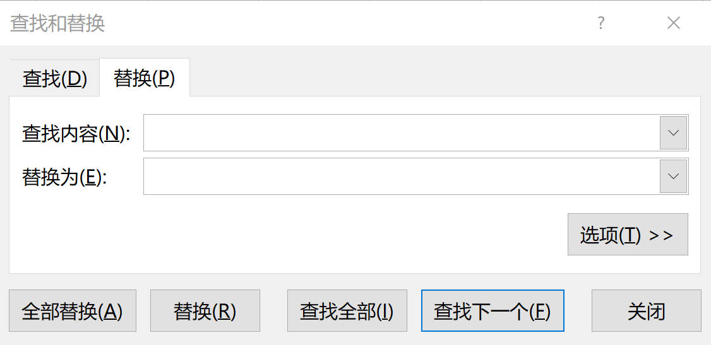<br />通过“定位”删除空值：<br />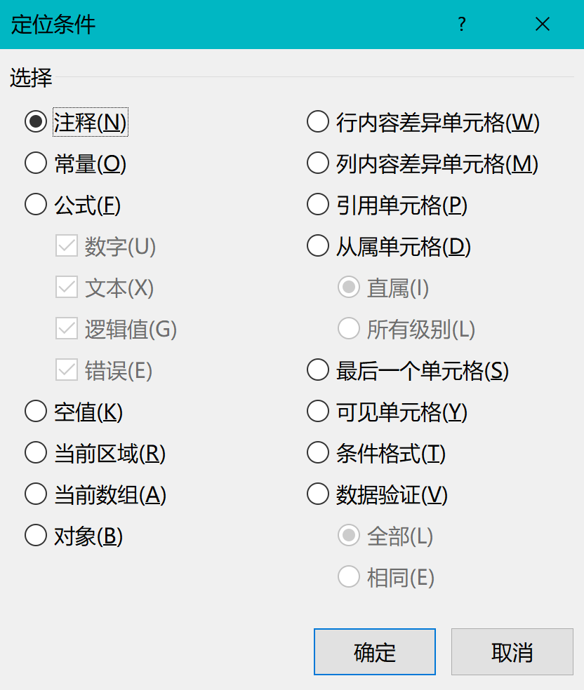<br />pandas处理空值的方式比较灵活，可以使用`dropna`函数删除空值
```python
import pandas as pd
data=pd.read_csv('成绩表.csv',encoding='gbk')
data.dropna(how='any')
```
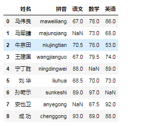<br />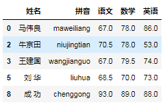<br />用`fillna`函数实现空值的填充
<a name="oL6MJ"></a>
### ①使用数字0填充数据表中的空值
```python
data.fillna(value=0)  
```
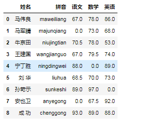
<a name="FxPcB"></a>
### ②使用平均值填充数据表中的空值
```python
data['语文'].fillna(data['语文'].mean())
```
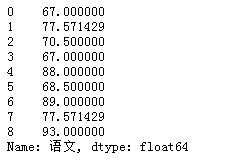
<a name="UtqXl"></a>
## 2、删除空格
excel中清理空格很简单，直接替换即可<br />pandas删除空格也很方便，主要使用`map`函数
```python
data['姓名']=data['姓名'].map(str.strip)
data
```
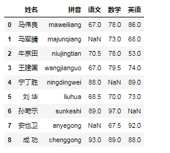
<a name="vIiIE"></a>
## 3、大小写转换
excel中大小写转换函数分别为`upper()`和`lower()`<br />pandas中转换函数也为`upper()`和`lower()`
```python
data['拼音']=data['拼音'].str.upper()
data
```
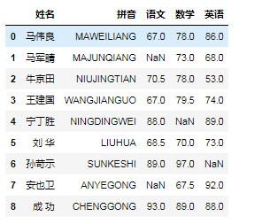
```python
data['拼音']=data['拼音'].str.lower()
data
```
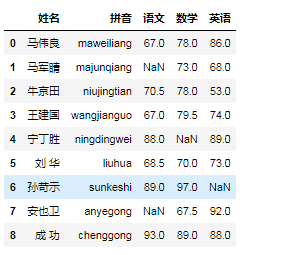
<a name="cpVAJ"></a>
## 4、更改数据格式
excel中更改数据格式通过快捷键“ctrl+1”打开“设置单元格格式”：<br />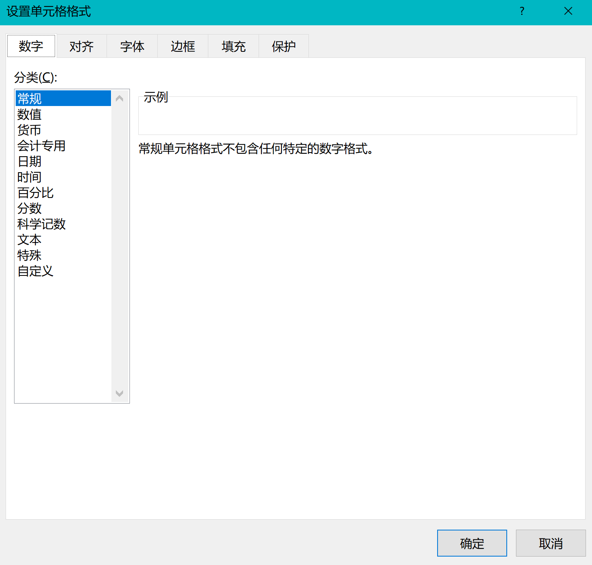<br />pandas使用`astype`来修改数据格式，以将“语文”列改成整数为例
```python
data['语文'].dropna(how='any').astype('int')
```
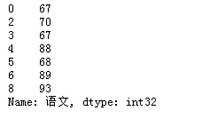
<a name="pquSi"></a>
## 5、更改列名称
excel中更改列名称就不说了，大家都会<br />pandas使用`rename`函数更改列名称，代码如下：
```python
data.rename(columns={'语文':'语文成绩'})
```
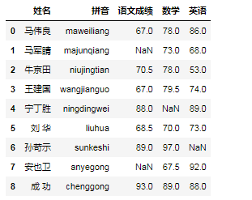
<a name="zlffr"></a>
## 6、删除重复值
excel的功能区“数据”下有“删除重复项”，可以用来删除表中的重复值，默认保留最第一个重复值，把后面的删除：<br /><br />pandas使用`drop_duplicates`函数删除重复值：
```python
data['数学'].drop_duplicates()  #默认删除后面的重复值

data['数学'].drop_duplicates(keep='last')  #删除第一项重复值
```
<a name="V9oEB"></a>
## 7、修改及替换数据
excel中使用“查找和替换”功能实现数值的替换<br />pandas中使用`replace`函数实现数据替换
```python
data['姓名'].replace('成  功','失  败')
```


