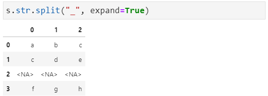

Python Pandas
<a name="Y63m1"></a>
## 1、文本数据类型
在pandas中存储文本数据有两种方式：`object `和 `string`。在pandas 1.0版本之前，object是唯一的文本类型，在一列数据中如果包含数值和文本等混合类型则一般也会默认为object。在pandas 1.0 版本之后，新增了string文本类型，可以更好的支持字符串的处理。
<a name="vPj1V"></a>
### 1.1. 类型简介
**默认情况下，object仍然是文本数据默认的类型**。<br /><br />**如果要采用string类型，可以通过**`**dtype**`**进行指定**<br /><br />**在Series 或 **`**Dataframe**`**被创建后，还可以通过**`**astype**`**进行类型强制转换**<br /><br />当然，还有个`df.convert_dtypes()`方法可以进行智能数据类型选择<br />
<a name="Aap5u"></a>
### 1.2. 类型差异
string和object在操作上有所不同。<br />对于sting来说，返回**数字**输出的字符串访问器方法将始终返回可为空的整数类型；对于object来说，是 int 或 `float`，具体取决于 NA 值的存在<br /><br />对于string类型来说，返回**布尔**输出的方法将返回一个可为空的布尔数据类型<br />
<a name="DciZU"></a>
## 2、字符串方法
Series 和 Index 都有一些字符串处理方法，可以方便进行操作，最重要的是，这些方法会自动排除缺失/NA 值，可以通过`str`属性访问这些方法。
<a name="jYaSv"></a>
### 2.1. 文本格式
文本格式是对字符串文本进行格式操作，比如转换大小写之类的
```python
>>> s = pd.Series(
...     ["A", "B", "Aaba", "Baca", np.nan, "cat"],
...     dtype="string"
... )
>>> s.str.lower() # 转小写
0       a
1       b
2    aaba
3    baca
4    <NA>
5     cat
dtype: string
>>> s.str.upper() # 转大写
0       A
1       B
2    AABA
3    BACA
4    <NA>
5     CAT
dtype: string
>>> s.str.title() # 每个单词大写
0       A
1       B
2    Aaba
3    Baca
4    <NA>
5     Cat
dtype: string
>>> s.str.capitalize() # 首字母大写
0       A
1       B
2    Aaba
3    Baca
4    <NA>
5     Cat
dtype: string
>>> s.str.swapcase() # 大小写互换
0       a
1       b
2    aABA
3    bACA
4    <NA>
5     CAT
dtype: string
>>> s.str.casefold() # 转为小写，支持其他语言
0       a
1       b
2    aaba
3    baca
4    <NA>
5     cat
dtype: string

```
<a name="XuAHl"></a>
### 2.2. 文本对齐
文本对齐是指在文本显示的时候按照一定的规则进行对齐处理，比如左对齐、右对齐、居中等等
```python
>>> s.str.center(10,fillchar='-') # 居中对齐，宽度为10，填充字符为'-'
0    ----A-----
1    ----B-----
2    ---Aaba---
3    ---Baca---
4          <NA>
5    ---cat----
dtype: string
>>> s.str.ljust(10,fillchar='-') # 左对齐
0    A---------
1    B---------
2    Aaba------
3    Baca------
4          <NA>
5    cat-------
dtype: string
>>> s.str.rjust(10,fillchar='-') # 右对齐
0    ---------A
1    ---------B
2    ------Aaba
3    ------Baca
4          <NA>
5    -------cat
dtype: string
>>> s.str.pad(width=10, side='left', fillchar='-') # 指定宽度，填充字符对齐方式为 left，填充字符为'-'
0    ---------A
1    ---------B
2    ------Aaba
3    ------Baca
4          <NA>
5    -------cat
dtype: string
>>> s.str.zfill(3) # 指定宽度3，不足则在前面添加0
0     00A
1     00B
2    Aaba
3    Baca
4    <NA>
5     cat
dtype: string
```
<a name="cnuK0"></a>
### 2.3. 计数与编码
文本计数与内容编码
```python
>>> s.str.count("a") # 字符串中指定字母的数量
0       0
1       0
2       2
3       2
4    <NA>
5       1
dtype: Int64
>>> s.str.len() # 字符串的长度
0       1
1       1
2       4
3       4
4    <NA>
5       3
dtype: Int64
>>> s.str.encode('utf-8') # 编码
0       b'A'
1       b'B'
2    b'Aaba'
3    b'Baca'
4       <NA>
5     b'cat'
dtype: object
>>> s.str.encode('utf-8').str.decode('utf-8') # 解码
0       A
1       B
2    Aaba
3    Baca
4    <NA>
5     cat
dtype: object    
```
<a name="PbeGR"></a>
### 2.4. 格式判断
格式判断就是对字符串进行字符格式判断，比如是不是数字，是不是字母，是不是小数等等
```python
>>> s = pd.Series(
...     ["A", "B", "Aaba", 12, 5, np.nan, "cat"],
...     dtype="string"
... )
>>> s.str.isalpha() # 是否为字母
0     True
1     True
2     True
3    False
4    False
5     <NA>
6     True
dtype: boolean
>>> s.str.isnumeric() # 是否为数字0-9
0    False
1    False
2    False
3     True
4     True
5     <NA>
6    False
dtype: boolean
>>> s.str.isalnum() # 是否由数字或字母组成
0    True
1    True
2    True
3    True
4    True
5    <NA>
6    True
dtype: boolean
>>> s.str.isdigit() # 是否为数字
0    False
1    False
2    False
3     True
4     True
5     <NA>
6    False
dtype: boolean
>>> s.str.isdecimal() # 是否为小数
0    False
1    False
2    False
3     True
4     True
5     <NA>
6    False
dtype: boolean
>>> s.str.isspace() # 是否为空格
0    False
1    False
2    False
3    False
4    False
5     <NA>
6    False
dtype: boolean
>>> s.str.islower() # 是否为小写
0    False
1    False
2    False
3    False
4    False
5     <NA>
6     True
dtype: boolean
>>> s.str.isupper() # 是否为大写
0     True
1     True
2    False
3    False
4    False
5     <NA>
6    False
dtype: boolean
>>> s.str.istitle() # 是否为标题格式
0     True
1     True
2     True
3    False
4    False
5     <NA>
6    False
dtype: boolean
```
以上这些字符串的方法其实和python原生的字符串方法基本相同。
<a name="RPZkH"></a>
## 3、文本高级操作
文本高级操作包含文本拆分、文本替换、文本拼接、文本匹配与文本提取等，学会这些操作技巧，基本上就可以完成常见的复杂文本信息处理与分析了。
<a name="zU6TM"></a>
### 3.1. 文本拆分
文本拆分类似excel里的数据分列操作，将文本内容按照指定的字符进行分隔，具体大家可以看下面案例。<br />方法`split()`返回的是一个列表<br /><br />可以使用`get` 或 `[]`符号访问拆分列表中的元素<br /><br />还可以**将拆分后的列表展开**，需要使用参数`expand`<br /><br />同样，可以**限制分隔的次数**，默认是从左开始（`rsplit`是从右到左），用到参数`n`<br /><br />对于更复杂的拆分规格，可以在**分隔符处传入正则表达式**<br /><br />**补充**：像`str.slice()`切片选择方法与`str.partition()`文本划分方法都有类似效果，大家可以自定查阅官方文档案例了解。
<a name="FU7p0"></a>
### 3.2. 文本替换
经常在数据处理中用到替换功能，将指定的一些数据替换成想要替换的内容。同样，在处理文本数据替换的时候，`str.repalce()`也可以很好的满足这一操作。<br /><br />以上案例中，将`regex`参数设置为`False`就可以进行字面替换而不是对每个字符进行转义；反之，则需要转义，为正则替换。<br />此外，还可以正则表达式替换，比如下面这个例子中实现的是对文本数据中英文部分进行倒序替换：<br /><br />可能部分同学无法直观的理解上面的正则案例，这里简单的拆解介绍下：<br /><br />另外，还可以通过`str.slice_replace()`方法实现**保留选定内容，替换剩余内容**的操作：<br /><br />**补充**：还可通过`str.repeat()`方法让原有的文本内容重复，具体大家可以自行体验
<a name="T5M8n"></a>
### 3.3. 文本拼接
文本拼接是指将多个文本连接在一起，基于`str.cat()`方法<br />比如，**将一个序列的内容进行拼接**，默认情况下会忽略缺失值，亦可指定缺失值<br /><br />**连接一个序列和另一个等长的列表**，默认情况下如果有缺失值，则会导致结果中也有缺失值，不过可以通过指定缺失值`na_rep`的情况进行处理<br /><br />**连接一个序列和另一个等长的数组（索引一致）**<br /><br />**索引对齐**<br /><br />在索引对齐中，还可以通过参数`join`来**指定对齐形式**，默认为左对齐`left`，还有`outer`, `inner`, `right`<br />
<a name="sndf5"></a>
### 3.4. 文本匹配
文本匹配这里介绍查询和包含判断，分别用到`str.findall()`、`str.find()`和`str.contains()`方法。<br />**文本查询**，`str.findall()`返回查询到的值，`str.find()`返回匹配到的结果所在的位置（-1表示不存在）<br /><br />**文本包含**，其实`str.contain()`常见于数据筛选中<br /><br />此外，还有`str.startwith()`和`str.endwith()`用于指定开头还是结尾包含某字符的情况，而`str.match()`则可用于正则表达式匹配。
<a name="ZL1R4"></a>
### 3.5. 文本提取
在日常中经常遇到需要提取某序列文本中特定的字符串，这个时候采用`str.extract()`方法就可以很好的进行处理，它是**用正则表达式将文本中满足要求的数据提取出来形成单独的列**。<br />比如下面这个案例，用正则表达式将文本分为两部分，第一部分是字母a和b，第二部分匹配数字：<br /><br />在上述案例中，`expand`参数为`Fasle`时如果返回结果是一列则为`Series`，否则是`Dataframe`。<br />还可以对提取的列进行命令，形式如`?P<列名称>`，具体如下：<br /><br />**提取全部匹配项**，会将一个文本中所有符合规则的内容匹配出来，最后形成一个多层索引数据：<br /><br />还可以从字符串列中**提取虚拟变量**，例如用`"|"`分隔（第一行abc只有a，第二行有a和b，第三行都没有，第四行有a和c）：<br />
