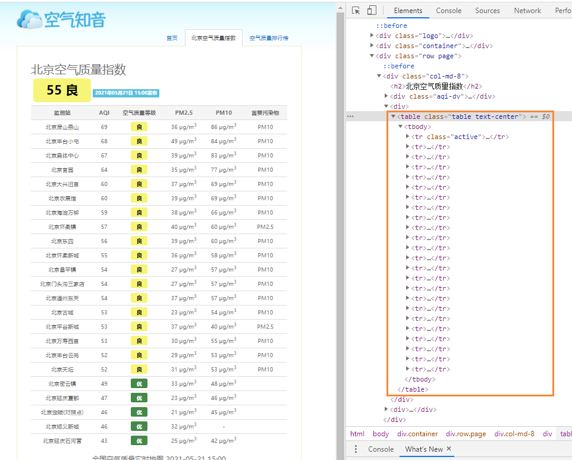
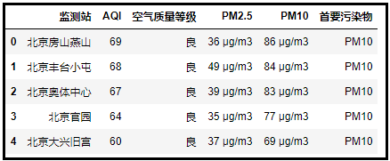
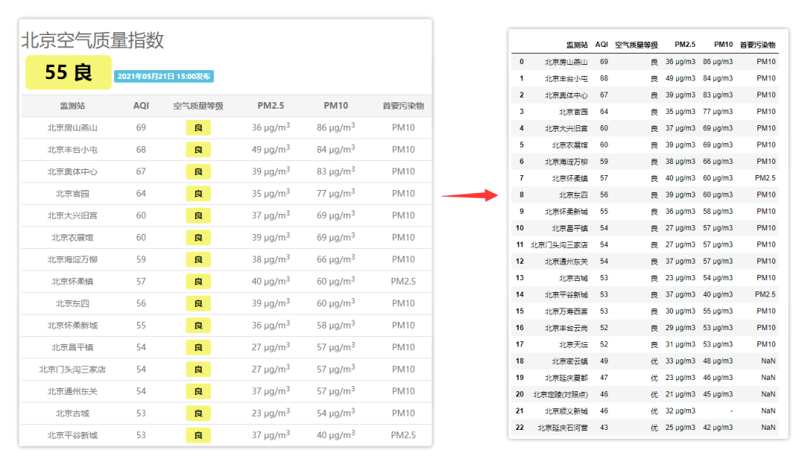
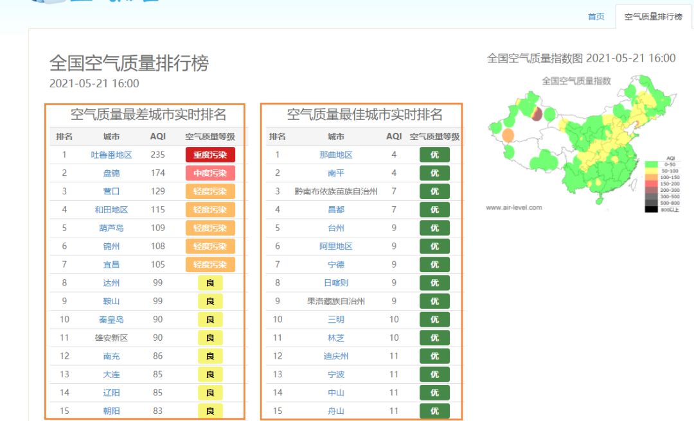
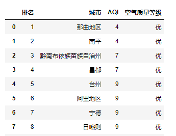
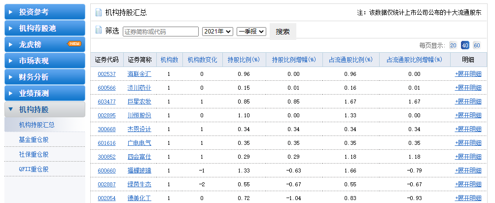
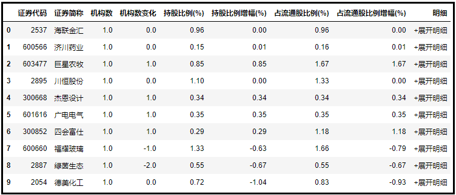
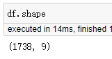

Python Pandas<br />用Pandas爬取表格数据有一定的局限性。<br />它只适合抓取Table表格型数据，先看看什么样的网页满足条件？
<a name="Ce7JC"></a>
## 什么样的网页结构适合Pandas爬取？
用浏览器打开网页，F12查看其HTML的结构，会发现符合条件的网页结构都有个共同的特点。<br />如果发现HTML结构是下面这个Table格式的，那直接可以用Pandas上手。
```html
<table class="..." id="...">
  <thead>
    <tr>
      <th>...</th>
    </tr>
  </thead>
  <tbody>
    <tr>
      <td>...</td>
    </tr>
    <tr>...</tr>
    <tr>...</tr>
    ...
    <tr>...</tr>
    <tr>...</tr>
  </tbody>
</table>
```
这个看着不直观，打开一个北京地区空气质量网站。<br />F12，左侧是网页中的质量指数表格，它的网页结构完美符合了Table表格型数据网页结构。<br /><br />它就非常适合使用pandas来爬取。
<a name="DLKrM"></a>
## `pd.read_html()`
Pandas提供`read_html()`，`to_html()`两个函数用于读写html格式的文件。这两个函数非常有用，一个轻松将DataFrame等复杂的数据结构转换成HTML表格；另一个不用复杂爬虫，简单几行代码即可抓取Table表格型数据，简直是个神器！<br />具体的`pd.read_html()`参数，可以查看其官方文档：<br />[https://pandas.pydata.org/pandas-docs/stable/reference/api/pandas.read_html.html](https://pandas.pydata.org/pandas-docs/stable/reference/api/pandas.read_html.html)<br />下面直接拿刚才的网页直接上手开工！
```python
import pandas as pd
df = pd.read_html("http://www.air-level.com/air/beijing/", encoding='utf-8',header=0)[0]
```
这里只加了几个参数，`header`是指定列标题所在的行。加上导包，只需两行代码。
```python
df.head()
```
<br />对比结果，可以看到成功获取了表格数据。<br />
<a name="qjuTg"></a>
## 多个表格
上一个案例中
```python
pd.read_html()[0]
```
对于`pd.read_html()`获取网页结果后，还加了一个[0]。这是因为网页上可能存在多个表格，这时候就需要靠列表的切片`tables[x]`来指定获取哪个表格。<br />比如还是刚才的网站，空气质量排行榜网页就明显由两个表格构成的。<br /><br />这时候如果用`pd.read_html()`来获取右边的表格，只需要稍微修改即可。
```python
import pandas as pd
df = pd.read_html("http://www.air-level.com/rank", encoding='utf-8',header=0)[1]
```
对比之下，可以看到成功获取到了网页右侧的表格。<br /><br />以上就是用`pd.read_html()`来简单爬取静态网页。但是之所以使用Python，其实是为了提高效率。可是若仅仅一个网页，鼠标选择复制岂不是更简单。所以Python操作最大的优点会体现在批量操作上。
<a name="lSjBn"></a>
## 批量爬取
下面展示一下如何用Pandas批量爬取网页表格数据👇<br />以新浪财经机构持股汇总数据为例：<br /><br />一共47页，通过for循环构建47个网页url，再用`pd.read_html()`循环爬取。
```python
df = pd.DataFrame()
for i in range(1, 48):
    url = f'http://vip.stock.finance.sina.com.cn/q/go.php/vComStockHold/kind/jgcg/index.phtml?p={i}'
    df = pd.concat([df, pd.read_html(url)[0]]) # 爬取+合并DataFrame
```
还是几行代码，轻松解决。<br /><br />一共47页1738条数据都获取到了。<br />
