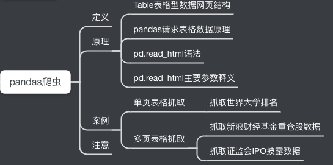
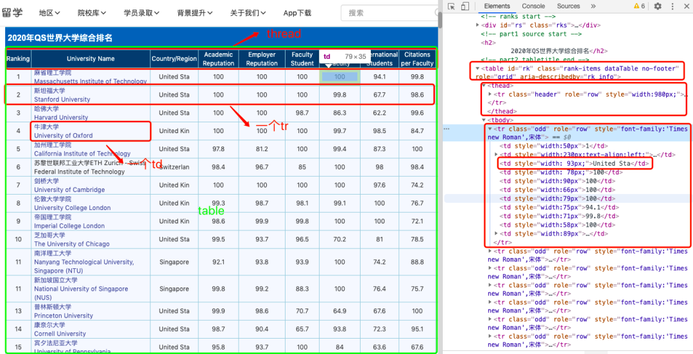
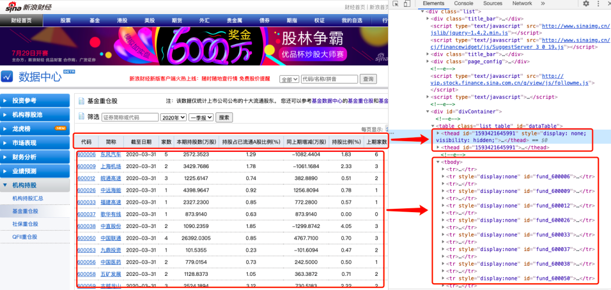
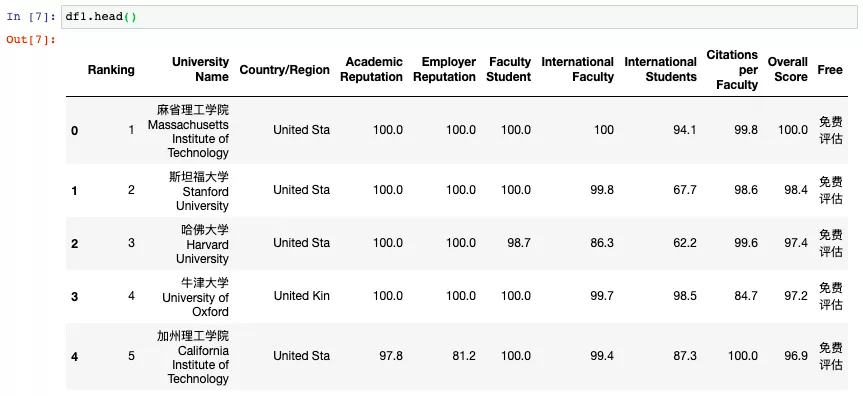
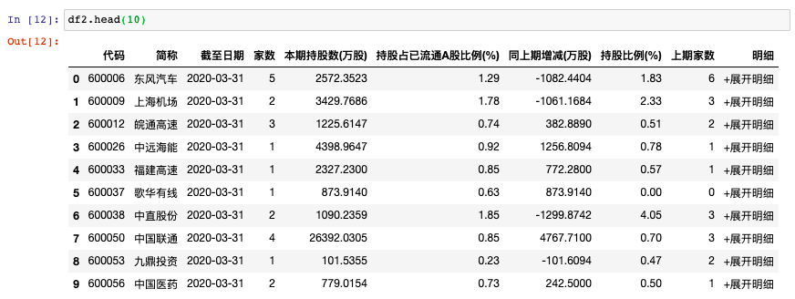
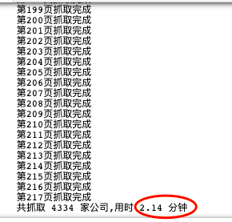
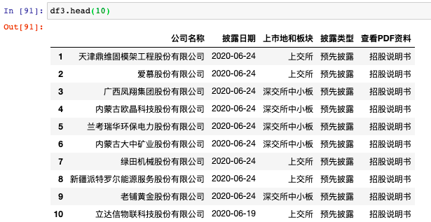

Python Pandas 爬虫<br />谈及Pandas的read.xxx系列的函数，第一反应会想到比较常用的`pd.read_csv()`和`pd.read_excel()`，大多数人估计没用过`pd.read_html()`这个函数。虽然它低调，但功能非常强大，用于抓取Table表格型数据时，简直是个神器。这个神器可以用来爬虫！<br />
<a name="JrOZ1"></a>
## 定 义
`pd.read_html()`这个函数功能强大，无需掌握正则表达式或者`xpath`等工具，短短的几行代码就可以轻松实现抓取Table表格型网页数据。
<a name="azCyV"></a>
## 原 理
<a name="a1Rk9"></a>
### 1、Table表格型数据网页结构
为了了解Table网页结构，看个简单例子。<br /><br />指南者留学网<br />另一个例子：<br /><br />新浪财经网<br />规律：以Table结构展示的表格数据，网页结构长这样：
```html
<table class="..." id="...">
  <thead>
    <tr>
      <th>...</th>
    </tr>
  </thead>
  <tbody>
    <tr>
      <td>...</td>
    </tr>
    <tr>...</tr>
    <tr>...</tr>
    ...
    <tr>...</tr>
    <tr>...</tr>        
  </tbody>
</table>
```
Table表格一般网页结构
<a name="ogx1d"></a>
### 2、pandas请求表格数据原理
<br />基本流程<br />其实，`pd.read_html`可以将网页上的表格数据都抓取下来，并以`DataFrame`的形式装在一个list中返回。
<a name="DTXrG"></a>
### 3、`pd.read_html`语法及参数
<a name="lU5fx"></a>
#### 基本语法
```python
pandas.read_html(io, match='.+', flavor=None, 
                 header=None,index_col=None,skiprows=None, 
                 attrs=None, parse_dates=False, thousands=', ', 
                 encoding=None, decimal='.', converters=None, na_values=None, 
                 keep_default_na=True, displayed_only=True）
```
<a name="FFQht"></a>
#### 主要参数
`io`：接收网址、文件、字符串；<br />`parse_dates`：解析日期；<br />`flavor`：解析器；<br />`header`：标题行；<br />`skiprows`：跳过的行；<br />`attrs`：属性，比如 `attrs = {'id': 'table'}`
<a name="L8FxP"></a>
## 实 战
<a name="N7cNv"></a>
### 1、案例1：抓取世界大学排名（1页数据）
```python
import pandas as pd 
import csv
url1 = 'http://www.compassedu.hk/qs'
df1 = pd.read_html(url1)[0]  #0表示网页中的第一个Table
df1.to_csv('世界大学综合排名.csv',index=0)
```
5行代码，几秒钟就搞定，数据预览：<br /><br />世界大学排行榜
<a name="b2pHb"></a>
### 2、案例2：抓取新浪财经基金重仓股数据（6页数据）
```python
import pandas as pd
import csv
df2 = pd.DataFrame()
for i in range(6):
    url2 = 'http://vip.stock.finance.sina.com.cn/q/go.php/vComStockHold/kind/jjzc/index.phtml?p={page}'.format(page=i+1)
    df2 = pd.concat([df2,pd.read_html(url2)[0]])
    print('第{page}页抓取完成'.format(page = i + 1))
df2.to_csv('./新浪财经数据.csv',encoding='utf-8',index=0)
```
8行代码搞定，还是那么简单。<br />来预览下爬取到的数据：<br /><br />基金重仓股数据
<a name="f0gjE"></a>
### 3、案例3：抓取证监会披露的IPO数据（217页数据）
```python
import pandas as pd
from pandas import DataFrame
import csv
import time
start = time.time() #计时
df3 = DataFrame(data=None,columns=['公司名称','披露日期','上市地和板块','披露类型','查看PDF资料']) #添加列名
for i in range(1,218):  
    url3 ='http://eid.csrc.gov.cn/ipo/infoDisplay.action?pageNo=%s&temp=&temp1=&blockType=byTime'%str(i)
    df3_1 = pd.read_html(url3,encoding='utf-8')[2]  #必须加utf-8，否则乱码
    df3_2 = df3_1.iloc[1:len(df3_1)-1,0:-1]  #过滤掉最后一行和最后一列（NaN列）
    df3_2.columns=['公司名称','披露日期','上市地和板块','披露类型','查看PDF资料'] #新的df添加列名
    df3 = pd.concat([df3,df3_2])  #数据合并
    print('第{page}页抓取完成'.format(page=i))
df3.to_csv('./上市公司IPO信息.csv', encoding='utf-8',index=0) #保存数据到csv文件
end = time.time()
print ('共抓取',len(df3),'家公司,' + '用时',round((end-start)/60,2),'分钟')
```
这里注意要对抓下来的Table数据进行过滤，主要用到`iloc`方法。另外，还加了个程序计时，方便查看爬取速度。<br /><br />2分钟爬下217页4334条数据，相当nice了。来预览下爬取到的数据：<br /><br />上市公司IPO数据<br />注意，并不是所有表格都可以用`pd.read_html`爬取，有的网站表面上看起来是表格，但在网页源代码中不是`table`格式，而是`list`列表格式。这种表格则不适用`read_html`爬取，得用其他的方法，比如`selenium`。
