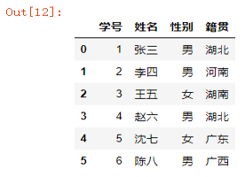

Python Pandas
<a name="hraty"></a>
## 1、pandas介绍
Pandas是一个强大的数据分析库，它的Series和DataFrame数据结构，使得处理起二维表格数据变得非常简单。<br />基于后面需要对Excel表格数据进行处理，有时候使用Pandas库处理表格数据，会更容易、更简单。<br />Pandas库是一个内容极其丰富的库。这里主要讲述的是如何利用Pandas库完成 “表格读取”、“表格取数” 和 “表格合并” 的任务。其实Pandas能实现的功能，远远不止这些。<br />在使用这个库之前，需要先导入这个库。为了使用方便，习惯性给这个库起一个别名pd。
<a name="f2ayn"></a>
## 2、Excel数据的读取
Pandas支持读取csv、excel、json、html、数据库等各种形式的数据，非常强大。但是这里仅以读取excel文件为例，讲述如何使用Pandas库读取本地的excel文件。<br />在Pandas库中，读取excel文件使用的是`pd.read_excel()`函数，这个函数强大的原因是由于有很多参数，使得读取excel文件更方便。在这里仅仅讲述`sheet_name`、`header`、`usecols`和`names`四个常用参数。
<a name="R8njr"></a>
### ① `sheet_name`参数详解
excel文件是一个工作簿，一个工作簿有多个sheet表，每个sheet表中是一个表格数据。`sheet_name`参数就是选择要读取的sheet表，具体用法如下。<br />`sheet_name=正整数值`，等于0表示读取第一个sheet表，等于1表示读取第二个sheet表，以此类推下去。<br />`sheet_name="sheet名称"`，可以利用每张sheet表的名称，读取到不同的sheet表，更方便灵活。<br />注意：如果不指定该参数，那么默认读取的是第一个sheet表。
<a name="qn23J"></a>
#### 用法1：`sheet_name=正整数值`
```python
df = pd.read_excel("readexcel.xlsx",sheet_name=1)
df
```
结果如下：<br />
<a name="Jvv2F"></a>
#### 用法2：`sheet_name="sheet名称"`
```python
df = pd.read_excel("readexcel.xlsx",sheet_name="考试成绩表")
df
```
结果如下：<br />
<a name="vkxaY"></a>
### ② `header`参数详解
有时候待读取的excel文件，可能有标题行，也有可能没有标题行。但是默认都会将第一行读取为标题行，这个对于没有标题行的excel文件来说，显得不太合适了，因此header参数可以很好的解决这个问题。<br />`header=None`，主要针对没有标题行的excel文件，系统不会将第一行数据作为标题，而是默认取一个1,2,3…这样的标题。<br />`header=正整数值`，指定哪一行作为标题行。
<a name="dPbZe"></a>
#### 用法1：`header=None`
```python
df = pd.read_excel("readexcel.xlsx",sheet_name="copy",header=None)
df
```
结果如下：<br />
<a name="z1YSl"></a>
#### 用法2：`header=正整数值`
```python
df = pd.read_excel("readexcel.xlsx",sheet_name="基本信息表",header=1)
df
```
结果如下：<br />
<a name="OL5V6"></a>
### ③  `usecols`参数详解
当一张表有很多列的时候，如果仅仅想读取 这张表中的指定列，使用`usecols`参数是一个很好的选择。<br />关于`usecols`参数，这里有多种用法，分别进行说明。<br />`usecols=None`，表示选择一张表中的所有列，默认情况不指定该参数，也表示选择表中的所有列。<br />`usecols=[A,C]`，表示选择A列（第一列）和C列（第三列）。而`usecols=[A,C:E]`，表示选择A列，C列、D列和E列。<br />`usecols=[0,2]`，表示选择第一列和第三列。
```python
# 下面这两行代码，均表示获取前2列的数据
df = pd.read_excel("readexcel.xlsx",sheet_name="考试成绩表",usecols=[1,2])
df = pd.read_excel("readexcel.xlsx",sheet_name="考试成绩表",usecols="A:B")
df
```
结果如下：<br />
<a name="gqKQ6"></a>
### ④ `names`参数详解
如果一张表没有标题行，就需要为其指定一个标题，使用`names`参数，可以在读取数据的时候，为该表指定一个标题。<br />`names=["列名1","列名2"…]`：传入一个列表，指明每一列的列名。
```python
name_list = ["学号","姓名","性别","籍贯"]
df = pd.read_excel("readexcel.xlsx",sheet_name="copy",header=None,names=name_list)
df
```
结果如下：<br />
<a name="ovAWy"></a>
## 3、Excel数据的获取
知道怎么读取excel文件中的数据后，接下来就要学着如何灵活获取到excel表中任意位置的数据了。<br />这里一共提供了5种需要掌握的数据获取方式，分别是 “访问一列或多列” ，“访问一行或多行” ，“访问单元格中某个值” ，“访问多行多列” 。
<a name="nHjNj"></a>
### ① 什么是“位置索引”和标签索引
<br />在讲述如何取数之前，首先需要理解“位置索引”和“标签索引”这两个概念。<br />每个表的行索引就是一个“标签索引”，而标识每一行位置的数字就是 “位置索引”，如图所示。<br />在pandas中，标签索引使用的是`loc`方法，位置索引用的是`iloc`方法。接下来就基于图中这张表，来带着大家来学习如何 “取数”。<br />首先，需要先读取这张表中的数据。
```python
df = pd.read_excel("readexcel.xlsx",sheet_name="地区")
df
```
结果如下：<br />
<a name="oG5U4"></a>
### ② 访问一列或多列
“访问一列或多列”，相对来说比较容易，直接采用中括号“标签数组”的方式，就可以获取到一列或多列。
<a name="vlfZS"></a>
#### 方法1：访问一列
```python
df["武汉"]
```
<a name="eFChf"></a>
#### 方法2：访问多列
```python
df[["武汉","广水"]]
```
<a name="G3Aip"></a>
### ③ 访问一行或多行
“访问一行或多行”，方法就比较多了，因此特别容易出错，因此需要特别注意。
<a name="Ul7Eb"></a>
#### 方法1：访问一行
```python
# 位置索引
df.iloc[0]
# 标签索引
df.loc["地区1"]
```
<a name="jij9n"></a>
#### 方法2：访问多行
```python
# 位置索引
df.iloc[[0,1,3]]
# 标签索引
df.loc[["地区1","地区2","地区4"]]
```
<a name="rl0Ng"></a>
### ④ 访问单元格中某个值
“访问单元格中某个值”，也有很多种方式，既可以使用“位置索引”，也可以使用“标签索引”。
```python
# 使用位置索引
df.iloc[2,1]
# 使用标签索引
df.loc["地区3","天门"]
```
<a name="yxtDM"></a>
### ⑤ 访问多行多列
“访问多行多列”，方法就更多了。一共总结了5种方法。第一，`iloc`+切片；第二种，`loc`+标签数组；第三种，`iloc`+切片+位置数组；第四种，`loc`+切片+标签数组。
<a name="nN5OC"></a>
#### 方法1：`iloc`+切片
```python
# 选取前3行数据的所有列
df.iloc[:3,:]
```
<a name="nApAe"></a>
#### 方法2：`loc`+标签数组
```python
# 选取地区1和地区3这两行的武汉、孝感、广水列
df.loc[["地区1","地区3"],['武汉','孝感','广水']]
```
<a name="BOcUt"></a>
#### 方法3：`iloc`+切片+位置数组
```python
# 选取所有行的第2和第5列数据
df.iloc[:,[1,4]]
```
<a name="A7q8e"></a>
#### 方法4：`loc`+切片+标签数组
```python
# 选取地区1和地区2这两行的武汉和广水列
df.loc[:"地区2":,["武汉","广水"]]
```
<a name="sguCs"></a>
## 4、Excel数据的拼接
在进行多张表合并的时候，需要将多张表的数据，进行纵向（上下）拼接。在pandas中，直接使用`pd.concat()`函数，就可以完成表的纵向合并。<br />关于`pd.concat()`函数，用法其实很简单，里面有一个参数`ignore_index`需要注意，`ignore_index=True`，表示会忽略原始索引，生成一组新的索引。<br />如果不使用`ignore_index`参数
```python
df1 = pd.read_excel("concat.xlsx",sheet_name="Sheet1")
df2 = pd.read_excel("concat.xlsx",sheet_name="Sheet2")
pd.concat([df1,df2],ignore_index=True)
```
结果如下：<br /><br />从上表可以看到，里面有两条记录是完全重复的，直接可以再调用`drop_duplicates()`函数，实现去重操作。
```python
df1 = pd.read_excel("concat.xlsx",sheet_name="Sheet1")
df2 = pd.read_excel("concat.xlsx",sheet_name="Sheet2")
pd.concat([df1,df2],ignore_index=True).drop_duplicates()
```
结果如下：<br />
<a name="uCqWK"></a>
## 5、Excel数据写出
将某个Excel文件中的表，进行读取、数据整理等一系列操作后，就需要将处理好的数据，导出到本地。其实Pandas库中可以导出的数据格式有很多种，同样以导出xlsx文件为例，进行讲述。<br />在Pandas库中，将数据导出为xlsx格式，使用的是`DataFrame`对象的`to_excle()`方法，其中这里面有4个常用的参数，详情如下。

- `excel_writer`：表示数据写到哪里去，可以是一个路径，也可以是一个`ExcelWriter`对象。
- `sheet_name`：设置导出到本地的`Excel`文件的`Sheet`名称。
- `index`：新导出到本地的文件，默认是有一个从0开始的索引列，设置`index=False`可以去掉这个索引列。
- `columns`：选则指定列导出，默认情况是导出所有列。
- `encoding`：有时候导出的文件会出现乱码的格式，这个时候就需要使用该参数设置文件编码格式。
```python
df1 = pd.read_excel("concat.xlsx",sheet_name="Sheet1")
df2 = pd.read_excel("concat.xlsx",sheet_name="Sheet2")
df3 = pd.concat([df1,df2],ignore_index=True)
df3.to_excel(excel_writer="to_excel.xlsx",sheet_name="to_excel",index=None)
```
<a name="pO0zw"></a>
## 6、ExcelWriter的使用
有时候需要将多excel表写入同一个工作簿，这个时候就需要借助Pandas中的`pd.ExcelWriter()`对象，默认对于xls使用xlwt引擎，对于xlsx使用`openpyxl`引擎。<br />这里面有两个参数，一个是路径参数Path，表示生成文件的存放路径，一个是时间格式化参数`datetime_format`，可以将生成文件中的时间列，按照指定时间格式化输出。
```python
df1 = pd.read_excel("concat.xlsx",sheet_name="Sheet1")
df2 = pd.read_excel("concat.xlsx",sheet_name="Sheet2")
with pd.ExcelWriter("excel_writer.xlsx",datetime_format="YYYY-MM-DD") as writer:
    df1.to_excel(excel_writer=writer,sheet_name="df1",index=None)
    df2.to_excel(excel_writer=writer,sheet_name="df2",index=None)
```
上面第三行代码，打开了一个`ExcelWriter`对象的同时，将所有设计到时间列的数据，进行格式化输出为年-月-日。<br />接着第四行代码，将df1中的数据写到这个`ExcelWriter`对象中，将这个Sheet取名为df1。<br />最后第五行代码，再将df2中的数据写入到这个`ExcelWriter`对象中，同样将Sheet取名为df1。
