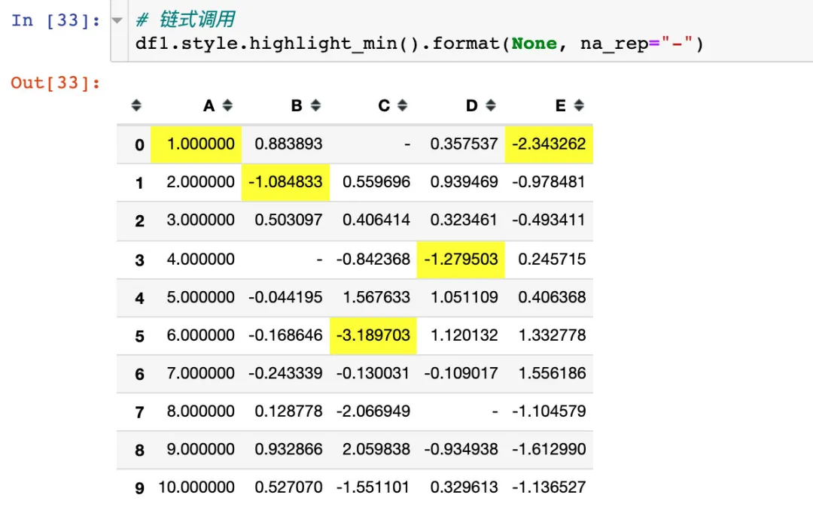
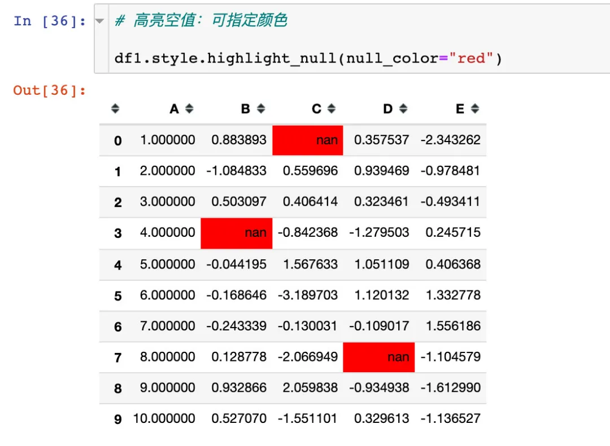

Python Pandas<br />美化Pandas的DataFrame的数据。主要是通过Pandas中的两个方法来实现：

1. `Styler.applymap`：逐个元素，返回带有CSS属性-值对的单个字符串
2. `Styler.apply`：列、表、行的方式，返回具有相同形状的Series或者DataFrame，其中每个值都是带有CSS属性值对的字符串。该方法在作用的时候，通过参数`axis`来传递，`axis=0`表示按列作用，`axis=1`表示按行作用。

官网学习地址：

- [https://pandas.pydata.org/pandas-docs/version/1.1.5/user_guide/style.html#Export-to-Excel](https://pandas.pydata.org/pandas-docs/version/1.1.5/user_guide/style.html#Export-to-Excel)
- [https://pandas.pydata.org/pandas-docs/stable/user_guide/style.html](https://pandas.pydata.org/pandas-docs/stable/user_guide/style.html)


<a name="FIiLT"></a>
## 模拟数据
```python
import pandas as pd
import numpy as np

# 设置随机种子，保证每次运行结果相同
np.random.seed(20)  

# 模拟数据
df = pd.DataFrame({'A': np.linspace(1, 10, 10)})
# 将两个DataFrame进行合并
df1 = pd.concat([df, pd.DataFrame(np.random.randn(10,4), columns=list("BCDE"))],axis=1)
df1
```
numpy中的`linspace(start,stop,setp)`：表示按照步长取数，包含头尾的数据：<br /><br />为了查看空值的效果，特意设置了3个空值nan：<br />
<a name="UI4lk"></a>
## 查看和隐藏样式
首先是查看DataFrame的样式设置：<br /><br />可以通过`render`方法来查看数据框样式的具体值：发现都是默认的CSS样式的代码<br />
<a name="YOI7g"></a>
### 隐藏索引
隐藏index的代码：<br />
<a name="QoNkA"></a>
### 隐藏指定的列
可以发现AC两个列被隐藏了，使用的是参数`subset`参数：<br /><br />下面是各种显示样式的案例讲解：
<a name="Xos9b"></a>
## 案例1：正负颜色
小于0显示红色，大于0显示蓝色
```python
def color_change(val):
    color = 'red' if val < 0 else 'blue'
    return 'color: %s' % color  

# 使用applymap并调用写好的函数
df1.style.applymap(color_change)
```
`applymap`方法是针对整个DataFrame的<br />
<a name="etbI6"></a>
## 案例2：高亮显示数据
可以高亮显示最大、最小和缺失值。手写一个简单的高亮函数：
```python
def highlight_min(x):
    is_min = x == x.min()
    return ["background-color: yellow" if v else '' for v in is_min]
```

<a name="aWFDF"></a>
## 实例3：使用默认高亮函数
Pandas中已经默认写好了内置的3个高亮函数：

- `highlight_max()`：最大
- `highlight_min()`：最小
- `highlight_null()`：空值

同时还可以搭配参数axis来显示行或者列
<a name="OOOTA"></a>
### 1、高亮最大值

<a name="Mx0qz"></a>
### 2、高亮每列的最小值

<a name="tR873"></a>
### 3、高亮空值：默认是红色
<br />当然是可以改变颜色的，通过使用参数`null_color`：<br /><br />使用参数`axis=1`，表示在行的方向上进行操作：<br />
<a name="FI2py"></a>
## 案例4：链式调用
链式调用指的是在同一个样式操作中同时使用多个函数（方法）：
```python
# color_change + highlight_max
df1.style.applymap(color_change).apply(highlight_min)

如果方法特别多，可以分行写：
# color_change + highlight_max
df1.style.\
applymap(color_change).\
apply(highlight_min)

# 或者：外面再加层括号，表示整个代码是一个整体
(df1.style.
applymap(color_change).
apply(highlight_min))
```
<br />空值高亮和改变颜色参数同时使用，实现链式调用：<br /><br />隐藏列属性和自定义参数同时使用：<br />
<a name="CEfK7"></a>
## 实例5：部分数据美化
使用参数`subset`参数控制作用的行列，传入的参数可以是：

- 列标签
- 列表（`numpy`数组）
- 元组（`row_indexer`， `column_indexer`）
<a name="Xr7QG"></a>
### 部分列属性
通过参数`subset`来指定我们想要美化的列属性：<br />
<a name="FglCM"></a>
### `pd.IndexSlice`构造列表
通过`pd.IndexSlice`来构造<br />
<a name="fdtPz"></a>
## 实例6：值的格式化显示（`Styler.format`）
`Styler.format`来控制数值的格式化输出，类似于Python中的字符串格式化
<a name="NMOK7"></a>
### 整体显示
比如想要全部数据只显示两位小数：<br />
<a name="FUPvK"></a>
### 使用字典，格式化特定列
通过字典的形式，列属性名当做键，格式说明当做值，进行格式化设置：<br />
<a name="hbAiK"></a>
### 使用`lambda`匿名函数
<br />
<a name="TgJRh"></a>
### 空值显示
通过参数`na_rep`，将空值进行替代：<br /><br />用“空值”两个字来替代：<br /><br />链式调用同时使用“-”来替代：<br />
<a name="N5sV0"></a>
### 表情符
使用emoji表情符：<br />
<a name="sVGOH"></a>
## 实例7：内置样式
<a name="HHOf9"></a>
### 内置函数
在这里使用的是内置的空值高亮函数：<br />
<a name="oXh28"></a>
### 热力图制作
借助`seaborn`库来实现：
```python
import seaborn as sns

cm = sns.light_palette("blue", as_cmap=True)
s = df1.style.background_gradient(cmap=cm)
s 
```

<a name="sCvzT"></a>
### 连续色谱
<br />通过参数`low`和`high`来指定色谱的范围：<br />
<a name="GE5yC"></a>
### `set_properties`使用
```python
### set_properties使用

df1.style.set_properties(**{"background":"yellow",  # 背景色
                           "color":"red",  # 字体
                           "border-color":"black"})  # 边界
```

<a name="pT8cJ"></a>
## 实例8：个性化条形图
<a name="pYiL4"></a>
### 默认方式
通过`bar`方法来操作：<br />
<a name="oOs0P"></a>
### 参数`align`
有3种对齐方式：

- `left`：最小值从单元格的左侧开始
- `zero`：零值位于单元格的中心
- `mid`：单元格中的中心在（max-min)/2处

<br /><br />
<a name="lyhOo"></a>
## 实例9：样式共享
假设某个一个DataFrame创建了一个样式，然后想在另一个DataFrame中直接使用这个样式，该怎么做呢？<br /><br />先创建一个样式style1：<br /><br />将style1运用到style2中：<br />
<a name="epuGe"></a>
## 实例10：设置精度`set_precision`
通常是给数据框中的数据指定精度（小数位）：<br /><br />
<a name="xiIRy"></a>
## 实例11：设置标题
使用`set_caption`方法<br />
<a name="Fo8Ds"></a>
## 实例12：缺失值设置
使用的是`set_na_rep`函数：
```python
(df1.style.set_na_rep("FAIL")
    .format(None, na_rep="PASS", subset=["D"])
    .highlight_null("yellow"))
```

<a name="doMfN"></a>
## 实例13：综合案例
```python
(df1.style
  .set_na_rep('-')  # 设置空值
  .format({'C':'{:.4f}',  # 精度设置
           'D':'{:.4f}',
           'E':'{:.2%}'},na_rep="-")  # 精度和空值同时设置
  .highlight_null("green")  # 空值高亮
  .applymap(color_change,subset=['D'])  # D列使用color_change函数
  .apply(highlight_min,subset=['C'])  # C列使用highlight_min
  .background_gradient(cmap='cubehelix',subset=['B','D'])  # 背景色设置
  .bar(subset=['E'], align='mid', color=['#60BCD4','#6A1B9A'])  # 柱状图设置
  .set_caption("Title of Pandas Style")  # 标题设置
  .hide_index()  # 隐藏索引
  .hide_columns(subset=['A']))  # 隐藏A列
```

<a name="TWb2A"></a>
## 实例14：终极武器
```python
# 版本至少需要pandas1.2.0
style1 = [
    dict(selector="th", props=[("font-size", "125%"), 
                               ("text-align", "center"),
                               ("background-color", "#F0F3CF"),
                               ('width',"100px"),
                               ('height','80px')]),
    
    dict(selector="td", props=[("font-size", "105%"), 
                               ("text-align", "right"),
                               ('width',"150px"),
                               ('height','50px')]),
    
    dict(selector="caption", props=[("caption-side", "top"),
                                    ("font-size","150%"),
                                    ("font-weight","bold"),
                                    ("text-align", "left"),
                                    ('height','50px'),
                                    ('color','#E74C3C')])]

style2 = {
    'A': [dict(selector='td', props=[('text-align','center'),
                                     ("font-weight","bold"),
                                     ("text-transform","capitalize")])],
    'B': [dict(selector='td', props=[('text-align','left'),
                                     ("font-style","italic")])],
    'C': [dict(selector='td', props=[('text-decoration','underline'),
                                     ('text-decoration-color','red'),
                                     ('text-decoration-style','wavy')])]}
# 链式调用各种设置方法
(df1.style
  .set_na_rep('-')  # 整体空值
  .format({'C':'{:.4f}','D':'{:.4f}','E':'{:.2%}'},na_rep="-")  # 精度
  .highlight_null("gray")  # 高亮空值
  .applymap(color_change,subset=['B']).highlight_max(subset=['A'])  # color_change函数和最大值高亮
  .background_gradient(cmap='Pastel1',subset=['C','D'])  #  背景
  .bar(subset=['E'], align='mid', color=['#90BCD4','#6A1B9A'])  # 柱状
  .set_caption("Advanced use of Pandas Style")  # 标题 
  .hide_index()  # 隐藏索引
  .hide_columns(subset=['E'])  # 隐藏E列  
  .set_table_styles(style1).set_table_styles(style2,overwrite=False)  # 样式传递
  .set_properties(**{'font-family': 'Microsoft Yahei','border-collapse': 'collapse',  # 属性设置
                     'border-top': '1px solid black','border-bottom': '1px solid black'}))
```

<a name="CzpBC"></a>
## 输出到Excel
这是一个还在开发阶段的功能，将DataFrame使用openyxl或者xlswriter作为引擎导出到Excel表格中，官网是这样说的：<br /><br />在这里看一个简单的案例：
```python
(df1.style
   .applymap(color_change)  # 正负改变颜色
   .apply(highlight_min)  # 高亮最小值
   .to_excel('styled.xlsx', engine='openpyxl'))
```
<br />如果不想要索引号，添加`index=False`：
```python
(df1.style
   .applymap(color_change)  # 正负改变颜色
   .apply(highlight_min)  # 高亮最小值
   .to_excel('styled.xlsx', engine='openpyxl', index=False))
```

