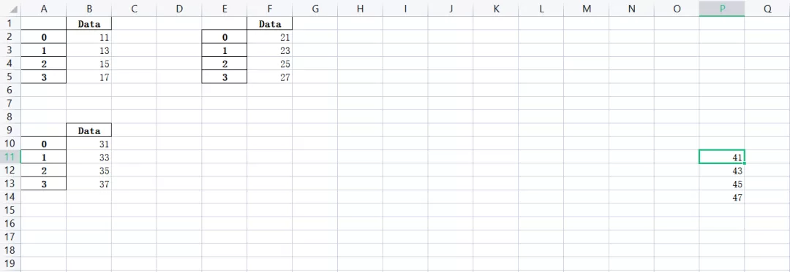
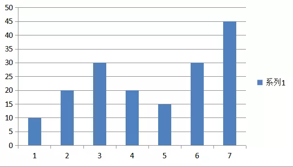
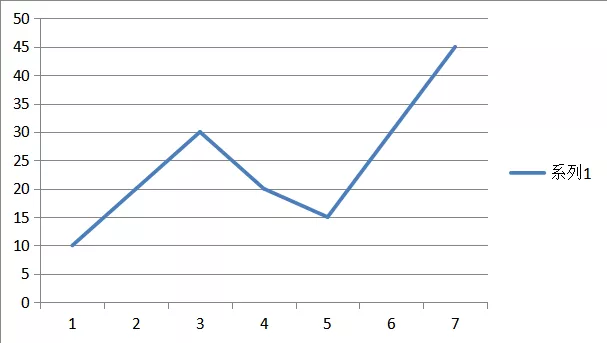
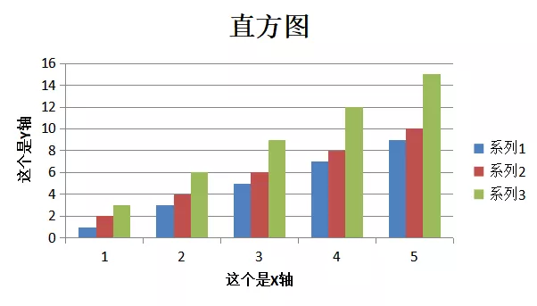
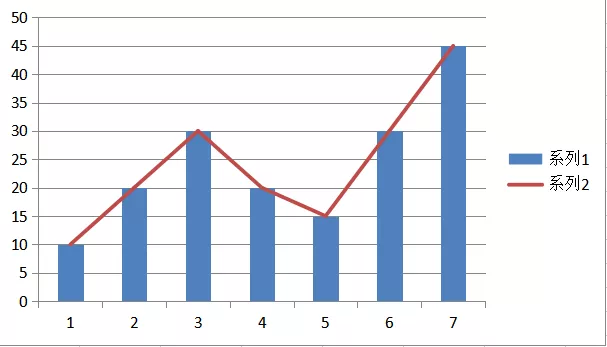
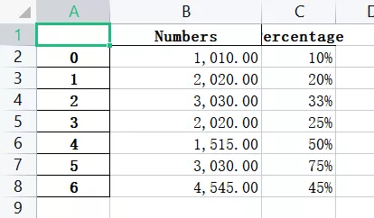

Python Pandas
<a name="xOgxM"></a>
## xlsxwriter模块安装
直接在命令行中输入
```bash
pip install xlsxwriter
```
或者使用豆瓣镜像
```bash
pip install -i https://pypi.douban.com/simple xlsxwriter
```
安装成功之后，来看一下如何使用
<a name="LFN6U"></a>
## 将多个DataFrame数据保存到Excel表格当中
当用pandas模块对Excel表格进行处理的时候，需要引用xlsxwriter模块作为内在的引擎。来实现一下如何将多个DataFrame数据保存在一张Excel表格当中，并且分成不同的sheet
```python
import pandas as pd

# 创建几个DataFrame数据集
df1 = pd.DataFrame({'Data': [11, 13, 15, 17]})
df2 = pd.DataFrame({'Data': [21, 23, 25, 27]})
df3 = pd.DataFrame({'Data': [31, 33, 35, 37]})

# 引入xlsxwriter作为引擎，制作ExcelWriter写入器
writer = pd.ExcelWriter('pandas_multiple.xlsx', engine='xlsxwriter')

# 将不同的DataFrame数据集写入不同的sheetd当中
df1.to_excel(writer, sheet_name='Sheet1')
df2.to_excel(writer, sheet_name='Sheet2')
df3.to_excel(writer, sheet_name='Sheet3')

# 输出生成的Excel文件
writer.save()
```
就可以在同级目录中看到生成的一个Excel文件，在不同的Sheet当中分别存放着指定的数据集
<a name="ElVbi"></a>
## 将多个DataFrame数据集放在一张Sheet当中
将多个DataFrame数据集放在同一张Sheet当中，通过当中的参数`startcol`与`startrow`，顾名思义就是从哪一行、哪一列开始
```python
df1 = pd.DataFrame({'Data': [11, 13, 15, 17]})
df2 = pd.DataFrame({'Data': [21, 23, 25, 27]})
df3 = pd.DataFrame({'Data': [31, 33, 35, 37]})
df4 = pd.DataFrame({'Data': [41, 43, 45, 47]})

writer = pd.ExcelWriter('pandas_positioning.xlsx', engine='xlsxwriter')

# 存放在指定的位置当中
df1.to_excel(writer, sheet_name='Sheet1')  # 默认位置是从A1开始的
df2.to_excel(writer, sheet_name='Sheet1', startcol=4)
df3.to_excel(writer, sheet_name='Sheet1', startrow=8)

# 当然我们不需要header和index
df4.to_excel(writer, sheet_name='Sheet1',
             startrow=10, startcol=15, header=False, index=False)

writer.save()
```
如下图所示<br />
<a name="satPp"></a>
## 针对表格中的数据绘制直方图
下面来看一下，如何利用Pandas来根据表格中的数据绘制柱状图，并且保存在Excel表格当中，在xlsxwriter模块当中有`add_chart()`方法，提供了9中图表的绘制方法，先来看一下柱状图的绘制
```python
df = pd.DataFrame({'Data': [10, 20, 30, 20, 15, 30, 45]})
writer = pd.ExcelWriter('pandas_chart.xlsx', engine='xlsxwriter')
df.to_excel(writer, sheet_name='Sheet1')

workbook  = writer.book
worksheet = writer.sheets['Sheet1']

# 绘制柱状图图表
chart = workbook.add_chart({'type': 'column'})

# 根据哪些数据来绘制图表
chart.add_series({'values': '=Sheet1!$B$2:$B$8'})

# 将绘制完成的图表插入到sheet当中
worksheet.insert_chart('D2', chart)

writer.save()
```
如下图所示<br />
<a name="Kvylz"></a>
## 针对表格中的数据制作折线图
只需要针对上面的代码，将`type`当中的`column`改成`line`即可绘制折线图
```python
df = pd.DataFrame({'Data': [10, 20, 30, 20, 15, 30, 45]})
writer = pd.ExcelWriter('pandas_line.xlsx', engine='xlsxwriter')
df.to_excel(writer, sheet_name='Sheet1')

workbook  = writer.book
worksheet = writer.sheets['Sheet1']

# 绘制折线图图表
chart = workbook.add_chart({'type': 'line'})

# 根据哪些数据来绘制图表
chart.add_series({'values': '=Sheet1!$B$2:$B$8'})

# 将绘制完成的图表插入到sheet当中
worksheet.insert_chart('D2', chart)

writer.save()
```
如下图所示<br /><br />除了折线图与直方图之外，小编也在上面提到，`xlsxwriter`模块提供了绘制9中图表的方法，分别是

- 折线图：`line`
- 柱状图：`column`
- 水平折线图：`bar`
- 面积图：`area`
- 饼图：`pie`
- 散点图：`scatter`
- 雷达图：`radar`
- 空心饼图：`doughnut`
- K线图：`stock`

仅仅只需要在`add_chart()`方法当中，填入对应的图表的类型即可
<a name="zXEjS"></a>
## 为图表添加标题等辅助内容
当然图表绘制出来之后，还需要添加例如标题、标记等辅助内容，毕竟希望绘制出来的图表能够被更多的人给理解，添加标题是去调用`set_title()`方法
```python
chart.set_title({'name': '.....'})
```
添加x轴与y轴上面的标注，需要用到的方法是
```python
chart.set_x_axis({'name': '...'})
chart.set_y_axis({'name': '...'})
```
尝试来绘制一个直方图，并且添加上这些辅助信息
```python
import xlsxwriter

workbook = xlsxwriter.Workbook('chart.xlsx')
worksheet = workbook.add_worksheet()

# Create a new Chart object.
chart = workbook.add_chart({'type': 'column'})

# 创建数据
data = [
    [1, 3, 5, 7, 9],
    [2, 4, 6, 8, 10],
    [3, 6, 9, 12, 15],
]

worksheet.write_column('A1', data[0])
worksheet.write_column('B1', data[1])
worksheet.write_column('C1', data[2])

# 基于指定的数据集来绘制图表
chart.add_series({'values': '=Sheet1!$A$1:$A$5'})
chart.add_series({'values': '=Sheet1!$B$1:$B$5'})
chart.add_series({'values': '=Sheet1!$C$1:$C$5'})

# 标题与标注
chart.set_title({"name": "直方图"})
chart.set_x_axis({'name': '这个是X轴'})
chart.set_y_axis({'name': '这个是Y轴'})

# 将绘制出来的图表插入到sheet当中
worksheet.insert_chart('A7', chart)

workbook.close()
```
如下图所示<br /><br />同时还可以将两种图表结合起来，例如是将折线图与直方图这两种图表结合起来绘制，通过内置的`combine()`方法
```python
chart = workbook.add_chart({'type': 'column'})
chart.add_series({'values': '=Sheet1!$B$2:$B$8'})

line_chart = workbook.add_chart({"type": "line"})
line_chart.add_series({'values': '=Sheet1!$B$2:$B$8'})

chart.combine(line_chart)
```
如下图所示<br />
<a name="Wg5kx"></a>
## 数据保留特定位数
可以对数据，尤其是一些小数，指定保留例如两位小数，或者是指定位数的小数，代码如下
```python
df = pd.DataFrame({'Numbers':    [1010, 2020, 3030, 2020, 1515, 3030, 4545],
                   'Percentage': [.1,   .2,   .33,  .25,  .5,   .75,  .45 ],
})

writer = pd.ExcelWriter("pandas_column_formats.xlsx", engine='xlsxwriter')
df.to_excel(writer, sheet_name='Sheet1')
workbook  = writer.book
worksheet = writer.sheets['Sheet1']

# 指定保留小数的位数
format1 = workbook.add_format({'num_format': '#,##0.00'})
format2 = workbook.add_format({'num_format': '0%'})

# 设置列的宽度以及保留小数的位数
worksheet.set_column('B:B', 18, format1)

# 不设置列的宽度，但是设置保留小数的位数
worksheet.set_column('C:C', None, format2)

writer.save()
```
如下图所示<br />
