Python Pandas<br />Pandas是一种高效的数据处理库，它以dataframe和series为基本数据类型，呈现出类似excel的二维数据。<br />在Jupyter中，会美化Pandas的输出。不同于IDE展示的文本形式，Jupyter可以通过CSS修改表格的样式。<br />在做excel表格的时候，常常会对重要数据进行highlight，或者用不同颜色表示数据的大小。这在Pandas中也是可以实现的，而且非常简洁。<br />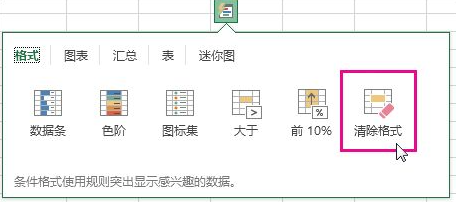<br />Pandas提供了`DataFrame.style`属性，它会返回Styler对象，用以数据样式的美化。<br />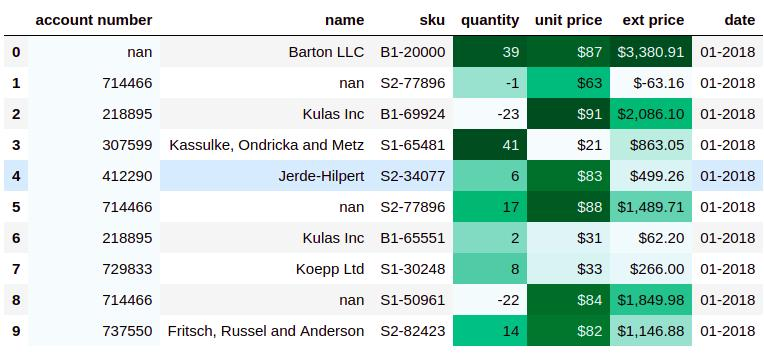<br />一般的，需要将样式函数作为参数传递到下面方法中，就可以实现图表美化。

- `Styler.applymap`: 作用于元素
- `Styler.apply`:作用于行、列或整个表

下面通过一些例子，具体展示常用的美化形式。
<a name="LcvjT"></a>
## 一、高亮显示
为便于展示，数据示例是用的2021世界人口数量前十国家数据。
```python
import pandas as pd
data = pd.read_excel(r"E:\\jupyter_notebook\\2021世界人口数据.xlsx")
data
```
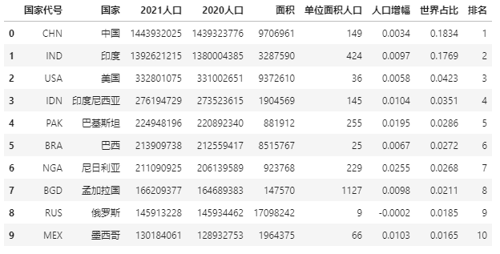<br />先看下该表的信息:
```python
data.info()
```
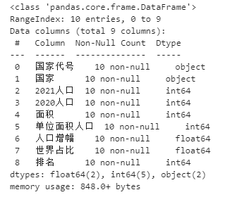<br />除了前两列，其他列都为数字类型。<br />现在对指定列的最大值进行高亮处理：
```python
def highlight_max(s):
    '''
    对列最大值高亮（黄色）处理
    '''
    is_max = s == s.max()
    return ['background-color: yellow' if v else '' for v in is_max]

data.style.apply(highlight_max,subset=['2021人口', '2020人口', '面积','单位面积人口','人口增幅','世界占比'])
```
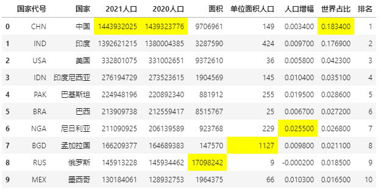<br />如果不想对元素背景高亮处理，也可以直接更改指定元素颜色，从而达到突出重点的目的。<br />标记单位面积人口列大于200的元素：
```python
def color_red(s):
    is_max = s > 200
    return ['color : red' if v else '' for v in is_max]

data.style.apply(color_red,subset=['单位面积人口'])
```
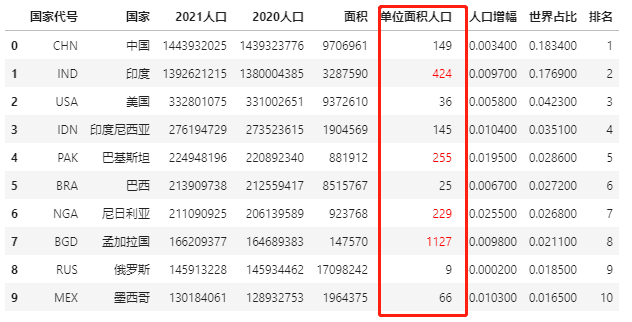
<a name="ArqTT"></a>
## 二、数据条显示
Excel条件格式里，有一个数据条显示方式，用以可视化表达数据大小。<br />Pandas Style方法中也有数据条的表达形式，用`df.style.bar`来实现。<br />还是用前面人口数据的例子，来看下如何操作数据条。
```python
import pandas as pd
data = pd.read_excel(r"E:\\jupyter_notebook\\2021世界人口数据.xlsx")
# 数据条显示指定列数据大小
data.style.bar(subset=['2021人口', '2020人口'], color='#FFA500')
```
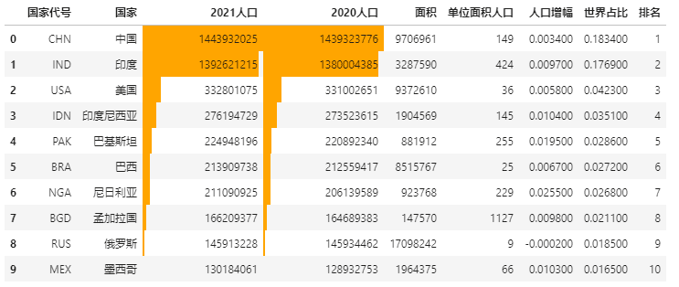
<a name="WzHmP"></a>
## 三、色阶显示
色阶也就是热力图，它和数据条一样，都用来表达数据大小。<br />Pandas Style中色阶的使用也很简单，用`df.style.background_gradient`实现。
```python
import seaborn as sns

# 使用seaborn获取颜色
cm = sns.light_palette("green", as_cmap=True)
# 色阶实现
data.style.background_gradient(cmap=cm,subset=['2021人口', '2020人口', '面积','单位面积人口','人口增幅','世界占比'])
```
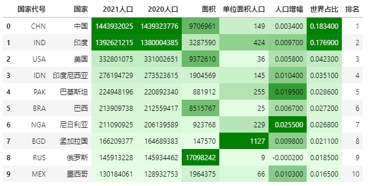<br />可以通过选择最大最小颜色比例，调节色阶范围。<br />调节前：
```python
import seaborn as sns

# 色阶实现,这里使用内置色阶类型，不调节颜色范围
data.style.background_gradient(cmap='viridis',high=0.2,low=0.1,subset=['2021人口', '2020人口', '面积','单位面积人口','人口增幅','世界占比'])
```
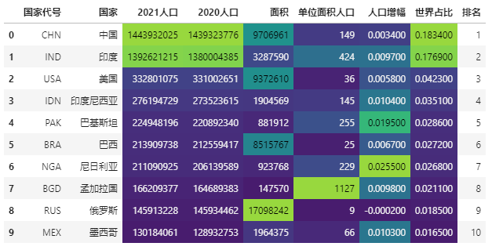<br />调节后：
```python
import seaborn as sns

# 色阶实现,这里使用内置色阶类型，调节颜色范围
data.style.background_gradient(cmap='viridis',high=0.5,low=0.3,subset=['2021人口', '2020人口', '面积','单位面积人口','人口增幅','世界占比'])
```
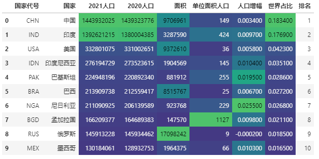
<a name="poe3m"></a>
## 四、百分比显示
有些数字需要百分比显示才能准确表达，比如说人口数据里的人口增幅、世界占比。<br />Pandas可以数据框中显示百分比，通过`Styler.format`来实现。
```python
data.style.format("{:.2%}",subset=['人口增幅','世界占比'])
```
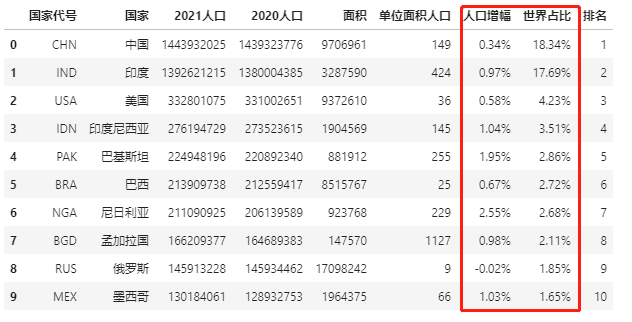
<a name="YgjoD"></a>
## 五、标记缺失值
数据集中可能会存在缺失值，如果想突出显示缺失值，该怎么操作？<br />这里有好几种常用的方法，一是用-符号替代，二是高亮显示<br />先创建一个带缺失值的表，还是用人口数据。
```python
import pandas as pd
import numpy as np
data = pd.read_excel(r"E:\\jupyter_notebook\\2021世界人口数据.xlsx")
data.iloc[1, 4] = np.nan
data.iloc[3, 1] = np.nan
data.iloc[6, 6] = np.nan
data
```
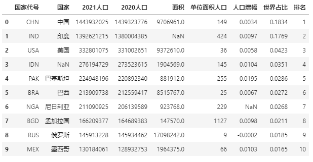<br />上面数据中有三个缺失值，用-符号替代缺失值：
```python
data.style.format(None, na_rep="-")
```
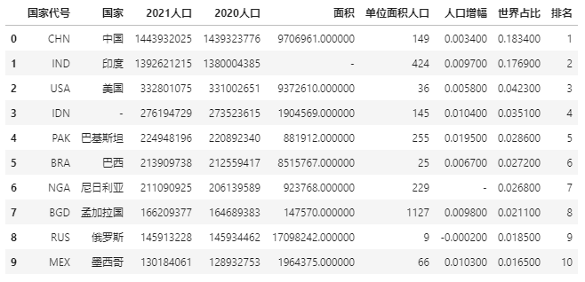<br />再试试对缺失值高亮显示：
```python
data.style.highlight_null(null_color='red')
```
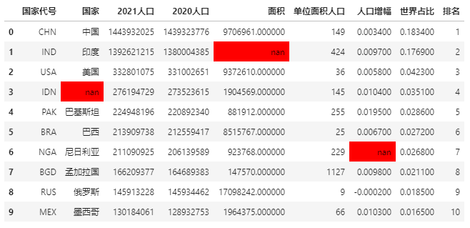
<a name="BYz5y"></a>
## 附：将样式输出到excel
Pandas中的数据美化样式不仅可以展示在notebook中，还可以输出到excel。<br />这里使用`to_excel`方法，并用openpyxl作为内核
```python
import pandas as pd
import numpy as np
data = pd.read_excel(r"E:\\jupyter_notebook\\2021世界人口数据.xlsx")
data.style.background_gradient(cmap='viridis',subset=['2021人口', '2020人口', '面积','单位面积人口','人口增幅','世界占比']).\
                              to_excel('style.xlsx', engine='openpyxl')
```
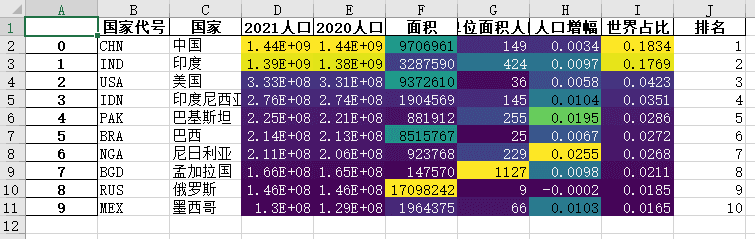
