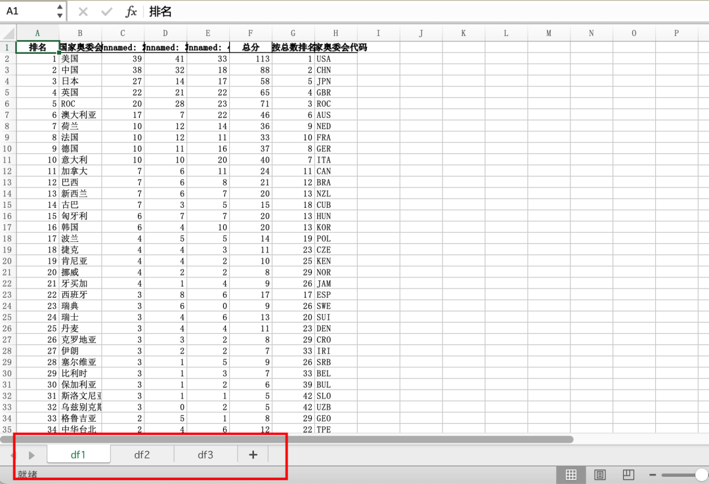
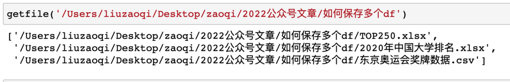
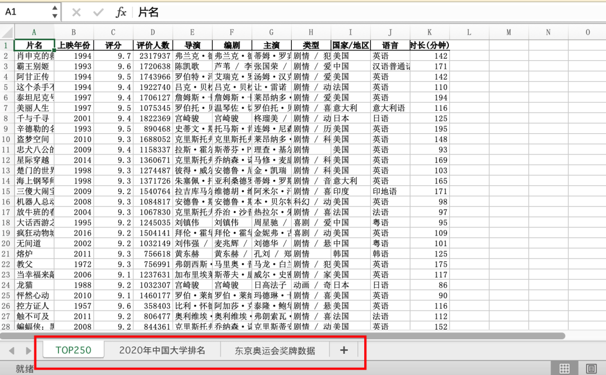

PythonPandas<br />分享一个利用Pandas进行数据分析的小技巧，即如何将多个`pandas.dataframe`保存到同一个Excel中。<br />其实只需要灵活使用pandas中的`pd.ExcelWriter()`方法即可。<br />假设现在有df1 df2 df3三个dataframe，需要将它们保存到同一个Excel的不同sheet中，只需要先创建一个`ExcelWriter`对象，然后不停写入就行
```python
df1 = pd.read_csv('东京奥运会奖牌数据.csv')
df2 = pd.read_excel("TOP250.xlsx")
df3 = pd.read_excel("2020年中国大学排名.xlsx")

writer = pd.ExcelWriter('test.xlsx')
df1.to_excel(writer,sheet_name="df1",index=False)
df2.to_excel(writer,sheet_name="df2",index=False)
df3.to_excel(writer,sheet_name="df3",index=False)
writer.save()
```
是不是和常见的文件读写`with`方法类似，也可以使用同样的方法
```python
with pd.ExcelWriter("test1.xlsx") as xlsxwriter:
    df1.to_excel(xlsxwriter,sheet_name="df1",index=False)
    df2.to_excel(xlsxwriter,sheet_name="df2",index=False)
    df3.to_excel(xlsxwriter,sheet_name="df3",index=False)
```
得到的结果是一样的，可以将多个`df`保存到一个Excel中<br /><br />这个方法虽然简单好用，但是如果要保存的 df 太多了，一个一个手动去读取再手动去保存就显得十分麻烦，另外希望sheet是文件名，如果手动复制粘贴，就更麻烦了。<br />先简单拿来一个小脚本「**获取指定目录下的全部Excel文件名**」
```python
import os
def getfile(dirpath):
	
	filelist = []
	for root,dirs,files in os.walk(dirpath):
		for file in files:
			if file.endswith("xlsx") or file.endswith("csv"):
				filelist.append(os.path.join(root,file)) 
				
    return filelist
```
执行一下，可以看到指定目录下的全部Excel文件名<br /><br />下面要做的，直接「**循环读取，自动保存**」
```python
filelist = getfile('/Users/liuzaoqi/Desktop/zaoqi/2022公众号文章/如何保存多个df')
writer = pd.ExcelWriter('test.xlsx')
for file in filelist:
    if file.endswith("xlsx"):
        df = pd.read_excel(file)
    else:
        df = pd.read_csv(file)
    df.to_excel(writer,sheet_name=file.split('/')[-1].split('.')[0],index=False)
writer.save()
```
现在，当前目录下的全部Excel就自动合并到一个Excel中的不同sheet中，并且sheet名是对应的文件名<br />
