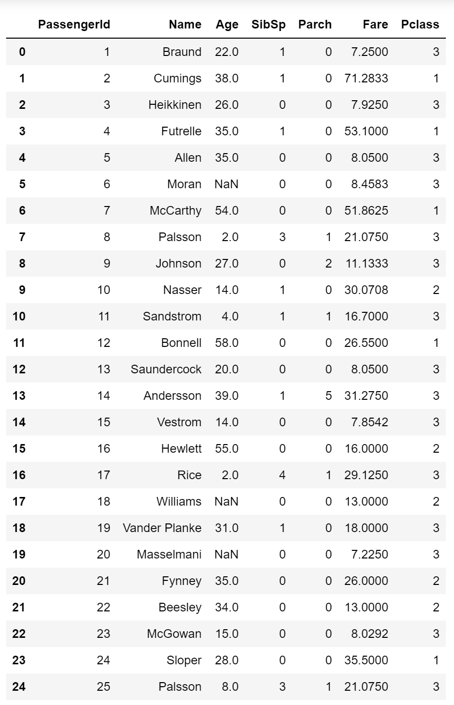
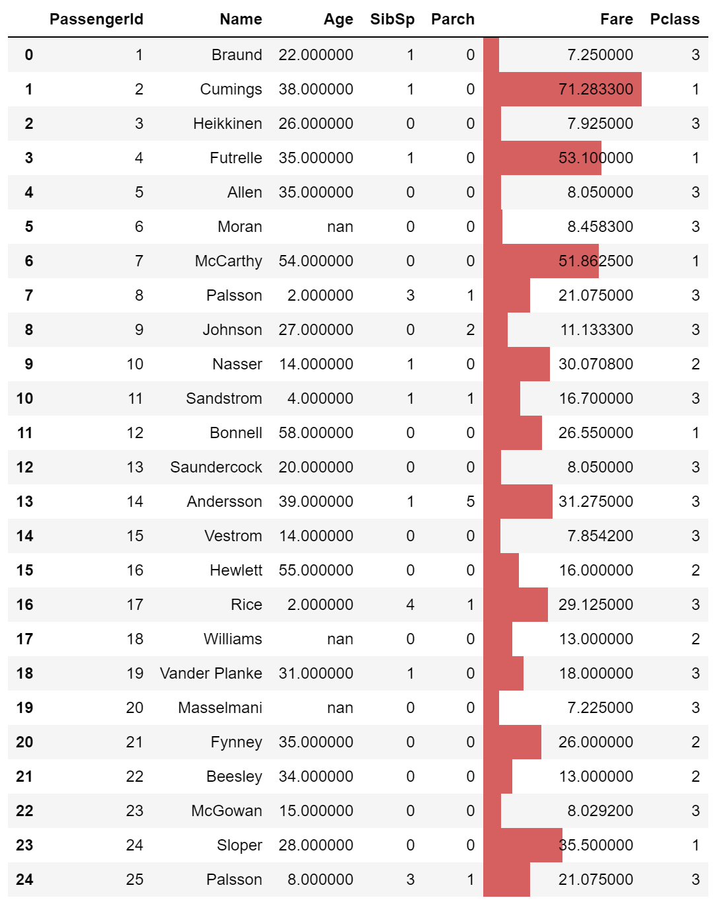
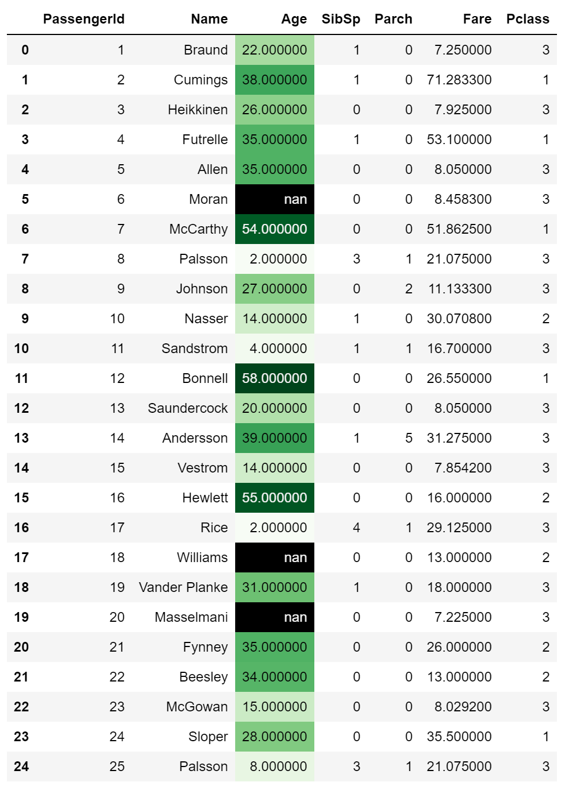
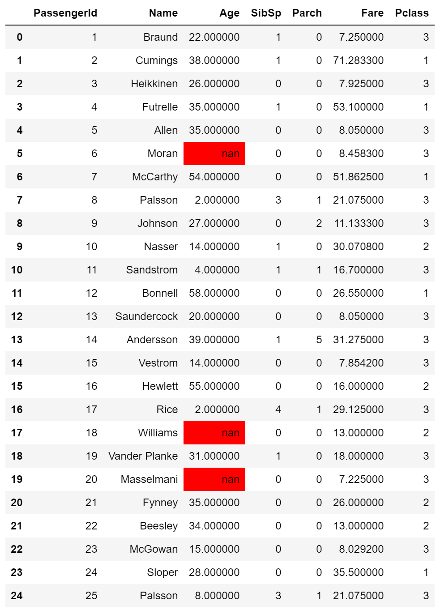
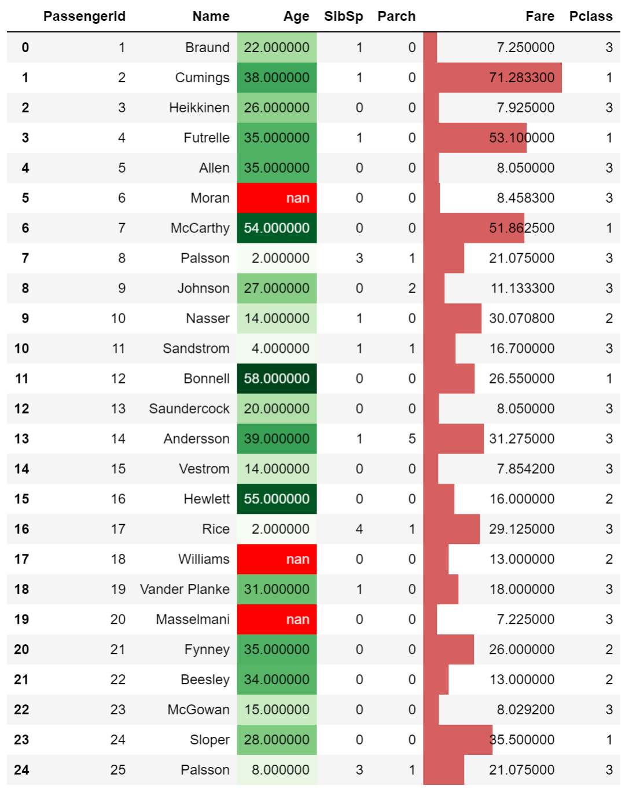
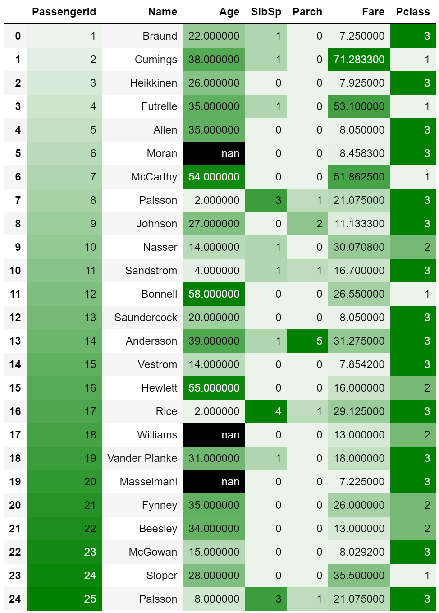
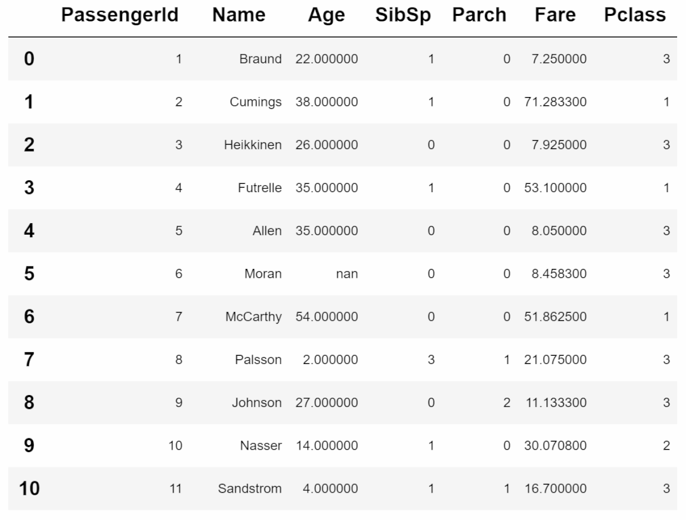

Python Python
<a name="nYWiJ"></a>
## 条件格式
Excel的 “条件格式”通过添加颜色条件可以让表格数据更加清晰的凸显出统计特性。
<a name="UA5PM"></a>
## 实例
首先，导入数据集，使用经典的titanic中抽样的部分数据。
```python
import pandas as pd
df = pd.read_csv("test.csv")
df
```
<br />可以看到，现在这个`dataframe`是空白的，什么都没有的，现在要给表格添加一些条件。
<a name="fjgmG"></a>
### 1、比如想让Fare变量值呈现条形图，以清楚看出各个值得大小比较，那么可直接使用`bar`代码如下。
```python
df.style.bar("Fare",vmin=0)
```

<a name="zDEYb"></a>
### 2、让Age变量呈现背景颜色的梯度变化，以体验映射的数值大小，那么可直接使用`background_gradient`，深颜色代表数值大，浅颜色代表数值小，代码如下。
```python
df.style.background_gradient("Greens",subset="Age")
```

<a name="OZcJ1"></a>
### 3、让所有缺失值都高亮出来，可使用`highlight_null`，表格所有缺失值都会变成高亮。
```python
df.style.highlight_null()
```
<br />以上就是`pandas`的`style`条件格式，用法非常简单。下面用链式法则将以上三个操作串起来，只需将每个方法加到前一个后面即可，代码如下。
```python
df.style.bar("Fare",vmin=0).background_gradient("Greens",subset="Age").highlight_null()
```
<br />当然，如果希望加更多的条件格式效果，还可以继续让链式更长，但不论条件怎么多，都只是一行代码。<br />其它操作<br />上面仅仅是列举了三个`style`中常用的操作，还有很多其他操作比如高亮最大值、给所有负值标红等等，通过参数subset还可以指定某一列或者某几列的小范围内进行条件格式操作。
```python
# 负值标为红色
applymap(color_negative_red)

# 高亮最大值
apply(highlight_max)

# 使某一列编程±前缀，小数点保留两位有效数字
format({"Coulumn": lambda x: "±{:.2f}".format(abs(x))})

# 使用subset进行dataframe切片，选择指定的列
applymap(color_negative_red,
                  subset=pd.IndexSlice[2:5, ['B', 'D']])
```
另外，还有很多的效果可以实现，比如结合`seaborn`的各种风格。
```python
import seaborn as sns
cm = sns.light_palette("green", as_cmap=True)
df.style.background_gradient(cmap=cm)
```
<br />如果结合`Ipython`的`HTML`还可以实现炫酷的动态效果。
```python
from IPython.display import HTML

def hover(hover_color="#ffff99"):
    return dict(selector="tr:hover",
                props=[("background-color", "%s" % hover_color)])

styles = [
    hover(),
    dict(selector="th", props=[("font-size", "150%"),
                               ("text-align", "center")]),
    dict(selector="caption", props=[("caption-side", "bottom")])
]
html = (df.style.set_table_styles(styles)
          .set_caption("Hover to highlight."))
html
```
<br />关于`style`条件格式的所有用法，可以参考pandas的官方文档。<br />链接：[https://pandas.pydata.org/pandas-docs/version/0.18/style.html](https://pandas.pydata.org/pandas-docs/version/0.18/style.html)
