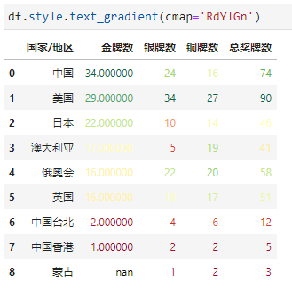
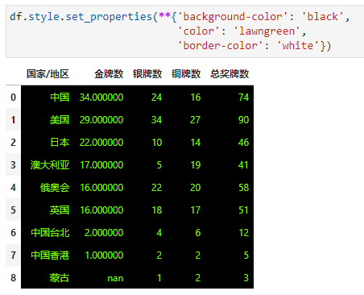

Python Pandas
<a name="U8U6g"></a>
## 1. 概述
先简单介绍一下什么是表格条件格式可视化，以常用的Excel为例说明。<br />在Excel菜单栏里，默认（选择）开始菜单，在中间部位有个条件格式控件，里面就是关于表格条件格式的方方面面。主要包含突出显示单元格规则、最前/最后规则、数据条、色阶、图标集以及规则管理等。<br /><br />条件格式<br />基于以上，其实可以通过函数方式进行多种条件的综合，让Excel表格可视化丰富多彩，比如以下截图展示的就是色阶效果！<br /><br />色阶案例，数据截止8月5日<br />在上图中，对每列单独进行条件格式-色阶设置，绿色->红色 代表数值从小到大，可以很直观的快速感受数值表现。<br />所谓 表格条件格式可视化，就是对表格的数据按照一定的条件进行可视化的展示（这里的可视化更多是指单元格背景色、字体颜色以及文本格式显示等）。<br />那么，Pandas作为表格化的数据处理工具，可以如何实现表格条件格式可视化呢？！<br />那就是通过：`df.style`
<a name="RjvUb"></a>
## 2. 突出显示单元格
在Excel条件格式中，突出显示单元格规则提供的是大于、小于、等于以及重复值等内置样式，不过在Pandas中这些需要通过函数方法来实现，放在后续介绍。这里介绍Pandas突出显示缺失值、最大值、最小值、区间值的函数方法以及Excel实现这些操作的自定义操作。
<a name="nlavV"></a>
### 2.1. 高亮缺失值
`df.style.highlight_null()`
```python
Signature:
df.style.highlight_null(
    null_color: 'str' = 'red',
    subset: 'Subset | None' = None,
    props: 'str | None' = None,
) -> 'Styler'
Docstring:
Highlight missing values with a style.
```
`null_color`用于指定高亮的背景色，默认是红色<br />`subset`用于指定操作的列或行<br />`props`用于突出显示CSS属性（后面案例中会涉及到）<br /><br />比如，可以指定高亮的背景色为橙色（颜色可以是英文名称）<br /><br />比如，可以指定高亮的背景色为紫红色（颜色可以是16进制）<br />
<a name="rUNmm"></a>
### 2.2. 高亮最大值
`df.style.highlight_max()`
```python
Signature:
df.style.highlight_max(
    subset: 'Subset | None' = None,
    color: 'str' = 'yellow',
    axis: 'Axis | None' = 0,
    props: 'str | None' = None,
) -> 'Styler'
Docstring:
Highlight the maximum with a style.
```
`subset`用于指定操作的列或行<br />`color`用于指定颜色，默认是黄色<br />`axis`用于指定行最大、列最大或全部，默认是列方向最大<br /><br />这里可以发现对于中文也有列最大高亮，为了避免出现这种情况，有两种方法：<br />①将这一列设置为索引(这里不做演示），<br />②采用`subset`指定<br /><br />指定颜色为灰色<br /><br />显示全部最大值<br /><br />那么，Excel如何显示最大值呢？这里以显示全部最大值为例展开介绍，逻辑如下：

1. 通过函数MAX获取数据区域的最大值
2. 然后编辑格式满足单元格值等于这个最大值即可

操作为：选中数据区域，进行条件格式设置->编辑格式规则<br />具体规则如下图：<br /><br />就可以得到想要的效果：<br /><br />同样的道理，可以根据需求高亮列或行的最大值、最小值等
<a name="Cru3y"></a>
### 2.3. 高亮最小值
`df.style.highlight_min()`<br />参数基本同高亮最大值，这里不再赘述，看案例<br /><br />链式调用 最大最小值高亮<br />
<a name="kxYE8"></a>
### 2.4. 高亮区间值
`df.style.highlight_between`
```python
Signature:
df.style.highlight_between(
    subset: 'Subset | None' = None,
    color: 'str' = 'yellow',
    axis: 'Axis | None' = 0,
    left: 'Scalar | Sequence | None' = None,
    right: 'Scalar | Sequence | None' = None,
    inclusive: 'str' = 'both',
    props: 'str | None' = None,
) -> 'Styler'
Docstring:
Highlight a defined range with a style.
```
`subset`用于指定操作的列或行<br />`color`用于指定颜色，默认是黄色<br />`axis`用于指定行、列或全部，如果left或right作为序列给出，则应用于这些序列的边界<br />`left`用于指定区间最小值<br />`right`用于指定区间最大值<br />`inclusive`用于确定是否左右闭包，可选'both', 'neither', 'left', 'right'<br />`props`用于突出显示CSS属性<br />高亮数量在`[20, 30]`的单元格<br /><br />`props`用于突出显示CSS属性，案例中将待高亮的部分显示为字体颜色-白色，背景色-紫色<br /><br />金牌数区间[20, 30]、银牌数区间[10, 20]、铜牌数区间[5, 10]<br />
<a name="A9jJp"></a>
### 2.5. 高亮分位数
`df.style.highlight_quantile()`
```python
Signature:
df.style.highlight_quantile(
    subset: 'Subset | None' = None,
    color: 'str' = 'yellow',
    axis: 'Axis | None' = 0,
    q_left: 'float' = 0.0,
    q_right: 'float' = 1.0,
    interpolation: 'str' = 'linear',
    inclusive: 'str' = 'both',
    props: 'str | None' = None,
) -> 'Styler'
Docstring:
Highlight values defined by a quantile with a style.
```
`subset`用于指定操作的列或行<br />`color`用于指定颜色，默认是黄色<br />`axis`用于指定行、列或全部<br />`q_left`用于指定分位数左边界，默认是0<br />`q_right`用于指定分位数右边界，默认是1<br />`inclusive`用于确定是否左右闭包，可选'both', 'neither', 'left', 'right'<br />`props`用于突出显示CSS属性<br />比如，高亮各列奖牌数前15%的值<br />
<a name="JMq2H"></a>
## 3. 色阶（背景及文本渐变色）
色阶部分包含背景渐变色和文本渐变色
<a name="lyyMZ"></a>
### 3.1. 背景渐变色
在Excel中，直接通过条件格式->色阶 操作即可选择想要的背景渐变色效果<br /><br />而在Pandas中，可以通过`df.style.background_gradient()`进行背景渐变色的设置。
```python
Signature:
df.style.background_gradient(
    cmap='PuBu',
    low: 'float' = 0,
    high: 'float' = 0,
    axis: 'Axis | None' = 0,
    subset: 'Subset | None' = None,
    text_color_threshold: 'float' = 0.408,
    vmin: 'float | None' = None,
    vmax: 'float | None' = None,
    gmap: 'Sequence | None' = None,
) -> 'Styler'
Docstring:
Color the background in a gradient style.
```
`cmap`用于指定matplotlib色条<br />`low`和`high`用于指定最小最大值颜色边界，区间[0, 1]<br />`axis`用于指定行、列或全部，默认是列方向<br />`subset`用于指定操作的列或行<br />`text_color_threshold`用于指定文本颜色亮度，区间[0, 1]<br />`vmin`和`vmax`用于指定与cmap最小最大值对应的单元格最小最大值<br /><br />`low`和`high`用于指定最小最大值颜色边界，区间[0, 1]<br /><br />`cmap`用于指定matplotlib色条，采用seaborn美化样式<br /><br />`text_color_threshold`用于指定文本颜色亮度，区间[0, 1]<br /><br />`vmin`和`vmax`用于指定与cmap最小最大值对应的单元格最小最大值（10以下同色，70以上同色）<br /><br />可以看到以上对于缺失值来说，其背景色是黑色，可以通过链式方法和高亮缺失值对缺失值背景色进行修改<br />
<a name="J9vZ4"></a>
### 3.2. 文本渐变色
文本渐变色顾名思义就是对单元格的文本进行颜色渐变，可以通过`df.style.text_gradient()`来操作，其参数和背景渐变色基本一致。<br />
<a name="C6SQk"></a>
## 4. 数据条
在Excel中，直接通过条件格式->数据条 操作即可选择想要的数据条效果<br /><br />而在Pandas中，可以通过 `df.style.bar()`来进行数据条绘制
```python
Signature:
df.style.bar(
    subset: 'Subset | None' = None,
    axis: 'Axis | None' = 0,
    color='#d65f5f',
    width: 'float' = 100,
    align: 'str' = 'left',
    vmin: 'float | None' = None,
    vmax: 'float | None' = None,
) -> 'Styler'
Docstring:
Draw bar chart in the cell backgrounds.
```
`subset`用于指定操作的列或行<br />`axis`用于指定行、列或全部，默认是列方向<br />`color`用于指定数据条颜色<br />`width`用于指定数据条长度，默认是100，区间[0, 100]<br />`vmin`和`vmax`用于指定与数据条最小最大值对应的单元格最小最大值<br />`align`数据条与单元格对齐方式，默认是left左对齐，还有zero居中和mid位于（max-min）/2<br />比如，奖牌数（不算总的）最低0最高40+颜色为橙色+居中展示，金牌差数据条长度为50（也就是单元格一半的长度）、银牌差mid对齐+数据条为单元格一半长度+正负显示不同颜色<br />
<a name="KXhJW"></a>
## 5. 数据格式化
调整数据格式用到`df.style.format()`
```python
Signature:
df.style.format(
    formatter: 'ExtFormatter | None' = None,
    subset: 'Subset | None' = None,
    na_rep: 'str | None' = None,
    precision: 'int | None' = None,
    decimal: 'str' = '.',
    thousands: 'str | None' = None,
    escape: 'str | None' = None,
) -> 'StylerRenderer'
Docstring:
Format the text display value of cells.
```
`formatter` 显示格式<br />`subset`用于指定操作的列或行<br />`na_rep`用于指定缺失值的格式<br />`precision`用于指定浮点位数<br />`decimal`用于用作浮点数、复数和整数的十进制分隔符的字符，默认是`.`<br />`thousands`用作浮点数、复数和整数的千位分隔符的字符<br />`escape`用于特殊格式输出（如html、latex等，这里不做展开，可参考官网）<br />比如，给数据加上单位枚，缺失值显示为无<br /><br />设置小数点位数为0<br /><br />指定列进行格式化<br /><br />分别对指定列进行单独格式化<br />
<a name="swes6"></a>
## 6. 自定义格式函数
通过传递样式函数来自定义格式：<br />`applymap()` (elementwise)：接受一个函数，它接受一个值并返回一个带有 CSS 属性值对的字符串。<br />`apply()`(column-/ row- /table-wise): 接受一个函数，它接受一个 Series 或 DataFrame 并返回一个具有相同形状的 Series、DataFrame 或 numpy 数组，其中每个元素都是一个带有 CSS 属性的字符串-值对。此方法根据axis关键字参数一次传递一个或整个表的 DataFrame 的每一列或行。对于按列使用`axis=0`、按行使用`axis=1`，以及一次性使用整个表`axis=None`。<br />比如，定义一个函数，如果金牌数<银牌数，则高亮金牌数这一列对应的值<br /><br />比如，还可以定义函数，如果金牌数<银牌数，则这一行数据都高亮<br /><br />又或者，可以根据不同的比值对每行进行不同的高亮<br /><br />关于以上函数的写法，还可以调用numpy的`where`和`repeat`方法进行优化，如：<br />
<a name="I8bs4"></a>
## 7. 其他
还有一些小操作，比如添加标题、隐藏索引、隐藏指定列等等
<a name="pw18b"></a>
### 添加标题

<a name="yHTwj"></a>
### 隐藏索引

<a name="RD8KC"></a>
### 隐藏指定列

<a name="lTEds"></a>
### 设置属性
如果一些单元格属性和单元格值无关，可以通过`df.style.set_properties()`来进行定制化操作，比如：背景色-黑色，字体颜色-草绿色，边框颜色-白色。（css样式）<br />
<a name="HQg5H"></a>
### 选中放大
<br />鼠标选择单元格会有放大效果<br /><br />效果演示
<a name="gKAhh"></a>
### 导出Excel
就直接`to_excel`就行了，`dfs = df.style.xxx`，然后`dfs.to_excel()`<br /><br />导出的excel截图
<a name="ldIAn"></a>
### 导出html


 
