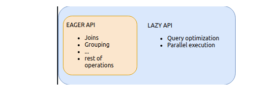
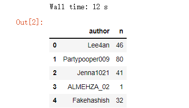
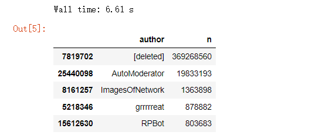
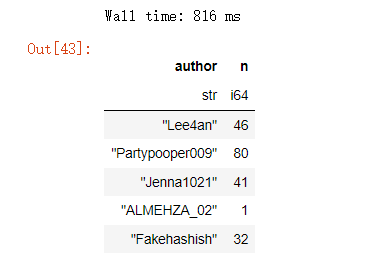
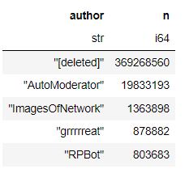
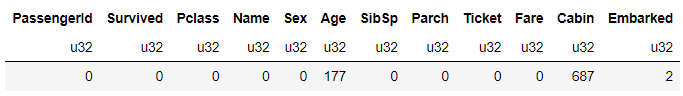
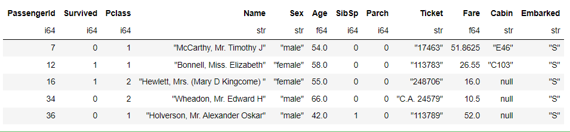
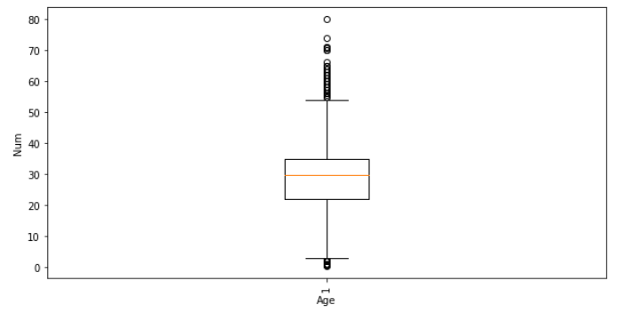

Python Pandas<br />对于不少的数据分析从业者来说呢，用的比较多的是Pandas以及SQL这两种工具，Pandas不但能够对数据集进行清理与分析，并且还能够绘制各种各样的炫酷的图表，但是遇到数据集很大的时候要是还使用Pandas来处理显然有点力不从心。<br />来介绍另外一个数据处理与分析工具，叫做Polars，它在数据处理的速度上更快，当然里面还包括两种API，一种是Eager API，另一种则是Lazy API，其中Eager API和Pandas的使用类似，语法类似差不太多，立即执行就能产生结果。<br /><br />而Lazy API和Spark很相似，会有并行以及对查询逻辑优化的操作。
<a name="WDjbP"></a>
### 模块的安装与导入
先来进行模块的安装，使用pip命令
```bash
pip install polars
```
在安装成功之后，分别用Pandas和Polars来读取数据，看一下各自性能上的差异，导入会要用到的模块
```python
import pandas as pd
import polars as pl
import matplotlib.pyplot as plt
%matplotlib inline
```
<a name="aMg88"></a>
### 用Pandas读取文件
本次使用的数据集是某网站注册用户的用户名数据，总共有360MB大小，先用Pandas模块来读取该csv文件
```python
%%time 
df = pd.read_csv("users.csv")
df.head()
```
output<br /><br />可以看到用Pandas读取CSV文件总共花费了12秒的时间，数据集总共有两列，一列是用户名称，以及用户名称重复的次数“n”，来对数据集进行排序，调用的是`sort_values()`方法，代码如下
```python
%%time 
df.sort_values("n", ascending=False).head()
```
output<br />
<a name="h382j"></a>
### 用Polars来读取操作文件
下面用Polars模块来读取并操作文件，看看所需要的多久的时间，代码如下
```python
%%time 
data = pl.read_csv("users.csv")
data.head()
```
output<br /><br />可以看到用polars模块来读取数据仅仅只花费了730毫秒的时间，可以说是快了不少的，根据“n”这一列来对数据集进行排序，代码如下
```python
%%time
data.sort(by="n", reverse=True).head()
```
output<br /><br />对数据集进行排序所消耗的时间为1.39秒，接下来用polars模块来对数据集进行一个初步的探索性分析，数据集总共有哪些列、列名都有哪些，还是以熟知“泰坦尼克号”数据集为例
```python
df_titanic = pd.read_csv("titanic.csv")
df_titanic.columns
```
output
```python
['PassengerId',
 'Survived',
 'Pclass',
 'Name',
 'Sex',
 'Age',
 ......]
```
和Pandas一样输出列名调用的是`columns`方法，然后来看一下数据集总共是有几行几列的，
```python
df_titanic.shape
```
output
```python
(891, 12)
```
看一下数据集中每一列的数据类型
```python
df_titanic.dtypes
```
output
```python
[polars.datatypes.Int64,
 polars.datatypes.Int64,
 polars.datatypes.Int64,
 polars.datatypes.Utf8,
 polars.datatypes.Utf8,
 polars.datatypes.Float64,
......]
```
<a name="fck3V"></a>
### 填充空值与数据的统计分析
来看一下数据集当中空值的分布情况，调用`null_count()`方法
```python
df_titanic.null_count()
```
output<br /><br />可以看到“Age”以及“Cabin”两列存在着空值，可以尝试用平均值来进行填充，代码如下
```python
df_titanic["Age"] = df_titanic["Age"].fill_nan(df_titanic["Age"].mean())
```
计算某一列的平均值只需要调用`mean()`方法即可，那么中位数、最大/最小值的计算也是同样的道理，代码如下
```python
print(f'Median Age: {df_titanic["Age"].median()}')
print(f'Average Age: {df_titanic["Age"].mean()}')
print(f'Maximum Age: {df_titanic["Age"].max()}')
print(f'Minimum Age: {df_titanic["Age"].min()}')
```
output
```python
Median Age: 29.69911764705882
Average Age: 29.699117647058817
Maximum Age: 80.0
Minimum Age: 0.42
```
<a name="vilJ7"></a>
### 数据的筛选与可视化
筛选出年龄大于40岁的乘客有哪些，代码如下
```python
df_titanic[df_titanic["Age"] > 40]
```
output<br /><br />最后简单地来绘制一张图表，代码如下
```python
fig, ax = plt.subplots(figsize=(10, 5))
ax.boxplot(df_titanic["Age"])
plt.xticks(rotation=90)
plt.xlabel('Age Column')
plt.ylabel('Age')
plt.show()
```
output<br /><br />总体来说呢，polars在数据分析与处理上面和Pandas模块有很多相似的地方，其中会有一部分的API存在着差异，感兴趣的童鞋可以参考其官网：[https://www.pola.rs/](https://www.pola.rs/)
