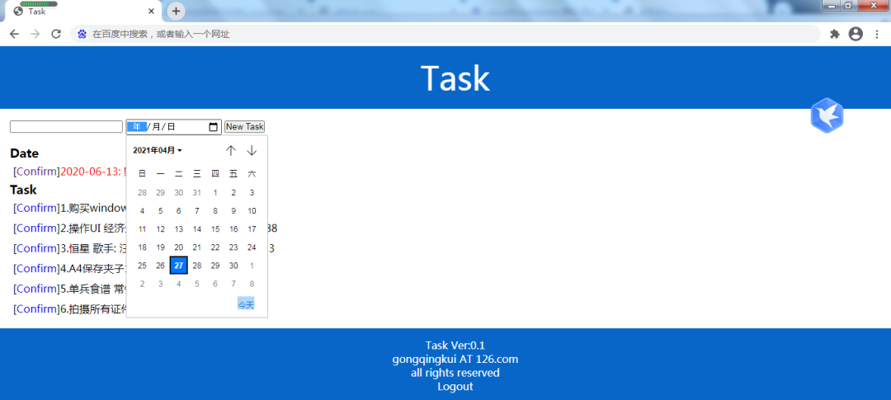
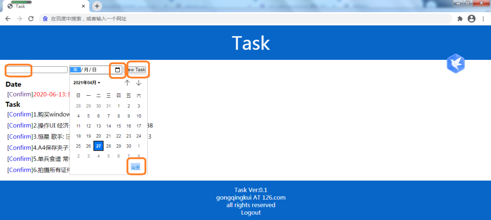

Python 
<a name="SKSh3"></a>
## 一、背景
经常遇到需要进行大量重复操作的时候，比如网页上填表，对 web 版本 OA 进行操作，自动化测试或者给新系统首次添加数据等。这些操作的特点往往是：数据同构，大多是已经有了的结构化数据；操作比较呆板，都是同一个流程的点击、输入；数据量大，极大消耗操作人精力。<br />那么能不能自动化呢？
<a name="Rud9i"></a>
## 二、自动化的方案
如果在 web 上进行操作， Python 的 Selenium 可以满足要求。如果需要对 GUI 界面进行操作，那么这里推荐一个更好的解决方案：PyAutoGUI 。<br />其实 PyAutoGUI 最主要好处就是比较简单，应急使用的话可以很快构建一个可用的自动化操作脚本。毕竟，数据处理任务本来就比较急迫，没有时间使用复杂知识，来构建一个完善的脚本。
<a name="mmwNl"></a>
## 三、思路和知识点
基本思路与相关知识点

- PyAutoGUI 就是模拟键盘、鼠标在界面上进行操作。
- 这里只使用它的 `click` 功能来模拟鼠标点击。
- 为了获取需要点击的位置，设计了一个鼠标坐标获取的程序。
- ASCII 码的输入比较简单。再解决汉字输入问题，就使得系统基本可用了。

这里以在 web 界面批量新增数据记录为例，讲解如何自动化操作。这个例子只是演示之用，非常简单。
<a name="hB8F1"></a>
## 四、操作步骤
<a name="pHKzW"></a>
### 4.1 初识 PyAutoGUI
简单地说， PyAutoGUI 就是模拟键盘、鼠标在界面上进行操作的包。安装时直接使用如下语句：`pip install pyautogui`即可。<br />编写一个简单的测试程序：
```python
import pyautogui as pag

pag.PAUSE = 1.5
pag.click(63,191) 
```
以上程序导入库，定义了每步骤的暂停时间 1.5 秒（用来留给操作时间），然后在屏幕左起 63 像素，上起 191 像素这个点上点击了鼠标。
<a name="d5FrT"></a>
### 4.2 坐标系
PyAutoGUI 默认的坐标系从屏幕左上角开始，`x` 轴向右增大，`y` 轴向下增大。所以显示器上每个点都有自己的位置。<br />引申一下，当知道界面上每个按钮的位置时，点击这些点，就是执行相应的操作了。<br />当然，这一切的前提是界面不变。大多数应用的界面、按钮位置不会变来变去。如果有这方面需求，可以参考下 `locateOnScreen()` 函数。这个函数根据提供的图片，在屏幕上找到像素匹配的地方。这样就不怕按钮动来动去了。<br />为了获取屏幕的坐标系，写了一个简单的程序，用来获取鼠标在屏幕上的坐标。可以自行下载运行。
```python
import pyautogui as pag 
import os 

try:
    while True:
        os.system('cls')
        a = '%4d,%4d'%pag.position()
        print(a)
except Exception as e:
    print(e) 
```
运行以上程序，移动鼠标到各个按钮上，就可以看到相应的坐标。<br />
<a name="EvbYr"></a>
### 4.3 点击
PyAutoGUI 的点击很简单：
```python
pyautogui.click(x=None, y=None, clicks=1, interval=0.0, button='left', duration=0.0)
```
其中`x`，`y`是坐标，`clicks` 是点击次数，`interval` 是点击间隔，`button` 指代三个鼠标按钮的哪一个，`duiation` 是点击之间的间隔。<br />写如下程序，来进行任务、时间和新建按钮之间的跳转。
```python
pag.click(63,191)
pag.click(328,191)
pag.click(384,461)
pag.click(374,191)
```
<a name="Shzk4"></a>
### 4.4 输入
输入 ASCII 字符和键盘击键、热键分别如下：

- 输入 ASCII 字符串是`typewrite(message='test message.',interval=0.5)`
- 击键是`press('esc')`
- 按下是`KeyDown('ctrl')`
- 松开是`KeyUp('ctrl')`
- 组合键是`hotkey('ctrl','v')`。

至于汉字，稍微复杂点。
<a name="uVopy"></a>
### 4.5 汉字输入
涉及汉字，无法用 ASCII 方案解决，需要导入包 `pyperclip `，这个包封装了系统剪贴板。
```python
import pyperclip
```
```python
#以下读入内容，就是把内容存入剪贴板。
pyperclip.copy('需要输入的汉字')
#以下输出内容，就是粘贴。
pag.hotkey('ctrl','v')
```
其实就是用 `pyperclip` 模拟拷贝，用热键 `Ctrl+v` 粘贴，实现了非 ASCII 字符的输入。
<a name="zebjR"></a>
### 4.6 集成起来
下面，把整个程序集成起来看：
```python
import pyautogui as pag
import pyperclip

pag.PAUSE = 1.5
pag.FAILSAFE = True

to = ['测试任务1','测试任务2','测试任务3','测试任务4','测试任务5',\
      '测试任务6','测试任务7','测试任务8','测试任务9','测试任务10']

for t in to:
    pag.click(63,191)
    pyperclip.copy(t)
    pag.hotkey('ctrl','v')
    pag.click(328,191)
    pag.click(384,461)
    pag.click(374,191)
```
以上程序，根据 `to` 列表内容，把操作分解为点击和粘贴，实现了自动化操作的目的。大部分编码都很好理解，能跟鼠标操作一一对应起来。可能存在难度的是数据源的问题，总不能把所有数据都写入程序吧？
<a name="sDZDt"></a>
## 五、数据源
相较于复杂的现实数据源，最好的方式就是把数据转成 csv 文件。这样许多 Excel 都可以另存成这个文件，其本身又是基于文本的，可读可写，比较方便。其他诸如 SQL 数据库、 XML 数据也可以导出转换为 csv 文件。<br />假设现在有了 csv 格式数据源 `data.csv` ,需要这样操作。
```python
to = []

with open('data.csv')as f:
    lines = f.readlines()

for line in lines:
    to.append(tuple(line.split(',')))
```
以上代码比较简单，把 csv 中存成的数据存储到 `to` 这个数组里，每行数据都是一个元组，调用的时候，如4.6部分代码所示，使用 `for` 循环加上元组下标即可。
