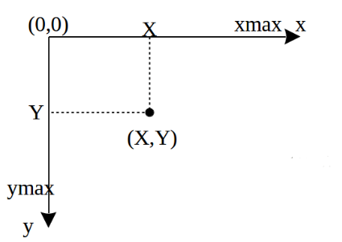
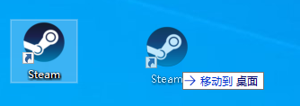
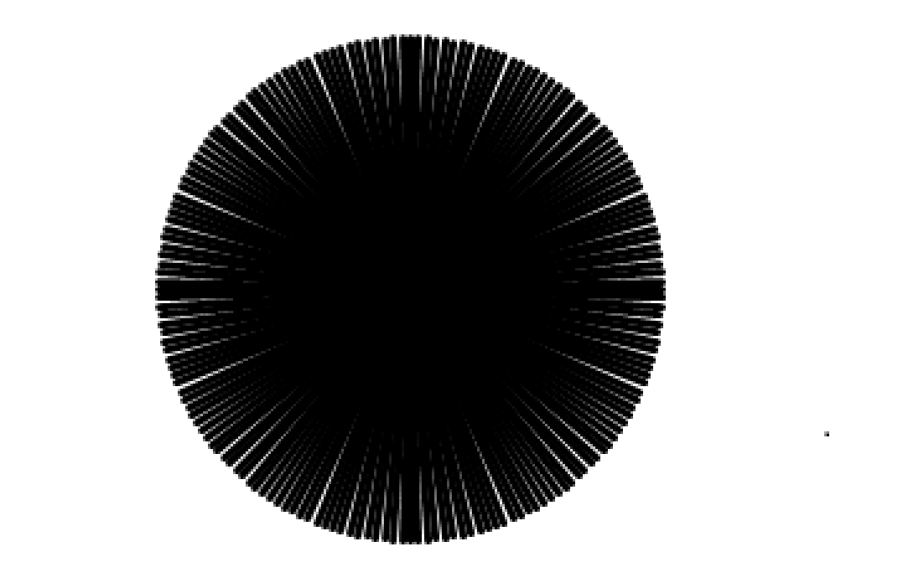

Python
<a name="XXCAa"></a>
## 安装
使用下面的命令先把模块安装到本地环境；
```bash
pip install pyautogui
```
<a name="p1pSR"></a>
## 简单使用
pyautogui模块能控制“键盘”、“鼠标”然后根据写的代码对电脑实现控制。<br />可以把它理解成桌面版的selenuim。
<a name="Lwyg8"></a>
### 鼠标控制
重要提示：一会启动程序之后，程序会接管“键盘”、“鼠标”的操作，所以使用Ctrl+C是无法停止程序运行的。<br />所以需要在代码首行写上`pyautogui.FAILSAFE = True`，这样当手动操作鼠标至屏幕顶部，程序就会报错停止，从而停止运行！
```python
import pyautogui

pyautogui.FAILSAFE = True
pyautogui.moveTo(1000,500,duration=5)
```
以上代码会把鼠标移动到坐标(1000,500)位置，duration参数是移动持续的时间。<br />
<a name="q2nd8"></a>
#### 滚轮
```python
import pyautogui

pyautogui.FAILSAFE = True
pyautogui.scroll(clicks=-500)
```
执行代码后，当前页面靠鼠标滑轮向下拉500个像素单位；<br />反之，如果想向上拉则将`clicks`参数改为正数即可。<br />滑动滚轮时注意鼠标当前位置。
<a name="qhYJe"></a>
#### 单击
```python
import pyautogui

pyautogui.FAILSAFE = True

pyautogui.click(1000,500,duration=2,button="left") # 移动到指定位置，单击左键
pyautogui.click(1000,600,duration=2,button="right") # 移动到指定位置，单击右键
pyautogui.click(1000,700,duration=2,button="middle") # 移动到指定位置，单击中键
```
<a name="t8yUN"></a>
#### 双击
```python
import pyautogui

pyautogui.FAILSAFE = True
pyautogui.doubleClick(1000,500,duration=2) # 移动到指定位置，双击右键
pyautogui.rightClick(1000,600,duration=2)  # 移动到指定位置，双击右键
pyautogui.middleClick(1000,700,duration=2) # 移动到指定位置，双击中键
```
<a name="bYpAu"></a>
#### 拖拉

```python
import pyautogui

pyautogui.FAILSAFE = True
pyautogui.dragTo(1000,500,duration=2)   
pyautogui.dragRel(1000,500,duration=2)
```
`pyautogui.dragTo`方法是把鼠标拖拉至目的地坐标；<br />`pyautogui.dragRel`方法则是拖动对应的像素单位；<br />`pyautogui.dragRel(1000,500,duration=2)`表示向右移动1000个像素点，向下移动500个像素点。
<a name="jkHM1"></a>
#### 点击与释放
```python
import pyautogui

pyautogui.FAILSAFE = True
pyautogui.mouseDown()  # 点击
pyautogui.mouseUp()    # 释放
```
可配合`move`方法实现移动点击。
<a name="wBjBy"></a>
### 键盘控制
下面使用一个小例子，可以很直观的展示每个方法的用途：
```python
import pyautogui

pyautogui.FAILSAFE = True
pyautogui.keyDown('h')   # 按下 h
pyautogui.keyUp('h')     # 释放 h
pyautogui.press('i')   # press = keyDown + keyUp
pyautogui.keyDown('shift') 
pyautogui.press('1') 
pyautogui.keyUp('shift') 
pyautogui.typewrite('fc', 0.1)
```
执行代码之后，会在当前的文本框编辑输入hi!fc
<a name="Rqzi1"></a>
#### 热键功能
像一些Ctrl+V，Alt+F4这样的组合键，按压是有前后顺序的，如果使用上面的方法去写是这样的：
```python
import pyautogui

pyautogui.FAILSAFE = True
pyautogui.keyDown('ctrl') 
pyautogui.press('v')
pyautogui.keyUp('ctrl')
```
有点繁琐，如果像三键顺序的会更麻烦，pyautogui也考虑到这个问题，集成了热键功能：
```python
pyautogui.hotkey('ctrl','v')
```
这一行代码顶上面的三行。
<a name="znPU5"></a>
## 小练习
通过pyautogui画了一个圆：<br /><br />就是重复N次从圆心向外画线。有兴趣的同学，可以自己练下。<br />参考代码：
```python
import math
import pyautogui

pyautogui.FAILSAFE = True
radius = 100        # 圆半径
min_angle = 0       # 每次循环角度计算
max_angle = 360     # 最大角度
spacing = 2         # 三角形的角度 可调整
duration = 0.0      # 鼠标移动速度

# 横线绘制实体圆
x,y = 200,520
pyautogui.moveTo(x, y, 0.2)
while min_angle <= max_angle:
    # 角度计算
    min_angle += spacing

    # x, y 偏移量计算
    x_offset = ('%.0f' % (radius * math.cos(min_angle * math.pi / 180)))
    y_offset = ('%.0f' % (radius * math.sin(min_angle * math.pi / 180)))
    
    # 控制鼠标
    pyautogui.mouseDown(x, y)
    pyautogui.moveRel(int(x_offset), int(y_offset), duration)
    pyautogui.mouseUp()
```
