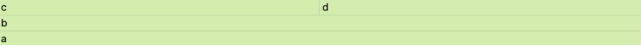
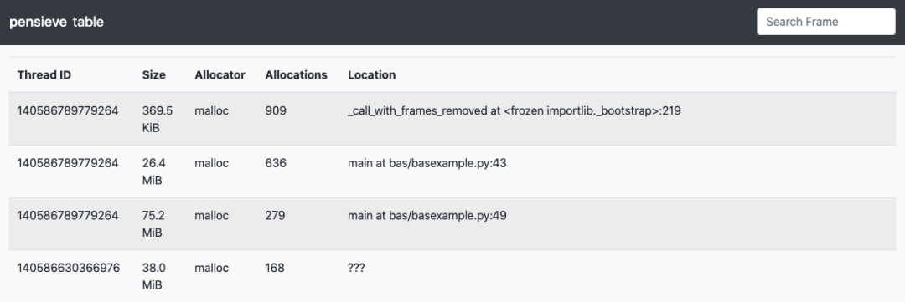
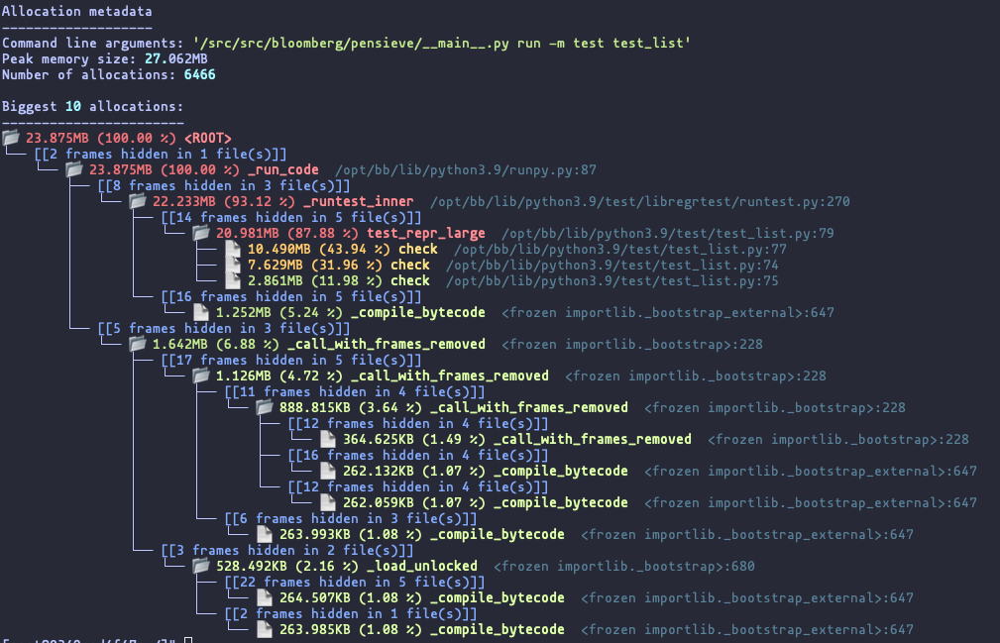
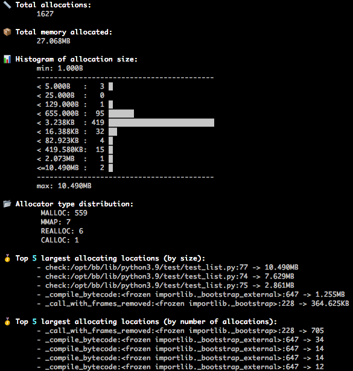
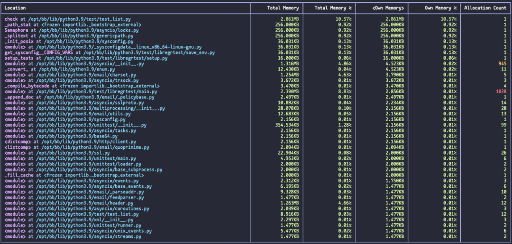
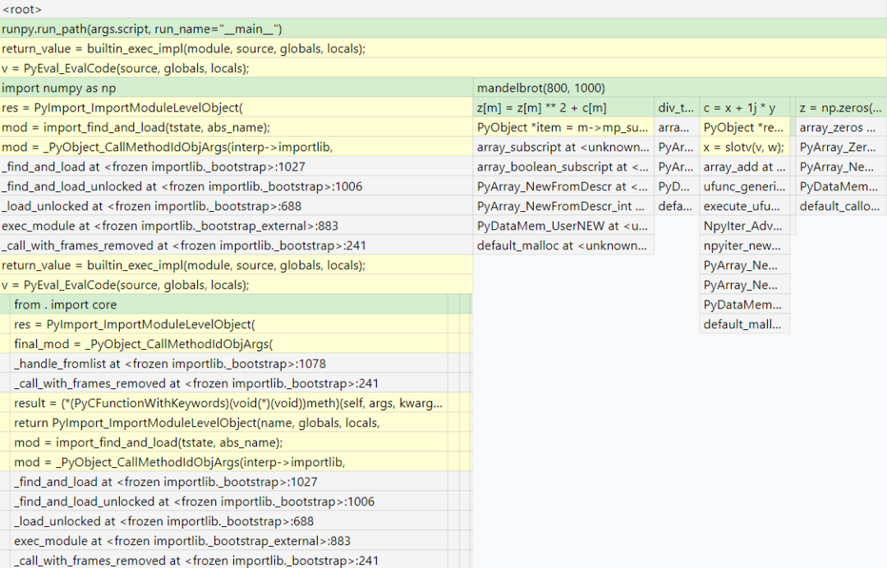
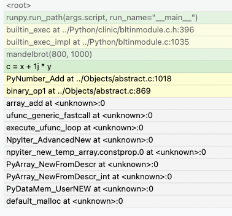
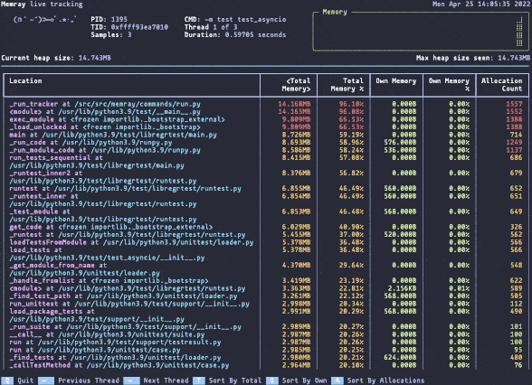
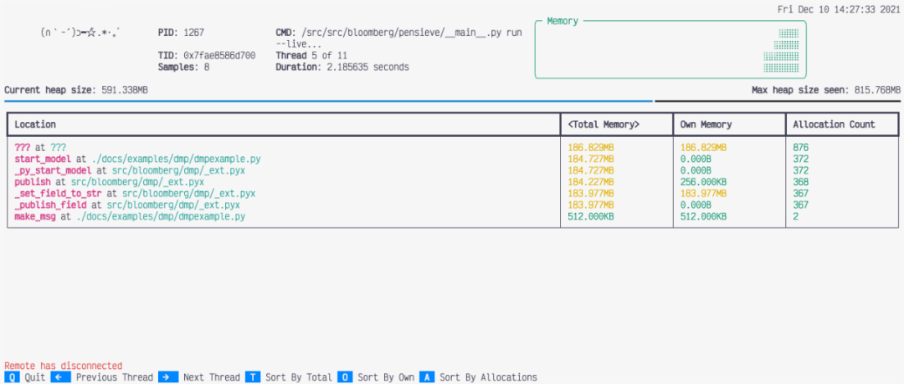

Python<br />Memray是一个可以检查Python代码内存分配情况的工具，可以使用它对Python解释器或扩展模块中的代码进行分析，并生成多种统计报告，从而更直观的看到代码的内存分配。
<a name="zJGym"></a>
## 简介
开发者可以根据需要，生成多种统计报告，观察程序的内存分配。
<a name="hE67a"></a>
### 总结报告
该报告会把多个线程的内存分配情况显示到同一个表格中，own memory表示每个函数占用的内存，total memory表示函数本身及其调用其他函数所占用的内存总量，allocation count表示暂时未释放的内存个数。<br />
<a name="nEjw0"></a>
### 火焰图报告 
该报告可以将内存分配数据可视化展示。火焰图的第一层是占用内存的函数， 宽度越大，则占用的内存越多；每一层的函数都被其下一层的函数所调用，依次类推。

- **示例代码：**
```python
def a(n):
	return b(n)

def b(n):
	return [c(n), d(n)]

def c(n):
	return "a" * n

def d(n):
	return "a" * n

a(100000)
```
<a name="VRLMO"></a>
### 生成的火焰图
<br />由该图可以看出，函数a调用了函数b，函数b调用了函数c和函数d。且第一层函数c 和函数d所占的宽度相同，表示c和d占用的内存一样。
<a name="GjmYD"></a>
### 表格报告
该报告以表格的形式展示程序的内存使用情况。Thread ID表示对应的线程，Size表示占用的内存总数，Allocator表示占用内存的函数，Location表示函数所在的位置。同时，还可以对每一列的数据进行排序。<br />
<a name="mtXhG"></a>
### 树形报告
该报告可以清晰的显示出程序的调用层次。树形报告中根节点中的内存总量和所占百分比 只是针对于图中展示的数据，占用内存小的不在图中。<br />
<a name="awxaR"></a>
### 统计报告
该报告可以显示程序内存使用情况的详细信息，包括分配的内存总量、分配类型(例如MALLOC, CALLOC)等。<br />
<a name="Eyvm0"></a>
### 项目地址
[https://github.com/bloomberg/memray](https://github.com/bloomberg/memray)
<a name="F9rex"></a>
## 安装
目前只能在Linux平台上使用Memray。由于Memray使用了C语言，发布的版本 是二进制的，所以得先在系统上安装二进制编译工具。随后在Python3.7+的环境 下安装Memray：
```bash
python3 -m pip install memray
```
如果想安装开发版本的Memray，首先要在系统上安装二进制工具：libunwind 和liblz4，随后克隆项目并运行如下命令进行安装：
```bash
git clone git@github.com:bloomberg/memray.git memray
cd memray
python3 -m venv ../memray-env/  # just an example, put this wherever you want
source ../memray-env/bin/activate
python3 -m pip install --upgrade pip
python3 -m pip install -e . -r requirements-test.txt -r requirements-extra.txt
```
<a name="A1NW5"></a>
## 使用
<a name="MPQ5h"></a>
### 基本使用
可以通过以下命令来追踪python代码的内存分配情况,my_script.py就是要分析的文件：
```bash
python3 -m memray run my_script.py
```
也可以把memray当作命令行工具使用，例如：
```bash
memray run my_script.py
memray run -m my_module
```
以上命令会输出一个二进制文件，随后可以根据需要生成统计报告。假如想生成一个总结报告，那么可以运行如下命令：
```bash
memray summary my_script.bin
```
会生成程序内存分配的总结报告：<br /><br />不同的报告形式在简介部分都有展示，请读者自行查看。
<a name="VZKLX"></a>
### 分析C/C++代码的内存分配
当要使用Memray分析numpy或者pandas这种包含C代码的模块时，可以运行如下命令：
```bash
memray run --native my_script.py
```
从而直观的看到Python代码分配了多少内存，扩展模块分配了多少内存。<br />假如在一个文件中使用了Numpy，当不使用`--native`时，生成的统计报告如下图：<br /><br />从图中可以看出在计算Numpy数组时分配了内存，但不清楚是Numpy还是Python解释器分配了内存。通过使用`--native`命令，就可以得到一个 更全面的报告，如图所示：<br /><br />从图中可以看到Numpy中C模块的调用情况，当添加Numpy数组后，产生了内存分配。可以通过文件的后缀名区分Python模块和C模块。
<a name="aFi3y"></a>
### 在代码运行时查看内存分配变化
Memray还支持动态查看Python代码的内存分配情况，只需使用以下命令：
```bash
memray run --live my_script.py
```
在这种模式下，开发者可以调试运行时间较长的代码。下图即为文件运行时的内存分配情况：<br />
<a name="FMaw4"></a>
### 结果排序
统计报告中的结果通常是根据分配的总内存，从大到小依次排列。可以改变排序条件：

- **t (默认)：根据总内存排列**
- **o：根据每个函数占用的内存排列**
- **a：根据未释放的内存个数进行排列**
<a name="U8Rwx"></a>
### 查看其他线程
使用`live`命令默认展示的是主线程的内存分配情况，可以通过左右箭头切换到其他线程。<br />
<a name="CzRbo"></a>
### API
除了使用`memray run`查看Python代码的内存分配，还可以在Python程序中使用memray。
```python
import memray

with memray.Tracker("output_file.bin"):
    print("Allocations will be tracked until the with block ends")
```
更多细节可以查看相关[**API文档**](https://bloomberg.github.io/memray/api.html)。
<a name="jfcwH"></a>
## 后记
在平时编写 Python 代码的过程中，有时候只考虑到了业务功能的实现，而忽视了代码的合理性与规范性，例如内存分配就是一个很重要的点，合理的内存分配有助于 提升项目的运行速度。<br />Memray 就是一个支持查看Python代码内存分配的工具，它的便捷之处在于：可以根据需要，生成多种分析报告，从而直观的了解到自己代码的内存分配情况，避免发生内存泄露现象。
<a name="amUoT"></a>
## 参考资料
API文档：[https://bloomberg.github.io/memray/api.html](https://bloomberg.github.io/memray/api.html)
