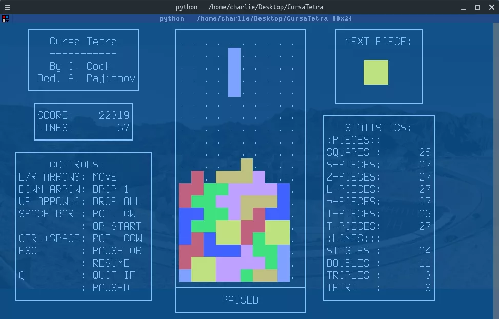
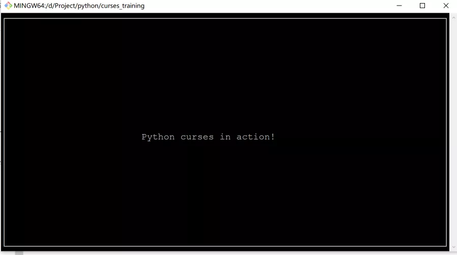
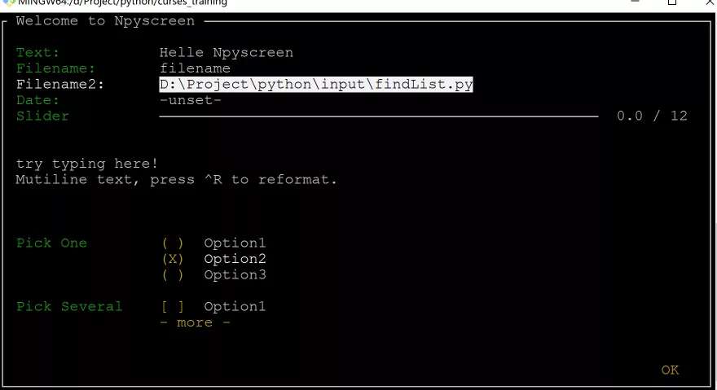
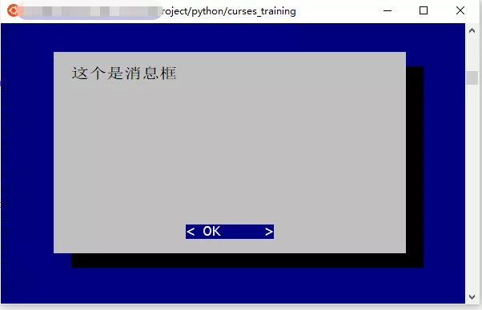
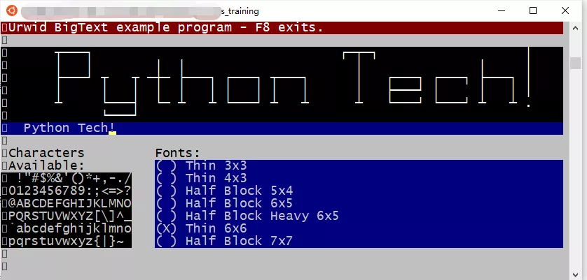
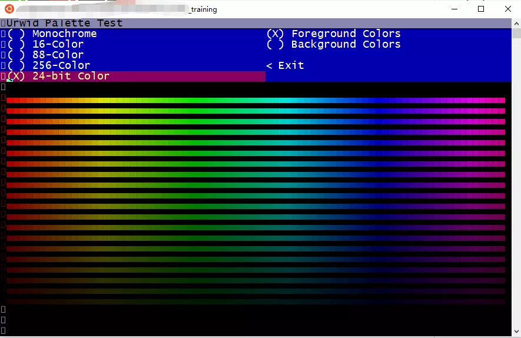
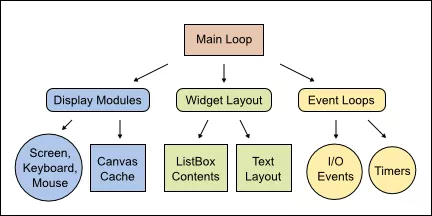

Python
<a name="bPiNP"></a>
## [Curses](https://docs.python.org/3/howto/curses.html)
<br />[Curses](https://docs.python.org/3/howto/curses.html) 是一个能提供基于文本终端窗口功能的动态库，它可以：

- 使用整个屏幕
- 创建和管理一个窗口
- 使用 8 种不同的彩色
- 为程序提供鼠标支持
- 使用键盘上的功能键

Curses 可以在任何遵循 ANSI/POSIX 标准的 Unix/Linux 系统上运行。Windows 上也可以运行，不过需要额外安装 windows-curses 库：
```bash
pip install windows-curses
```
上面图片，就是一哥们用 Curses 写的 [俄罗斯方块游戏](https://github.com/cSquaerd/CursaTetra)。<br />来试试：
```python
import curses

myscreen = curses.initscr()

myscreen.border(0)
myscreen.addstr(12, 25, "Python curses in action!")
myscreen.refresh()
myscreen.getch()

curses.endwin()
```

- 需要注意 `addstr` 前两个参数是字符坐标，不是像素坐标
- `getch` 会阻塞程序，直到等待键盘输入
- `curses.endwin()` 作用是退出窗口
- 如果需要持续监听用户的交互，需要写个循环，并对 `getch()` 获得的输入进行判断

代码运行效果如下：<br /><br />Curses 非常轻巧，特别适合处理一下简单交互，代替复杂参数输入的程序，既优雅，有简单，而且 Curses 也是其他文字终端 UI 的基础。
<a name="UF2j7"></a>
## Npyscreen
[Npyscreen](https://npyscreen.readthedocs.io/) 也是一个用了编写文本终端的 Python 组件库，是基于 Curses 构建的应用框架。<br />比起 Curses，Npyscreen 更接近 UI 式编程，通过组件的组合完成 UI 展示和交互，而且 Npyscreen 可以自适应屏幕变化。<br />Npyscreen 提供了多个控件，比如 表单（Form）、单行文本输入框（TitleText）、日期控件（TitleDateCombo）、多行文本输入框（MultiLineEdit）、单选列表（TitleSelectOne）、进度条（TitleSlider）等多种控件。<br />提供强大的功能，满足快速开发程序的要求，无论是简单的单页程序还是复杂的多页应用。<br />来看一个小例子：
```python
import npyscreen

class TestApp(npyscreen.NPSApp):
    def main(self):
        # These lines create the form and populate it with widgets.
        # A fairly complex screen in only 8 or so lines of code - a line for each control.
        F  = npyscreen.Form(name = "Welcome to Npyscreen",)
        t  = F.add(npyscreen.TitleText, name = "Text:",)
        fn = F.add(npyscreen.TitleFilename, name = "Filename:")
        fn2 = F.add(npyscreen.TitleFilenameCombo, name="Filename2:")
        dt = F.add(npyscreen.TitleDateCombo, name = "Date:")
        s  = F.add(npyscreen.TitleSlider, out_of=12, name = "Slider")
        ml = F.add(npyscreen.MultiLineEdit,
               value = """try typing here!\nMutiline text, press ^R to reformat.\n""",
               max_height=5, rely=9)
        ms = F.add(npyscreen.TitleSelectOne, max_height=4, value = [1,], name="Pick One",
                values = ["Option1","Option2","Option3"], scroll_exit=True)
        ms2= F.add(npyscreen.TitleMultiSelect, max_height =-2, value = [1,], name="Pick Several",
                values = ["Option1","Option2","Option3"], scroll_exit=True)

        # This lets the user interact with the Form.
        F.edit()

        print(ms.get_selected_objects())

if __name__ == "__main__":
    App = TestApp()
    App.run()
```

- 引入 Npyscreen 模块，如果没有可以通过 pip 安装：`pip install npyscreen`
- 继承 `npyscreen.NPSApp` 创建一个应用类 `TestApp`
- 实现 `main` 方法，方法里创建一个 `Form` 表单对象，然后向表单对象上添加各种控件，并设置控件的一些属性
- 调用表单对象的 `Edit` 方法，将操作权交给用户
- 在运行时，实例化 `TestAPP`，然后调用 `run` 方法启动应用，应用即可进入等待用户交互的状态

上面代码运行的效果如下：<br />

- [Tab] / [Shift + Tab] 用于切换控件焦点
- [回车] / [空格] 用于进入选择、设置、确认
- 在选择框架中，方向键与 [vim](https://www.vim.org/) 操作类似，即通过 hjkl 来控制

用文本原来可以做这么多复杂的操作。
<a name="hieLk"></a>
## Urwid
如果说 Curses 和 Npysreen 是轻量级的文本终端 UI 框架，那么 [Urwid](https://urwid.org/index.html) 绝对称得上是重量级选手。<br />Urwid 包含了众多开发文本 UI 的特性，例如：

- 应用窗口自适应
- 文本自动对齐
- 轻松设置文本块
- 强大的选择框控件
- 可以和各种基于事件驱动的框架集成，比如和 [Twisted](https://www.twistedmatrix.com/trac/)，[Glib](https://docs.gtk.org/glib/)，[Tornado](https://www.tornadoweb.org/en/stable/) 等等
- 提供诸如编辑框、按钮、多(单)选框 等多种预制控件
- 显示模式支持原生、Curses模式、LCD 显示屏 以及 网络显示器
- 支持 UTF-8 以及 CJK 字符集（可以显示中文）
- 支持多种颜色

看看效果：<br /><br /><br /><br />更厉害的是，Urwid 完全是按照面向对象的思想打造的框架：<br /><br />现在来小试一把，感受一下 Urwid 的强大：
```python
import urwid

def show_or_exit(key):
    if key in ('q', 'Q'):
        raise urwid.ExitMainLoop()
    txt.set_text(repr(key))

txt = urwid.Text(u"Hello World")
fill = urwid.Filler(txt, 'middle')
loop = urwid.MainLoop(fill, unhandled_input=show_or_exit)
loop.run()
```

- 先引入 `urwid` 模块
- 定义了一个输入事件处理方法 `show_or_exit`
- 处理方法中，当输入按键是 q 或者 Q 时，退出主循环，否则将按键名称显示出来
- `urwid.Text` 是一个文本控件，接受一个字符串作为显示信息
- `urwid.Filler` 类似于 panel，将 txt 控件填充在上面，位置设置在窗口中央
- `urwid.MainLoop` 设置 Urwid 的主循环，将 fill 作为控件的绘制入口，参数 `unhandled_input` 接受一个按键事件处理方法，用的就是前面定义的 `show_or_exit`
- `loop.run()` 启动 UI，并监控各种事件

运行这段代码，就可以看到命令行被设置为交互模式，按键时会在窗口中央显示出键名，如果按下 q 键，程序就会退出。
:::danger
注意：Urwid 只能在 Linux 操作系统中运行，Windows 上会因为缺失必要组件无法运行
:::
<a name="zZGkv"></a>
## 总结
这里只展示了三种文本终端框架，不过已经能对基于文本终端 UI 框架的强大感受一二了。<br />还有一些框架也很优秀，比如 prompt_toolkit，有兴趣的同学可以研究一下。<br />虽然基于文本终端的 UI 早已不是主流，但是在一些特殊的行业或者业务中，还是有其存在的价值，研究一下，说不定在特殊的地方有用。<br />最后，推荐一个很有意思的基于文本终端的应用 —— [命令行网易云音乐](https://github.com/darknessomi/musicbox)：<br /><br />是基于 Curses 开发，如果运行起来，能被它的强悍所震撼！
<a name="c3U9p"></a>
## 参考资料
Curses: [https://docs.python.org/3/howto/curses.html](https://docs.python.org/3/howto/curses.html)<br />俄罗斯方块游戏: [https://github.com/cSquaerd/CursaTetra](https://github.com/cSquaerd/CursaTetra)<br />npyscreen: [https://npyscreen.readthedocs.io/](https://npyscreen.readthedocs.io/)<br />vim: [https://www.vim.org/](https://www.vim.org/)<br />Urwid: [https://urwid.org/index.html](https://urwid.org/index.html)<br />Twisted: [https://www.twistedmatrix.com/trac/](https://www.twistedmatrix.com/trac/)<br />Glib: [https://docs.gtk.org/glib/](https://docs.gtk.org/glib/)<br />Tornado: [https://www.tornadoweb.org/en/stable/](https://www.tornadoweb.org/en/stable/)<br />命令行网易云音乐 : [https://github.com/darknessomi/musicbox](https://github.com/darknessomi/musicbox)
