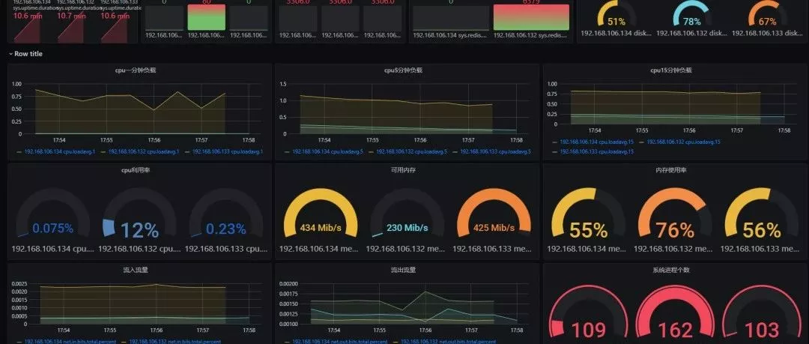
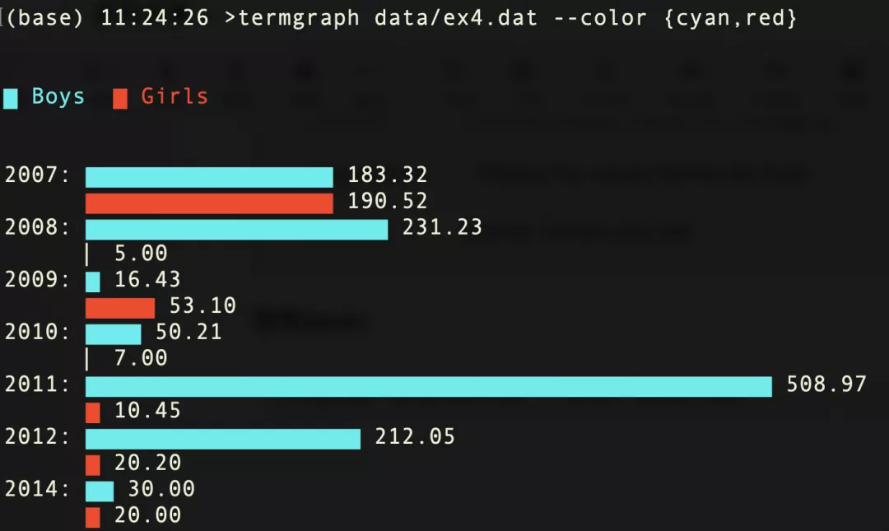
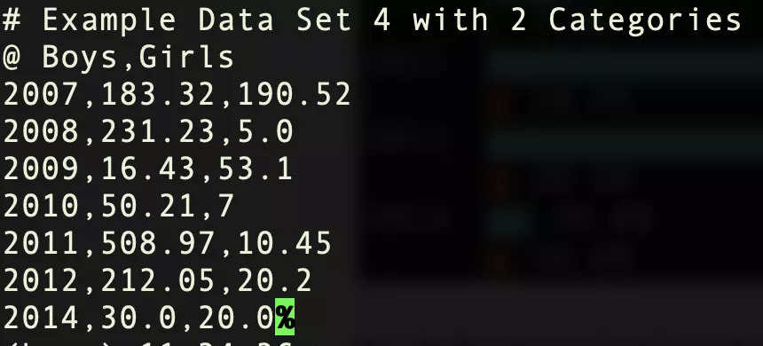
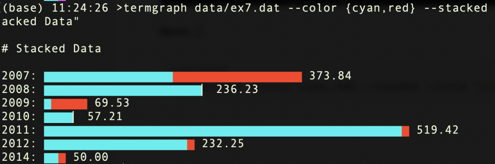
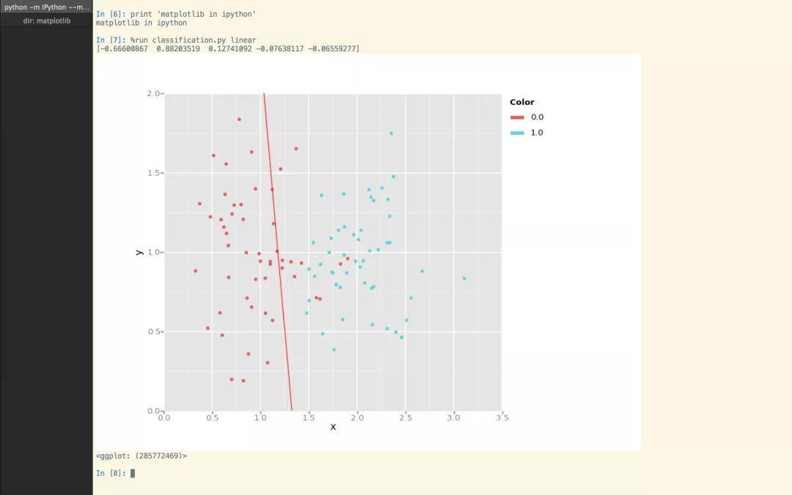

Python<br /><br />介绍两个在终端直接绘图工具termgraph和matplotlib_iterm2。
<a name="J1Ye8"></a>
## termgraph
<a name="DyBkm"></a>
### 安装
```bash
python3 -m pip install termgraph
```
<a name="IeNIf"></a>
### 工具参数
`termgraph -h`输出termgraph使用方法和详细参数介绍
```bash
「使用方法」

usage: termgraph [-h] [--title TITLE] [--width WIDTH] [--format FORMAT]

                 [--suffix SUFFIX] [--no-labels] [--no-values]

                 [--space-between] [--color [COLOR [COLOR ...]]] [--vertical]                 

                 [--stacked] [--histogram] [--bins BINS] [--different-scale]

                 [--calendar] [--start-dt START_DT]

                 [--custom-tick CUSTOM_TICK] [--delim DELIM] [--verbose]

                 [--label-before] [--version]

                 [filename]

draw basic graphs on terminal

positional arguments:「必须参数」

filename              data file name (comma or space separated). Defaults to stdin.

绘图数据：逗号或者\t分割

optional arguments:「可选参数」

  -h, --help            show this help message and exit

  --title TITLE         Title of graph，图像名称

  --width WIDTH         width of graph in characters default:50，图宽

  --format FORMAT       format specifier to use.

  --suffix SUFFIX       string to add as a suffix to all data points.

  --no-labels           Do not print the label column

  --no-values           Do not print the values at end

  --space-between       Print a new line after every field

  --color [COLOR [COLOR ...]] Graph bar color( s )

图形可选颜色：'red', 'blue', 'green', 'magenta', 'yellow', 'black', 'cyan'

「支持图形」：

  --vertical            Vertical graph

  --stacked             Stacked bar graph

  --histogram           Histogram

  --bins BINS           Bins of Histogram

  --different-scale     Categories have different scales.

  --calendar            Calendar Heatmap chart

  --start-dt START_DT   Start date for Calendar chart

  --custom-tick CUSTOM_TICK  Custom tick mark, emoji approved

  --delim DELIM         Custom delimiter, default , or space

  --verbose             Verbose output, helpful for debugging

  --label-before        Display the values before the bars

  --version             Display version and exit
```
<a name="PR0oa"></a>
### 案例demo
```bash
termgraph data/ex1.dat

# Reading data from data/ex1.dat

2007: ▇▇▇▇▇▇▇▇▇▇▇▇▇▇▇▇▇ 183.32
2008: ▇▇▇▇▇▇▇▇▇▇▇▇▇▇▇▇▇▇▇▇▇▇ 231.23
2009: ▇ 16.43
2010: ▇▇▇▇ 50.21
2011: ▇▇▇▇▇▇▇▇▇▇▇▇▇▇▇▇▇▇▇▇▇▇▇▇▇▇▇▇▇▇▇▇▇▇▇▇▇▇▇▇▇▇▇▇▇▇▇▇▇▇ 508.97
2012: ▇▇▇▇▇▇▇▇▇▇▇▇▇▇▇▇▇▇▇▇ 212.05
2014: ▏ 1.00


termgraph data/ex1.dat --custom-tick "🏃" --width 20 --title "Running Data"

# Running Data

2007: 🏃🏃🏃🏃🏃🏃🏃 183.32
2008: 🏃🏃🏃🏃🏃🏃🏃🏃🏃 231.23
2009:  16.43
2010: 🏃 50.21
2011: 🏃🏃🏃🏃🏃🏃🏃🏃🏃🏃🏃🏃🏃🏃🏃🏃🏃🏃🏃🏃 508.97
2012: 🏃🏃🏃🏃🏃🏃🏃🏃 212.05
2014:  1.00


echo "Label,3,9,1" | termgraph --custom-tick "😀" --no-label


😀😀😀 3.00
😀😀😀😀😀😀😀😀😀 9.00
😀 1.00
```
<a name="jyUPy"></a>
#### demo1
```bash
#并列条形图
termgraph data/ex4.dat --color {cyan,red}
```
<br />输入数据data/ex4.dat 如下格式：逗号分割<br />
<a name="rtqgV"></a>
#### demo 2
```bash
#堆积条形图
data/ex7.dat --color {cyan,red} --stacked --title "Stacked Data"
```


---

<a name="nISAu"></a>
## matplotlib_iterm2
效果图<br />
<a name="XgelZ"></a>
## REF
[https://github.com/mkaz/termgraph](https://github.com/mkaz/termgraph)<br />[https://github.com/oselivanov/matplotlib_iterm2](https://github.com/oselivanov/matplotlib_iterm2)
