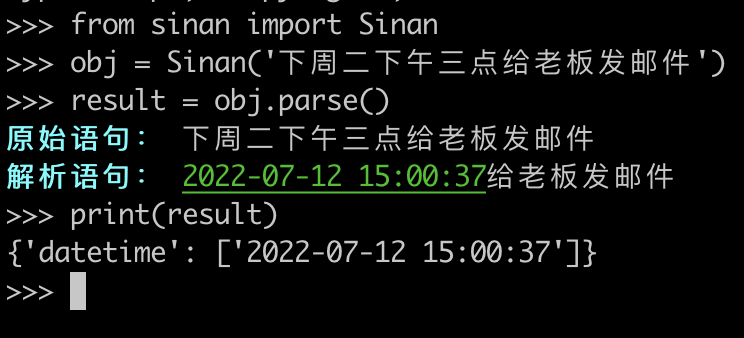
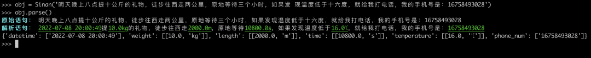

Python<br />如果使用过嘀嗒清单或者Todoist，那应该知道他们有一个很好用的功能，那就是自动识别任务中的时间，例如：
> 下周二下午三点给老板发邮件

它会自动识别为：<br /><br />Python中有一个叫做司南的库，它就可以实现这样的功能。<br />来看看这个第三方库怎么使用。首先pip安装它：
```bash
python3 -m pip install sinan
```
安装完成以后，使用方法非常简单：
```python
from sinan import Sinan
obj = Sinan('下周二下午三点给老板发邮件')
result = obj.parse()
print(result)
```
运行效果如下图所示：<br /><br />这个库不仅可以解析时间，它还可以解析更复杂的语句，例如：
```python
>>> obj = Sinan('明天晚上八点提十公斤的礼物，徒步往西走两公里，原地等待三个小时，如果发 现温度低于十六度，就给我打电话，我的手机号是：16758493028')
>>> obj.parse()
```
运行效果如下图所示：<br />
