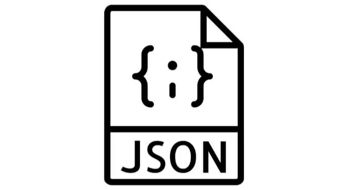
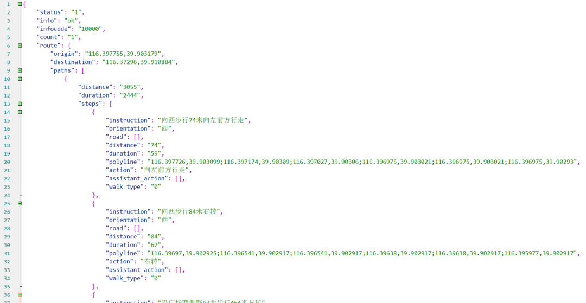
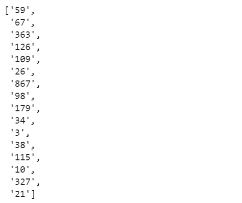
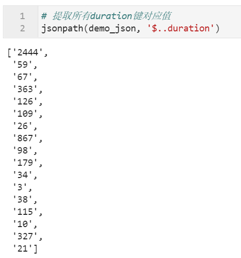
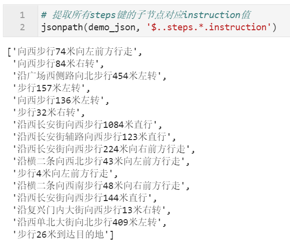
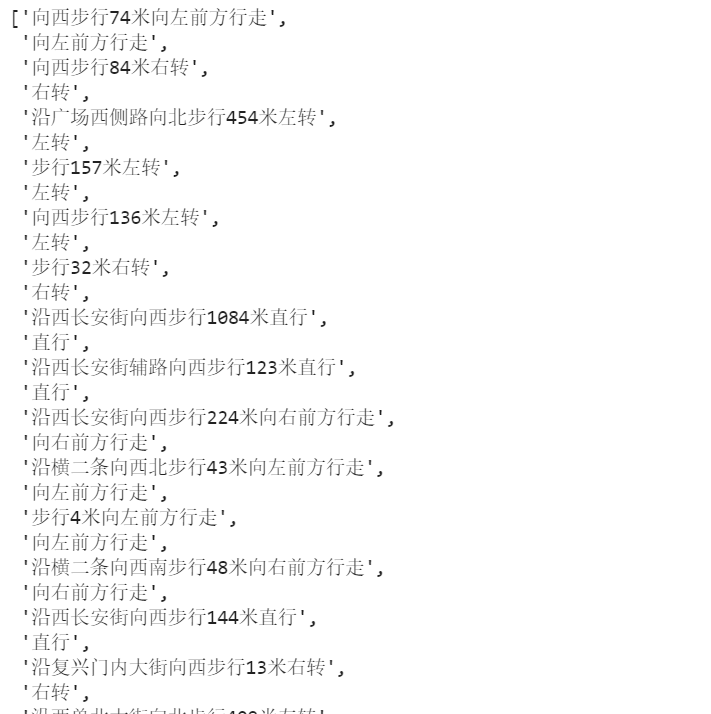
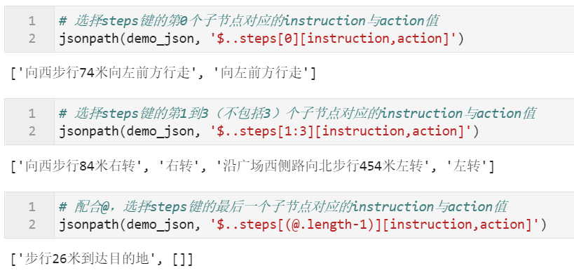
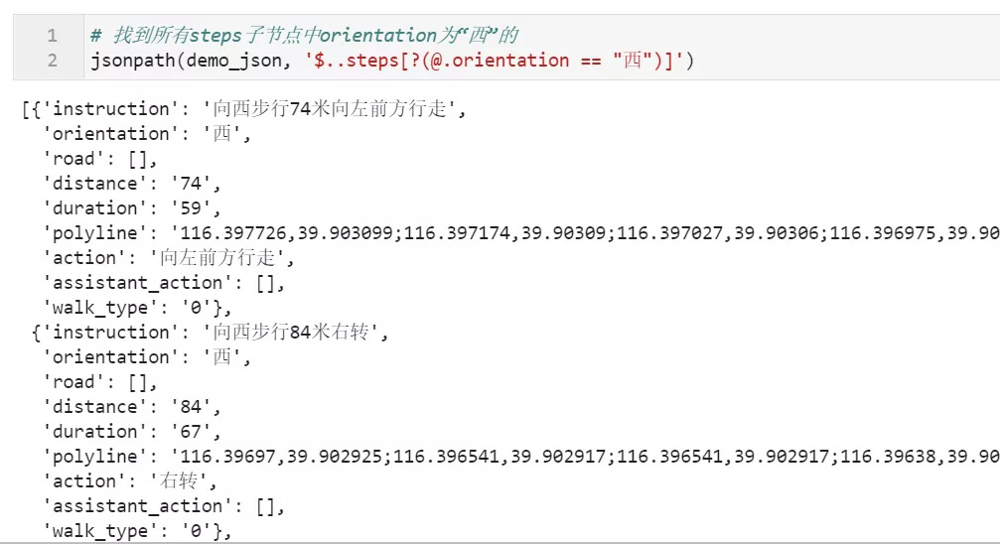
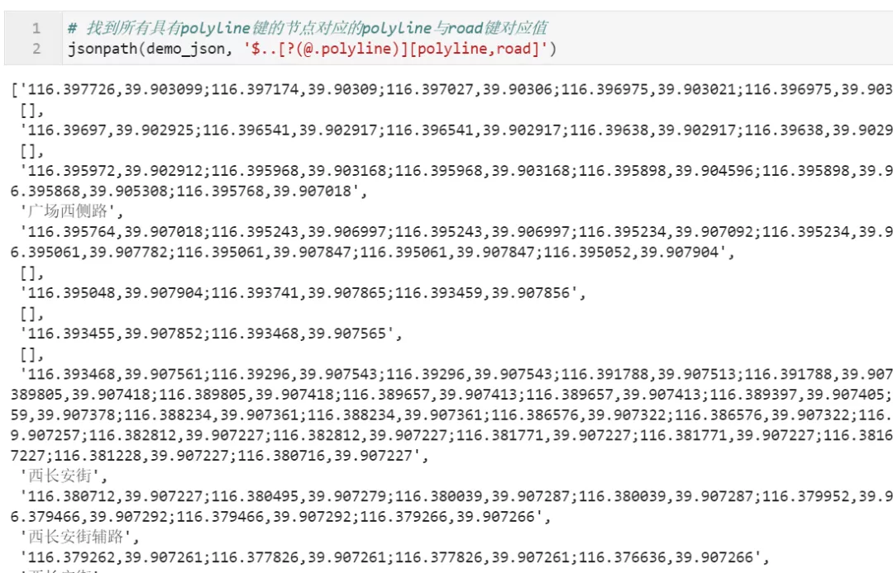
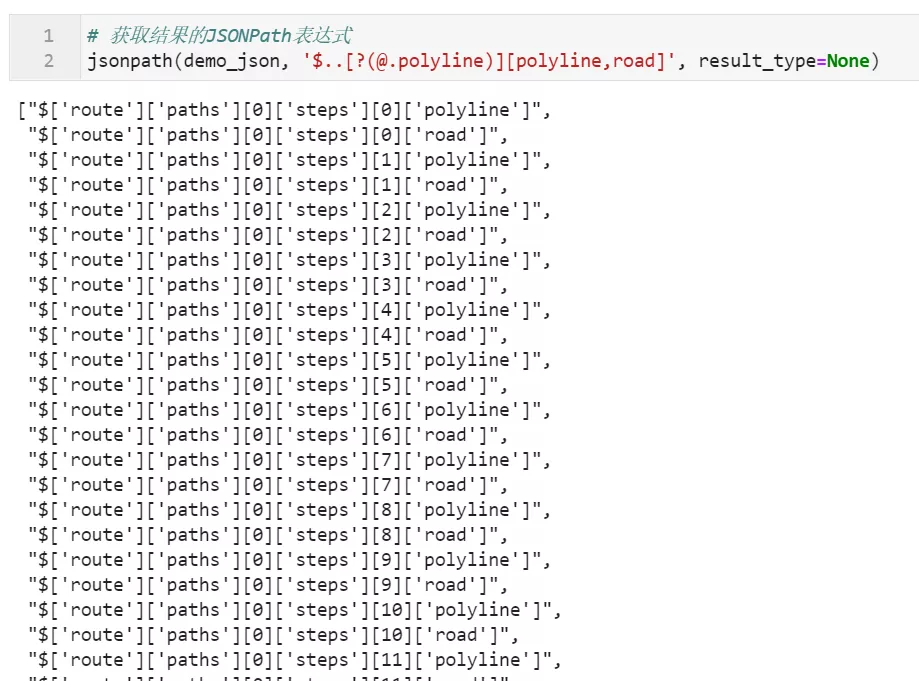

Python jsonpath json
<a name="z6Tds"></a>
## 1、简介
在日常使用 Python 的过程中，经常会与 json 格式的数据打交道，尤其是那种嵌套结构复杂的 json 数据，从中抽取复杂结构下键值对数据的过程枯燥且费事。<br />而熟悉 xpath 的朋友都知道，对于 xml 格式类型的具有层次结构的数据，可以通过编写 xpath 语句来灵活地提取出满足某些结构规则的数据。<br />类似的，JSONPath 也是用于从 json 数据中按照层次规则抽取数据的一种实用工具，在 Python 中可以使用 jsonpath 这个库来实现 JSONPath 的功能。<br />
<a name="tOUWa"></a>
## 2、在 Python 中使用 JSONPath 提取 json 数据
jsonpath 是一个第三方库，所以首先需要通过 `pip install jsonpath` 对其进行安装。
<a name="FFCEh"></a>
### 2.1 一个简单的例子
安装完成后，首先来看一个简单的例子，从而初探其使用方式：<br />这里使用到的示例 json 数据来自高德地图步行导航接口，包含了从天安门广场到西单大悦城的步行导航结果，原始数据如下，层次结构较深：<br /><br />假如想要获取其嵌套结构中 steps 键值对下每段行程的耗时 duration 数据，配合 jsonpath 就可以这样做：
```python
import json
from jsonpath import jsonpath

# 读入示例json数据
with open('json示例.json', encoding='utf-8') as j:
    demo_json = json.loads(j.read())

# 配合JSONPath表达式提取数据
jsonpath(demo_json, '$..steps[*].duration')
```
<br />其中 `$..steps[*].duration` 就是用于描述数据位置规则的 JSONPath 语句，配合 `jsonpath()` 便可以提取出对应信息，下面就来学习 jsonpath 中支持的常用 JSONPath 语法。
<a name="QTBVy"></a>
### 2.2 jsonpath 中的常用 JSONPath 语法
为了满足日常提取数据的需求，JSONPath 中设计了一系列语法规则来实现对目标值的定位，其中常用的有：
<a name="SPWSn"></a>
#### 「按位置选择节点」
在 jsonpath 中主要有以下几种按位置选择节点的方式：

| 功能 | 语法 |
| --- | --- |
| 根节点 | `$` |
| 当前节点 | `@` |
| 子节点 | `.`或`[]` |
| 任意子节点 | `*` |
| 任意后代节点 | `..` |

来演示一下它们的一些用法：
```python
# 提取所有duration键对应值
jsonpath(demo_json, '$..duration')
```

```python
# 提取所有steps键的子节点对应instruction值
jsonpath(demo_json, '$..steps.*.instruction')
```

<a name="rgvWk"></a>
#### 「索引子节点」
有些时候需要在选择过程中对子节点做多选或按位置选择操作，就可以使用到 jsonpath 中的相关功能：
```python
# 多选所有steps键的子节点对应的instruction与action值
jsonpath(demo_json, '$..steps.*[instruction,action]')
```

```python
# 选择steps键的第0个子节点对应的instruction与action值
jsonpath(demo_json, '$..steps[0][instruction,action]')

# 选择steps键的第1到3（不包括3）个子节点对应的instruction与action值
jsonpath(demo_json, '$..steps[1:3][instruction,action]')

# 配合@，选择steps键的最后一个子节点对应的instruction与action值
jsonpath(demo_json, '$..steps[(@.length-1)][instruction,action]')
```

<a name="u6Gad"></a>
#### 「条件筛选」
有些时候需要根据子节点的某些键值对值，对选择的节点进行筛选，在 jsonpath 中支持常用的 `==`、`!=`、`>`、`<` 等比较运算符，以`==`比较符为例，这里配合 `@` 定位符从当前节点提取子节点，语法为` ?(@. 键名 比较符 值)`：
```python
# 找到所有steps子节点中orientation为“西”的
jsonpath(demo_json, '$..steps[?(@.orientation == "西")]')
```
<br />而如果想要提取所有具有指定键的节点，可以参考下面的例子：
```python
# 找到所有具有polyline键的节点对应的polyline与road键对应值
jsonpath(demo_json, '$..[?(@.polyline)][polyline,road]')
```

<a name="bvOa5"></a>
### 2.3 返回结果的形式
在前面的例子中，所有的返回结果直接就是提取到的满足条件的结果，而 `jsonpath()` 中还提供了另一种特殊的结果返回形式，只需要设置参数 `result_type=None` 就可以改直接返回结果为返回每个结果的 JSONPath表达式：
```python
# 获取结果的JSONPath表达式
jsonpath(demo_json, '$..[?(@.polyline)][polyline,road]', result_type=None)
```
<br />以上介绍的均为 jsonpath 库中的常规功能，可以满足基础的 json 数据提取需求，而除了 jsonpath 之外，还有其他具有更加丰富拓展功能的 JSONPath 类的第三方库，可以实现很多进阶灵活的操作。
