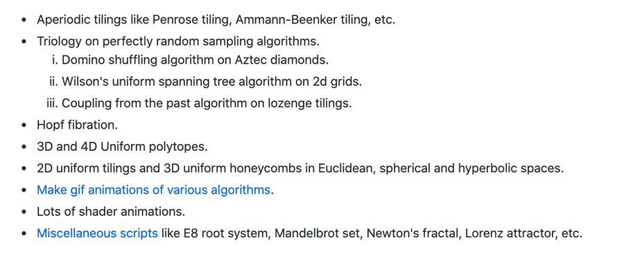
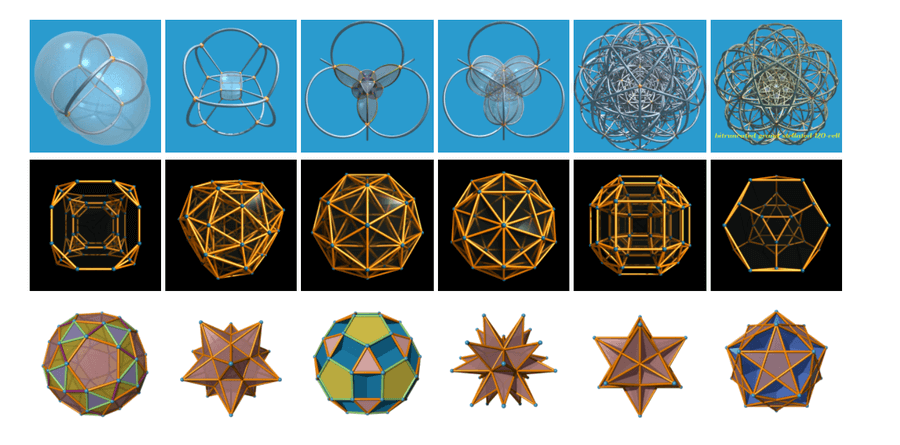
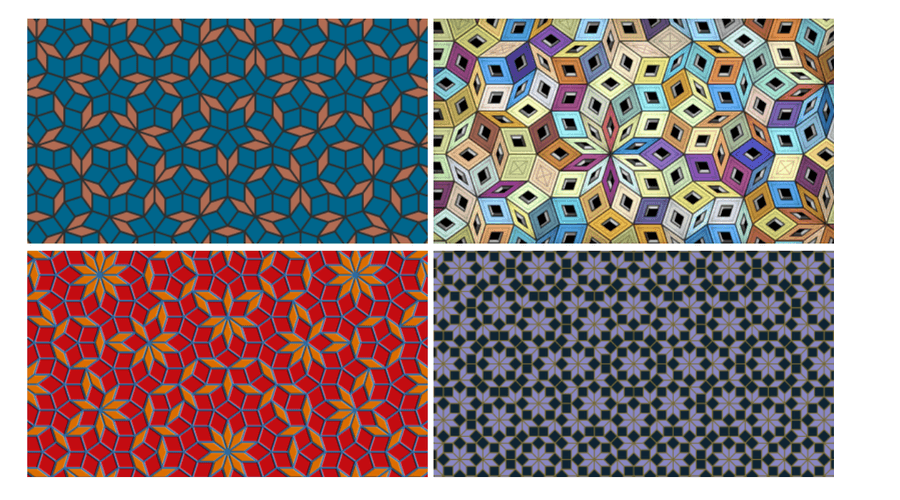
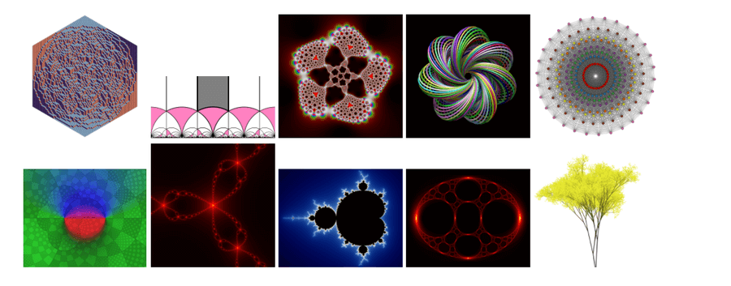

Python 用 Python 通过图片、视频、动图等方式来表达数学之美，是非常好的主意，同时本身 Python 对数学方面的支持也非常友好。 推荐这个项目 pywonderland，就是集合了各种 Python 的脚本来展示数学之美的，目前列表包含如下：  以上专业术语比较多，很多解释起来也比较麻烦，不如直接来看对应的理论在数学上是怎么可视化的。 1、统一 3D 和 4D 模型（Uniform 3D and 4D polytopes）  2、非周期平铺（Aperiodic tilings）  3、其他  是不是很神奇？更多项目详情请查看如下链接。 项目地址：[https://github.com/neozhaoliang/pywonderland](https://github.com/neozhaoliang/pywonderland) 项目作者：neozhaoliang
