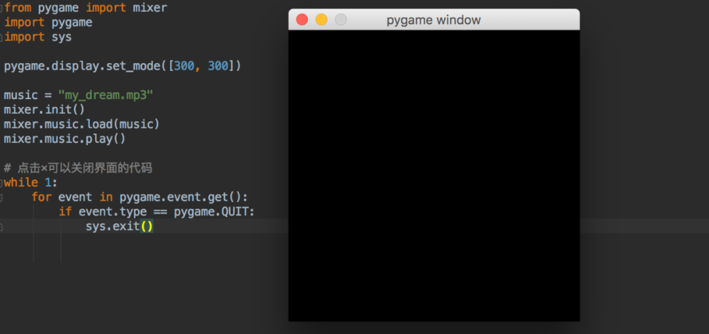
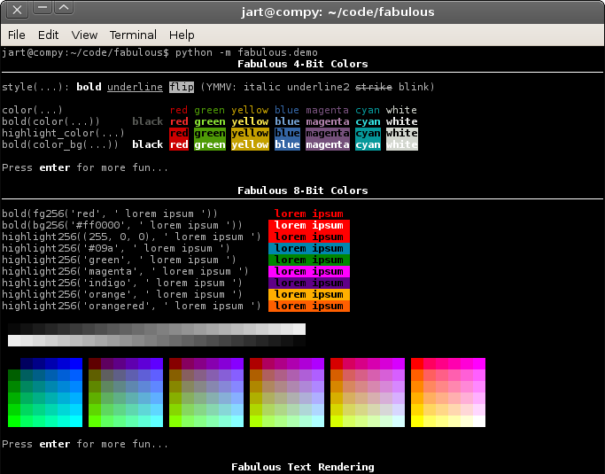
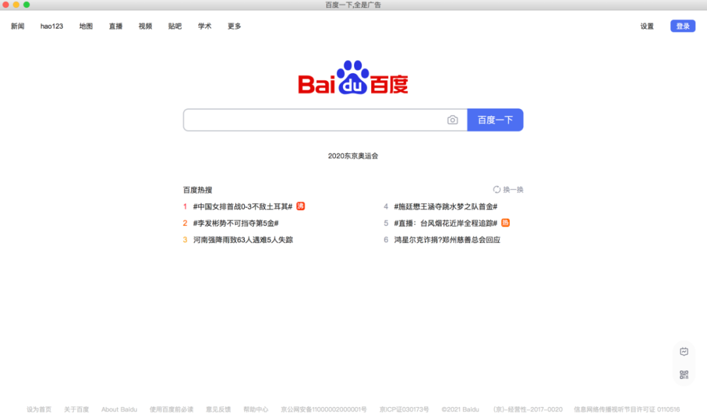

Python
<a name="M9J4h"></a>
## ① speedtest(网速测试)
Speedtest模块可以测试电脑的网络带宽大小。<br />使用百度源安装库。
```bash
# 安装speedtest
pip install speedtest -i https://mirror.baidu.com/pypi/simple/
```
使用时，需要取消证书验证。
```python
import speedtest

# 全局取消证书验证
import ssl
ssl._create_default_https_context = ssl._create_unverified_context

test = speedtest.Speedtest()
down = test.download()
upload = test.upload()

print(f"上传速度：{round(upload/(1024 * 1024),2)} Mbps")
print(f"下载速度：{round(down/(1024 * 1024),2)} Mbps")
```
得到结果如下。
```python
上传速度：31.3 Mbps
下载速度：86.34 Mbps
```
看起来网速还挺快的。
<a name="Ni4fg"></a>
## ② socket(获取本机ip地址)
使用socket，先获取电脑的主机名后，再获取本机的IP地址。<br />其中socket是Python内置标准库，无需安装。
```python
import socket as f

hostn = f.gethostname()
Laptop = f.gethostbyname(hostn)
print("你的电脑本地IP地址是：" + Laptop)
```
得到结果如下，此IP为局域网内IP。
```python
你的电脑本地IP地址是：192.168.2.101
```
如若想获取电脑的公网IP地址，可以借助一些第三方网站，比如下面这个。<br />浏览器访问, 返回公网IP地址[https://jsonip.com](https://jsonip.com)<br />代码如下，同样取消证书验证。
```python
import json
from urllib.request import urlopen

# 全局取消证书验证
import ssl
ssl._create_default_https_context = ssl._create_unverified_context


with urlopen(r'https://jsonip.com') as fp:
    content = fp.read().decode()

ip = json.loads(content)['ip']
print("你的电脑公网IP地址是：" + ip)
```
对网站发起请求，解析返回的结果。<br />最后成功得到公网IP地址。
```python
# 这里随便写了一个~
你的电脑公网IP地址是：120.236.128.201
```
<a name="LaWC6"></a>
## ③ textblob(文本处理)
TextBlob是一个用于处理文本数据的Python库，仅为英文分析。<br />中文则可以使用SnowNLP，能够方便的处理中文文本内容，是受到了TextBlob的启发而写的。<br />下面就给英文做一个拼写检查。
```python
from textblob import TextBlob

a = TextBlob("I dream about workin with goof company")
a = a.correct()
print(a)
```
结果如下。
```python
I dream about working with good company
```
可以看到，句子中的单词被更正了。
<a name="gW9xq"></a>
## ④ pygame(制作游戏)
pygame，一个制作游戏的Python库。<br />不仅给开发人员提供了制作游戏的图形、声音库，还可以使用内置的模块来实现复杂的游戏逻辑。<br />下面使用pygame来制作一个小型的音乐播放器。
```python
from pygame import mixer
import pygame
import sys

pygame.display.set_mode([300, 300])

music = "my_dream.mp3"
mixer.init()
mixer.music.load(music)
mixer.music.play()

# 点击×可以关闭界面的代码
while 1:
    for event in pygame.event.get():
        if event.type == pygame.QUIT:
            sys.exit()
```
运行上面的代码，电脑就会播放音乐。<br /><br />必须给pygame添加图形化界面，要不然没声音。
<a name="mbUoK"></a>
## ⑤ pyqrcode(生成二维码)
二维码简称QR Code(Quick Response Code)，学名为快速响应矩阵码，是二维条码的一种。由日本的Denso Wave公司于1994年发明。<br />现随着智能手机的普及，已广泛应用于平常生活中，例如商品信息查询、社交好友互动、网络地址访问等等。<br />pyqrcode模块则是一个QR码生成器，使用简单，用纯python编写。<br />安装。
```bash
# 安装pyqrcode
pip install pyqrcode -i https://mirror.baidu.com/pypi/simple/
```
下面就将「百度一下」生成一个二维码。
```python
import pyqrcode
import png
from pyqrcode import QRCode


inpStr = "www.baidu.com"
qrc = pyqrcode.create(inpStr)
qrc.png("baidu.png", scale=6)
```
得到二维码图片如下。<br /><br />微信扫描出来是文本内容，为百度网址，应该是有所操作。<br />用手机的浏览器扫描，则可以正常跳转网页。<br />使用文档：<br />[https://pythonhosted.org/PyQRCode/](https://pythonhosted.org/PyQRCode/)
<a name="jPfIy"></a>
## ⑥ pyshorteners(短网址)
pyshorteners是一个简单的URL缩短Python库。<br />提供了18种短链根域名供使用。<br /><br />安装。
```bash
# 安装pyshorteners
pip install pyshorteners -i https://mirror.baidu.com/pypi/simple/
```
以clck.ru格式为例。
```python
import pyshorteners as psn

url = "http://www.shuhai.com/"
u = psn.Shortener().clckru.short(url)
print(u)
```
得到结果如下。
```python
# 结果
https://clck.ru/WPJgg
```
是可以正常访问的。<br />使用文档：<br />[https://pyshorteners.readthedocs.io/en/latest/](https://pyshorteners.readthedocs.io/en/latest/)
<a name="ZK3PM"></a>
## ⑦ googletrans(翻译)
Googletrans是一个免费且无限制的Python翻译库，可以用来自动侦测语言种类、翻译之类。<br />安装3.1.0a0版本，最新版无法使用。
```bash
# 安装googletrans
pip install googletrans==3.1.0a0 -i https://mirror.baidu.com/pypi/simple/
```
查看所有支持的语言。
```python
import googletrans
from googletrans import Translator

print(googletrans.LANGUAGES)
```
结果如下，其中中文有简体和繁体两种。
```python
LANGUAGES = {
    'af': 'afrikaans',
    'sq': 'albanian',
    'am': 'amharic',
    'ar': 'arabic',
    'hy': 'armenian',
    'az': 'azerbaijani',
    'eu': 'basque',
    'be': 'belarusian',
    'bn': 'bengali',
    'bs': 'bosnian',
    'bg': 'bulgarian',
    'ca': 'catalan',
    'ceb': 'cebuano',
    'ny': 'chichewa',
    'zh-cn': 'chinese (simplified)',
    'zh-tw': 'chinese (traditional)',
    'co': 'corsican',
    'hr': 'croatian',
    'cs': 'czech',
    'da': 'danish',
    'nl': 'dutch',
    'en': 'english',
    'eo': 'esperanto',
    'et': 'estonian',
    'tl': 'filipino',
    'fi': 'finnish',
    'fr': 'french',
    'fy': 'frisian',
    'gl': 'galician',
    'ka': 'georgian',
    'de': 'german',
    'el': 'greek',
    'gu': 'gujarati',
    'ht': 'haitian creole',
    'ha': 'hausa',
    'haw': 'hawaiian',
    'iw': 'hebrew',
    'he': 'hebrew',
    'hi': 'hindi',
    'hmn': 'hmong',
    'hu': 'hungarian',
    'is': 'icelandic',
    'ig': 'igbo',
    'id': 'indonesian',
    'ga': 'irish',
    'it': 'italian',
    'ja': 'japanese',
    'jw': 'javanese',
    'kn': 'kannada',
    'kk': 'kazakh',
    'km': 'khmer',
    'ko': 'korean',
    'ku': 'kurdish (kurmanji)',
    'ky': 'kyrgyz',
    'lo': 'lao',
    'la': 'latin',
    'lv': 'latvian',
    'lt': 'lithuanian',
    'lb': 'luxembourgish',
    'mk': 'macedonian',
    'mg': 'malagasy',
    'ms': 'malay',
    'ml': 'malayalam',
    'mt': 'maltese',
    'mi': 'maori',
    'mr': 'marathi',
    'mn': 'mongolian',
    'my': 'myanmar (burmese)',
    'ne': 'nepali',
    'no': 'norwegian',
    'or': 'odia',
    'ps': 'pashto',
    'fa': 'persian',
    'pl': 'polish',
    'pt': 'portuguese',
    'pa': 'punjabi',
    'ro': 'romanian',
    'ru': 'russian',
    'sm': 'samoan',
    'gd': 'scots gaelic',
    'sr': 'serbian',
    'st': 'sesotho',
    'sn': 'shona',
    'sd': 'sindhi',
    'si': 'sinhala',
    'sk': 'slovak',
    'sl': 'slovenian',
    'so': 'somali',
    'es': 'spanish',
    'su': 'sundanese',
    'sw': 'swahili',
    'sv': 'swedish',
    'tg': 'tajik',
    'ta': 'tamil',
    'te': 'telugu',
    'th': 'thai',
    'tr': 'turkish',
    'uk': 'ukrainian',
    'ur': 'urdu',
    'ug': 'uyghur',
    'uz': 'uzbek',
    'vi': 'vietnamese',
    'cy': 'welsh',
    'xh': 'xhosa',
    'yi': 'yiddish',
    'yo': 'yoruba',
    'zu': 'zulu',
}
```
翻译一句「你好」试一下。
```python
translater = Translator()
out = translater.translate("你好", dest='en', src='auto')
print(out)
```
结果如下。
```python
# 翻译结果
Translated(src=zh-CN, dest=en, text=Hello, pronunciation=None, extra_data="{'translat...")
```
src：源文本的语言<br />dest：将源文本转换为的语言。<br />text：翻译的结果<br />使用文档：<br />[https://py-googletrans.readthedocs.io/en/latest/](https://py-googletrans.readthedocs.io/en/latest/)
<a name="F0W0t"></a>
## ⑧ pendulum(时间)
Pendulum是一个处理日期和时间的Python库，该库在涉及时区的情况下非常有用。<br />安装。
```bash
# 安装pendulum
pip install pendulum -i https://mirror.baidu.com/pypi/simple/
```
来看一下2分钟前的时间。
```python
import pendulum

past = pendulum.now().subtract(minutes=2)
print(past.diff_for_humans())
print(past)
```
结果如下。
```python
2 minutes ago
2021-07-25T19:10:09.222953+08:00
```
还有很多方便使用的地方，可以查看使用文档。<br />使用文档地址：<br />[https://pendulum.eustace.io/](https://pendulum.eustace.io/)
<a name="Xyora"></a>
## ⑨ fabulous(添加文本颜色)
如果是在命令行上运行Python程序，那么输出都是相同颜色，不方便观察。<br />使用Fabulous，则可以添加图像、彩色文本来凸显输出。<br /><br />安装。
```bash
# 安装fabulous
pip install fabulous -i https://mirror.baidu.com/pypi/simple/
```
下面来看一个示例吧！
```python
from fabulous.color import bold, magenta, highlight_red

print(bold(magenta(
    """
    hello world
    this is some new line
    and here is the last line. :)
    """
)))
```
结果如下，输出字体加粗且有颜色。<br /><br />更多配置，可以访问使用文档：<br />[https://jart.github.io/fabulous/](https://jart.github.io/fabulous/)
<a name="FOhOC"></a>
## ⑩ pywebview(GUI浏览器)
pywebview是一个Python库，用于以GUI形式显示HTML、CSS、和JavaScript内容。<br />这意味着使用这个库，可以在桌面应用程序中显示网页。<br />安装。
```bash
# 安装pywebview
pip install pywebview -i https://mirror.baidu.com/pypi/simple/
```
启动一个给定网站的窗口，运行下面的代码。
```python
import webview

window = webview.create_window(
    title='百度一下,全是广告',
    url='http://www.baidu.com',
    width=850,
    height=600,
    resizable=False,    # 固定窗口大小
    text_select=False,   # 禁止选择文字内容
    confirm_close=True   # 关闭时提示
)
webview.start()
```
结果如下。<br />
