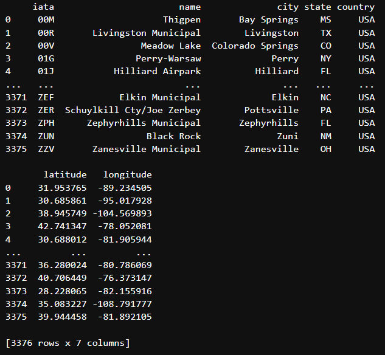
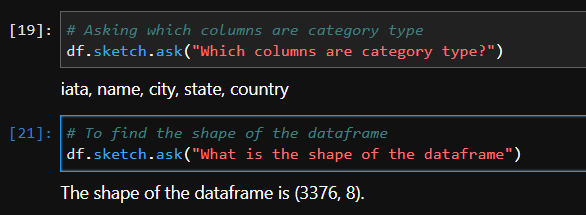
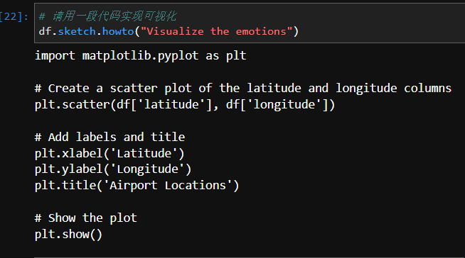
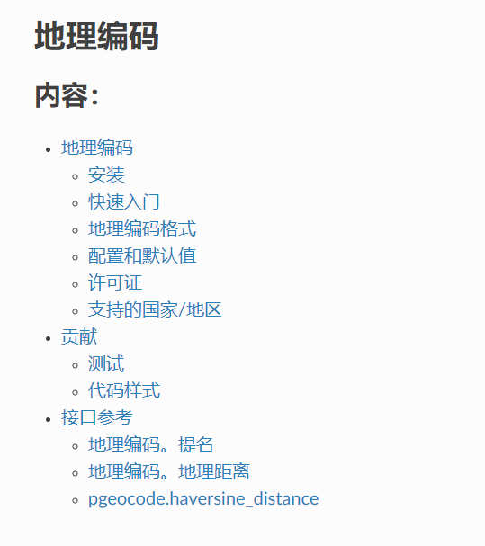
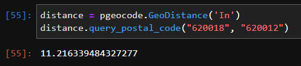
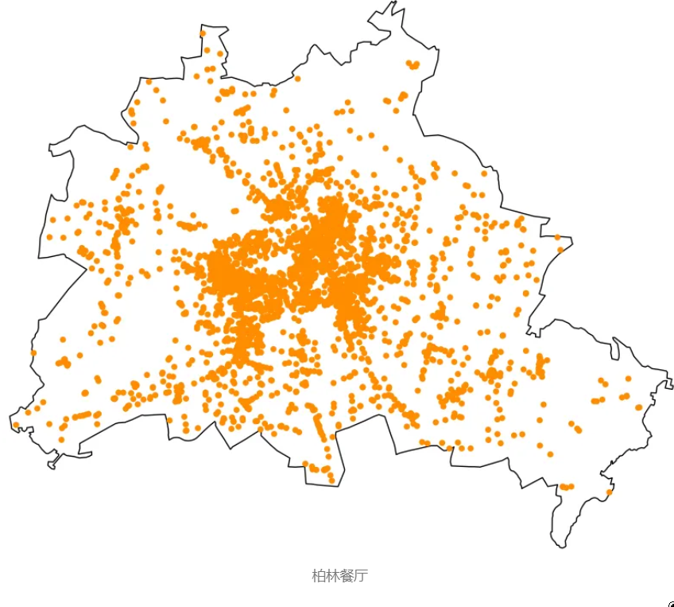

<a name="b7Bj8"></a>
## 1、Pendulum
Python 中有许多库可用于日期时间，Pendulum 在日期的任何操作上都易于使用。<br />Pendulum扩展了内置的 Python 日期时间模块，添加了更直观的 API，用于处理时区并对日期和时间执行操作：<br />例如添加时间间隔、减去日期和在时区之间转换。它提供了一个简单、人性化的 API 来格式化日期和时间。
<a name="FxQ0B"></a>
### 安装
```bash
pip install pendulum
```
<a name="Q7ZT2"></a>
### 实例化时区和时区换算：
```python
# 导入库
# import library

import pendulum
dt = pendulum.datetime(2023, 6, 8)
print(dt)
```
输出：
```
2023-06-08T00:00:00+00:00
```
<a name="GMjyW"></a>
### `local()` 使用本地时区
```python
#local() 使用本地时区

local = pendulum.local(2023, 6, 8)
print("本地时间：", local)
print("本地时区：", local.timezone.name)
```
输出：
```
本地时间：2023-06-08T00:00:00+08:00
本地时区：Asia/Shanghai
```
<a name="CwsCG"></a>
### 创建日期时间实例
```python
# Printing UTC time
utc = pendulum.now('UTC')
print("Current UTC time:", utc)
```
输出：
```
Current UTC time: 2023-06-08T10:44:51.856673+00:00
```
<a name="dwvHa"></a>
### 将 UTC 时区转换为欧洲/巴黎时间
```python
# 将UTC 时区转换为欧洲/巴黎时间
europe = utc.in_timezone('Europe/Paris')
print("巴黎当前时间：", europe)
```
输出：
```
Current UTC time: 2023-06-08T10:47:27.836789+00:00
Current time in Paris: 2023-06-08T12:47:27.836789+02:00
```
<a name="FdoOk"></a>
## 2、FTFY
是否遇到过数据中存在的外语无法正确显示的情况？<br />这被称为：Mojibake术语用于描述编码或解码问题而发生的乱码或乱码文本。<br />当使用一种字符编码编写的文本使用不同的编码错误解码时，通常会发生这种情况。<br />ftfy python库将帮助您修复Mojibake，这在NLP用例中非常有用。<br />安装
```bash
pip install ftfy
```
例
```python
print(ftfy.fix_text('Correct the sentence using “ftfyâ€\x9d.'))
print(ftfy.fix_text('✔ No problems with text'))
print(ftfy.fix_text('à perturber la réflexion'))
```
输出<br />除了Mojibake，ftfy将修复不正确的编码，不正确的行尾和不正确的引号。可以理解解码为以下任何编码的文本：
```
拉丁语-1 （ISO-8859–1）
Windows-1252 （cp1252 — 用于微软产品）
Windows-1251 （cp1251 — cp1252的俄语版本）
Windows-1250 （cp1250 — cp1252的东欧版本）
ISO-8859–2（与Windows-1250不完全相同）
MacRoman（在 Mac OS 9 及更早版本上使用）
cp437（用于 MS-DOS 和某些版本的 Windows 命令提示符）
```
<a name="vlcp8"></a>
## 3、Sketch
Sketch是一个独特的AI代码编写助手，专为使用Python中的pandas库的用户而设计。<br />它利用机器学习算法来理解用户数据的上下文，并提供相关的代码建议，使数据操作和分析任务更容易、更高效。<br />Sketch不需要用户在他们的IDE中安装任何其他插件，因此可以快速轻松地开始使用。<br />这可以大大减少数据相关任务所需的时间和精力，并帮助用户编写更好、更高效的代码。
<a name="UZUwX"></a>
### 安装
```bash
pip install sketch
```
例如需要在 Pandas 数据框中添加一个 .sketch 扩展名才能使用此库。
<a name="slJtf"></a>
### .sketch.ask
ask是Sketch的一项功能，允许用户以自然语言格式询问有关其数据的问题。它为用户的查询提供基于文本的响应。
```python
# Importing libraries
import sketch
import pandas as pd
file = "D://7 Datasciense//DS_visilization//altair//airports.csv"
# Reading the data (using twitter data as an example)
df = pd.read_csv(file)
print(df)
```
输出美国机场的概况：<br />
```python
# 问表单有哪些项目
df.sketch.ask("Which columns are category type?")
```
```
iata, name, city, state, country
```
合并到下一个命令输出截图
```python
# 描述表单的形状行和列的大小
df.sketch.ask("What is the shape of the dataframe")
```
```
The shape of the dataframe is (3376, 8).
```
以上两条命令的结果：<br />
<a name="qn9qy"></a>
### .sketch.howto
HowTo 是一项功能，它提供了一个代码块，可用作各种数据相关任务的起点或结论。<br />可以要求代码片段来规范化它们的数据、创建新特征、绘制数据，甚至构建模型。<br />这将节省时间并轻松复制和粘贴代码;<br />无需从头开始手动编写代码。
```python
# 请用一段代码实现可视化
df.sketch.howto("Visualize the emotions")
```
输出<br />
<a name="OeklD"></a>
### .sketch.apply
.apply 函数有助于生成新特征、解析字段和执行其他数据操作。<br />要使用此功能，需要拥有_ OpenAI _帐户并使用 API 密钥来执行任务
<a name="hgR3Z"></a>
## 4、pgeocode 地理编码
_“pgeocode”_是最近遇到的一个优秀的库，它对空间分析项目非常有用。<br />例如，它允许查找两个邮政编码之间的距离，并通过输入国家/地区和邮政编码来提供地理信息。<br />[_https://pgeocode.readthedocs.io/en/latest/_](https://pgeocode.readthedocs.io/en/latest/)<br /><br />[_https://pypi.org/project/pgeocode/_](https://pypi.org/project/pgeocode/)<br />以上页面里可以找到链接下载全球的邮政编码：<br />[_http://download.geonames.org/export/zip/_](http://download.geonames.org/export/zip/)<br />数据按“原样”提供，不带任何精度、时效性或完整性的保证或陈述。此自述文件描述了GeoNames邮政编码数据集。<br />主要的GeoNames地理名称数据提取位于此处：[_http://download.geonames.org/export/dump/_](http://download.geonames.org/export/dump/)<br />支持的国家/地区:<br />**目前支持近100个国家/地区。当国家邮政服务开始以兼容许可证发布数据时，将添加新的国家/地区。**<br />对许多国家/地区来说，纬度/经度是通过在主要的geonames数据库中搜索邮政编码的地名来确定的，_administrativedivisions_和邮政编码的数值邻近度是地名消歧的因素。<br />对于找不到主要的_geonames_数据库中对应的地理名称的邮政编码和地名，计算相邻邮政编码的平均纬度/经度。<br />部分中文国家简称的编码
```
地名数据库中提供的国家名单
以及相应的国家代码如下：

安道尔（AD）、阿根廷（AR）、美属萨摩亚（AS）、
奥地利（AT）、澳大利亚（AU）、奥兰群岛（AX）、
孟加拉国（BD）、比利时（BE）、保加利亚（BG）、
百慕大（BM）、巴西（BR）、白俄罗斯（BY）、
加拿大（加拿大）、瑞士（瑞士）、哥伦比亚（CO）、
哥斯达黎加（CR）、捷克（CZ）、德国（DE）、
丹麦（DK）、多米尼加共和国（DO）、
阿尔及利亚（DZ）、西班牙（西班牙）、芬兰（FI）、
法罗群岛（FO）、法国（fr）、

墨西哥（MX）、荷兰（荷兰）、挪威（NO）、
新西兰（新西兰）、
菲律宾（菲律宾）、巴基斯坦（PK）、波兰（PL）、
波多黎各（PR）、葡萄牙（PT）、留尼汪岛（RE）、
罗马尼亚（RO）、俄罗斯联邦（俄罗斯）、瑞典（SE）、
斯洛文尼亚（SI）、斯洛伐克（SK）、 圣马力诺（SM）、
泰国（TH）、土耳其（TR）、乌克兰（UA）、
美利坚合众国（美国）、乌拉圭（UY）、罗马教廷（VA）、
美属维尔京群岛（VI）、马约特岛（YT）、南非（ZA）
```
完整的英文国家简称的编码
```
Andorra (AD), Argentina (AR), American Samoa (AS), Austria (AT), Australia (AU), Åland Islands (AX), 

Bangladesh (BD), Belgium (BE), Bulgaria (BG), Bermuda (BM), Brazil (BR), Belarus (BY), 

Canada (CA), Switzerland (CH), Colombia (CO), Costa Rica (CR), Czechia (CZ), 

Germany (DE), Denmark (DK), Dominican Republic (DO), Algeria (DZ), 

Spain (ES), 

Finland (FI), Faroe Islands (FO), France (FR), 

United Kingdom of Great Britain and Northern Ireland (GB), French Guiana (GF), Guernsey (GG), Greenland (GL), Guadeloupe (GP), Guatemala (GT), Guam (GU), 

Croatia (HR), Hungary (HU), 

Ireland (IE), Isle of Man (IM), India (IN), Iceland (IS), Italy (IT), 

Jersey (JE), Japan (JP), 

Liechtenstein (LI), Sri Lanka (LK), Lithuania (LT), Luxembourg (LU), Latvia (LV), 

Monaco (MC), Republic of Moldova (MD), Marshall Islands (MH), The former Yugoslav Republic of Macedonia (MK), Northern Mariana Islands (MP), Martinique (MQ), Malta (MT), Mexico (MX), Malaysia (MY), 

New Caledonia (NC), Netherlands (NL), Norway (NO), New Zealand (NZ), 

Philippines (PH), Pakistan (PK), Poland (PL), Saint Pierre and Miquelon (PM), Puerto Rico (PR), Portugal (PT), 

Réunion (RE), Romania (RO), Russian Federation (RU), Sweden (SE), Slovenia (SI), Svalbard and Jan Mayen Islands (SJ), Slovakia (SK), San Marino (SM), 

Thailand (TH), Turkey (TR), 

Ukraine (UA), United States of America (US), Uruguay (UY), 

Holy See (VA), United States Virgin Islands (VI), 

Wallis and Futuna Islands (WF), Mayotte (YT), 

South Africa (ZA)
```
安装
```bash
pip install pgeocode
```
例获取特定邮政编码的地理信息
```python
# Checking for country "India"

nomi = pgeocode.Nominatim('In')

# Getting geo information by passing the postcodes

nomi.query_postal_code(["620018", "620017", "620012"])
```
输出
```
"PGEOCODE"
```
通过将国家和邮政编码作为输入来计算两个邮政编码之间的距离，结果以公里为单位：
```python
# 两个邮政编码之间的物理距离

distance = pgeocode.GeoDistance('In')
distance.query_postal_code("620018", "620012")
```
输出<br />
<a name="QoxT7"></a>
## 5、rembg
rembg 是另一个有用的库，可以轻松地从图像中删除背景。
```bash
#Installation
pip install rembg
```
例
```python
# Importing libraries
from rembg import remove
import cv2 
# path of input image (my file: image.jpeg)
input_path = 'image.jpeg'
# path for saving output image and saving as a output.jpeg
output_path = 'output.jpeg'
# Reading the input image
input = cv2.imread(input_path)
# Removing background
output = remove(input)
# Saving file 
cv2.imwrite(output_path, output)
```
输入本地目录存入待处理的照片：<br /><br />输出扣去背景的效果：<br />
<a name="IuTTy"></a>
## 6、Humanize
翻译为字面意思即“人性化”—为数字、日期和时间提供简单、易于阅读的字符串格式。<br />该库的目标是获取数据并使其更加人性化，例如，通过将秒数转换为更具可读性的字符串，如“2 分钟前”。<br />该库可以通过多种方式格式化数据，包括使用逗号格式化数字、将时间戳转换为相对时间等。<br />经常在数据工程项目中使用整数和日期和时间。
<a name="pQvPc"></a>
### 安装
```bash
pip install humanize
```
<a name="UInH7"></a>
### 示例-整数
```python
# Importing library
import humanize
import datetime as dt

# Formatting  numbers with comma
a =  humanize.intcomma(951009)

# converting numbers into words
b = humanize.intword(10046328394)

#printing
print(a)
print(b)
```
输出
```
951,009
10.0 billion
```
<a name="uTBAm"></a>
### 示例日期和时间
```python
import humanize
import datetime as dt

a = humanize.naturaldate(dt.date(2012, 6, 5))
b = humanize.naturalday(dt.date(2012, 6, 5))

print(a)
print(b)
```
输出
```python
Jun 05 2012
Jun 05
```
<a name="kyhrJ"></a>
## 7、开放街道地图 OSM 数据
osmnx是获取有关当地社区空间信息的非常有用的工具。<br />除了广泛的可用性之外，它可以通过Python轻松获得。这里展示如何下载OSM数据，如下所示。图为柏林的餐馆。<br /><br />柏林餐厅目标是收集不同年份、不同地理位置以及不同类型的机构的数据。当然，只需选择一个选项即可轻松简化任务。<br />首先通过加载必要的库来设置文件。
```python
# 必要的模块
import os
from os.path import join
import osmnx
import pandas as pd

# 全局路径变量
main_path = "your_main_path"
data_path = join(main_path, "data")
```
需要操作系统来处理目录路径。<br />osmnx是用来从OSM检索数据的主要库。建议使用虚拟环境来避免库安装时出现任何问题。<br />通常在 Anaconda 中设置一个虚拟环境，并通过通道 conda-forge 安装 osmnx。最后，Pandas主要用于数据操作和导出。<br />第二步要求为感兴趣的数据指定所有相关参数，包括要提取的地点类型以及地理位置。
```python
cities = ["柏林, 德国"， "汉堡, 德国"]
地点 = ["餐厅", "酒吧"]
# 注意：如果有外部存储的城市列表，也可以在此处阅读。 
# 只需要在这些城市中循环。
```
将以前定义的不同位置存储在自己的文件夹中。这是完全可选的。以下代码自动设置文件夹结构。<br />为了获得不同的年份，定义了一个时间戳，即检索OSM快照的时间点。这是按如下方式完成的：<br />时间戳设置为年底。任何其他日期也可以。<br />{year} 是用于循环多年中的占位符。<br />因此，要定义的最后一个参数是时间范围。<br />最后，需要一个列表来存储收集的数据。<br />一切准备就绪后，可以遍历所有选项。<br />请注意，在这里定义了便利设施如餐厅和酒吧。还可以根据 OSM 标签定义其他类型如休闲。可以通过咨询谷歌来了解不同的类型。就是这样。总之，它检索指定参数集的 OSM 数据。
