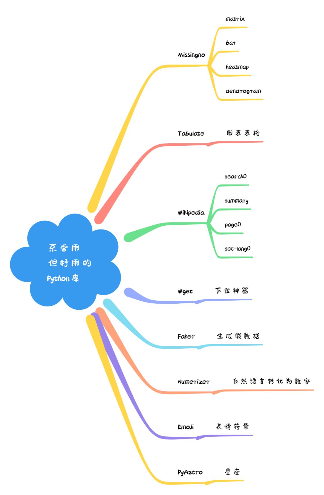
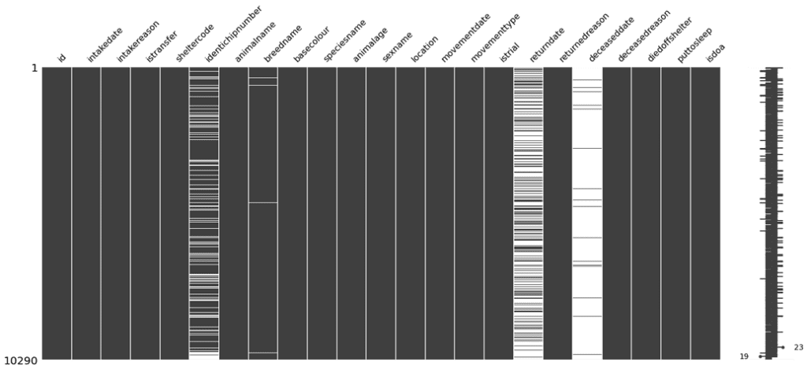
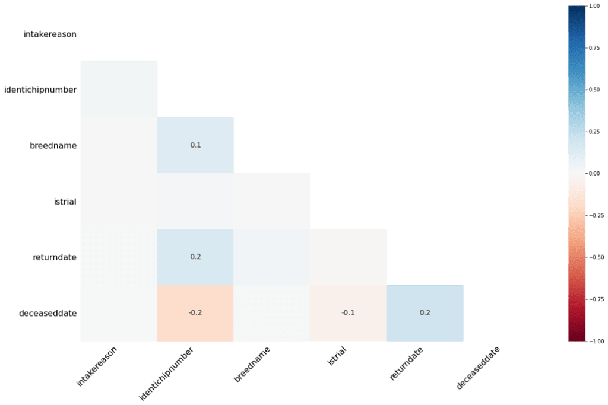
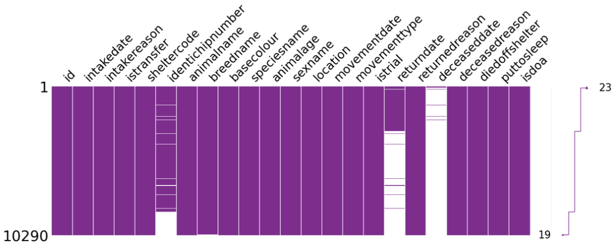
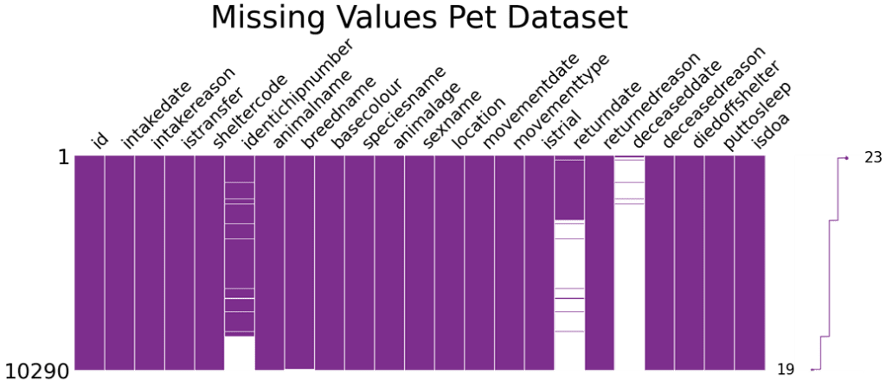
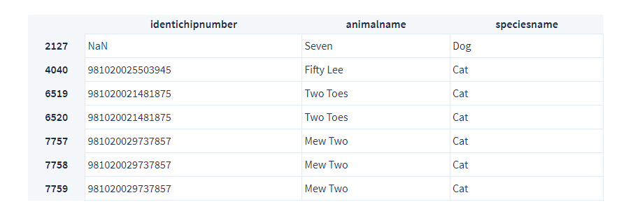
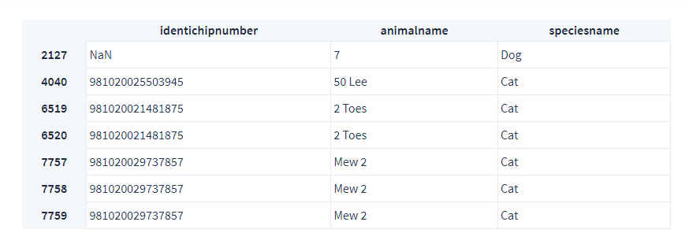
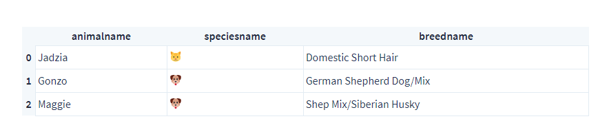
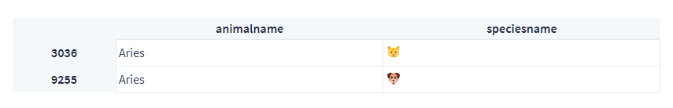

Python<br /><br />为了配合上述 Python 库的使用，先从 Kaggle 上下载一个数据 -- Animal Care and Control Adopted Animals<br />[https://www.kaggle.com/jinbonnie/animal-data](https://www.kaggle.com/jinbonnie/animal-data)
```python
import pandas as pd
df = pd.read_csv('animal-data-1.csv')
print('Number of pets:', len(df))
print(df.head(3))
```
```
Number of pets: 10290

          id           intakedate intakereason  istransfer sheltercode  \
    0  15801  2009-11-28 00:00:00       Moving           0   C09115463
    1  15932  2009-12-08 00:00:00       Moving           0   D09125594
    2  28859  2012-08-10 00:00:00    Abandoned           0   D12082309

      identichipnumber animalname                breedname basecolour speciesname  \
    0       0A115D7358     Jadzia      Domestic Short Hair     Tortie         Cat
    1       0A11675477      Gonzo  German Shepherd Dog/Mix        Tan         Dog
    2       0A13253C7B     Maggie  Shep Mix/Siberian Husky    Various         Dog

       ...         movementdate movementtype istrial returndate returnedreason  \
    0  ...  2017-05-13 00:00:00     Adoption     0.0        NaN          Stray
    1  ...  2017-04-24 00:00:00     Adoption     0.0        NaN          Stray
    2  ...  2017-04-15 00:00:00     Adoption     0.0        NaN          Stray

       deceaseddate deceasedreason diedoffshelter puttosleep isdoa
    0           NaN   Died in care              0          0     0
    1           NaN   Died in care              0          0     0
    2           NaN   Died in care              0          0     0

    [3 rows x 23 columns]
```
下面就进入这些 Python 库的介绍
<a name="QBvlM"></a>
### 1、Missingno
Missingno 是用于在数据集当中显示缺失值的，这对于数据分析来说是非常有用的。而且还能做成热力图或者条形图，来更加直观的观察缺失值

- matrix - 类似于 seaborn 中的缺失值热图，可以最多展示数据集中50列的密度情况，也可以通过右侧的迷你图，来整体观测数据集的缺失情况
- bar - 案列显示缺失值情况
- heatmap - 展示缺失值之间的相关性，本质上，揭示了变量的存在与否对另一个变量的存在的影响程度。而对于没有缺失值的列或者全完没有值的列，则不会出现在这里
- dendrogram - 树状图与热图类似，展示的是列之间缺失的相关性，而与热图不同的地方是通过一组列来揭示相关性

下面就来具体看看这些图表
```python
import missingno as msno

msno.matrix(df)
```

```python
msno.bar(df)
```

```python
msno.heatmap(df)
```

```python
msno.dendrogram(df)
```
<br />对于 missingno 图表，还可以自定义一些参数
```python
msno.matrix(
    df,
    figsize=(25,7),
    fontsize=30,
    sort='descending',
    color=(0.494, 0.184, 0.556),
    width_ratios=(10, 1)
)
```
<br />最后还可以与 matplotlib 相结合，制作更加优美的图表
```python
import matplotlib.pyplot as plt
msno.matrix(
    df,
    figsize=(25,7),
    fontsize=30,
    sort='descending',
    color=(0.494, 0.184, 0.556),
    width_ratios=(10, 1),
    inline=False
)
plt.title('Missing Values Pet Dataset', fontsize=55)
plt.show()
```

<a name="oXG8q"></a>
### 2、Tabulate
这个库可以在 Python 中打印出漂亮的表格，允许智能和可定制的列对齐、数字和文本格式、小数点对齐，也是一个数据分析过程中的好用工具。支持的数据类型包括 dataframe, list of lists or dictionaries, dictionary, NumPy array
```python
from tabulate import tabulate
df_pretty_printed = df.iloc[:5, [1,2,4,6]]
print(tabulate(df_pretty_printed))
```
```
-  -----------  -----------------------  ------  -----
0  Jadzia       Domestic Short Hair      Female  Stray
1  Gonzo        German Shepherd Dog/Mix  Male    Stray
2  Maggie       Shep Mix/Siberian Husky  Female  Stray
3  Pretty Girl  Domestic Short Hair      Female  Stray
4  Pretty Girl  Domestic Short Hair      Female  Stray
-  -----------  -----------------------  ------  -----
```
还可以自定义表格头，使用参数 headers
```python
print(tabulate(
               df_pretty_printed,
               headers='keys',
               tablefmt='fancy_grid',
               stralign='center'
               ))
```
```
│    │  animalname  │        breedname        │  sexname  │  returnedreason  │
╞════╪══════════════╪═════════════════════════╪═══════════╪══════════════════╡
│  0 │    Jadzia    │   Domestic Short Hair   │  Female   │      Stray       │
├────┼──────────────┼─────────────────────────┼───────────┼──────────────────┤
│  1 │    Gonzo     │ German Shepherd Dog/Mix │   Male    │      Stray       │
├────┼──────────────┼─────────────────────────┼───────────┼──────────────────┤
│  2 │    Maggie    │ Shep Mix/Siberian Husky │  Female   │      Stray       │
├────┼──────────────┼─────────────────────────┼───────────┼──────────────────┤
│  3 │ Pretty Girl  │   Domestic Short Hair   │  Female   │      Stray       │
├────┼──────────────┼─────────────────────────┼───────────┼──────────────────┤
│  4 │ Pretty Girl  │   Domestic Short Hair   │  Female   │      Stray       │
╘════╧══════════════╧═════════════════════════╧═══════════╧══════════════════╛
```
不过这个库打印出的表格数据在手机屏幕上会有一定的兼容性问题，只有在PC机上才能有最佳的显示效果
<a name="DtETp"></a>
### 3、Wikipedia
维基百科库，可以方便的访问维基百科信息，以及获取数据<br />该库的几个主要功能如下：

- 搜索维基百科 - `search()`
- 获取文章摘要 - `summary`
- 获取完整页面内容，包括图像、链接等 - `page()`
- 选择语言 - `set_lang()`

以上面数据集当中的 Siberian Husky 为关键词，在维基百科中设置为俄语搜索一下，看看结果
```python
import wikipedia
wikipedia.set_lang('ru')
print(wikipedia.search('Siberian Husky'))
```
```
['Сибирский хаски', 'Древние породы собак', 'Маккензи Ривер Хаски', 'Породы собак по классификации кинологических организаций', 'Ричардсон, Кевин Майкл']
```
获取第一个搜索结果当中的第一段话
```python
print(wikipedia.summary('Сибирский хаски', sentences=1))
```
```
Сибирский хаски — заводская специализированная порода собак, выведенная чукчами северо-восточной части Сибири и зарегистрированная американскими кинологами в 1930-х годах как ездовая собака, полученная от аборигенных собак Дальнего Востока России, в основном из Анадыря, Колымы, Камчатки у местных оседлых приморских племён — юкагиров, кереков, азиатских эскимосов и приморских чукчей — анкальын (приморские, поморы — от анкы (море)).
```
下面再来获取图片信息
```python
print(wikipedia.page('Сибирский хаски').images[0])
```
就可以拿到图片了<br />
<a name="k0a9V"></a>
### 4、Wget
对于这个库，熟悉 Linux 的同学应该都知道，一个好用的 shell 命令也叫做 wget，是用来下载文件的，这个 Python 库也有着同样的功能<br />来试试下载上面哈士奇图片吧
```python
import wget
wget.download('https://upload.wikimedia.org/wikipedia/commons/a/a3/Black-Magic-Big-Boy.jpg')
```
```
'Black-Magic-Big-Boy.jpg'
```
当然使用该库，还可以方便的下载 HTML 文件
```python
wget.download('https://www.kaggle.com/jinbonnie/animal-data')
```
```
'animal-data'
```
下载好的文件内容类似：
```
<!DOCTYPE html>
<html lang="en">
<head>
    <title>Animal Care and Control Adopted Animals | Kaggle</title>
    <meta charset="utf-8" />
    <meta name="robots" content="index, follow" />
    <meta name="description" content="animal situation in Bloomington Animal Shelter from 2017-2020" />
    <meta name="turbolinks-cache-control" content="no-cache" />
```
<a name="ljyTP"></a>
### 5、Faker
这个库是用来生成假数据的，这个在平时的程序测试当中还是非常好用的。它可以生成包括名字、邮件地址、电话号码、工作、句子、颜色，货币等等众多假数据，同时还支持本地化，也就是可以将当前工作语言环境作为参数，生成当前语言的假数据，实在是太贴心了
```python
from faker import Faker
fake = Faker()

print(
      'Fake color:', fake.color(), '\n'
      'Fake job:',   fake.job(),   '\n'
      'Fake email:', fake.email(), '\n'
      )

# Printing a list of fake Korean and Portuguese addresses
fake = Faker(['ko_KR', 'pt_BR'])
for _ in range(5):
    print(fake.unique.address())     # using the `.unique` property

print('\n')

# Assigning a seed number to print always the same value / data set
fake = Faker()
Faker.seed(3920)
print('This English fake name is always the same:', fake.name())
```
```
Fake color: #212591
Fake job: Occupational therapist
Fake email: nancymoody@hotmail.com

Estrada Lavínia da Luz, 62
Oeste
85775858 Moura / SE
Residencial de Moreira, 57
Morro Dos Macacos
75273529 Farias / TO
세종특별자치시 강남구 가락거리 (예원박김마을)
전라북도 광주시 백제고분길 (승민우리)
경상남도 당진시 가락53가

This English fake name is always the same: Kim Lopez
```
再回到动物数据集，可以发现有两个动物的名字不是特别好
```python
df_bad_names = df[df['animalname'].str.contains('Stink|Pooh')]
print(df_bad_names)
```
```
identichipnumber animalname            breedname speciesname sexname  \
1692              NaN    Stinker  Domestic Short Hair         Cat    Male
3336  981020023417175       Pooh  German Shepherd Dog         Dog  Female
3337  981020023417175       Pooh  German Shepherd Dog         Dog  Female

               returndate                     returnedreason
1692                  NaN                              Stray
3336  2018-05-14 00:00:00  Incompatible with owner lifestyle
3337                  NaN                              Stray
```
下面分别为这两只猫狗重新命名一个好听的名字
```python
# Defining a function to rename the unlucky pets
def rename_pets(name):
    if name == 'Stinker':
        fake = Faker()
        Faker.seed(162)
        name = fake.name()
    if name == 'Pooh':
        fake = Faker(['de_DE'])
        Faker.seed(20387)
        name = fake.name()
    return name

# Renaming the pets
df['animalname'] = df['animalname'].apply(rename_pets)

# Checking the results
print(df.iloc[df_bad_names.index.tolist(), :] )
```
```
identichipnumber            animalname            breedname speciesname  \
1692              NaN         Steven Harris  Domestic Short Hair         Cat
3336  981020023417175  Helena Fliegner-Karz  German Shepherd Dog         Dog
3337  981020023417175  Helena Fliegner-Karz  German Shepherd Dog         Dog

     sexname           returndate                     returnedreason
1692    Male                  NaN                              Stray
3336  Female  2018-05-14 00:00:00  Incompatible with owner lifestyle
3337  Female                  NaN                              Stray
```
怎么样，名字是不是好听多了
<a name="UadlN"></a>
### 6、Numerizer
该库可以将自然语言转化为数字，来看看吧<br />先来获取名称中包含数据的动物的信息
```python
df_numerized_names = df[['identichipnumber', 'animalname', 'speciesname']]\
                        [df['animalname'].str.contains('Two|Seven|Fifty')]
df_numerized_names
```
<br />下面就把名称中的数字转化成阿拉伯数字
```python
from numerizer import numerize
df['animalname'] = df['animalname'].apply(lambda x: numerize(x))
df[['identichipnumber', 'animalname', 'speciesname']].iloc[df_numerized_names.index.tolist(), :]
```

<a name="MKyUN"></a>
### 7、Emoji
符号库，可以根据 Unicode Consortium 2 定义的表情符号代码将字符串转换为表情符号，emoji 库只有两个函数：`emojize()` 和 `demojize()`
```python
import emoji
print(emoji.emojize(':koala:'))
print(emoji.demojize(''))
print(emoji.emojize(':rana:', language='it'))
```
```
🐨
:koala:
🐸
```
下面来符号化动物吧
```python
print(df['speciesname'].unique())
```
```
['Cat' 'Dog' 'House Rabbit' 'Rat' 'Bird' 'Opossum' 'Chicken' 'Wildlife'
 'Ferret' 'Tortoise' 'Pig' 'Hamster' 'Guinea Pig' 'Gerbil' 'Lizard'
'Hedgehog' 'Chinchilla' 'Goat' 'Snake' 'Squirrel' 'Sugar Glider' 'Turtle'
'Tarantula' 'Mouse' 'Raccoon' 'Livestock' 'Fish']
```
要将字母全部转化为小写，然后在前后分别添加冒号
```python
df['speciesname'] = df['speciesname'].apply(lambda x: emoji.emojize(f':{x.lower()}:',
                                                                    use_aliases=True))
print(df['speciesname'].unique())
```
```
['' '' ':house rabbit:' '' '' ':opossum:' '' ':wildlife:' ':ferret:'
':tortoise:' '' '' ':guinea pig:' ':gerbil:' '' '' ':chinchilla:' ''
'' ':squirrel:' ':sugar glider:' '' ':tarantula:' '' '' ':livestock:'
'']
```
再进行名称同义词转化
```python
df['speciesname'] = df['speciesname'].str.replace(':house rabbit:', ':rabbit:')\
                                         .replace(':tortoise:', ':turtle:')\
                                         .replace(':squirrel:', ':chipmunk:')
df['speciesname'] = df['speciesname'].apply(lambda x: emoji.emojize(x, variant='emoji_type'))
print(df['speciesname'].unique())
```
```
['' '' '️' '' '' ':opossum:️' '' ':wildlife:️' ':ferret:️' '️' ''
'' ':guinea pig:' ':gerbil:️' '' '' ':chinchilla:️' '' '' ''
':sugar glider:' '' ':tarantula:️' '' '' ':livestock:️' '']
```
对于剩下的这些没有对应动物名称的数据，再转化回原来的数据形式
```python
df['speciesname'] = df['speciesname'].str.replace(':', '').apply(lambda x: x.title())
print(df['speciesname'].unique())
df[['animalname', 'speciesname', 'breedname']].head(3)
```
```
['' '' '️' '' '' 'Opossum️' '' 'Wildlife️' 'Ferret️' '️' '' ''
'Guinea Pig' 'Gerbil️' '' '' 'Chinchilla️' '' '' '' 'Sugar Glider'
'' 'Tarantula️' '' '' 'Livestock️' '']
```
这样，就完成了符号化动物名称了<br />
<a name="XzXmX"></a>
### 8、PyAztro
这个库的创造可能仅仅是为了娱乐吧，该库可以预测每一天不同星座的幸运数字、幸运时间、幸运颜色等等，感兴趣的朋友可以玩一玩
```python
import pyaztro
pyaztro.Aztro(sign='taurus').description
```
```
'You need to make a radical change in some aspect of your life - probably related to your home. It could be time to buy or sell or just to move on to some more promising location.'
```
再来看看数据集，在数据集中，有一只猫和一只狗叫 Aries（白羊座）
```python
df[['animalname', 'speciesname']][(df['animalname'] == 'Aries')]
```
<br />还有很多动物叫做 Leo （狮子座）
```python
print('Leo:', df['animalname'][(df['animalname'] == 'Leo')].count())

Leo: 18
```
假设这就是动物们的星座，然后来使用该库预测他们的运势吧
```python
aries = pyaztro.Aztro(sign='aries')
leo = pyaztro.Aztro(sign='leo')

print('ARIES: \n',
      'Sign:',             aries.sign,          '\n',
      'Current date:',     aries.current_date,  '\n',
      'Date range:',       aries.date_range,    '\n',
      'Sign description:', aries.description,   '\n',
      'Mood:',             aries.mood,          '\n',
      'Compatibility:',    aries.compatibility, '\n',
      'Lucky number:',     aries.lucky_number,  '\n',
      'Lucky time:',       aries.lucky_time,    '\n',
      'Lucky color:',      aries.color,       2*'\n',

      'LEO: \n',
      'Sign:',             leo.sign,            '\n',
      'Current date:',     leo.current_date,    '\n',
      'Date range:',       leo.date_range,      '\n',
      'Sign description:', leo.description,     '\n',
      'Mood:',             leo.mood,            '\n',
      'Compatibility:',    leo.compatibility,   '\n',
      'Lucky number:',     leo.lucky_number,    '\n',
      'Lucky time:',       leo.lucky_time,      '\n',
      'Lucky color:',      leo.color)
```
```
ARIES:
 Sign: aries
 Current date: 2021-02-06
 Date range: [datetime.datetime(2021, 3, 21, 0, 0), datetime.datetime(2021, 4, 20, 0, 0)]
 Sign description: It's a little harder to convince people your way is best today -- in part because it's much tougher to play on their emotions. Go for the intellectual arguments and you should do just fine.
 Mood: Helpful
 Compatibility: Leo
 Lucky number: 18
 Lucky time: 8am
 Lucky color: Gold

 LEO:
 Sign: leo
 Current date: 2021-02-06
 Date range: [datetime.datetime(2021, 7, 23, 0, 0), datetime.datetime(2021, 8, 22, 0, 0)]
 Sign description: Big problems need big solutions -- but none of the obvious ones seem to be working today! You need to stretch your mind as far as it will go in order to really make sense of today's issues.
 Mood: Irritated
 Compatibility: Libra
 Lucky number: 44
 Lucky time: 12am
 Lucky color: Navy Blue
```
