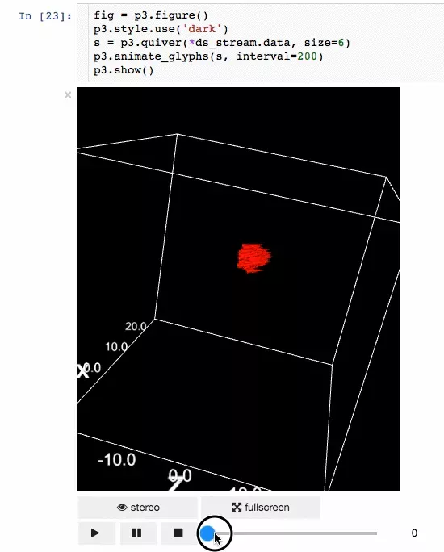
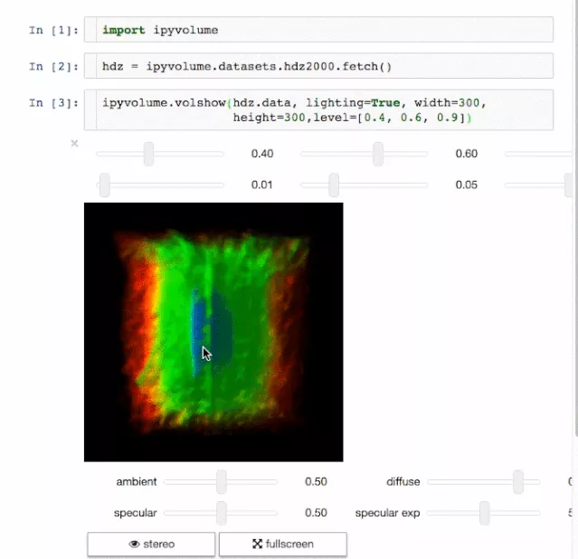
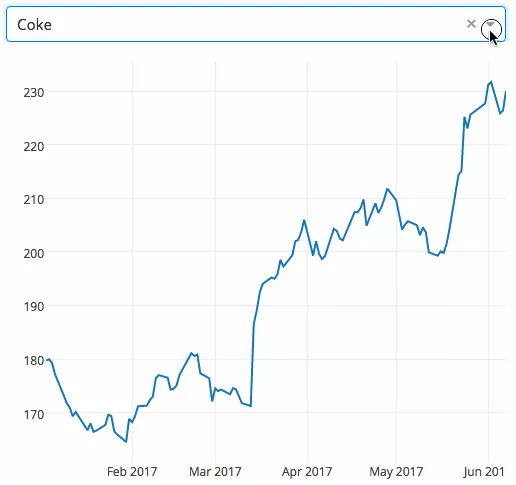

Python 库
<a name="r0fZ9"></a>
### Wget
从网络上提取数据是数据科学家的重要任务之一。Wget 是一个免费的实用程序，可以用于从网络上下载非交互式的文件。它支持 HTTP、HTTPS 和 FTP 协议，以及通过 HTTP 的代理进行文件检索。由于它是非交互式的，即使用户没有登录，它也可以在后台工作。所以下次当你想要下载一个网站或者一个页面上的所有图片时，wget 可以起作用。
<a name="iQVC4"></a>
#### 安装
```bash
$ pip install wget
```
<a name="VRqog"></a>
#### 例子
```python
import wget
url = 'http://www.futurecrew.com/skaven/song_files/mp3/razorback.mp3'
filename = wget.download(url)
100% [................................................] 3841532 / 3841532
filename
'razorback.mp3'
### Pendulum
```
<a name="G8Wjy"></a>
### Pendulum 
对于那些在 Python中处理日期时间时会感到沮丧的人来说，Pendulum 很适合你。它是一个简化日期时间操作的 Python 包。它是 Python 原生类的简易替代。可以参阅文档深入学习。
<a name="e5kaO"></a>
#### 安装
```bash
$ pip install pendulum
```
<a name="tzfYZ"></a>
#### 例子
```python
import pendulum
dt_toronto = pendulum.datetime(2012, 1, 1, tz='America/Toronto')
dt_vancouver = pendulum.datetime(2012, 1, 1, tz='America/Vancouver')
print(dt_vancouver.diff(dt_toronto).in_hours())
3
```
<a name="5oP9h"></a>
### imbalanced-learn
可以看出，当每个类的样本数量基本相同时，大多数分类算法的效果是最好的，即需要保持数据平衡。但现实案例中大多是不平衡的数据集，这些数据集对机器学习算法的学习阶段和后续预测都有很大影响。幸运的是，这个库就是用来解决此问题的。它与 scikit-learn 兼容，是 scikit-lear-contrib 项目的一部分。下次当遇到不平衡的数据集时，请尝试使用它。
<a name="2qVXN"></a>
#### 安装
```bash
$ pip install -U imbalanced-learn
# 或者
conda install -c conda-forge imbalanced-learn
```
<a name="vve9G"></a>
#### 例子
使用方法和例子请参考文档。
<a name="1OAKO"></a>
### FlashText
在 NLP 任务中，清理文本数据往往需要替换句子中的关键字或从句子中提取关键字。通常，这种操作可以使用正则表达式来完成，但是如果要搜索的术语数量达到数千个，这就会变得很麻烦。Python 的 FlashText 模块是基于 FlashText 算法为这种情况提供了一个合适的替代方案。FlashText 最棒的一点是，不管搜索词的数量如何，运行时间都是相同的。
<a name="UObip"></a>
#### 安装
```bash
$ pip install flashtext
```
<a name="S59Z2"></a>
#### 例子
提取关键字
```python
from flashtext import KeywordProcessor
keyword_processor = KeywordProcessor()
# keyword_processor.add_keyword(<unclean name>, <standardised name>)
keyword_processor.add_keyword('Big Apple', 'New York')
keyword_processor.add_keyword('Bay Area')
keywords_found = keyword_processor.extract_keywords('I love Big Apple and Bay Area.')
keywords_found
['New York', 'Bay Area']
```
替换关键字
```python
keyword_processor.add_keyword('New Delhi', 'NCR region')
new_sentence = keyword_processor.replace_keywords('I love Big Apple and new delhi.')
new_sentence
'I love New York and NCR region.'
Fuzzywuzzy
```
<a name="JNSaN"></a>
### fuzzywuzzy 
这个库的名字听起来很奇怪，但是在字符串匹配方面，fuzzywuzzy 是一个非常有用的库。可以很方便地实现计算字符串匹配度、令牌匹配度等操作，也可以很方便地匹配保存在不同数据库中的记录。
<a name="zeyQl"></a>
#### 安装
```bash
$ pip install fuzzywuzzy
```
<a name="9XkgU"></a>
#### 例子
```python
from fuzzywuzzy import fuzz
from fuzzywuzzy import process
# 简单匹配度
fuzz.ratio("this is a test", "this is a test!")
97
# 模糊匹配度
fuzz.partial_ratio("this is a test", "this is a test!")
 100
```
更多有趣例子可以在 GitHub 仓库找到。
<a name="p1uqm"></a>
### PyFlux
时间序列分析是机器学习领域中最常见的问题之一。PyFlux 是 Python 中的一个开源库，它是为处理时间序列问题而构建的。该库拥有一系列优秀的现代时间序列模型，包括但不限于 ARIMA、GARCH 和 VAR 模型。简而言之，PyFlux 为时间序列建模提供了一种概率方法。值得尝试一下。
<a name="yCkYT"></a>
#### 安装
```bash
$ pip install pyflux
```
<a name="zTGT9"></a>
#### 例子
详细用法和例子请参考官方文档。
<a name="aVes7"></a>
### Ipyvolume
结果展示也是数据科学中的一个重要方面。能够将结果进行可视化将具有很大优势。IPyvolume 是一个可以在 Jupyter notebook 中可视化三维体和图形（例如三维散点图等）的 Python 库，并且只需要少量配置。但它目前还是 1.0 之前的版本阶段。用一个比较恰当的比喻来解释就是：IPyvolume 的 volshow 对于三维数组就像 matplotlib 的 imshow 对于二维数组一样好用。可以在这里获取更多。
<a name="kbBX0"></a>
#### 安装
使用 pip
```bash
$ pip install ipyvolume
```
使用 Conda/Anaconda
```bash
$ conda install -c conda-forge ipyvolume
```
<a name="FMmhH"></a>
#### 例子

- 动画



- 体绘制图


<a name="Ybi7x"></a>
### Dash
Dash 是一个高效的用于构建 web 应用程序的 Python 框架。它是在 Flask、Plotly.js 和 React.js 基础上设计而成的，绑定了很多比如下拉框、滑动条和图表的现代 UI 元素，可以直接使用 Python 代码来写相关分析，而无需再使用 javascript。Dash 非常适合构建数据可视化应用程序。然后，这些应用程序可以在 web 浏览器中呈现。用户指南可以在这里获取。
<a name="1kNt2"></a>
#### 安装
```bash
pip install dash==0.29.0  # 核心 dash 后端
pip install dash-html-components==0.13.2  # HTML 组件
pip install dash-core-components==0.36.0  # 增强组件
pip install dash-table==3.1.3  # 交互式 DataTable 组件（最新！）
```
<a name="IM5sS"></a>
#### 例子
下面的例子展示了一个具有下拉功能的高度交互式图表。当用户在下拉菜单中选择一个值时，应用程序代码将动态地将数据从 Google Finance 导出到 panda DataFrame。<br />
<a name="zlQWq"></a>
### Gym
OpenAI 的 Gym 是一款用于增强学习算法的开发和比较工具包。它兼容任何数值计算库，如 TensorFlow 或 Theano。Gym 库是测试问题集合的必备工具，这个集合也称为环境 —— 可以用它来开发强化学习算法。这些环境有一个共享接口，允许进行通用算法的编写。
<a name="2V8xs"></a>
#### 安装
```bash
$ pip install gym
```
<a name="8cb94eb1"></a>
#### 例子
这个例子会运行`CartPole-v0`环境中的一个实例，它的时间步数为 1000，每一步都会渲染整个场景。
