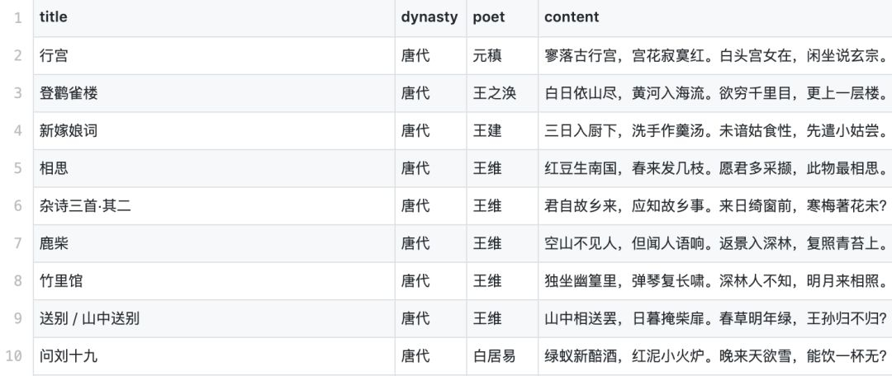

Python<br />简单介绍 Python 中的一个轻量级搜索工具 Whoosh，并给出相应的使用示例代码。
<a name="gv7U1"></a>
## Whoosh 简介
Whoosh 由 Matt Chaput 创建，它一开始是一个为 Houdini 3D 动画软件包的在线文档提供简单、快速的搜索服务工具，之后便慢慢成为一个成熟的搜索解决工具并已开源。<br />Whoosh 纯由 Python 编写而成，是一个灵活的，方便的，轻量级的搜索引擎工具，现在同时支持 Python2、3，其优点如下：

- Whoosh 纯由 Python 编写而成，但很快，只需要 Python 环境即可，不需要编译器；
- 默认使用 Okapi BM25F 排序算法，也支持其他排序算法；
- 相比于其他搜索引擎，Whoosh 会创建更小的 index 文件；
- Whoosh 中的 index 文件编码必须是 unicode;
- Whoosh 可以储存任意的 Python 对象。

Whoosh 的官方介绍网站为：[https://whoosh.readthedocs.io/en/latest/intro.html](https://whoosh.readthedocs.io/en/latest/intro.html) 。<br />相比于 ElasticSearch 或者 Solr 等成熟的搜索引擎工具，Whoosh 显得更轻便，操作更简单，可以考虑在小型的搜索项目中使用。
<a name="TXz4t"></a>
## Index & query
对于熟悉 ES 的人来说，搜索的两个重要的方面为 mapping 和 query，也就是索引的构建以及查询，背后是复杂的索引储存、query 解析以及排序算法等。如果有 ES 方面的经验，那么，对于 Whoosh 是十分容易上手的。<br />按照笔者的理解以及 Whoosh 的官方文档，Whoosh 的入门使用主要是 index 以及 query。搜索引擎的强大功能之一在于它能够提供全文检索，这依赖于排序算法，比如 BM25，也依赖于怎样储存字段。因此，index 作为名词时，是指字段的索引，index 作为动词时，是指建立字段的索引。而 query 会将需要查询的语句，通过排序算法，给出合理的搜索结果。<br />关于 Whoosh 的使用，在官文文档中已经给出了详细的说明，在这里只给出一个简单的例子，来说明 Whoosh 如何能方便地提升搜索体验。
<a name="NEwpS"></a>
## 示例代码
<a name="dlwLQ"></a>
### 数据
本项目的示例数据为 poem.csv，下图为该数据集的前十行：<br />
<a name="tt5d7"></a>
### 字段
根据数据集的特征，创建四个字段（fields）：title, dynasty, poet, content。创建的代码如下：
```python
# -*- coding: utf-8 -*-
import os
from whoosh.index import create_in
from whoosh.fields import *
from jieba.analyse import ChineseAnalyzer
import json

# 创建schema, stored为True表示能够被检索
schema = Schema(title=TEXT(stored=True, analyzer=ChineseAnalyzer()),
                dynasty=ID(stored=True),
                poet=ID(stored=True),
                content=TEXT(stored=True, analyzer=ChineseAnalyzer())
               )
```
其中，ID 只能为一个单元值，不能分割为若干个词，常用于文件路径、URL、日期、分类；<br />TEXT 文件的文本内容，建立文本的索引并存储，支持词汇搜索；Analyzer 选择结巴中文分词器。
<a name="odoa8"></a>
### 创建索引文件
接着，需要创建索引文件。用程序先解析 poem.csv 文件，并将它转化为 index，写入到 indexdir 目录下。Python 代码如下：
```python
# 解析poem.csv文件
with open('poem.csv', 'r', encoding='utf-8') as f:
    texts = [_.strip().split(',') for _ in f.readlines() if len(_.strip().split(',')) == 4]

    # 存储schema信息至indexdir目录
indexdir = 'indexdir/'
if not os.path.exists(indexdir):
    os.mkdir(indexdir)
ix = create_in(indexdir, schema)

# 按照schema定义信息，增加需要建立索引的文档
writer = ix.writer()
for i in range(1, len(texts)):
    title, dynasty, poet, content = texts[i]
    writer.add_document(title=title, dynasty=dynasty, poet=poet, content=content)
writer.commit()
```
index 创建成功后，会生成 indexdir 目录，里面含有上述 poem.csv 数据的各个字段的索引文件。
<a name="UazEq"></a>
### 查询
index 创建成功后，我们就利用进行查询。<br />比如想要查询 content 中含有明月的诗句，可以输入以下代码：
```python
# 创建一个检索器
searcher = ix.searcher()

# 检索content中出现'明月'的文档
results = searcher.find("content", "明月")
print('一共发现%d份文档。' % len(results))
for i in range(min(10, len(results))):
    print(json.dumps(results[i].fields(), ensure_ascii=False))
```
输出结果如下：
```
一共发现44份文档。
前10份文档如下：
{"content": "床前明月光，疑是地上霜。举头望明月，低头思故乡。", "dynasty": "唐代", "poet": "李白 ", "title": "静夜思"}
{"content": "边草，边草，边草尽来兵老。山南山北雪晴，千里万里月明。明月，明月，胡笳一声愁绝。", "dynasty": "唐代", "poet": "戴叔伦 ", "title": "调笑令·边草"}
{"content": "独坐幽篁里，弹琴复长啸。深林人不知，明月来相照。", "dynasty": "唐代", "poet": "王维 ", "title": "竹里馆"}
{"content": "汉江明月照归人，万里秋风一叶身。休把客衣轻浣濯，此中犹有帝京尘。", "dynasty": "明代", "poet": "边贡 ", "title": "重赠吴国宾"}
{"content": "秦时明月汉时关，万里长征人未还。但使龙城飞将在，不教胡马度阴山。", "dynasty": "唐代", "poet": "王昌龄 ", "title": "出塞二首·其一"}
{"content": "京口瓜洲一水间，钟山只隔数重山。春风又绿江南岸，明月何时照我还？", "dynasty": "宋代", "poet": "王安石 ", "title": "泊船瓜洲"}
{"content": "四顾山光接水光，凭栏十里芰荷香。清风明月无人管，并作南楼一味凉。", "dynasty": "宋代", "poet": "黄庭坚 ", "title": "鄂州南楼书事"}
{"content": "青山隐隐水迢迢，秋尽江南草未凋。二十四桥明月夜，玉人何处教吹箫？", "dynasty": "唐代", "poet": "杜牧 ", "title": "寄扬州韩绰判官"}
{"content": "露气寒光集，微阳下楚丘。猿啼洞庭树，人在木兰舟。广泽生明月，苍山夹乱流。云中君不见，竟夕自悲秋。", "dynasty": "唐代", "poet": "马戴 ", "title": "楚江怀古三首·其一"}
{"content": "海上生明月，天涯共此时。情人怨遥夜，竟夕起相思。灭烛怜光满，披衣觉露滋。不堪盈手赠，
```
