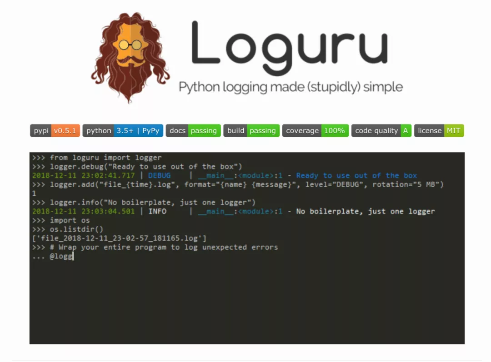

Python 日志<br />Loguru: 更优雅的日志记录解决方案！<br />loguru 是一个 Python 简易且强大的第三方日志记录库，该库旨在通过添加一系列有用的功能来解决标准记录器的注意事项，从而减少 Python 日志记录的痛苦。<br />

## 1、引入原因
简单且方便的输出需要的日志信息！

- 使用 Python 来写程序或者脚本的话，常常遇到的问题就是需要对日志进行删除。一方面可以在程序出问题的时候排除问题，二来可以记录需要关注的信息。
- 但是，使用自带自带的 logging 模块的话，则需要进行不同的初始化等相关工作。对应不熟悉该模块的同学来说，还是有些费劲的，比如需要配置 Handler/Formatter 等。
```python
import logging

logger = logging.getLogger('xxx')
handler = logging.StreamHandler()
formatter = logging.Formatter('%(asctime)s %(name)-12s %(levelname)-8s %(message)s')
handler.setFormatter(formatter)
logger.addHandler(handler)
logger.setLevel(logging.DEBUG)

logger.debug('This is a %s', 'test')
```

- 而 loguru 就是一个可以 开箱即用 的日志记录模块，不再需要复杂的初始化操作就可以通过如下命令来记录日志信息了。
```bash
# pip
$ pip install loguru
```
<a name="nTEn7"></a>
## 2、功能特性
有很多优点，以下列举了其中比较重要的几点！

- 开箱即用，无需准备
- 无需初始化，导入函数即可使用
- 更容易的文件日志记录与转存/保留/压缩方式
- 更优雅的字符串格式化输出
- 可以在线程或主线程中捕获异常
- 可以设置不同级别的日志记录样式
- 支持异步，且线程和多进程安全
- 支持惰性计算
- 适用于脚本和库
- 完全兼容标准日志记录
- 更好的日期时间处理

---


## 3、快速上手
介绍 loguru 的常用操作和功能介绍！

### [1] 开箱即用，无需准备

   - loguru 并没有什么黑科技，只是它预先设置好了相关的配置，导入之后即可直接使用。
```python
from loguru import logger

logger.debug("That's it, beautiful and simple logging!")
```

### [2] 无需初始化，导入函数即可使用

- 如何添加处理程序(`handler`)呢？
- 如何设置日志格式(logs formatting)呢？
- 如何过滤消息(filter messages)呢？
- 如何如何设置级别(log level)呢？
```python
# add
logger.add(sys.stderr, \
    format="{time} {level} {message}",\
    filter="my_module",\
    level="INFO")
```
<a name="XYrDa"></a>
### [3] 更容易的文件日志记录与转存/保留/压缩方式
```python
# 日志文件记录
logger.add("file_{time}.log")

# 日志文件转存
logger.add("file_{time}.log", rotation="500 MB")
logger.add("file_{time}.log", rotation="12:00")
logger.add("file_{time}.log", rotation="1 week")

# 多次时间之后清理
logger.add("file_X.log", retention="10 days")

# 使用zip文件格式保存
logger.add("file_Y.log", compression="zip")
```

### [4] 更优雅的字符串格式化输出
```python
logger.info(
    "If you're using Python {}, prefer {feature} of course!",
    3.6, feature="f-strings")
```

### [5] 在线程或主线程中捕获异常
```python
@logger.catch
def my_function(x, y, z):
    # An error? It's caught anyway!
    return 1 / (x + y + z)

my_function(0, 0, 0)
```

### [6] 可以设置不同级别的日志记录样式

- Loguru 会自动为不同的日志级别，添加不同的颜色进行区分，当然也是可以自定义自己喜欢的显示颜色样式的。
```python
logger.add(sys.stdout,
    colorize=True,
    format="<green>{time}</green> <level>{message}</level>")

logger.add('logs/z_{time}.log',
           level='DEBUG',
           format='{time:YYYY-MM-DD :mm:ss} - {level} - {file} - {line} - {message}',
           rotation="10 MB")
```

### [7] 支持异步且线程和多进程安全

- 默认情况下，添加到 `logger` 中的日志信息都是线程安全的。但这并不是多进程安全的，可以通过添加 `enqueue` 参数来确保日志完整性。
- 如果想要在异步任务中使用日志记录的话，也是可以使用同样的参数来保证的。并且通过 `complete()` 来等待执行完成。
```python
# 异步写入
logger.add("some_file.log", enqueue=True)
```
<a name="Cd6fQ"></a>
### [8] 异常的完整性描述

- 用于记录代码中发生的异常的 bug 跟踪，Loguru 通过允许显示整个堆栈跟踪(包括变量值)来帮助您识别问题。
```python
logger.add("out.log", backtrace=True, diagnose=True)

def func(a, b):
    return a / b

def nested(c):
    try:
        func(5, c)
    except ZeroDivisionError:
        logger.exception("What?!")

nested(0)
```

### [9] 结构化日志记录

- 对日志进行序列化以便更容易地解析或传递数据结构，使用序列化参数，在将每个日志消息发送到配置的接收器之前，将其转换为 JSON 字符串。
- 同时，使用 `bind()` 方法，可以通过修改额外的 `record` 属性来将日志记录器消息置于上下文中。还可以通过组合 `bind()` 和 `filter` 对日志进行更细粒度的控制。
- 最后 `patch()` 方法允许将动态值附加到每个新消息的记录 `dict` 上。
```python
# 序列化为json格式
logger.add(custom_sink_function, serialize=True)

# bind方法的用处
logger.add("file.log", format="{extra[ip]} {extra[user]} {message}")
context_logger = logger.bind(ip="192.168.0.1", user="someone")
context_logger.info("Contextualize your logger easily")
context_logger.bind(user="someone_else").info("Inline binding of extra attribute")
context_logger.info("Use kwargs to add context during formatting: {user}", user="anybody")

# 粒度控制
logger.add("special.log", filter=lambda record: "special" in record["extra"])
logger.debug("This message is not logged to the file")
logger.bind(special=True).info("This message, though, is logged to the file!")

# patch()方法的用处
logger.add(sys.stderr, format="{extra[utc]} {message}")
logger = logger.patch(lambda record: record["extra"].update(utc=datetime.utcnow()))
```
<a name="wpZKj"></a>
### [10] 惰性计算

- 有时希望在生产环境中记录详细信息而不会影响性能，可以使用 `opt()` 方法来实现这一点。
```python
logger.opt(lazy=True).debug("If sink level <= DEBUG: {x}", x=lambda: expensive_function(2**64))

# By the way, "opt()" serves many usages
logger.opt(exception=True).info("Error stacktrace added to the log message (tuple accepted too)")
logger.opt(colors=True).info("Per message <blue>colors</blue>")
logger.opt(record=True).info("Display values from the record (eg. {record[thread]})")
logger.opt(raw=True).info("Bypass sink formatting\n")
logger.opt(depth=1).info("Use parent stack context (useful within wrapped functions)")
logger.opt(capture=False).info("Keyword arguments not added to {dest} dict", dest="extra")
```
<a name="sgeMO"></a>
### [11] 可定制的级别
```python
new_level = logger.level("SNAKY", no=38, color="<yellow>", icon="🐍")
logger.log("SNAKY", "Here we go!")
```
<a name="oqY7a"></a>
### [12] 适用于脚本和库
```python
# For scripts
config = {
    "handlers": [
        {"sink": sys.stdout, "format": "{time} - {message}"},
        {"sink": "file.log", "serialize": True},
    ],
    "extra": {"user": "someone"}
}
logger.configure(**config)

# For libraries
logger.disable("my_library")
logger.info("No matter added sinks, this message is not displayed")
logger.enable("my_library")
logger.info("This message however is propagated to the sinks")
```
<a name="TjpRC"></a>
### [13] 完全兼容标准日志记录

- 希望使用 Loguru 作为内置的日志处理程序？
- 需要将 Loguru 消息到标准日志？
- 想要拦截标准的日志消息到 Loguru 中汇总？
```python
handler = logging.handlers.SysLogHandler(address=('localhost', 514))
logger.add(handler)
```
```python
class PropagateHandler(logging.Handler):
    def emit(self, record):
        logging.getLogger(record.name).handle(record)

logger.add(PropagateHandler(), format="{message}")
```
```python
class InterceptHandler(logging.Handler):
    def emit(self, record):
        # Get corresponding Loguru level if it exists
        try:
            level = logger.level(record.levelname).name
        except ValueError:
            level = record.levelno

        # Find caller from where originated the logged message
        frame, depth = logging.currentframe(), 2
        while frame.f_code.co_filename == logging.__file__:
            frame = frame.f_back
            depth += 1

        logger.opt(depth=depth, exception=record.exc_info).log(level, record.getMessage())

logging.basicConfig(handlers=[InterceptHandler()], level=0)
```
<a name="EezG2"></a>
### [14] 方便的解析器

- 从生成的日志中提取特定的信息通常很有用，这就是为什么 `Loguru` 提供了一个 `parse()` 方法来帮助处理日志和正则表达式。
```python
pattern = r"(?P<time>.*) - (?P<level>[0-9]+) - (?P<message>.*)"  # Regex with named groups
caster_dict = dict(time=dateutil.parser.parse, level=int)        # Transform matching groups

for groups in logger.parse("file.log", pattern, cast=caster_dict):
    print("Parsed:", groups)
    # {"level": 30, "message": "Log example", "time": datetime(2018, 12, 09, 11, 23, 55)}
```
<a name="GVIhf"></a>
### [15] 通知机制
```python
import notifiers

params = {
    "username": "you@gmail.com",
    "password": "abc123",
    "to": "dest@gmail.com"
}

# Send a single notification
notifier = notifiers.get_notifier("gmail")
notifier.notify(message="The application is running!", **params)

# Be alerted on each error message
from notifiers.logging import NotificationHandler

handler = NotificationHandler("gmail", defaults=params)
logger.add(handler, level="ERROR")
```
<a name="m3E9c"></a>
### [16] Flask 框架集成

- 现在最关键的一个问题是如何兼容别的 `logger`，比如说 `tornado` 或者 `django` 有一些默认的 `logger`。
- 经过研究，最好的解决方案是参考官方文档的，完全整合 `logging` 的工作方式。比如下面将所有的 `logging`都用 `loguru` 的 `logger` 再发送一遍消息。
```python
import logging
import sys

from pathlib import Path

from flask import Flask
from loguru import logger

app = Flask(__name__)

class InterceptHandler(logging.Handler):
    def emit(self, record):
        logger_opt = logger.opt(depth=6, exception=record.exc_info)
        logger_opt.log(record.levelname, record.getMessage())

def configure_logging(flask_app: Flask):
    """配置日志"""
    path = Path(flask_app.config['LOG_PATH'])
    if not path.exists():
        path.mkdir(parents=True)
    log_name = Path(path, 'sips.log')

    logging.basicConfig(handlers=[InterceptHandler(level='INFO')], level='INFO')
    # 配置日志到标准输出流
    logger.configure(handlers=[{"sink": sys.stderr, "level": 'INFO'}])
    # 配置日志到输出到文件
    logger.add(log_name, rotation="500 MB", encoding='utf-8', colorize=False, level='INFO')
```
<a name="zD4ha"></a>
## 4、要点解析
介绍，主要函数的使用方法和细节 - `add()`的创建和删除

- `add()` - 非常重要的参数 `sink` 参数
   - 具体的实现规范可以参见官方文档
   - 可以实现自定义 `Handler` 的配置，比如 `FileHandler`、`StreamHandler` 等等
   - 可以自行定义输出实现
   - 代表文件路径，会自动创建对应路径的日志文件并将日志输出进去
   - 例如 `sys.stderr` 或者 `open('file.log', 'w')` 都可以
   - 可以传入一个 `file` 对象
   - 可以直接传入一个 `str` 字符串或者 `pathlib.Path` 对象
   - 可以是一个方法
   - 可以是一个 `logging` 模块的 `Handler`
   - 可以是一个自定义的类
```python

def add(self, sink, *,
    level=_defaults.LOGURU_LEVEL, format=_defaults.LOGURU_FORMAT,
    filter=_defaults.LOGURU_FILTER, colorize=_defaults.LOGURU_COLORIZE,
    serialize=_defaults.LOGURU_SERIALIZE, backtrace=_defaults.LOGURU_BACKTRACE,
    diagnose=_defaults.LOGURU_DIAGNOSE, enqueue=_defaults.LOGURU_ENQUEUE,
    catch=_defaults.LOGURU_CATCH, **kwargs
):
```

- 另外添加 `sink` 之后也可以对其进行删除，相当于重新刷新并写入新的内容。删除的时候根据刚刚 `add` 方法返回的 id 进行删除即可。可以发现，在调用 `remove` 方法之后，确实将历史 `log` 删除了。但实际上这并不是删除，只不过是将 `sink` 对象移除之后，在这之前的内容不会再输出到日志中，这样就可以实现日志的刷新重新写入操作
```python
from loguru import logger

trace = logger.add('runtime.log')
logger.debug('this is a debug message')
logger.remove(trace)
logger.debug('this is another debug message')
```
