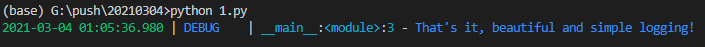
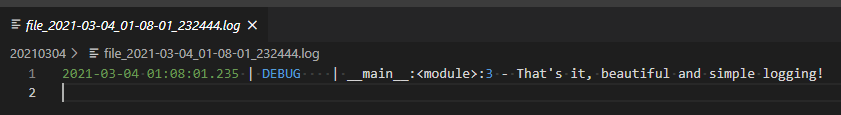
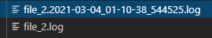
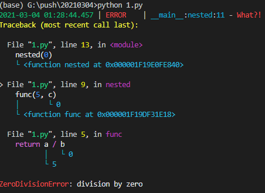

Python<br /><br />Loguru 一个能彻底解放你的日志记录器。<br />它即插即用，具备多种方式滚动日志、自动压缩日志文件、定时删除等功能。<br />除此之外，多线程安全、高亮日志、日志告警等功能也不在话下。<br />下面就给大家介绍一下这个强大工具的基本使用方法。<br />Loguru 安装方式很简单，打开终端输入：
```bash
pip install loguru
```
即可完成安装。
<a name="VNVMM"></a>
## 1、即开即用
如果需要输出 debug 日志到终端，可以这么做：
```python
from loguru import logger

logger.debug("That's it, beautiful and simple logging!")
```
其输出自带高亮：<br /><br />如果需要把日志输出到文件，只需要这样：
```python
from loguru import logger
logger.add("file_{time}.log")
logger.debug("That's it, beautiful and simple logging!")
```
这样就会在当前运行的文件夹下生成 file_当前时间.log 的日志文件：<br />
<a name="kkk2X"></a>
## 2、滚动日志与压缩
使用 Loguru 可轻易地实现滚动日志。
<a name="zZnMq"></a>
### 按时间滚动
比如按时间滚动，只需要在 logger.add 参数中添加一个 rotation 参数：
```python
from loguru import logger
logger.add("file_2.log", rotation="12:00") # 每天12:00会创建一个新的文件
logger.debug("That's it, beautiful and simple logging!")
```
这样，如果当前时间过了这个设定的时间，它就会生成一个新的日志文件。如果没有则使用原来的日志文件：<br /><br />如图所示，过了设定的时间，则将原来的 file_2.log 重命名，并添加一个新的 file_2.log 文件。
<a name="yV3F4"></a>
### 按大小滚动
除了按时间滚动日志外，Loguru 还可以按日志大小滚动：
```python
from loguru import logger
logger.add("file_1.log", rotation="1 MB") # 滚动大日志文件
logger.debug("That's it, beautiful and simple logging!")
```
这样，一旦日志文件大小超过 1 MB 就会产生新的日志文件。
<a name="ZXwWj"></a>
### 压缩日志
如果不想删除原有日志文件，Loguru 还支持将日志直接压缩：
```python
from loguru import logger
logger.add("file_Y.log", compression="zip") # 压缩日志
```
<a name="BmUuj"></a>
## 3、其他特性
<a name="VlsIO"></a>
### 自定义颜色
Loguru 是支持自定义颜色的，如果不喜欢它默认的颜色，可以这么改：
```python
logger.add(sys.stdout, colorize=True, format="<green>{time}</green> <level>{message}</level>")
```
类似于HTML标签 `<green></green>` 标签中间的文字将会被标记为绿色。
<a name="YSEXo"></a>
### 多进程安全
Loguru 默认情况下是线程安全的，但它不是多进程安全的。不过如果需要多进程/异步记录日志，它也能支持，只需要添加一个 enqueue 参数：
```python
logger.add("somefile.log", enqueue=True)
```
<a name="EJ2Ms"></a>
### 支持Backtrace
对于日志而言，没有错误堆栈的日志是没有灵魂的。Loguru 允许显示整个堆栈信息来帮助你发现问题（包括变量）。<br />比如下面这个例子：
```python
logger.add("out.log", backtrace=True, diagnose=True) # Caution, may leak sensitive data in prod

def func(a, b):
    return a / b

def nested(c):
    try:
        func(5, c)
    except ZeroDivisionError:
        logger.exception("What?!")

nested(0)
```
日志将会是这样的：<br /><br />非常清晰明了。
<a name="GGMeb"></a>
### 邮件告警
Loguru 可以和强大的邮件通知模块 notifiers 库结合使用，以在程序意外失败时接收电子邮件，或发送许多其他类型的通知。
```python
import notifiers

params = {
    "username": "you@gmail.com",
    "password": "abc123",
    "to": "dest@gmail.com"
}

# 初始化时发送一封邮件
notifier = notifiers.get_notifier("gmail")
notifier.notify(message="The application is running!", **params)

# 发生Error日志时，发邮件进行警报
from notifiers.logging import NotificationHandler

handler = NotificationHandler("gmail", defaults=params)
logger.add(handler, level="ERROR")
```
这样配置之后，每次产生 Error 日志，程序都会自动向邮箱发送告警，真的极其方便。<br />除了这些特性外，Loguru 还支持与 Python 原生的 Logging 模块兼容使用，可以将原始的标准日志记录器记录的所有信息转移到Loguru中。<br />还可以基于 Loguru 定制新的日志 Level，定制自己喜欢的结构化数据，详情可见 Loguru 的官方文档：<br />[https://github.com/Delgan/loguru](https://github.com/Delgan/loguru)
