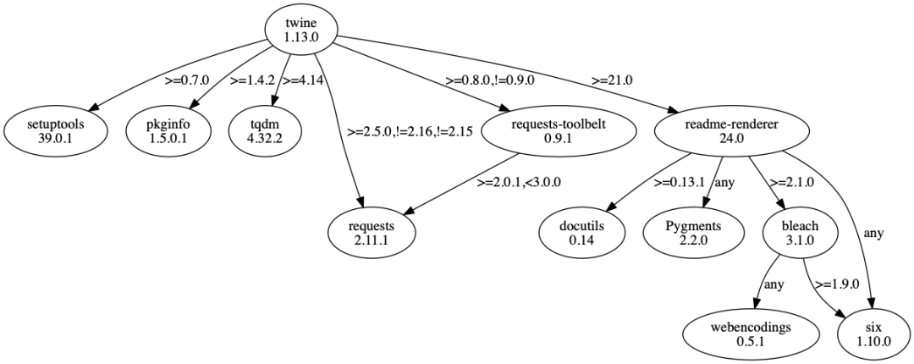

Python<br /><br />可能时常会遇到由于包的版本不匹配导致代码报错的问题，由于 `pip freeze` 将所有依赖项显示为二维列表，这时候如果想找到这个错误版本的包是比较麻烦的事情。这时候，有个工具必须得知道，它就是 **pipdeptree**.<br />pipdeptree 是一个命令行实用程序，它能用于以依赖关系树可视化的形式显示已安装的python包。<br />它适用于全局安装在计算机上的各个模块，也适用于Virtualenv等虚拟环境中的模块。
<a name="bjl3q"></a>
## 1、安装
只需要在环境中输入以下命令就能安装 pipdeptree：
```bash
pip install pipdeptree
```
已通过测试的Python版本：2.7，3.5，3.6，3.7，3.8，3.9.
<a name="hcWuf"></a>
## 2、用法和示例
`pip freeze` 和 pipdeptree 最大的区别如下：
```bash
# pip freeze 的显示
$ pip freeze
Flask==0.10.1
itsdangerous==0.24
Jinja2==2.11.2
-e git+git@github.com:naiquevin/lookupy.git@cdbe30c160e1c29802df75e145ea4ad903c05386#egg=Lookupy
MarkupSafe==0.22
pipdeptree @ file:///private/tmp/pipdeptree-2.0.0b1-py3-none-any.whl
Werkzeug==0.11.2
```
可见，pip freeze 最多只能显示一个依赖的列表，而在 pipdeptree ，每个模块的依赖关系能够非常直观地展示出来：
```bash
$ pipdeptree
Warning!!! Possibly conflicting dependencies found:
* Jinja2==2.11.2
 - MarkupSafe [required: >=0.23, installed: 0.22]
------------------------------------------------------------------------
Flask==0.10.1
  - itsdangerous [required: >=0.21, installed: 0.24]
  - Jinja2 [required: >=2.4, installed: 2.11.2]
    - MarkupSafe [required: >=0.23, installed: 0.22]
  - Werkzeug [required: >=0.7, installed: 0.11.2]
Lookupy==0.1
pipdeptree==2.0.0b1
  - pip [required: >=6.0.0, installed: 20.1.1]
setuptools==47.1.1
wheel==0.34.2
```
请注意这个 Warning，提示了哪些模块会造成其依赖的模块版本发生冲突，这是非常有用的提示，很多时候问题就出现在这里。<br />不仅如此，如果存在循环性依赖，比如：<br />**CircularDependencyA => CircularDependencyB => CircularDependencyA **<br />它会进行如下提示：
```bash
$ pipdeptree --exclude pip,pipdeptree,setuptools,wheel
Warning!!! Cyclic dependencies found:
- CircularDependencyA => CircularDependencyB => CircularDependencyA
- CircularDependencyB => CircularDependencyA => CircularDependencyB
------------------------------------------------------------------------
wsgiref==0.1.2
argparse==1.2.1
```
如果想生成 requirements.txt，可以这么做：
```bash
$ pipdeptree -f | tee locked-requirements.txt
Flask==0.10.1
  itsdangerous==0.24
  Jinja2==2.11.2
    MarkupSafe==0.23
  Werkzeug==0.11.2
gnureadline==8.0.0
-e git+git@github.com:naiquevin/lookupy.git@cdbe30c160e1c29802df75e145ea4ad903c05386#egg=Lookupy
pipdeptree @ file:///private/tmp/pipdeptree-2.0.0b1-py3-none-any.whl
  pip==20.1.1
setuptools==47.1.1
wheel==0.34.2
```
在确认没有冲突的依赖项后，甚至可以将其“锁定”，其中所有包都将固定到其当前安装的版本：
```bash
$ pipdeptree -f | sed 's/ //g' | sort -u > locked-requirements.txt
```
<a name="gVP65"></a>
## 3、可视化依赖树
为了能够可视化展示依赖树，需要安装GraphViz。安装完成后输入以下命令：
```bash
pipdeptree --graph-output png > dependencies.png

# pipdeptree --graph-output dot > dependencies.dot
# pipdeptree --graph-output pdf > dependencies.pdf
# pipdeptree --graph-output svg > dependencies.svg
```
支持四种格式的输出，这里png的输出效果如下：<br /><br />效果是非常不错的，大家如果有需要清理依赖的大型项目，可以用 pipdeptree 试一下。
