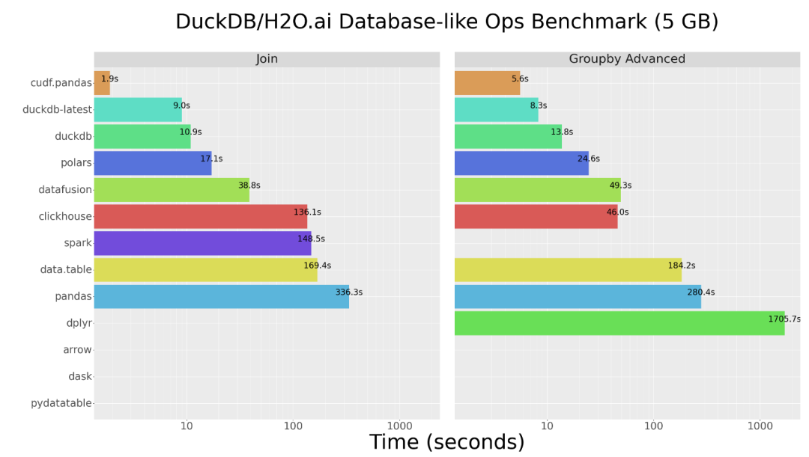

**cuDF (Pandas GPU 平替)，用于加载、连接、聚合、过滤和其他数据操作。**
<a name="tymEJ"></a>
## cuDF介绍
cuDF是一个基于Apache Arrow列内存格式的Python GPU DataFrame库，用于加载、连接、聚合、过滤和其他数据操作。cuDF还提供了类似于pandas的API。<br /><br />GitHub：[https://github.com/rapidsai/cudf](https://github.com/rapidsai/cudf)<br />Documentation：[https://docs.rapids.ai/api/cudf/stable](https://docs.rapids.ai/api/cudf/stable)
<a name="yIFKB"></a>
## 相关框架介绍
**cuDF：**cuDF是一个Python GPU DataFrame库，它基于Apache Arrow的列式内存格式，用于加载、连接、聚合、过滤和以类似pandas的DataFrame风格API操纵表格数据。它允许数据工程师和数据科学家通过类似于pandas的API轻松加速其工作流程，而无需深入研究CUDA编程的细节。cuDF的设计旨在在GPU上处理大规模数据集，提供了对数据处理任务的高性能支持。<br />**Dask：**Dask是一个灵活的Python并行计算库，使得在工作流程中平滑而简单地实现规模化。在CPU上，Dask使用Pandas来并行执行DataFrame分区上的操作。它允许用户以更大规模处理数据，充分发挥计算资源，而无需对代码进行大规模更改。<br />**Dask-cuDF：**Dask-cuDF在需要的情况下扩展Dask，以允许其DataFrame分区使用cuDF GPU DataFrame而不是Pandas DataFrame进行处理。例如，当调用`dask_cudf.read_csv(...)`时，集群的GPU通过调用`cudf.read_csv()`来执行解析CSV文件的工作。这使得在GPU上利用cuDF的高性能数据处理能力，从而加速大规模数据处理任务。
<a name="VStcC"></a>
### cuDF和Pandas比较
**cuDF是一个DataFrame库，它与Pandas API密切匹配，但直接使用时并不是Pandas的完全替代品。在API和行为方面，cuDF和Pandas之间存在一些差异。以下是cuDF和Pandas之间的相似之处和差异的对比：**
<a name="zPqvf"></a>
#### **支持的操作：**
cuDF支持许多与Pandas相同的数据结构和操作，包括Series、DataFrame、Index等，以及它们的一元和二元操作、索引、过滤、连接、分组和窗口操作等。
<a name="dVNqs"></a>
#### **数据类型：**
cuDF支持Pandas中常用的数据类型，包括数值、日期时间、时间戳、字符串和分类数据类型。此外，cuDF还支持用于十进制、列表和“结构”值的特殊数据类型。
<a name="wV6iW"></a>
#### **缺失值：**
与Pandas不同，cuDF中的所有数据类型都是可为空的，意味着它们可以包含缺失值（用cudf.NA表示）。
<a name="P5KPr"></a>
#### **迭代：**
在cuDF中，不支持对Series、DataFrame或Index进行迭代。因为在GPU上迭代数据会导致极差的性能，GPU优化用于高度并行操作而不是顺序操作。
<a name="yGApF"></a>
#### **结果排序：**
默认情况下，cuDF中的join（或merge）和groupby操作不保证输出排序。与Pandas相比，需要显式传递`sort=True`或在尝试匹配Pandas行为时启用`mode.pandas_compatible`选项。
<a name="ATOoy"></a>
#### **浮点运算：**
cuDF利用GPU并行执行操作，因此操作的顺序不总是确定的。这影响浮点运算的确定性，因为浮点运算是非关联的。在比较浮点结果时，建议使用`cudf.testing`模块提供的函数，允许根据所需的精度比较值。
<a name="tJriR"></a>
#### **列名：**
与Pandas不同，cuDF不支持重复的列名。最好使用唯一的字符串作为列名。
<a name="XGWtV"></a>
#### **没有真正的“object”数据类型：**
与Pandas和NumPy不同，cuDF不支持“object”数据类型，用于存储任意Python对象的集合。
<a name="tcW9t"></a>
#### `**.apply()**`**函数限制：**
cuDF支持`.apply()`函数，但它依赖于Numba对用户定义的函数（UDF）进行JIT编译并在GPU上执行。这可以非常快速，但对UDF中允许的操作施加了一些限制。
<a name="daG2d"></a>
### 何时使用cuDF和Dask-cuDF
<a name="K18Cv"></a>
#### **cuDF：**

- 当工作流在单个GPU上足够快，或者数据在单个GPU的内存中轻松容纳时，希望使用cuDF。
- 当数据量不大，可以在单个GPU内存中处理时，cuDF提供了对单个GPU上高性能数据操作的支持。
<a name="JLZok"></a>
#### **Dask-cuDF：**

- 当希望在多个GPU上分布工作流程时，或者数据量超过了单个GPU内存的容量，或者希望同时分析许多文件中分布的数据时，希望使用Dask-cuDF。
- Dask-cuDF允许在分布式GPU环境中进行高性能的数据处理，特别是当数据集太大，无法容纳在单个GPU内存中时。
<a name="YhKB3"></a>
### cuDF代码案例
```python
import os
import pandas as pd
import cudf

# Creating a cudf.Series
s = cudf.Series([1, 2, 3, None, 4])

# Creating a cudf.DataFrame
df = cudf.DataFrame(
    {
        "a": list(range(20)),
        "b": list(reversed(range(20))),
        "c": list(range(20)),
    }
)

# read data directly into a dask_cudf.DataFrame with read_csv
pdf = pd.DataFrame({"a": [0, 1, 2, 3], "b": [0.1, 0.2, None, 0.3]})
gdf = cudf.DataFrame.from_pandas(pdf)
gdf

# Viewing the top rows of a GPU dataframe.
ddf.head(2)

# Sorting by values.
df.sort_values(by="b")

# Selecting a single column
df["a"]

# Selecting rows from index 2 to index 5 from columns ‘a’ and ‘b’.
df.loc[2:5, ["a", "b"]]

# Selecting via integers and integer slices, like numpy/pandas.
df.iloc[0:3, 0:2]

# Selecting rows in a DataFrame or Series by direct Boolean indexing.
df[df.b > 15]

# Grouping and then applying the sum function to the grouped data.
df.groupby("agg_col1").agg({"a": "max", "b": "mean", "c": "sum"})
```
