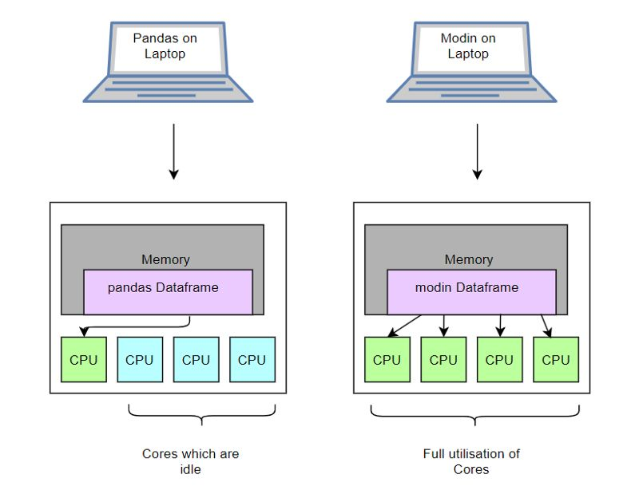
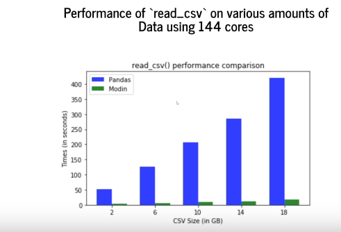
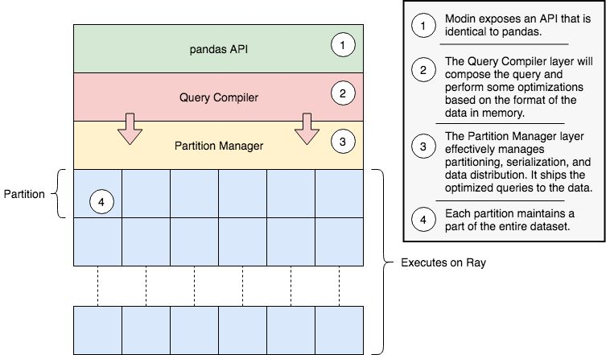
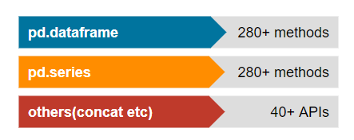
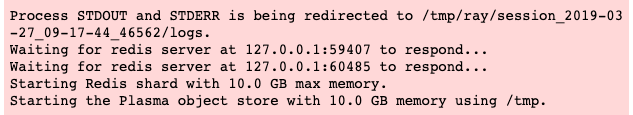
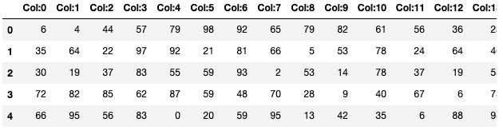

Python<br />Modin存在的意义就是：**更改一行代码来提速pandas工作流程。**<br />Pandas在数据科学领域就无需介绍了，它提供高性能，易于使用的数据结构和数据分析工具。但是，在处理过多的数据时，单核上的Pandas就显得心有余而力不足了，大家不得不求助于不同的分布式系统来提高性能。然而，提高性能的权衡伴随着陡峭的学习曲线。从本质上讲，用户可能只是希望Pandas运行得更快，并不希望对其特定的硬件设置优化其工作流程。这意味着大家希望使用相同Pandas脚本作用于10KB数据集和10TB数据集。 Modin对优化pandas提供了解决方案，以便数据科学家可以花更多时间从数据中提取价值，而不是在工具上。
<a name="ZNG8Q"></a>
## Modin
<br />**Modin是加州大学伯克利分校RISELab的早期项目，旨在促进分布式计算在数据科学中的应用。**它是一个多进程Dataframe库，具有与pandas相同的API，允许用户加速其Pandas工作流程。<br />Modin在8核计算机上将Pandas查询加速4倍，只需要用户更单行代码。该系统专为现有的Pandas用户而设计，他们希望程序能够更快地运行并且无需重大代码更改即可更好地扩展。这项工作的最终目标是能够在云设置中使用Pandas。
<a name="x001n"></a>
### 安装
Modin是完全开源的，可以在GitHub上找到：[https://github.com/modin-project/modin](https://github.com/modin-project/modin)<br />Modin可以从PyPI安装：
```bash
pip install modin
```
对于Windows，其中一个依赖项是Ray。在Windows上本身尚不支持Ray，因此为了安装它，需要使用WSL（适用于Linux的Windows子系统）。
<a name="pKQa3"></a>
## Modin是如何加速运行的？
<a name="pzD7L"></a>
### 在笔记本电脑上
考虑一款4核现代笔记本电脑，dateframe可以很好地适用其上。pandas只使用其中一个CPU核，但是，modin确使用了所有的核。<br /><br />modin所做的基本上就是增加了CPU所有内核的利用率，从而提供了更好的性能。 
<a name="PaPlB"></a>
### 在一个更大型机器上
在大型机器上，modin的有利用率变得更加明显。假装有一些服务器或一些非常强大的机器。pandas仍将使用单核，而modin将使用全部核。以下是144核心计算机上read_csv操作下，pandas和modin的性能比较。<br /><br />pandas有一个很明显的线性增长，这是因为它一直只使用一个核。可能很难看到绿色条纹，因为modin的运行时间非常短。
<a name="quwj5"></a>
## Modin的架构
来看看Modin的架构。
<a name="iuYEC"></a>
### DataFrame分区
分区模式沿着列和行分区，因为它在列数和支持的行数方面给Modin提供了灵活性和可伸缩性。<br />
<a name="MPLjq"></a>
### 系统架构 
Modin被分成不同的层： 

- Pandas API暴露在最顶层。
- 下一层包含查询编译器，它从pandas API层接收查询并执行某些优化。
- 最后一层是分区管理器，负责数据布局和洗牌，分区和序列化发送到每个分区的任务。


<a name="qQeP0"></a>
## 在Modin中实现pandas API
pandas API是非常多的，这可能是它具有如此广泛的应用的原因。<br /><br />在这么多的操作下，modin遵循了一种数据驱动的方法。意思是说modin的创造者分析了一下大多数人在pandas中所使用的操作。他们去了Kaggle并对那里出现的脚本和笔记进行了大量搜索，并最终弄明白了最受欢迎的pandas方法如下：<br /><br />`pd.read_csv`是目前pandas中使用最多的方法，其次是pd.Dataframe。因此，在modin中，他们开始实现这些方法并按照它们的受欢迎程度对它们进行优化：

- 目前，modin支持大约71％的pandas API。
- 这代表了基于该研究的约93％的使用量。
<a name="HGHTG"></a>
## Ray
Modin使用Ray提供了一种省事儿的方式来加速pandas的notebooks，脚本和库。Ray是一个高性能的分布式执行框架，面向大规模机器学习和强化学习应用程序。可以在单个机器上运行相同的代码以实现高效的多进程处理，并且可以在群集上使用它来进行大型计算。可以在GitHub上找到Ray：<br />[https://github.com/ray-project/ray](https://github.com/ray-project/ray)
<a name="E87nz"></a>
## Usage
<a name="emmfD"></a>
### Importing
Modin包装了pandas并透明地分发数据和计算，通过一行代码更改加速了pandas的工作流程。用户继续使用以前的pandas notebooks，同时可以体验到Modin的相当大的加速，即使在一台机器上也是如此。只需要修改`import`语句，其中需要导入modin.pandas而不是简单的pandas。
```python
import numpy as np
import modin.pandas as pd
```
<br />使用由随机整数组成的Numpy构建一个数据集。注意，不必在此处指定分区。
```python
ata = np.random.randint(0,100,size = (2**16, 2**4))
df = pd.DataFrame(data)
df = df.add_prefix("Col:")
```
当打印出类型时，它是一个Modin的数据框。
```python
type(df)
modin.pandas.dataframe.DataFrame
```
如果用head命令打印出前5行，它会像pandas一样呈现HTML表。
```python
df.head()
```

<a name="n5c7V"></a>
## 对比
Modin管理数据分区和洗牌，以便用户可以专注于从数据中提取值。以下代码在具有32GB RAM的2013年4核iMac上运行。 
<a name="Phe1P"></a>
### `pd.read_csv`
read_csv是迄今为止最常用的pandas操作。当在pandas vs modin中使用read_csv时，可以快速地比较出来。

- **pandas**
```python
%%time
import pandas 
pandas_csv_data = pandas.read_csv("../800MB.csv")
-----------------------------------------------------------------
CPU times: user 26.3 s, sys: 3.14 s, total: 29.4s
Wall time: 29.5 s
```

- **Modin**
```python
%%time
modin_csv_data = pd.read_csv("../750MB.csv")
-----------------------------------------------------------------
CPU times: user 76.7 ms, sys: 5.08 ms, total: 81.8 ms
Wall time: 7.6 s
```
使用Modin，只需更改`import`语句，`read_csv`在4核计算机上的运行速度可提高4倍。
<a name="Z1qim"></a>
### `df.groupby`
pandas `groupby`编写得非常好，速度非常快。但即便如此，modin仍然胜过pandas。

- **pandas**
```python
%%time
import pandas
_ = pandas_csv_data.groupby(by=pandas_csv_data.col_1).sum()
-----------------------------------------------------------------
CPU times: user 5.98 s, sys: 1.77 s, total: 7.75 s
Wall time: 7.74 s
```

- **Modin**
```python
%%time
results = modin_csv_data.groupby(by=modin_csv_data.col_1).sum()
-----------------------------------------------------------------
CPU times: user 3.18 s, sys: 42.2 ms, total: 3.23 s
Wall time: 7.3 s
```
<a name="ANMON"></a>
## 默认为pandas实现
如果想要使用尚未实现或优化的pandas API，实际上可以默认使用pandas。这使得该系统可用于使用尚未在Modin中实现操作的notebooks，即使性能会因为使用pandas API而下降。当默认为pandas时，会看到一个警告：
```python
dot_df = df.dot(df.T)
```
<br />一旦计算完成，它将返回分布式Modin DataFrame。
```python
type(dot_df)
-----------------
modin.pandas.dataframe.DataFrame
```
<a name="ILJib"></a>
## 结论
Modin仍然处于早期阶段，似乎是对pandas非常有前途的补充。Modin处理用户的所有分区和混洗，以便可以专注于工作流程。Modin的基本目标是使用户能够在小数据和大数据上使用相同的工具，而无需担心更改API以适应不同的数据大小。
<a name="G9hgb"></a>
## 来源
[https://towardsdatascience.com/get-faster-pandas-with-modin-even-on-your-laptops-b527a2eeda74](https://towardsdatascience.com/get-faster-pandas-with-modin-even-on-your-laptops-b527a2eeda74)<br />[https://rise.cs.berkeley.edu/blog/modin-pandas-on-ray-october-2018/](https://rise.cs.berkeley.edu/blog/modin-pandas-on-ray-october-2018/)
