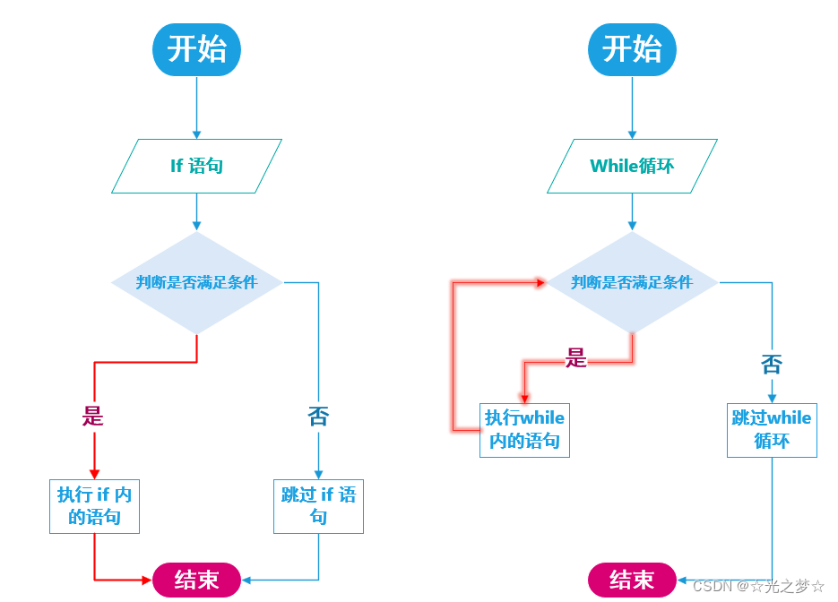

# 一、while循环

## 1.1 **while 循环的基本结构**

> **while（判断是否循环的条件）**

> **{**

>         **循环体语句……**

> **}**


**while** 的意思是：**当……时。**


## **1.2 while与 if 的区别**

> **while循环**你可以这么理解：**把while 循环看成 if 语句，但是和 if 语句有一个区别**


它们的**相同点**是：**先判断（）内的条件是否成立，如果条件成立那就执行 while循环 或 if 内的语句，如果条件不成立那就跳过 while循环 或者 if 语句**

它们的**不同点**：**我们都知道如果条件成立，程序只会执行一次 if 内的语句，然而如果条件成立程序则会反复执行 while 内的语句直到条件不满足时，才跳出while循环**

为了方便大家更好地区分和理解 if 语句与while循环。下面分别是 if 语句与 while循环 的流程图：

编辑

**也就是说：如果条件成立，执行完一次 if 内的语句程序就会跳出 if 语句，去执行下面的程序。（ if 执行完一次就没了）**

**如果条件成立，执行完一次while内的语句还要再次重新判断条件是否还是成立，如果条件还是成立，那就再执行一次while内的循环，如此反复，直到条件不成立为止，才能跳出循环。 去执行下面的程序。**


## **1.3 程序验证**

- **测试程序是否有效时经常使用边界数据**
- **通常用：正数，0，负数 来测试。还有有效范围两端的数据、特殊的倍数等。**
- **还可以在程序适当的地方插入printf()来输出变量的内容**


# **二、do while 循环**

## 2.1 do while 循环的基本格式

> **do{**

>     **循环体语句……**

> **}while（判断是否循环的条件）**


**do** 的意思是：**做**

**do while 循环**：**程序先执行一轮 do while 循环体内的语句，然后再来判断循环的条件是否满足，如果满足则继续循环，不满足则循环结束**


## 2.2 do while 循环与 while循环的区别

> **do while循环 和 while循环**很像，**区别是do while循环是执行一遍，然后再来判断条件**。


**也就是说，无论如何，do while 循环都会执行一遍，然后再来判断条件。与while循环相同的是，条件满足时执行循环，条件不满足时结束循环**


# 三、while循环与do while循环的基本用法

> **光说不练是肯定学不会的接下来让我们在实战中来学习与掌握 while 循环与do while 循环**


**（一定要动动你们的小手一起敲哦，就算是看懂了也要自己实践一下哦。编程就是在实践中学习，用的多了自然也就会了。）**


## 3.1 项目一、火箭发射倒计时


> **要求**：**设计一个火箭发射倒计时的程序**

**问题;**

1. **这个循环需要执行多少次？**
2. **循环结束后，count最后的值是多少？**
3. **循环停下来的时候，有没有输出最后的0？**

**代码示例：**

```cpp
#include <stdio.h>

int main()
{
    int n;
    printf("尊敬的指挥官！\n请您输入火箭发射倒计时的时间：");
    scanf("%d",&n);
	
	if(n>0)
	{
		printf("输入完毕！\n您的火箭将会于%d秒后发射升空!\n",n);
		
		while ( n>0 )
		{
        printf("%d\n", n);
        n--;
    	}
    	
    	printf("发射！\n");
	}else
	{
		printf("输入错误!\n");
	}
    
    return 0;
}
```


**运行结果：**

编辑

**答：**

- **这个while循环一共执行了10次**
- **循环结束后，n最后的值是0**
- **n=0时不满足while循环的条件（n>0），所以并未输出0.**


编辑**你答对了吗？**


## **3.2 项目二、猜数**


> **需求**

> **让计算机来想一个数，然后让用户来猜，用户每输入一个数，就告诉用户是大了还是小了，直到用户猜到为止，最后还要告诉用户他猜了几次**


**思路**

**因为需要不断重复让用户猜，所以需要用到循环**

**核心重点是循环的条件**

**需要考虑循环终止的条件**


## **3.3 项目二需要用到的知识点**

### **1、rand（）函数**

**rand()函数用来产生*_[随机数](https://so.csdn.net/so/search?q=%E9%9A%8F%E6%9C%BA%E6%95%B0&spm=1001.2101.3001.7020)*_，但是，rand()的内部实现是用线性同余法实现的，是伪随机数由于周期较长，因此在一定范围内可以看成是随机的。**

**rand()会返回一个范围在0到32767之间的伪随机数（整数）。**

**在调用rand()函数之前，要使用srand()函数设置*_[随机数种子](https://so.csdn.net/so/search?q=%E9%9A%8F%E6%9C%BA%E6%95%B0%E7%A7%8D%E5%AD%90&spm=1001.2101.3001.7020)*_，如果没有设置随机数种子，rand()函数在调用时，自动设计一个随机数种子。由于随机种子只有一个，所以每次产生的随机数也会相同。**


### **2、srand()函数**

**srand()用来设置rand()产生随机数时的随机数种子**

**使用rand()和srand()产生1-100以内的随机整数:**

**srand(time(0));**

**int number1 = rand() % 100;**


### **3、整数的分解**

**对一个整数做%10的操作，就得到它的个位数**

**对一个整数做%100的操作，就得到它的十位数**

**对一个整数做/10的操作，就去掉了它的个位数**

**对一个整数做/100的操作，就去掉了它的十位数与个位数**

**代码示例**：

```cpp
#include <stdio.h>
#include <stdlib.h>
#include <time.h>

int main(){
    //调用srand()函数。
	//不加srand(time(0));的话，每次循环的数都一样
    srand(time(0));
    
    //让生成的随机数在1~100之内 
	int number = rand()%100;
	
	// 定义一个count变量用来记录用户输入的次数,定义变量a用来保存用户输入的数
	int count = 0; 
	int a = 0;
	
	printf("我已经想好了一个1到100之间的数。\n");
	
	do {
		printf("请你猜猜这个1到100之间数：");
		scanf("%d", &a);
		
		if( a > number )
		{
			printf("你猜的数大了。");
		}
		else if( a < number )
		{
			printf("你猜的数小了。");
		}
		
		count ++;
	} while (a != number);
	
	printf("太好了，你用了%d次就猜到了答案。\n", count);
	
	return 0;
}
```


**运行结果：**

编辑

**注：**

- **while循环执行前需要判断是否满足条件，所以可能一次循环一次也没有执行**
- **条件成立是循环继续的条件**
- **如果要用到循环，则一定要想好要让循环不满足的条件，就是要给它一个出口，否则程序将会一直循环下去。**
