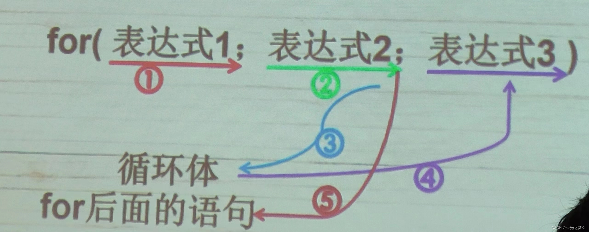
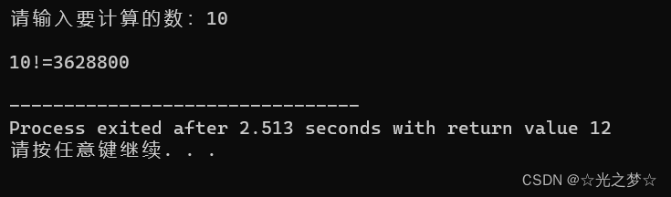
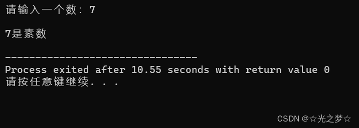
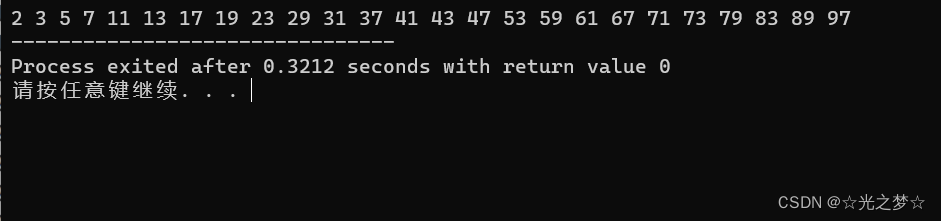

# **一、for 循环的基本结构**

> **for（初始动作；判断循环是否继续的条件；循环每轮都要做的事）**

> **{**

>     **语句……**

> **}**

**上面这个也可以简化成：**

> **for （初始化；条件；每轮的动作）**

> **{**

>     **语句……**

> **}**


# **二、for 循环的概念**

> **for = 对于**

**我们可以把 for 的意思看成是 ：对于**

**我们先来看看以下代码：**

```cpp
例如：
for(count = 10; count > 0; count--)
{
  printf("%d",count);
}


for(初始动作;条件;每轮的动作)
{
    ……
}
```


**for(count = 10; count > 0; count--)**

**可以解读成：对于，一开始的count = 10，当count > 0的时候，重复做循环体的内容，每一轮循环在做完循环体内语句后，使得count--**

**for 循环的执行流程：**




**也就是说 for 循环：像是一个计数循环:设定一个计数器（如count），初始化它（如count=10），然后在计数器到达某值之前（count>0），重复执行循环体，而每执行一轮循环，计数器值以一定的步进 来进行调整，比如加一或者减一。因为 for 也是循环，所以在用 for 时，我们需要考虑好如何让条件不满足。否则程序就会一直循环下去。**

<a name="0aa587db"></a>
# **三、for 循环 与 while循环**

> **for 中的每一个条件都是可以省略的，for(;条件;) == while(条件)**


<a name="f9d87826"></a>
## **3.1 for 循环 与 while循环的关系**

**请看下面代码：**

```cpp
for( int i = 1;i <= n;i++ )
{
    fact *= i;   
}
-------------------------------------------
int i = 1;
while(i <= n)
{
    fact *=i;
    i++;
}
```


**上面这两部分的代码，表达的意思和程序执行的结果都是相同的。只是用代码表示的不同而已（一个程序可以用多种方法来实现，就像写数学解答题一样，有多种解题思路与方法，我们要多去尝试，从中选出最高效的那种方法就行。并没有什么是绝对的标准与答案）**

**也就是说 for 循环：for(;条件;) == while(条件)**

<a name="22012597"></a>
## **3.2 循环次数**

> **for( i = 0; i <** **n; i++)**


**这样循环的次数是n，而循环次数结束以后，i 的值是n。**

**循环的控制变量 i，是选择从0开始还是从1开始，是判断 i<n还是判断i <=n，对循环次数，循环结束后变量的值都是有影响的**

<a name="21f70b1f"></a>
## **3.3 for 循环与 while 与 do while**

**什么时候用 for 循环 ？什么时候用while ？什么时候用 do while？**


**学了这么多的循环，想必大家一定有这个疑问吧**

**接下来是重点哦，拿起你的笔还有你的小本本，记好咯**

**敲黑板啦（咚！咚！咚！）**


> - **如果有固定次数，就用 for**
> - **如果必须执行一次，就用 do while**
> - **其他情况都可以用 while**


## **3.4 一点C语言的小套路**

> **做求和的程序时，记录结果的变量应该初始化为0，而做求积的变量时，记录结果的变量应该初始化为1**


**如果循环控制变量 i 只在循环里被使用了，在循环外面它没有任何用处。那么，我们可以把变量 i 的定义写到for语句里面去**


# **四、for 循环的基本用法**

> **光说不练是肯定学不会的接下来让我们在实战中来学习与掌握 for 循环**


**（一定要动动你们的小手一起敲哦，就算是看懂了也要自己实践一下哦。编程就是在实践中学习，用的多了自然也就会了。）**


## **4.1 计算阶乘**

> **要求：写出一个程序，让用户输入n，然后计算输出n!**


**思路：显然读用户的输入需要一个int的 变量n ，然后计算的结果需要用一个变量保存，也可以是int的 fact，在计算中需要有一个变量不断地从1递增到n，那可以是int的 i**

**代码示例：**

```cpp
#include <stdio.h>

int main()
{
	int n;
	
	printf("请输入要计算的数：");
	//用n来保存用户输入的数
	scanf("%d",&n);
	
	printf("\n");
	
	//计算的结果用fact来保存
	int fact = 1;
	
    //计算阶乘
	int i = 1;
	for( i = 1;i <= n; i++)
	{
	    fact *= i;
	}
	
	printf("%d!=%d\n",n,fact);	

}
```


**运行结果：**

**_**_**


**_*编辑*_**


## **4.2 判断输入的数是否是素数**

> **素数：只能被1和自身整除的数，不包括1**

> **要求：判断输入的数是否是素数**

**代码示例：**

```cpp
#include <stdio.h>

int main()
{
    //输入一个数x
	int x;
	printf("请输入一个数：");
	scanf("%d",&x);
	printf("\n"); 
	
	int i;
	int isprime=1;    // 先让x是素数

    // 判断输入的是不是素数
    //素数是除了1只能被1和自身整除的数，所以从程序2开始
	for (i=2;i<x;i++)
    {
		if (x%i==0)
        {
			isprime=0;
			break;
		}
	}
	
	if (isprime==1)
    {
		printf("%d是素数\n",x);
	}else 
    {
		printf("%d不是素数\n",x);
	}
	return 0;
}
```


**运行结果：**

**_**_**

**_*编辑*_**


## **4.3 输出100以内的素数**

> **要求：如何让程序输出100以内的素数呢?**

**（一定要自己先动脑筋想一想哦，我的只是其中一个方法，或许你想到的方法会比我方法的更高效，代码量比我用的更少哦。有更好的方法欢迎大家积极在评论区投稿或者私信我哦）**


**代码示例：**

```cpp
#include <stdio.h>

int main()
{
    //定义一个变量x，让x保存我们输入的值
    int x;

    //我们需要有一个循环，从 1 到 100 
    //素数是除了1只能被1和自身整除的数，所以从程序2开始
    for(x=2; x<=100; x++)
    {
	    int i;
	    int isPrime = 1;     // x是素数
        
        //判断输入的数是不是素数
	    for ( i=2; i<x; i++ )
        {
	        if ( x % i == 0 )
            {
	            isPrime = 0;
	            break;
	        }
	    }

	    //当它是素数的时候就输出出来，不是素数就不要输出任何东西
	    if ( isPrime == 1 )
        {
	        printf("%d ", x);
	    }
    }

    return 0;
}
```


**运行结果：**

**_**_**

**_*编辑*_**


# **小结：**

1. 
**for = 对于**

2. **for （初始化；条件；每轮的动作）**
**{**
    **语句……**
**}**

3. 
**for中的每一个条件都是可以省略的，for(;条件;) == while(条件)**


- **如果有固定次数，就用 for**
- **如果必须执行一次，就用 do while**
- **其他情况都可以用 while**


