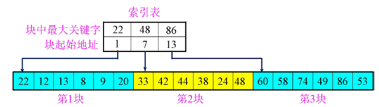
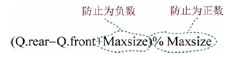
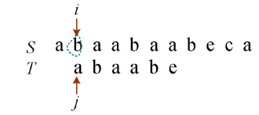
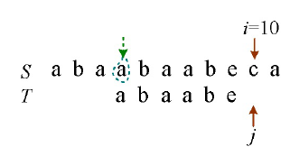
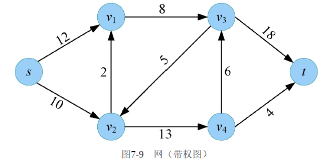
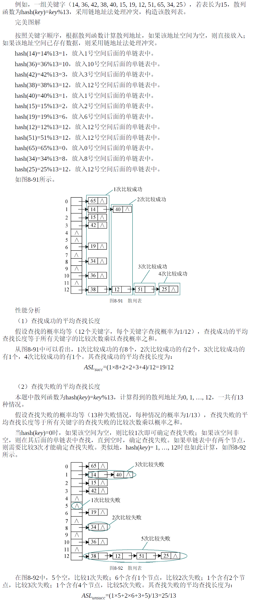

> by 花满锤
> 本文主要是一些数据结构的基本概念

# 1. 第一章：数据结构的基本概念
## 抽象数据类型
抽象数据类型（Abstract Data Type，ADT）是将数据对象、数据对象之间的关系和数据对象的基本操作封装在一起的一种表达方式，它和工程中的应用是一致的。在工程项目中，开始编程之前，首先列出程序需要完成的功能任务，先不用管具体怎么实现，实现细节在项目后期完成，一开始只是抽象出有哪些基本操作。把这些操作项封装为抽象数据类型，等待后面具体实现这些操作。而其他对象如果想调用这些操作，只需要按照规定好的参数接口调用，并不需要知道具体是怎么实现的，从而实现了数据封装和信息隐藏。在C++中可以用类的声明表示抽象数据类型，用类的实现来实现抽象数据类型的具体操作。

_抽象数据类型可以用以下的三元组来表示。_


```c
ADT 抽象数据类型名{
        数据对象：<数据对象的定义>
        数据关系：<数据关系的定义>
        基本操作：<基本操作的定义>
 } ADT抽象数据类型名
```
（1）为什么要使用抽象数据类型？

​	抽象数据类型的主要作用是数据封装和信息隐藏，让实现与使用相分离。数据及其相关操作的结合称为数据封装。对象可以对其他对象隐藏某些操作细节，从而使这些操作不会受到其他对象的影响，这就是信息隐藏。抽象数据类型独立于运算的具体实现，使用户程序只能通过抽象数据类型定义的某些操作来访问其中的数据，实现了信息隐藏。

（2）为什么很多书中没有使用抽象数据类型？

​	既然抽象数据类型符合工程化需要，可以实现数据封装和信息隐藏，为什么很多数据结构书中的程序并没有使用抽象数据类型呢？因为很多人觉得数据结构难以理解，学习起来非常吃力，因此仅仅将数据结构的基本操作作为重点，把每一个基本操作讲解清楚，使读者学会和掌握数据结构的基本操作，便完成了数据结构书的基本任务。在实际工程中，需要根据实际情况融会贯通，灵活运用，这是后续话题。目前要掌握的就是各种数据结构的基本操作，本书也将基本操作作为重点讲述，并结合实例讲解数据结构的应用。

​	数据结构和算法相辅相成，密不可分，在学习数据结构之前，首先要了解什么是算法、好算法的衡量标准，以及算法复杂度的计算方法。


## 1.1 定义

- 在任何问题中，数据元素都不是孤立存在的，而是在它们之间存在着某种关系，这种数据元素相互之间的关系称为结构（Structure）。数据结构是相互之间存在一种或多种特定关系的数据元素的集合。数据结构包括三方面的内容：逻辑结构、存储结构和数据的运算。数据的逻辑结构和存储结构是密不可分的两个方面，一个算法的设计取决于所选定的逻辑结构，而算法的实现依赖于所采用的存储结构。
<a name="Q6ehR"></a>
## 1.2 逻辑结构

- 逻辑结构是指数据元素之间的逻辑关系，即从逻辑关系上描述数据。它与数据的存储无关，是独立于计算机的
- 数据的逻辑结构分为线性结构和非线性结构


   - **集合** 结构中的数据元素之间除了“同属于一个集合”的关系外，别无其他关系。 类似于数学上的集合
   - **线性结构** 结构中的数据元素之间只存在_一对一_的关系。比如排队
   - **树形结构** 结构中的数据元素之间存在_一对多_的关系。比如家族族谱
   - **图状结构或网状结构** 结构中的数据元素之间存在_多对多_的关系。 比如地图
<a name="qiXgw"></a>
## 1.3 物理结构

- 存储结构是指数据结构在计算机中的表示（又称映像），也称物理结构。它包括数据元素的表示和关系的表示。数据的存储结构是逻辑结构用计算机语言的实现，它依赖于计算机语言。数据的存储结构主要有：顺序存储、链式存储、索引存储和散列存储。
   - 顺序存储：存储的物理位置相邻。（p.s. 物理位置即信息在计算机中的位置。）
   - 
   - 链接存储：存储的物理位置未必相邻，通过记录相邻元素的物理位置来找到相邻元素。
   - 
   - 索引存储：类似于目录，以后可以联系操作系统的文件系统章节来理解。
   - 
   - 散列存储：通过关键字直接计算出元素的物理地址（以后详解）。
   - 
   <a name="PYwy0"></a>
## 1.4 算法的五个特征


- 1，有穷性：有限步之后结束
- 2，确定性：不存在二义性，即没有歧义
- 3，可行性：比如受限于计算机的计算能力，有些算法虽然理论上可行，但实际上无法完成。
- 4，输入：能被计算机处理的各种类型数据，如数字，音频，图像等等。
- 5，输出：一至多个程序输出结果。
<a name="sQ5wA"></a>
## 1.5 算法的复杂度
### 1.5.1 时间复杂度：

- 它用来衡量算法随着问题规模增大，算法执行时间增长的快慢；
- 是问题规模的函数：T(n)是时间规模函数 时间复杂度主要分析T(n)的数量级
- `T(n)=O(f(n))` `f(n)`是算法中基本运算的频度 一般我们考虑最坏情况下的时间复杂度
> 时间复杂度：
> 算法运行需要的时间，一般将算法基本运算的执行次数作为时间复杂度的度量标准。

```java
//算法1-3
sum=0; //运行1次
total=0; //运行1次
for(i=1;i<=n;i++) //运行n+1次，最后依次判断条件不成立，结束
{
    sum=sum+i; //运行n次
    for(j=1;j<=n;j++) //运行n*(n+1)次
    total=total+i*j; //运行n*n次
}
```
> 把算法所有语句的运行次数加起来，即1+1+n+1+n+n×(n+1)+n×n，可以用一个函数T(n)表达：
> 当n足够大时，如n=105时，T(n)=2×1010+3×105+3，我们可以看到算法运行时间主要
> 取决于第一项，后面的基本可以忽略不计。
> 如果用极限来表示，则为：
> c为不等于0的常数
> 如果用时间复杂度渐进上界表示，如图
> 
> 从图可以看出，当时，，当n足够大时，和近似相等，因此我们用来表示时间复杂度渐近上界，通常用这种表示法衡量算法时间复杂度。算法的时间复杂度渐进上界为，如果用极限来表示，则为：
> 还有渐近下界符号，如图所示。
> 
> 从图中可以看出，时，，当n足够大时，和近似相等，因此用来表示时间复杂度渐近下界。
> 渐近精确界符号，如图所示。
> 
> 从图1-3中可以看出，当时，，当足够大时，和近似相等，这种两边逼近的方式，更加精确近似，时间复杂度渐近精确界用来表示。我们通常使用时间复杂度渐近上界来表示时间复杂度。


> <a name="MPYPU"></a>
### 常用的时间复杂度大小关系：
> 
> <a name="HBCMb"></a>
### 复杂度如何计算
> 
> - 时间复杂度计算（单个循环体）
>    - 直接关注循环体的执行次数，设为k 
> - 时间复杂度计算（多个循环体）
>    - 两个运算规则：乘法规则，加法规则。

<a name="uIphh"></a>

### 1.5.2 空间复杂度：

- 它用来衡量算法随着问题规模增大，算法所需空间的快慢；
- 是问题规模的函数：S(n)=O(g(n)) ；算法所需空间的增长率和g(n)的增长率相同。
- 复杂度计算为重点
> 空间复杂度：算法占用的空间大小。一般将算法的辅助空间作为衡量空间复杂度的标准。
> 空间复杂度的本意是指算法在运行过程中占用了多少存储空间，算法占用的存储空间
> 包括如下。
> （1）输入/输出数据所占空间。
> （2）算法本身所占空间。
> （3）额外需要的辅助空间。
> 输入/输出数据占用的空间是必需的，算法本身占用的空间可以通过精简算法来缩减，但这个压缩的量是很小的，可以忽略不计。而在运行时使用的辅助变量所占用的空间，即辅助空间是衡量空间复杂度的关键因素。

<a name="13XtH"></a>

# 2. 第二章：线性表
## 2.1 线性表的逻辑结构

- 定义：_线性表是具有相同数据类型的n（n≥0）个数据元素的有限序列_。其中n为表长。当n=0时 线性表是一个空表
- 特点：线性表中第一个元素称为表头元素；最后一个元素称为表尾元素。除第一个元素外，每个元素有且仅有一个_直接前驱_。除最后一个元素外，每个元素有且仅有一个_直接后继_。


## 2.2 线性表的顺序存储结构

- 线性表的顺序存储又称为顺序表。它是用_一组地址连续的存储单元_（比如C语言里面的数组），依次存储线性表中的数据元素，从而使得_逻辑上相邻的两个元素在物理位置上也相邻_。
> 顺序表采用顺序存储方式，即逻辑上相邻的数据在计算机内的存储位置也是相邻的。顺序存储方式，元素存储是连续的，中间不允许有空，可以快速定位第几个元素，但是插入和删除时需要移动大量元素。根据分配空间方法不同，顺序表可以分为静态分配和动态分配两种方法。

### 2.2.1 静态分配
顺序表最简单的方法是使用一个定长数组`data[]`存储数据，最大空间为`Maxsize`，用`length`记录实际的元素个数，即顺序表的长度。这种用定长数组存储的方法称为**静态分配**。静态顺序表如图所示。


顺序表的静态分配结构体定义，如图所示。采用静态分配方法，定长数组需要预先分配一段固定大小的连续空间，但是在运算的过程中，如合并、插入等操作，容易超过预分配的空间长度，出现溢出。解决静态分配的溢出问题，可以采用动态分配的方法。


### 2.2.2 动态分配
在程序运行过程中，根据需要动态分配一段连续的空间（大小为Maxsize），用elem记录该空间的基地址（首地址），用length记录实际的元素个数，即顺序表的长度。动态<br />顺序表如图2-4所示。采用动态存储方法，在运算过程中，如果发生溢出，可以另外开辟一块更大的存储空间，用以替换原来的存储空间，从而达到扩充存储空间的目的。<br /><br />顺序表的动态分配结构体定义<br />


#### 1. 简化比较复杂的类型声明
> 给复杂的结构体类型起一个别名，这样就可以使用这个别名等价该结构体类型，在声明该类型变量时就方便多了。
> 例如，不使用typedef的顺序表定义：

```c
struct SqList {
    int *elem; //顺序表的基地址
    int length; //顺序表的长度
};
```


> 如果需要定义一个顺序表，需要写：

```c
struct SqList L; //定义时需要加上struct(c需要，C++不需要)，L为顺序表的名字
```


> 使用typedef的顺序表定义：

```c
typedef struct {
    int *elem; //顺序表的基地址
    int length; //顺序表的长度
} SqList;
```


> 如果需要定义一个顺序表，需要写：

```c
SqList L; //不需要写struct，直接用别名定义
```


#### 2. 提高程序的可移植性
> 例如，在程序中使用这样的语句：

```c
typedef int ElemType; //给int起个别名ElemType
```
> 在程序中，假如有n个地方用到了ElemType类型，如果现在处理的数据变为字符型了，那么就可以将上面类型定义中的int直接改为char。

```c
typedef char ElemType;
```
> 这样只需要修改类型定义，不需要改动程序中的代码。如果不使用typedef类型定义，就需要把程序中n个用到int类型的地方全部改为char类型。如果某处忘记修改，就会产生错误。


> 问题2：使用ElemType是为了让算法的通用性更好，因为使用线性表的结构体定义后，并不清楚具体问题处理的数据是什么类型，不能简单地写成某一种类型。结合typedef使用，可以提高算法的通用性和可移植性。
> 以int型元素为例，如果使用顺序表的动态分配结构体定义，就可以直接将ElemType写成int。

```c
typedef struct{
    int *elem; //顺序表的基地址
    int length; //顺序表的长度
} SqList;
```
> 也可以使用类型定义，给int起个别名：

```c
typedef int ElemType; //给int起个别名ElemType，两者等价
typedef struct{
    ElemType *elem; //顺序表的基地址
    int length; //顺序表的长度
} SqList;
```
> 显然，后一种定义的通用性和可移植性更好，当然第一种定义也没有错。


- 建立顺序表的三个属性: 
   - 1.存储空间的起始位置（数组名data）
   - 2.顺序表最大存储容量（MaxSize）
   - 3.顺序表当前的长度（length）


- 其实数组还可以动态分配空间，存储数组的空间是在程序执行过程中通过动态存储分配语句分配


- 总结：

   - 1. 顺序表最主要的特点是随机访问（C语言中基于数组），即通过首地址和元素序号可以在O(1)的时间内找到指定的元素。
   - 2. 顺序表的存储密度高，每个结点只存储数据元素。无需给表中元素花费空间建立它们之间的逻辑关系（因为物理位置相邻特性决定）
   - 3. 顺序表逻辑上相邻的元素物理上也相邻，所以插入和删除操作需要移动大量元素。

   

## 2.3 顺序表的操作
### 2.3.1.插入

- 算法思路：
   - 1.判断`i`的值是否正确
   - 2.判断表长是否超过数组长度
   - 3.从后向前到第`i`个位置，分别将这些元素都向后移动一位
   - 4.将该元素插入位置`i` 并修改表长
- 代码


- 分析：
   - 最好情况：在表尾插入（即`i=n+1`），元素后移语句将不执行，时间复杂度为`O(1)`。
   - 最坏情况：在表头插入（即`i=1`），元素后移语句将执行n次，时间复杂度为`O(n)`。
   - 平均情况：假设pi（`pi=1/(n+1)` ）是在第i个位置上插入一个结点的概率，则在长度为n的线性表中插入一个结点时所需移动结点的平均次数为


### 2.3.2.删除

- 算法思路：
   - 1.判断i的值是否正确
   - 2.取删除的元素
   - 3.将被删元素后面的所有元素都依次向前移动一位
   - 4.修改表长
- 代码


- 分析
   - 最好情况：删除表尾元素（即`i=n`），无须移动元素，时间复杂度为`O(1)`。
   - 最坏情况：删除表头元素（即`i=1`），需要移动除第一个元素外的所有元素，时间复杂度为`O(n)`。
   - 平均情况：假设pi(`pi=1/n`)是删除第i个位置上结点的概率，则在长度为n的线性表中删除一个结点时所需移动结点的平均次数为


## 2.4 线性表的链式存储结构

### 链表的优点
链表是动态存储，不需要预先分配最大空间；插入删除不需要移动元素。


### 链表的缺点
每次动态分配一个节点，每个节点的地址是不连续的，需要有指针域记录下一个节点的地址，指针域需要占用一个int的空间，因此存储密度低（数据所占空间/节点所占总空间）。存取元素必须从头到尾按顺序查找，属于顺序存取。


> 

- 线性表的链式存储是指通过一组任意的存储单元来存储线性表中的数据元素。
- 头结点和头指针的区别？
   - 不管带不带头结点，头指针始终指向链表的第一个结点，而头结点是带头结点链表中的第一个结点，结点内通常不存储信息
- 为什么要设置头结点？
   - 1.处理操作起来方便 例如：对在第一元素结点前插入结点和删除第一结点起操作与其它结点的操作就统一了
   - 2.无论链表是否为空，其头指针是指向头结点的非空指针，因此空表和非空表的处理也就统一了。
## 2.5 单链表的操作
### 2.5.1. 头插法建立单链表：

- 建立新的结点分配内存空间，将新结点插入到当前链表的表头


- 代码


### 2.5.2.尾插法建立单链表：

- 建立新的结点分配内存空间，将新结点插入到当前链表的表尾


- 代码


### 2.5.3.按序号查找结点

- 在单链表中从第一个结点出发，顺指针next域逐个往下搜索，直到找到第i个结点为止,否则返回最后一个结点指针域NULL。
- 代码


### 2.5.4.按值查找结点

- 从单链表第一个结点开始，由前往后依次比较表中各结点数据域的值，若某结点数据域的值等于给定值e，则返回该结点的指针；若整个单链表中没有这样的结点，则返回NULL。
- 代码


### 2.5.5．插入

- 插入操作是将值为x的新结点插入到单链表的第i个位置上。先检查插入位置的合法性，然后找到待插入位置的前驱结点，即第i−1个结点，再在其后插入新结点。
- 算法思路：1.取指向插入位置的前驱结点的指针① p=GetElem(L,i-1);2.令新结点*s的指针域指向*p的后继结点② s->next=p->next;3.令结点*p的指针域指向新插入的结点*s③ p->next=s; 


### 2.5.6．删除

- 删除操作是将单链表的第i个结点删除。先检查删除位置的合法性，然后查找表中第i−1个结点，即被删结点的前驱结点，再将其删除。
- 算法思路：1.取指向删除位置的前驱结点的指针 p=GetElem(L,i-1);2.取指向删除位置的指针 q=p->next;3.p指向结点的后继指向被删除结点的后继 p->next=q->next4.释放删除结点 free(q);


## 2.6. 双向链表
为了向前、向后操作方便，可以给每个元素附加两个指针域，一个存储前一个元素的地址，另一个存储下一个元素的地址。这种链表称为双向链表<br />**定义**<br /><br />
<a name="bhyFx"></a>

### 2.6.1.插入：(方法不唯一)
① `s->next=p->next;`<br />② `p->next->prior=s;`<br />③ `s->prior=p;`<br />④ `p->next=s;`<br />
<a name="ix2re"></a>

### 2.6.2.删除：
① `p->next=q->next;`<br />② `q->next->prior=p;`<br />③ `free(q);`<br />
<a name="1jjgf"></a>

## 2.7 循环链表
单链表中，只能向后，不能向前。如果从当前节点开始，无法访问该节点前面的节点，而最后一个节点的指针指向头节点，形成一个环，就可以从任何一个节点出发，访问<br />所有的节点，这就是循环链表。循环链表和普通链表的区别就是最后一个节点的后继指向了头节点。<br />

- 循环单链表：循环单链表和单链表的区别在于，表中最后一个结点的指针不是NULL，而改为指向头结点，从而整个链表形成一个环

<br />")")

- 循环双链表：类比循环单链表，循环双链表链表区别于双链表就是首尾结点构成环

<br /><br />

   - 当循环双链表为空表时，其头结点的`prior`域和`next`域都等于`Head`。
<a name="vFJum"></a>
## 2.8 静态链表

- 静态链表：静态链表是用数组来描述线性表的链式存储结构。


   - 数组第一个元素不存储数据，它的指针域存储第一个元素所在的数组下标。链表最后一个元素的指针域值为-1。
   - 例子


<a name="cUwTj"></a>

## 顺序表和链表的比较

<a name="hJ6b2"></a>
## 2.9 线性表的应用
<a name="j1h7X"></a>

### 合并有序顺序表
> 题目：将两个有序（非递减）顺序表La和Lb合并为一个新的有序（非递减）顺序表。
> 解题思路
> 1）首先创建一个顺序表Lc，其长度为La和Lb的长度之和。
> 2）然后从La和Lb中分别取数，比较其大小，将较小者放入Lc中，一直进行下去，直到其中一个顺序表La或Lb中的数取完为止。
> 3）把未取完的数再依次取出放入Lc中即可。

<a name="YJUhF"></a>

### 合并有序链表
> 题目：将两个有序（非递减）单链表La和Lb合并为一个新的有序（非递减）单链表。
> 解题思路
> 链表合并不需要再创建空间，只需要“穿针引线”，把两个单链表中的节点按非递减的顺序串联起来即可。
> 注意：单链表的头指针不可以移动，一旦头指针丢失，就找不到该单链表了，因此需要辅助指针。

<a name="Se8g6"></a>
### 就地逆置单链表
> 题目：将带有头节点的单链表就地逆置。即元素的顺序逆转，而辅助空间复杂度为O(1)。
> 解题思路
> 充分利用原有的存储空间，通过修改指针实现单链表的就地逆置。还记得吗？头插法
> 创建单链表得到的序列正好是逆序，那么我们就利用头插法建表的思路，实现就地逆置。

<a name="jGgCv"></a>
### 查找链表的中间节点
> 题目：带有头节点的单链表L，设计一个尽可能高效的算法求L中的中间节点。
> 解题思路
> 此类题型可以使用快慢指针来解决。一个快指针，一个慢指针，快指针走两步，慢指
> 针走一步。当快指针指向结尾的时候，慢指针刚好指向中间节点。

<a name="ECuX1"></a>
### 删除链表中的重复元素
> 题目：用单链表保存m个整数，节点的结构为(data,next)，且|data| n(n为正整数)。现要求设计一个时间复杂度尽可能高效的算法，对于链表中data的绝对值相等的节点，仅保留第一次出现的节点而删除其余绝对值相等的节点。
> 解题思路
> 本题数据大小有范围限制，因此可以设置一个辅助数组记录该数据是否已出现，如果
> 已出现，则删除；如果未出现，则标记。一趟扫描即可完成。

<a name="sIVp5"></a>
# 3. 第三章：栈和队列
<a name="VJven"></a>
## 3.1 栈

- 栈（Stack）：只允许在一端进行插入或删除操作的线性表。
- 栈顶（Top）：线性表允许进行插入和删除的那一端。
- 栈底（Bottom）：固定的，不允许进行插入和删除的另一端
- 特点：1.栈是受限的线性表，所以自然具有线性关系。2.栈中元素后进去的必然先出来，即后进先出LIFO（Last In First Out）
   - 栈中元素后进去的必然先出来，即_后进先出_LIFO（Last InFirst Out）
### 3.1.1 顺序栈
<br /><br />

- 栈是线性表的特例，那栈的顺序存储也是线性表顺序存储的简化。栈的顺序存储结构也叫作顺序栈。


- 顺序栈的操作
   - 1.判空：
   - 
   - 2.进栈：
   - 
   - 3.出栈：
   - 
   - 4.读取栈顶元素：
   - 
   <a name="aVHqH"></a>
### 3.1.2 共享栈

- 顺序栈的存储空间大小需要事先开辟好，很多时候对每个栈各自单独开辟存储空间的利用率不如将各个栈的存储空间共享
- 示意图


   - 共享栈的结构


   - 共享栈的操作：（进栈）


<a name="wYwUa"></a>
### 3.1.3 链式栈
<br />

- 栈是线性表的特例，线性表的存储结构还有链式存储结构，所以也可以用链表的方式来实现栈。栈的链式存储结构也叫作链栈。
- 特点1.链栈一般不存在栈满的情况。2.空栈的判定条件通常定为top==NULL；
- 结构


- 链式栈的操作
   - 1.进栈
   - 
   - 2.出栈
   - 
   <a name="bMfki"></a>
## 3.2 队列

- 队列是只允许在一端进行插入，而在另一端进行删除的线性表
- 队头（Front）：允许删除的一端，又称为队首。
- 队尾（Rear）： 允许插入的一端。
- 先进入队列的元素必然先离开队列，即_先进先出_（First In First Out）简称FIFO
<a name="IhKQQ"></a>
### 3.2.1 顺序队列
队列的顺序存储采用一段连续的空间存储数据元素，并用两个整型变量记录队头和队尾元素的下标<br /><br /><br />

- 用数组来实现队列，可以将队首放在数组下标为0的位置。


<a name="9J7bi"></a>
### 3.2.2 循环队列
把数组“掰弯”，形成一个环。Rear指针到了下标为4的位置还能继续指回到下标为0的地方。这样首尾相连的顺序存储的队列就叫循环队列<br />
#### 循环队列队空的判定条件为：`Q.front==Q.rear`
#### 队满的临界状态:`(Q.rear+1)%Maxsize=Q.front`
#### 队列中元素个数为：`(Q.rear-Q.front+Maxsize)%Maxsize`
#### 入队：`rear=(rear+1)%MaxSize`
```java
Q.base[Q.rear]=x; //将元素x放入Q.rear所指空间
Q.rear=(Q.rear+1)%Maxsize; //Q.rear后移一位
```

#### 出队：`front=(front+1)%MaxSize`
```java
e=Q.base[Q.front]; //用变量记录Q.front所指元素，
Q.front=(Q.front+1)%Maxsize; // Q. front向后移一位
```


#### 为什么要%Maxsize
循环队列无论入队还是出队，队尾、队头加1后都要取余运算，主要是为了处理临界状态，如图所示。队列的最大空间为`Maxsize`，当`Q.rear=Maxsize−1`时，`Q.rear+1=Maxsize`。而根据循环队列的规则，`Q.rear`的下一个位置为`0`才对，怎么才能变成`0`呢？可以考虑取余运算。即`(Q.rear+1)%Maxsize=0`，而此时`Q.front=0`，即`(Q.rear+1)%Maxsize=Q.front`。此时为队满的临界状态。

 

入队或出队时，队尾后队头加1后都有可能达到临界状态，因此加1运算后要%Maxsize，使其达到临界状态时，下标变为0。


#### 循环队列长度计算公式
在计算元素个数时，可以分两种情况判断。

1. `Q.rear Q.front`：元素个数为`Q.rear−Q.front`。
2. `Q.rear<Q.front`：元素个数为`Q.rear−Q.front+ Maxsize`。

也可以采用取余的方法把两种情况巧妙地统一为一个语句。<br />队列中元素个数为：`(Q.rear−Q.front+Maxsize)% Maxsize`。<br />当`Q.rear−Q.front`为正数时，加上`Maxsize`超过了最大空间数，取余后正好是元素个数。<br />当`Q.rear−Q.front`为负数时，加上`Maxsize`正好是元素个数，因为元素个数小于`Maxsize`，所以取余运算对其无影响。<br />因此，`%Maxsize`是为了防止`Q.rear−Q.front`为正数的情况，`+Maxsize`是为了防止`Q.rear−Q.front`为负数的情况，

- 循环队列的操作
   - 1.入队：
   - 
   - 2.出队：
   - 
- 那如何分辨队列是空还是满呢？
   - 方法一：设置标志位flag，当flag=0且rear等于front时为队列空，当flag=1且rear等于front时为队列满。
   - 
   - 方法二：我们把`front=rear`仅作为队空的判定条件。当队列满的时候，令数组中仍然保留一个空余单元。我们认为这种情况就是队列满了。
   - 
   - 
   - 因此，%Maxsize是为了防止Q.rear-Q.front为正数的情况，+Maxsize是为了防止Q.rear-Q.front为负数的情况
   <a name="ASCro"></a>
### 3.2.3 链式队列
链队列类似一个单链表，需要两个指针front和rear分别指向队头和队尾。从队头出队，从队尾入队，为了出队时删除元素方便，可以增加一个头节点。<br />


- 队列的链式存储结构，其实就是线性表的单链表，只不过需要加点限制，只能表尾插入元素，表头删除元素。


- 为了方便操作，我们分别设置队头指针和队尾指针，队头指针指向头结点，队尾指针指向尾结点。


- 链式队列的操作
   - 1.入队：我们知道队列只能从队尾插入元素，队头删除元素。于是入队就是在队尾指针进行插入结点操作。链队的插入操作和单链表的插入操作是一致的。
   - 
   - 2.出队：出队就是头结点的后继结点出队，然后将头结点的后继改为它后面的结点。
   - 
   <a name="GFeob"></a>
### 3.2.4 双端队列
> 栈是后进先出，队列是先进先出，如何具有这两种特性呢？
> 栈是在一端进出，队列是在一端进、另一端出，能否设计两端都可以进出呢？

允许两端都可以进行入队和出队的队列，就是双端队列，如图所示。


双端队列是比较特殊的线性表，具有栈和队列两种性质。

循环队列表示的双端队列，可以用环形形象地表达出来。双端队列和普通循环队列的区别如图所示。双端队列包括前端和后端，可以从前端进入、前端出队、后端进队、后端出队。


## 3.3 栈和队列的应用
### 3.3.1.括号匹配：假设有两种括号，一种圆的()，一种方的[]，嵌套的顺序是任意的。

- 算法思想：若是左括号，入栈；若是右括号，出栈一个左括号判断是否与之匹配；检验到字符串尾，还要检查栈是否为空。只有栈空，整个字符串才是括号匹配的。


- 代码


### 3.3.2.表达式求值：

- 


- 规则：从左到右扫描表达式的每个数字和符号，遇到数字就进栈，遇到符号就将处于栈顶的两个数字出栈然后跟这个符号进行运算，最后将运算结果进栈，直到最终获得结果。


### 3.3.3.递归：

- 要理解递归，你要先理解递归，直到你能理解递归。如果在一个函数、过程或数据结构的定义中又应用了它自身，那么这个函数、过程或数据结构称为是递归定义的，简称递归。递归最重要的是递归式和递归边界。


- 1.阶乘


   - 时间复杂度：O(NlogN)


- 2.斐波那契数列


   - 时间复杂度   O(2^n)

### 3.3.4.如何将中缀表达式转换成后缀表达式？

- 1.按运算符优先级对所有运算符和它的运算数加括号。(原本的括号不用加)
- 2.把运算符移到对应的括号后。
- 3.去掉括号。

- 例子


### 3.3.5 数制的转换
题目：将一个十进制数n转换为二进制数。
解题思路
十进制数转换为二进制，可以采用辗转相除、取余数的方法得到。例如十进制数11转二进制。先求余数11%2=1，求商11/2=5，然后用商5再求余数，求商，直到商为0，结
束。
11%2=1　11/2=5
5%2=1　 5/2=2
2%2=0　 2/2=1
1%2=1　 1/2=0
先求出的余数是二进制数的低位，后求出的余数是二进制数的高位，将得到的余数逆序输出就是所要的二进制数，即11的二进制数为1011。如何将余数逆序输出呢？逆序输出正好符合栈的先入后出性质，因此可以借助栈来实现。
算法步骤
1）初始化一个栈S。
2）如果n!=0，将n%2入栈S，更新n=n/2。
3）重复运行第2步，直到n=0为止。
4）如果栈不空，弹出栈顶元素e，输出e，直到栈空。

> 十进制数11转二进制的计算步骤如下：
> 1）初始时，n=11；
> 2）n%2=1，1入栈，更新n=11/2=5；
> 3）n %2 =1，1入栈，更新n=5/2=2；
> 4）n %2 =0，0入栈，更新n=2/2=1；
> 5）n %2 =1，1入栈，更新n=1/2=0；
> 6）n=0时，算法停止。
> 


### 3.3.6 回文判定
题目：回文是指正读反读均相同的字符序列，如“abba”和“abcscba”均是回文，也就是说字符串沿中心线对称，如图3-55所示，但“foot”和“bed”不是回文。试写一个算法判定给定的字符串是否为回文

解题思路
回文是中心对称的，可以将字符串前一半入栈，然后，栈中元素和字符串后一半进行比较。即将第一个出栈元素和后一半串中第一个字符比较，若相等，则再将出栈一个元素与后一个字符比较……直到栈空为止，则字符序列是回文。在出栈元素与串中字符比较不等时，则字符序列不是回文。
算法步骤
1）初始化一个栈S。
2）求字符串长度，将前面一半的字符依次入栈S。
3）如果栈不空，弹出栈顶元素e，与字符串后一半元素比较。若n为奇数，则跳过中心点，比较中心点后面的元素。如果元素相等，则继续比较直到栈空，返回true；如果元
素不等，返回false。
完美图解
假设字符串str="abcscba"，字符串存储数组如图所示。

字符串长度为7，将字符串前一半（7/2=3个元素）依次入栈，如图

当i=3时取数结束，因为字符串长度为奇数，需要跳过中心点，从i=4开始，字符串中的字符与出栈元素比较，如图所示。


<a name="bcK6d"></a>
## 3.4 栈和队列的比较


# 4. 第五章 串
<a name="HbICx"></a>
## 4.1 字符串
串：又称字符串，是由零个或多个字符组成的有限序列。
> 字符串通常用双引号括起来，例如S=“abcdef”，S为字符串的名字，双引号里面的内容为字符串的值。

串长：串中字符的个数，例如S的串长为6。<br />空串：零个字符的串，串长为0。<br />子串：串中任意个连续的字符组成的子序列，称为该串的子串，原串称为子串的主串。例如T=“cde”，T是S的子串。子串在主串中的位置，用子串的第一个字符在主串中出<br />现的位置表示。T在S中的位置为3，如图所示。<br />
> 注意：空格也算一个字符，例如X=“abc fg”，X的串长为6。

空格串：全部由空格组成的串为空格串。
> 注意：空格串不是空串。


<a name="BrLta"></a>
### 1）字符串的顺序存储
顺序存储是用一段连续的空间存储字符串。可以预先分配一个固定长度Maxsize的空间，在这个空间中存储字符串。<br />顺序存储又有3种方式。

- （1）以'\0'表示字符串结束：在C、C++、Java语言中，通常用'\0'表示字符串结束，'\0'不算在字符串长度内，如图所示。
   - 
   - 这样做有一个问题：如果想知道串的长度，需要从头到尾遍历一遍，如果经常需要用到串的长度，每次遍历一遍复杂性较高，因此可以考虑将字符串的长度存储起来以使用。
- （2）在0空间存储字符串的长度：下标为0的空间不使用，因此可以预先分配Maxsize+1的空间，在下标为0的空间中存储字符串长度，如图所示。
   - 
- （3）结构体变量存储字符串的长度
- _**静态分配空间的方法**_
```c
typedef struct {
    char ch[Maxsize]; //字符型数组
    int length; //字符串的长度
}SString；
```
> 例如，字符串S=“abdefgc”，其存储结构如图所示。
> 

这样做也有一个问题，串的运算如合并、插入、替换等操作，容易超过最大长度，出现溢出。为了解决这个问题，可以采用_**动态分配空间的方法**_，其结构体定义如下。
```c
typedef struct {
    char *ch; //指向字符串指针
    int length; //字符串的长度
}SString；
```
> 例如，字符串S=“abcdef”，其存储结构如图4-5所示。
> 

<a name="KyrcX"></a>
### 2）字符串的链式存储
顺序存储的串在插入和删除操作时，需要移动大量元素，因此也可以采用链表的形式存储<br />
> 单链表存储字符串时，虽然插入和删除非常容易，但是这样做也有一个问题：一个节点只存储一个字符，如果需要存储的字符特别多，会浪费很多空间。因此也可以考虑一个节点存储多个字符的形式，例如一个节点存储3个字符，最后一个节点不够3个时用#代替，如图所示。
> 


## 4.2 模式匹配BF算法
模式匹配：子串的定位运算称为串的模式匹配或串匹配。

_假设有两个串S、T，设S为主串，也称正文串；T为子串，也称模式。在主串S中查找与模式T相匹配的子串，如果查找成功，返回匹配的子串第一个字符在主串中的位置。最笨的办法就是穷举所有S的所有子串，判断是否与T匹配，该算法称为BF（BruteForce[1]）算法。_

> 算法步骤
> 1）从S第1个字符开始，与T第1个字符比较，如果相等，继续比较下一个字符，否则转向下一步；
> 2）从S第2个字符开始，与T第1个字符比较，如果相等，继续比较下一个字符，否则转向下一步；
> 3）从S第3个字符开始，与T第1个字符比较，如果相等，继续比较下一个字符，否则转向下一步；
> ……
> 4）如果T比较完毕，则返回T在S中第一个字符出现的位置；
> 5）如果S比较完毕，则返回0，说明T在S中未出现。

**_完美图解_**

例如：S=“abaabaabeca”，T=“abaabe”，求子串T在主串S中的位置。<br />1）从S第1个字符开始：i=1，j=1，如图1所示。比较两个字符是否相等，如果相等，则i++，j++；如果不等，则转向下一步，如图2所示。<br /><br /><br />2）i回退到i−j+2的位置，j回退到1的位置，即i−j+2=6−6+2=2，即i从S第2个字符开始，j从T第1个字符开始。比较两个字符是否相等，如果相等，则i++，j++；如果不等则转向下一步，如图所示。<br />

解释：为什么i要回退到i−j+2的位置呢？如果本趟开始位置是a，那么下一趟开始的位置就是a的下一个字符b的位置，这个位置正好是i−j+2，如图所示。


3）i回退到i−j+2的位置，i=2−1+2=3，即从S第3个字符开始，j=1，如图1所示。比较两个字符是否相等，如果相等，则i++，j++；如果不等，则转向下一步，如图2所示。

<<br />4)i回退到i−j+2的位置，i=4−2+2=4，即从S第4个字符开始，j=1，如图1所示。比较两个字符是否相等，如果相等，则i++，j++；此时T比较完了，执行下一步，如图2所示。




5)nT比较完毕，返回子串T在主串S中第1个字符出现的位置，即i−m=10−6=4，m为T的长度。

> 因为串的模式匹配没有插入、合并等操作，不会发生溢出，因此可以采用第2种字符串顺序存储方法，用0空间存储字符串长度。例如，T的顺序存储方式如图所示。
> 

> 算法复杂度分析
> 设S、T串的长度分别为n、m，则BF算法的时间复杂度分为以下两种情况。
> **（1）最好情况**
> 在最好情况下，每一次匹配都在第一次比较时发现不等，如图4-17～图4-20所示。
> 
> 假设第i次匹配成功，则前i−1次匹配都进行了1次比较，一共i−1次，第i次匹配成功时进行了m次比较，则总的比较次数为i−1+m。在匹配成功的情况下，最多需要n−m+1次匹配，即模式串正好在主串的最后端。假设每一次匹配成功的概率均等，概率pi =1/(n−m+1)，则在最好情况下，匹配成功的平均比较次数为：
> 
> 最好情况下的平均时间复杂度为O(n+m)。
> 
> **（2）最坏情况**
> 在最坏情况下，每一次匹配都比较到T的最后一个字符发现不等，回退重新开始，这样每次匹配都需要比较m次，如图4-21～图4-23所示。
> 
> 假设第i次匹配成功，则前i−1次匹配都进行了m次比较，第i次匹配成功时也进行m次比较，则总的比较次数为i×m。在匹配成功的情况下，最多需要n−m+1次匹配，即模式串正好在主串的最后端。假设每一次匹配成功的概率均等，概率pi=1/(n−m+1)，则在最坏情况下，匹配成功的平均比较次数为：
> 
> 最坏情况下的平均时间复杂度为O(n×m)。


## 4.3 模式匹配KMP算法
例如：S=“abaabaabeca”，T=“abaabe”，求子串T在主串S中的位置。
> 完全没必要从S的每一个字符开始穷举每一种情况

从S第1个字符开始：i=1，j=1，如图4-24所示。比较两个字符是否相等，如果相等，则i++，j++；第一次匹配不相等，如图4-25所示。


按照BF算法，如果不等，则i回退到i−j+2，j回退到1，即i=2，j=1，如图4-26所示。

<br />其实i不用回退，让j回退到第3个位置，接着比较即可，如图4-27所示。<br />

> 是不是像T向右滑动了一段距离？
> 为什么可以这样？为什么让j回退到第3个位置？而不是第2个？或第4个？

因为T串中开头的两个字符和i指向的字符前面的两个字符一模一样，如图4-28所示。这样j就可以回退到第3个位置继续比较了，因为前面两个字符已经相等了，如图4-29所<br />示。<br /><br />那怎么知道T中开头的两个字符和i指向的字符前面的两个字符一模一样？难道还要比较？我们发现i指向的字符前面的两个字符和T中j指向的字符前面两个字符一模一样，因为它们一直相等， i++、j++才会走到当前的位置，如图4-30所示。<br /><br />也就是说，我们不必判断开头的两个字母和i指向的字符前面的两个字符是否一样，只需要在T本身比较就可以了。假设T中当前j指向的字符前面的所有字符为T′，只需要比较`T′`的前缀和`T′`的后缀即可，如图4-31所示。<br />
<a name="J0LC8"></a>
#### 前缀后缀next[ ]
**_前缀是从前向后取若干个字符，后缀是从后向前取若干个字符。注意：前缀和后缀不可以取字符串本身。如果串的长度为n，前缀和后缀长度最多达到n−1_**，如图4-32所示。<br />
> 判断T′=“abaab”的前缀和后缀是否相等，并找相等前缀后缀的最大长度。
> 1）长度为1：前缀“a”，后缀“b”，不等　 ×
> 2）长度为2：前缀“ab”，后缀“ab”，相等　 √
> 3）长度为3：前缀“aba”，后缀“aab”，不等　×
> 4）长度为4：前缀“abaa”，后缀“baab”，不等　×

相等前缀后缀的最大长度为l=2，则j就可以回退到第l+1=3个位置继续比较了。因此，当i、j指向的字符不等时，只需要求出T′的相等前缀后缀的最大长度l，i不变，j回退到l+1的位置继续比较即可，如图4-33和图4-34所示。<br /><br />现在可以写出通用公式，next[j]表示j需要回退的位置，，则：<br />根据公式很容易求出T=“abaabe”的next[]数组，如图4-35所示。<br /><br />解释如下。<br />1）j=1：根据公式next[1]=0。<br />2）j=2：T′=“a”，没有前缀和后缀，next[2]=1。<br />3）j=3：T′=“ab”，前缀为“a”，后缀为“b”，不等，next[3]=1。<br />4）j=4：T′=“abc”，前缀为“a”，后缀为“a”，相等且l=1；前缀为“ab”，后缀为“ba”，<br />不等；因此next[4]=l+1=2。<br />5）j=5：T′=“abaa”，前缀为“a”，后缀为“a”，相等且l=1；前缀为“ab”，后缀为“aa”，不等；前缀为“aba”，后缀为“baa”，不等；因此next[5]=l+1=2。j=6：T′=“abaab”，前缀为“a”，后缀为“a”，相等且l=1；前缀为“ab”，后缀为“ab”，相等且l=2；前缀为“aba”，后缀为“aab”，不等；前缀为“abaa”，后缀为“baab”，不等；取最大长度2，因此next[6]=l+1=3。

可以用动态规划递推<br />首先大胆假设，我们已经知道了那么T′的相等前缀、后缀最大长度为k−1，如图4-36所示。<br /><br />那么next[j+1]=?<br />考查以下两种情况。<br />1）：那么，即相等前缀和后缀的长度比多1，如图4-37所示。<br /><br />2）：当两者不相等时，我们又开始了这两个串的模式匹配，回退找的位置，比较与是否相等，如图4-38所示。<br /><br />如果与相等，则。<br />如果与不相等，则继续回退找，比较与是否相等，如图4-39所示。<br /><br />如果与相等，则。<br />如果与不相等，继续向前找，直到找到next[1]=0停止。

求解求出T=“abaabe”的next[ ]数组<br /><br />解释如下。<br />1）初始化时next[1]=0，j=1，k=0，进入循环，判断满足k==0，则执行代码next[++j]=++k，即next[2]=1，此时j=2、k=1。<br />2）进入循环，判断满足T[j]==T[k]，T[2]≠T[1]，则执行代码k=next[k]，即k=next[1]=0，此时j=2、k=0。<br />3）进入循环，判断满足k==0，则执行代码next[++j]=++k，即next[3]=1，此时j=3、k=1。<br />4）进入循环，判断满足T[j]==T[k]，T[3]=T[1]，则执行代码next[++j]=++k，即next[4]=2，此时j=4、k=2。<br />5）进入循环，判断满足T[j]==T[k]，T[4]≠T[2]，则执行代码k=next[k]，即k=next[2]=1，此时j=4、k=1。<br />6）进入循环，判断满足T[j]==T[k]，T[4]=T[1]，则执行代码next[++j]=++k，即next[5]=2，此时j=5、k=2。<br />7）进入循环，判断满足T[j]==T[k]，T[5]=T[2]，则执行代码next[++j]=++k，即next[6]=3，此时j=6、k=3。<br />8）j=T[0]，循环结束。

有了next[ ]数组，就很容易进行模式匹配了，当S[i]≠T[j]时，i不动，j回退到next[ j ]的位置继续比较即可。

**算法复杂度分析**<br />设S、T串的长度分别为n、m。KMP算法的特点是：i不回退，当S[i]≠T[j]时，j回退到next[j]，重新开始比较。最坏情况下扫描整个S串，其时间复杂度为O(n)。计算next[]数<br />组需要扫描整个T串，其时间复杂度为O(m)，因此**总的时间复杂度为O(n+m)**。<br />需要注意的是，尽管BF算法最坏情况下时间复杂度为O(n×m)，KMP算法的时间复杂度为O(n+m)。但是在实际运用中，BF算法的时间复杂度一般为O(n+m)，因此仍然有很多<br />地方用BF算法进行模式匹配。只有在主串和子串有很多部分匹配的情况下，KMP才显得更优越。

<a name="XyKnO"></a>
## 4.4 改进的KMP算法
在KMP算法中，求解非常方便、迅速，但是也有一个问题：当时，j回退到，然后与比较。这样的确没错，但是如果，这次比较就没必要了，因为刚才就是因为才回退的，那么肯定，完全没必要再比了，如图4-41所示。<br /><br />再向前回退，找下一个位置，继续比较就可以了。当时，本来应该j回退到，与比较。但是如果，则不需要比较，继续回退到下一个位置，减少了一次无效比较，如图4-42所示。<br /><br />算法复杂度分析<br />设S、T的长度分别为n、m。改进的KMP算法只是在求解next[]从常数上的改进，并没<br />有降阶，因此其时间复杂度仍为O(n+m)。<br />3种算法的运行结果比较如下。<br />S：　a　a　b　a　a　a　b　a　a　a　a　b　e　a<br />T：　a　a　a　a　b<br />BF算法运行结果：<br />一共比较了21次。主串和子串在第8个字符处首次匹配。<br />KMP算法运行结果：<br />-----next[]-------<br />0　1　2　3　4<br />一共比较了19次。主串和子串在第8个字符处首次匹配。<br />改进的KMP算法运行结果：<br />-----next[]-------<br />0　0　0　0　4<br />一共比较了14次。主串和子串在第8个字符处首次匹配。

<a name="GU32W"></a>
## 4.5 字符串小结


串解题时需要注意几个问题。<br />1）空格也算一个字符。空串是指没有任何字符，空格串不是空串。<br />2）串中位序和下标之间的关系。如果下标从0开始，则第i个字符的下标为i−1。<br />3）充分理解KMP算法中的next[]求解方法。<br />4）熟练利用字符串模式匹配解决实际问题。

<a name="XRhtm"></a>
# 5. 数组与广义表
<a name="yG2B4"></a>
## 5.1 数组的顺序存储
数组是由相同类型的数据元素构成的有限集合。

一维数组可以看作一个线性表，如图所示。<br /><br />二维数组也可以看作一个线性表，只不过每一个数据元素也是一个线性表，如图所示。<br /><br />于是，二维数组也可以看作一个线性表，只不过每一个数据元素也是一个线性表，如图所示。<br /><br />数组一般采用顺序存储结构，因为存储单元是一维的，而数组可以是多维的，如何用一组连续的存储单元来存储多维数组呢？以二维数组为例，可以按行序存储，即先存第一行，再存第二行……也可以按列序存储，先存第一列，再存第二列……现在比较流行的C语言，Java都是按行序存储的。
<a name="vSSwc"></a>
### 1)按行序存储
> 如果按行序存储，怎么找到的存储位置呢？

先看看存储之前，前面已经存储了多少个元素，如图所示。<br /><br />从图可以看出，在之前一共有i×n+j个元素，如果每个元素占用L字节，那么共需要(i×n+j)×L字节，只需要用基地址加上这些字节就可以得到的存储地址了。按行序存储，的存储地址为：<br /><br />表示第一个元素的存储地址，即基地址，表示的存储地址。
<a name="sNKWV"></a>
### 2)按列序存储
> 如果按列序存储，怎么找到的存储位置呢？

先看看存储之前，前面已经存储了多少个元素，如图所示。<br /><br />从图可以看出，在之前一共有j×m+i个元素，如果每个元素占用L字节，那么共需要(j×m+i)×L字节，只需要用基地址加上这些字节就可以得到的存储地址了。按列序存储，的存储地址为：<br /><br />表示第一个元素的存储地址，即基地址，表示aij的存储地址。

> 注意：如果二维数组的下标是从1开始的，那么情形就变了。
> 先看看存储之前，前面已经存储了多少个元素，如图所示。
> 
> 从图可以看出，行数和个数都少1，在aij之前一共有(i−1)×n+j−1个元素，如果每个元素占用L字节，那么共需要((i−1)×n+j−1)×L字节，只需要用基地址加上这些字节就可以得到的存储地址了。如果二维数组下标从1开始，按行序存储，的存储地址为：
> 


<a name="lYTVc"></a>
### 存储地址计算秘籍：
的存储地址等于第一个元素的存储地址，加上前面的元素个数乘以每个元素占用的字节数。计算公式为：<br />
<a name="D7buh"></a>
## 5.2 特殊矩阵的压缩存储
> 在很多科学工程计算问题中，经常遇到一些特殊的矩阵，这些矩阵的很多值是相同的，有的很多元素是0，为了节省空间，可以对这类矩阵进行压缩存储。
> 什么是压缩存储？给多个相同的元素分配一个存储空间，元素为0的不分配空间。
> 什么样的矩阵能够压缩？一些特殊矩阵，如对称矩阵、三角矩阵、对角矩阵、稀疏矩阵等。
> 什么叫稀疏矩阵？矩阵中非零元素的个数较少，怎样才算是较少呢？一般认为非零元素个数小于5%的矩阵为稀疏矩阵。

<a name="HAUFJ"></a>
### 5.2.1 对称矩阵
对称矩阵比较特殊，其数据元素沿着对角线对称，即：<br />那么，因为上三角和下三角是一样的，因此只存储其中的一个就可以了。如果用一维数组存储下三角，则只需要n(n+1)/2个空间，比全部存储需要n^2个空间少了很多。
> 如果按行序存储下三角，那么怎么找到aij的存储位置呢？

先看看存储下三角中的之前，前面已经存储了多少个元素，如图所示。<br /><br />如果将对称矩阵的下三角（i>= j）存储在一维数组s[ ]中，那么下三角中的下标就是i(i−1)/2+j−1，如图所示。<br /><br />而上三角的元素（i<j），根据对称性，，可以直接读取下三角中的，因此按行序存储下三角时，的下标为：

存储下标计算秘籍：如果用一维数组s[ ]存储（下标从0开始），则的存储下标k等于前面的元素个数。<br />
> 如果一维数组的下标从1开始呢？——公式后面再加1就行了。上面的公式是计算一维数组存储的下标，如果给了基地址（a11的存储地址），那么的存储地址为：
> 
> 

<a name="pqYUt"></a>
### 5.2.2 三角矩阵
三角矩阵比较特殊，分为下三角矩阵和上三角矩阵，下三角矩阵是指矩阵的下三角有数据，而其余的都是常数c或者为0，如图5-11所示。上三角矩阵也是如此，如图所示。<br /><br /><br />在下三角矩阵存储时，只需要存储其下三角中的元素，最后一个空间存储常数c即可。如果上面全为0，则不需要存储；下三角也是如此。
> 三角矩阵如果按行序存储，怎么找到的存储位置呢？

先看看存储之前，前面已经存储了多少个元素，如图所示。<br /><br />如果一维数组的下标从零开始，那么下三角中的下标就是i(i−1)/2+j−1。而上三角的元素因为全是常数c或者为0，最后一个空间（下标为n(n+1)/2）存储常数c即可，如果是0，则不需要存储。因此下三角矩阵按行序存储时，的下标为：
> 上三角矩阵如果按行序存储，怎么找到aij的存储位置呢？

先看看存储之前，前面已经存储了多少个元素，如图所示。<br /><br />如果一维数组的下标从0开始，那么上三角中的下标就是(i−1)(2n−i+2)/2+j−i。而下三角的元素全是常数c或者为0，最后一个空间（下标为n(n+1)/2）存储常数c即可。因此上三角矩阵按行序存储时，的下标为：
<a name="yVKrR"></a>
### 5.2.3 对角矩阵
对角矩阵又称为带状矩阵，是指在n×n的矩阵中非零元素集中在主对角线及其两侧，共L（奇数）条对角线的带状区域内，称为L对角矩阵，如图所示。<br /><br />很明显，L对角矩阵的带宽为L，半带宽d=(L−1)/2。例如，5对角矩阵的半带宽d=2。当|i−j| d时，≠0，为对角矩阵的带状区域元素。当|i−j|>d时，=0，为对角矩阵的带状区域之外的元素。
<a name="SmSyt"></a>
#### 1）L对角矩阵非零元素个数
> L对角矩阵一共有多少个非零元素呢？

首先将每一行以对角线为中心进行补零，让每一行都达到L个元素，如图所示。一共补了多少个零呢？第一行补d个0，第二行补d−1个0左上角补零个数为d (d+1)/2。同理，右下角补零个数也为d(d+1)/2，总的补零个数为d(d+1)。那么每行按L个元素计算，再减去补零元素个数即可，即带状区域元素个数为L×n−d(d+1)。因为d=(L−1)/2，即L=2d+1，所以带状区域元素个数也可以表达为(2d+1)×n−d(d+1)。<br />
<a name="YKiR0"></a>
#### 2）按行序存储
补零后每行都有L个元素，需要L×n个空间。为了节省空间，第一行前面和最后一行后面的d个0可以不存储，“掐头去尾”，需要L×n−2d个空间。如图所示，阴影部分就是要存储的元素。<br /><br />如果按行序，用一维数组s[]（下标从0开始）存储上图中的5对角矩阵，如下图所示。<br /><br />怎么找到的存储位置呢？<br />首先找到的存储位置，因为是对角线上的元素，以对角线为中心，左右两侧都是d个元素，如图5-20所示。之前有i−1行，每行L个元素，所在行左侧有d个元素，因此之前有(i−1)×L+d个元素。因为第一行前面的d个0“掐头去尾”没有存储，所以之前有(i−1)×L个元素。的存储位置为：(i−1)×L。而和相差j−i个元素，也就说，的存储位置为：(i−1)×L+j−i。<br /><br />在上图中，在的右侧（i<j），它们之间相差j−i个元素。如果在的左侧（i>j）呢？它们之间相差i−j个元素。只需要计算出的存储位置，减去它们之间的差值就可以了。即的存储位置为(i−1)×L−(i−j)=(i−1)×L+j−i。也就是说在的左侧或右侧，存储位置计算公式是一样的。<br />**公式总结**<br />按行序，用一维数组（下标从0开始）存储L对角矩阵，aij的存储位置为：<br />3对角矩阵中的存储位置为k=3(i−1)+j−i=2i+j−3。<br />5对角矩阵中的存储位置为k=5(i−1)+j−i=4i+j−5。<br />如果一维数组的下标从1开始，公式后面再加1即可。

<a name="RLgH9"></a>
#### 3）按对角线存储
对角矩阵还有一种按对角线的顺序存储方式，如图所示。<br /><br />即对角线作为0行，左侧分别为1, 2, …, d行，右侧分别为−1, −2, …, −d行。相当于行转换为i′=i−j，列值j不变，把n×n的L对角矩阵转换为L×n的矩阵，如图5-22所示。在图中，（a）矩阵中的对应（b）矩阵中的，其中。<br /><br />在图（b）所示的矩阵中，将其他位置补零，如图5-23所示。用一维数组s[ ]（下标从0开始）按行序存储，仍然采用“掐头去尾”，第一行前面和最后一行后面的d个0不存储，如图5-24所示。<br />
> 怎么找到的存储位置呢？

首先看n×n的L对角矩阵按对角线转换后的L×n的矩阵，如图5-25所示。之前有行，每行有n个元素，所在行左侧有j−1个元素，因此之前有个元素。因为第一行前面的d个0“掐头去尾”没有存储，所以之前有个元素。的存储位置为：。<br /><br />如果用一维数组（下标从0开始）按行序存储，的下标为：<br />又因为，因此对角矩阵中的下标为：<br />**公式总结**<br />按对角线存储，对角矩阵中的下标为：
<a name="uxNXW"></a>
### 5.2.4 稀疏矩阵
稀疏矩阵是指非零元素个数较少，且分布没有规律可言，
> 那么少到什么程度才算稀疏呢？

一般认为非零元素小于5%时，属于稀疏矩阵。当然也没那么绝对，只要非零元素个数远远小于矩阵元素个数，就可以认为是稀疏矩阵，如图所示。<br />
> 稀疏矩阵如何存储呢？

为了节省空间，只需要记录每个非零元素的行、列和数值即可，这就是三元组存储法，如图所示。<br />

<a name="aygQD"></a>
## 5.3 广义表
广义表是线性表的推广，也称为列表。它是个表元素组成的有限序列，记作。是表名，是表元素，它可以是表（称为子表），也可以是数据元素(称为原子)。为表的长度，的广义表为空表。

广义表最常见的操作就是求表头和表尾。<br />表头`GetHead(L)`：非空广义表的第一个元素，可以是一个单元素，也可以是一个子表。<br />表尾`GetTail(L)`：删除表头元素后余下的元素所构成的表。表尾一定是一个表。

例如，，表长为，表头为，表尾为，如图所示。<br />

<a name="rbRMj"></a>
## 5.4 数组与广义表小结


虽然矩阵压缩有多种，但存储地址计算有一个**通用公式**。<br />存储地址计算秘籍：的存储地址等于第一个元素的存储地址，加上前面的元素个数乘以每个元素占用的字节数。计算公式为：<br /><br />:表示第一个元素的存储地址，即基地址，表示的存储地址。<br />存储下标计算秘籍：如果用一维数组s[ ]存储（下标从0开始），则aij的存储下标k等于前面的元素个数。计算公式为：<br />
> 只需要掌握这两个计算秘籍，结合画图，很快就可以计算出来。


<a name="fcLaJ"></a>
# 6. 第四章：树
## 6.1 树的基本概念
### 6.1.1 树是递归定义的结构
树（tree）是n（n>=0）个节点的有限集合，当n=0时，为空树；n>0时，为非空树。任意一棵非空树，满足以下两个条件：<br />1）有且仅有一个称为根的节点；<br />2）除根节点以外，其余节点可分为m（m＞0）个互不相交的有限集，其中每一个集合本身又是一棵树，并且称为根的子树（subtree）。
> 该定义是从集合论的角度给出的树的递归定义，即把树的节点看作一个集合。除了树根以外，其余节点分为m个互不相交的集合，每一个集合又是一棵树。


<a name="0b2ok"></a>
### 6.1.2 结点

- 根节点：树只有一个根结点
- 结点的度：结点拥有的子树的数量
   - 度为0：叶子结点或者终端结点
   - 度不为0：分支结点或者非终端结点
   - 分支结点除去根结点也称为内部结点
   <a name="Gp41q"></a>
### 6.1.3 树的度：树中所有结点的度数的最大值
<a name="iHy33"></a>
### 6.1.4 结点关系

- 祖先结点
   - 根结点到该结点的唯一路径的任意结点
- 子孙结点
   - 节点的子树中的所有节点都称为该节点的子孙。
- 双亲结点
   - 根结点到该结点的唯一路径上最接近该结点的结点
- 孩子结点
   - 节点的子树的根称为该节点的孩子
- 兄弟结点
   - 有相同双亲结点的结点
   <a name="N7QFb"></a>
### 6.1.5 层次，高度，深度，树的高度

- 层次：根为第一层，它的孩子为第二层，以此类推
- 结点的深度：根结点开始自顶向下累加
- 结点的高度：叶节点开始自底向上累加
- 树的高度（深度）：树中结点的最大层数
<a name="3KneT"></a>
### 6.1.6 树的性质
> 有序树——节点的各子树从左至右有序，不能互换位置。
> 无序树——节点各子树可互换位置。
> 森林——由m（m>=0）棵不相交的树组成的集合。

- 1.树中的结点数等于所有结点的度数加1。
   - 证明：不难想象，除根结点以外，每个结点有且仅有一个指向它的前驱结点。也就是说每个结点和指向它的分支一一对应。假设树中一共有b个分支，那么除了根结点，整个树就包含有b个结点，所以整个树的结点数就是这b个结点加上根结点，设为n，则n=b+1。而分支数b也就是所有结点的度数，证毕。
- 2.度为m的树中第i层上至多有m^(i−1)个结点（i≥1）。
   - 证明：（数学归纳法）首先考虑i=1的情况：第一层只有根结点，即一个结点，i=1带入式子满足。假设第i-1层满足这个性质，第i-1层最多有m^(i-2)个结点。..........i-1层………又因为树的度为m,所以对于第i-1层的每个结点，最多有m个孩子结点。所以第i层的结点数最多是i-1层的m倍，所以第i层上最多有m^(i-1)个结点。
- 3.高度为h的m叉树至多有(m^h-1)/(m-1)个结点
- 4.具有n个结点的m叉树的最小高度为
<a name="DOPtM"></a>
## 6.2 树的存储结构
### 6.2.1 顺序存储结构
顺序存储采用一段连续的存储空间，因为树中节点的数据关系是一对多的逻辑关系，不仅要存储数据元素，还要存储它们之间的逻辑关系。顺序存储分为**双亲表示法、孩子表示法和双亲孩子表示法**。

- 双亲表示法：用一组连续的存储空间存储树的结点，同时在每个结点中，用一个变量存储该结点的双亲结点在数组中的位置。


- 孩子表示法：孩子表示法是指除了存储数据元素之外，还存储其所有孩子的存储位置下标
- 双亲孩子表示法：双亲孩子表示法是指除了存储数据元素之外，还存储其双亲和所有孩子的存储位置下标
> 以上3种表示法的优缺点如下。
> 双亲表示法只记录了每个节点的双亲，无法直接得到该节点的孩子；孩子表示法可以得到该节点的孩子，但是无法直接得到该节点的双亲，而且由于不知道每个节点到底有多少个孩子，因此只能按照树的度（树中节点的最大度）分配孩子空间，这样做可能会浪费很多空间。双亲孩子表示法是在孩子表示法的基础上，增加了一个双亲域，可以快速得到节点的双亲和孩子，其缺点和孩子表示法一样，可能浪费很多空间。


### 6.2.2 链式存储结构
> 由于树中每个节点的孩子数量无法确定，因此在使用链式存储时，孩子指针域不确定分配多少个合适。如果采用“异构型”数据结构，每个节点的指针域个数按照节点的孩子数分配，则数据结构描述困难；如果采用每个节点都分配固定个数（如树的度）的指针域，则浪费很多空间。可以考虑两种方法存储：一种是采用邻接表的思路，将节点的所有孩子存储在一个单链表中，称为**孩子链表表示法**；另一种是采用二叉链表的思路，左指针存储第一个孩子，右指针存储右兄弟，称为**孩子兄弟表示法**。

- **孩子表示法**：把每个结点的孩子结点排列起来存储成一个单链表。所以n个结点就有n个链表；如果是叶子结点，那这个结点的孩子单链表就是空的；然后n个单链表的的头指针又存储在一个顺序表（数组）中。

<br />

- **孩子兄弟表示法**：顾名思义就是要存储孩子和孩子结点的兄弟，具体来说，就是节点除了存储数据元素之外，还有两个指针域lchild和rchild，被称为二叉链表。lchild

存储第一个孩子地址，rchild存储右兄弟地址。<br /><br /><br />
<a name="9YwxL"></a>
## 6.3 二叉树
<a name="9FasG"></a>

### 6.3.1 定义
二叉树（binary tree）是n（n>=0）个节点构成的集合，它或为空树（n=0），或满足以下两个条件：<br />1）有且仅有一个称为根的节点；<br />2）除根节点以外，其余节点分为两个互不相交的子集T1和T2，分别称为T的左子树和右子树，且T1和T2本身都是二叉树。
> 二叉树是一种特殊的树，它最多有两个子树，分别为左子树和右子树，二者是有序的，不可以互换。也就是说，二叉树中不存在度大于2的节点。

<a name="m2qcG"></a>
### 6.3.2 二叉树的五种基本形态：

- 1.空树
- 2.只有一个根结点
- 3.根结点只有左子树
- 4.根结点只有右子树
- 5.根结点既有左子树又有右子树


<a name="0uVSu"></a>
### 6.3.3 特殊二叉树

- 1.斜树


- 2.满二叉树:


- 3.完全二叉树


<a name="kgQw6"></a>
### 6.3.4 二叉树的性质

- 1.非空二叉树上叶子结点数等于度为2的结点数加1
- 2.非空二叉树上第层上至多有个结点（K≥1）
- 3.深度度为的二叉树至多有个结点（H≥1）
- 4.具有个节点的完全二叉树的深度必为。
<a name="PUugx"></a>
## 6.4 二叉树的存储结构
<a name="rkPyf"></a>
### 顺序存储

- 二叉树的顺序存储结构就是用一组地址连续的存储单元依次自上而下、自左至右存储完全二叉树上的结点元素。
<a name="CjE7t"></a>
### 链式存储
二叉树每个结点最多两个孩子，所以设计二叉树的结点结构时考虑两个指针指向该结点的两个孩子。<br /><br />

一般情况下，二叉树采用二叉链表存储即可，但是在实际问题中，如果经常需要访问双亲节点，二叉链表存储则必须从根出发查找其双亲节点，为了解决这一问题，可以增加一个指向双亲节点的指针域，这样每个节点就包含3个指针域，分别指向两个孩子节点和双亲节点，还包含一个数据域，用来存储节点信息。这种存储方式称为三叉链表<br /><br />
<a name="tgbOr"></a>
## 6.5 二叉树的创建
递归创建二叉树有两种方法，分别是**询问法**和**补空法**。

<a name="Wsvdw"></a>
### 1)询问法
每次输入节点信息后，询问是否创建该节点的左子树，如果是，则递归创建其左子树，否则其左子树为空；询问是否创建该节点的右子树，如果是，则递归创建其右子树，否则其右子树为空。<br />算法步骤

- 1）输入节点信息，创建一个节点T。
- 2）询问是否创建T的左子树，如果是，则递归创建其左子树，否则其左子树为NULL。
- 3）询问是否创建T的右子树，如果是，则递归创建其右子树，否则其右子树为NULL。
<a name="VwLAS"></a>
### 2)补空法
补空法是指如果左子树或右子树为空时，则用特殊字符补空，如“#”，然后按照根、左子树、右子树的顺序，得到先序遍历序列，根据该序列递归创建二叉树。<br />算法步骤

- 1）输入补空后的二叉树先序遍历序列。
- 2）如果ch=='#'，T=NULL；否则创建一个新节点T，令T->data=ch；递归创建T的左子树；递归创建T的右子树。
<a name="ZEaGy"></a>
## 6.6 二叉树的遍历
二叉树的遍历就是按某条搜索路径访问二叉树中的每个节点一次且只有一次。访问的含义很广，如输出、查找、插入、删除、修改、运算等，都可以称为访问。
<a name="NZYcs"></a>
### 6.6.1 先序遍历：
先序遍历是指先访问根，然后先序遍历左子树，再先序遍历右子树，即DLR。<br />算法步骤<br />如果二叉树为空，则空操作，否则：

- 1）访问根节点；
- 2）先序遍历左子树；
- 3）先序遍历右子树。

先序遍历秘籍：访问根，先序遍历左子树，左子树为空或已遍历才可以遍历右子树。

- 递归


- 非递归


<a name="pl674"></a>
### 6.6.2 中序遍历：
中序遍历是指中序遍历左子树，然后访问根，再中序遍历右子树，即LDR。<br />算法步骤<br />如果二叉树为空，则空操作，否则：

- 1）中序遍历左子树；
- 2）访问根节点；
- 3）中序遍历右子树。

中序遍历秘籍：中序遍历左子树，左子树为空或已遍历才可以访问根，中序遍历右子树。

- 递归


- 非递归


<a name="bqPHG"></a>
### 6.6.3 后序遍历：
后序遍历是指后序遍历左子树，后序遍历右子树，然后访问根，即LRD。<br />算法步骤<br />如果二叉树为空，则空操作，否则：

- 1）后序遍历左子树；
- 2）后序遍历右子树；
- 3）访问根节点。

后序遍历秘籍：后序遍历左子树，后序遍历右子树，左子树、右子树为空或已遍历才可以访问根。

- 递归


- 非递归


<a name="8e0MZ"></a>
### 6.6.4 层次遍历：
二叉树的遍历除一般的先序遍历、中序遍历和后序遍历这3种遍历之外，还有另一种遍历方式——层次遍历，即按照层次的顺序从左向右进行遍历。

- 若树为空，则什么都不做直接返回。否则从树的第一层开始访问，从上而下逐层遍历，在同一层中，按从左到右的顺序对结点逐个访问。


<a name="WU6w6"></a>
## 6.7 线索二叉树
> 二叉树是非线性数据结构，而遍历序列是线性序列，二叉树遍历实际上是将一个非线性结构进行线性化的操作。根据线性序列的特性，除了第一个元素外，每一个节点都有唯一的前驱，除了最后一个元素外，每一个节点都有唯一的后继。（如没有特殊说明，本笔记中的前驱和后继是指直接前驱和直接后继。）而根据遍历序列的不同，每个节点的前驱和后继也不同。采用二叉链表存储时，只记录了左、右孩子的信息，无法直接得到每个节点的前驱和后继。

N个结点的二叉链表，每个结点都有指向左右孩子的结点指针，所以一共有2N个指针，而N个结点的二叉树一共有N-1条分支，也就是说存在2N-(N-1)=N+1个空指针。比如左图二叉树中有6个结点，那么就有7个空指针。
> 大量的空余指针能否利用起来？

<br />每个节点还是两个指针域，如果节点有左孩子，则lchild指向左孩子，否则lchild指向其前驱；如果节点有右孩子，则rchild指向右孩子，否则rchild指向其后继。那么怎么区分到底存储的是左孩子和右孩子，还是前驱和后继信息呢？为了避免混淆，增加两个标志域ltag和rtag，节点的结构体如图所示。<br /><br />
> 指向前驱和后继的指针称为线索，加上线索的二叉链表就称为线索链表，相应的二叉树就称为线索二叉树
> 对二叉树以某种次序遍历使其变为线索二叉树的过程就叫做线索化


> 注意：如果在考试当中只要求绘图，则没必要按照程序执行的过程进行线索化，可以直接写出遍历序列。根据该遍历序列的先后顺序，对所有的空指针域进行线索化，左指针为空，则令其指向前驱；右指针为空，则令其指向后继。
> 
> 例如，一棵二叉树如图6-143所示，对其中序线索化的过程如下。
> 
> 首先写出二叉树的中序遍历序列，即DBEAFGC，然后按照该遍历序列，对所有的空指针进行线索化。
> D的左指针为空，但在中序遍历序列中，D是第一个元素，没有前驱，赋值为NULL。D的右指针为空，中序遍历序列中D的后继是B，因此D的右指针指向B节点。同理，从中序遍历序列中可以很清楚地知道每个节点的前驱和后继，分别对所有节点的空指针进行线索化即可，如图6-144所示。
> 

<a name="s98xI"></a>
## 6.8 哈夫曼树和哈夫曼编码
> 1）编码尽可能短。我们可以让使用频率高的字符编码较短，使用频率低的编码较长。这种方法可以提高压缩率，节省空间，也能提高运算和通信速度，即频率越高，编码越短。
> 2）不能有二义性。
> 
> 1952年，数学家D. A. Huffman提出了用字符在文件中出现的频率（即用0、1串）表示各字符的最佳编码方式，称为哈夫曼编码（Huffman code）。哈夫曼编码很好地解决了
> 上述两个关键问题，被广泛地应用于数据压缩，尤其是远距离通信和大容量数据存储，常用的JPEG图片就是采用哈夫曼编码压缩的。
> 哈夫曼编码的基本思想是以字符的使用频率作为权来构建一棵哈夫曼树，然后利用哈夫曼树对字符进行编码。哈夫曼树是通过将所要编码的字符作为叶子节点，将该字符在文件中的使用频率作为叶子节点的权值，以自底向上的方式，做n−1次“合并”运算构造出来的。

算法的描述如下：

- 1）将这N个结点分别作为N棵仅含一个结点的二叉树，构成森林F。
- 2）构造一个新结点，并从F中选取两棵根结点权值最小的树作为新结点的左、右子树，并且将新结点的权值置为左、右子树上根结点的权值之和。
- 3）从F中删除刚才选出的两棵树，同时将新得到的树加入F中。
- 4）重复步骤2）和3），直至F中只剩下一棵树为止。

<a name="yKQGE"></a>
## 6.9. 二叉树与树与森林
<a name="g3Nmt"></a>
### 6.9.1 树与二叉树
<a name="tEf8I"></a>
#### 如何将一棵树转化成二叉树？
树的孩子兄弟表示法与二叉树的二叉链表表示法都是用到两个指针

- 将孩子兄弟表示法理解成二叉链表

树转换成二叉树的手动模拟方法：

- ①将同一结点的各个孩子用线串连起来
- ②将每个结点的子树分支，从左往右，除了第一个以外全部删除
- 例子


<a name="HyHX2"></a>
#### 如何将一棵二叉树转化成树？
二叉树转换成树的手动模拟方法：

- ①将二叉树从上到下分层，并调节成水平方向。(分层方法：每遇到左孩子则为一层)
- ②找到每一层的双亲结点，方法为它的上一层相连的那个结点就是双亲结点。例如bcd这一层，与它相连的上一层结点即为a,所以bcd这三个结点的双亲结点都是a.
- ③将每一层结点和其双亲结点相连，同时删除该双亲结点各个孩子结点之间的联系。
- 例子


<a name="US5ma"></a>
### 6.9.2 森林与二叉树
<a name="IS6zt"></a>
#### 森林：森林是m（m≥0）棵互不相交的树的集合
<a name="n5aCN"></a>
#### 如何将森林转换成二叉树？
森林转换成树的手动模拟方法：

- ①将森林中每棵树都转换成二叉树
- ②将第二棵树作为第一棵树的根结点的右子树，将第三棵树作为第二棵树的根结点的右子树..依次类推
- 例子


<a name="ArTHi"></a>
#### 如何将二叉树转换成森林？
二叉树转换成森林的手动模拟方法：

- 反复断开二叉树根结点的右孩子的右子树指针，直到不存在根结点有右孩子的二叉树为止。
- 例子


<a name="jmJ1o"></a>
### 6.9.3 树与森林的遍历

- 先序：先访问根结点，再访问根结点的每棵子树。           访问子树也是按照先序的要求
- 后序：先访问根结点的每棵子树，再访问根结点。           访问子树也是按照先序的要求
- 树的先序遍历等于它对应二叉树的先序遍历，后序遍历等于它对应的二叉树的中序遍历
<a name="QXKD2"></a>
#### 例子

<a name="rrJt5"></a>
## 6.10 树的小结


<a name="XAyfa"></a>
# 7. 第五章：图
## 7.1 图的基本概念和基本术语
### 7.1.1 定义：
树是个结点的有限集合，时，称为空树，这是一种特殊情况。在任意一棵非空树中应满足：<br />1）有且仅有一个特定的称为根的结点。<br />2）当时，其余结点可分为个互不相交的有限集合，其中每一个集合本身又是一棵树，并且称为根结点的子树。

图由顶点集和边集E组成，记为

1. 表示图中顶点的有限非空集。用表示图中顶点的个数，也称为图的阶
2. 表示图中顶点之间的关系（边）集合。用表示图中边的条数。
<a name="6lApt"></a>
### 7.1.2 分类
<a name="Uq1jj"></a>
#### 有向图
若图中每条边都是有方向的，则称为有向图。有向边也称为弧，每条弧都是由两个顶点组成的有序对。

- 有向边（弧）的有限集合
- 弧是顶点的有序对
- 
- 是弧尾，是弧头
- 邻接到或邻接自
<a name="OuRWQ"></a>
#### 无向图
若图中每条边都是没有方向的，则称为无向图，每条边都是两个顶点组成的无序对。

- 无向边的有限集合
- 边是顶点的无序对
- 
- 
- 互为邻接点
> 注意：尖括号表示有序对，圆括号表示无序对。

<a name="V25ZO"></a>
### 7.1.3 简单图
既不含平行边也不含环的图称为简单图

- 1.不存在顶点到自身的边
- 2.同一条边不重复出现
<a name="rBgfL"></a>
### 7.1.4 多重图

- 若图G中某两个结点之间的边数多于一条，又允许顶点通过通过同一个边和自己关联
<a name="vYVw0"></a>
### 7.1.5 完全图

- 无向完全图：如果任意两个顶点之间都存在边
- 有向完全图：如果任意两个顶点之间都存在方向相反的两条弧
<a name="EQjtp"></a>
### 7.1.6 子图与生成子图
子图：设有两个图，则称G1是G的子图。从图中选择若干个顶点、若干条边构成的图称为原图的子图。<br />生成子图：从图中选择所有顶点，若干条边构成的图称为原图的生成子图。<br />
<a name="qO3iA"></a>
### 7.1.7 连通图：图中任意两个顶点都是连通的
连通图：在无向图中，如果顶点vi到vj有路径，则称vi和vj是连通的。如果图中任何两个顶点都是连通的，则称G为连通图。
<a name="jC1Pe"></a>
### 7.1.8 连通分量：无向图中的极大连通子图
连通分量：无向图G的极大连通子图称为G的连通分量。

- 连通：顶点A到顶点B有路径
- 极大：
   - 1.顶点足够多
   - 2.极大连通子图包含这些依附这些顶点的所有边
- 结论1:如果一个图有n个顶点，并且有小于n-1条边，则此图必是非连通图。
> 找连通分量的方法：从选取一个顶点开始，以这个顶点作为一个子图，然后逐个添加与这个子图相连的顶点和边直到所有相连的顶点都加入该子图

<a name="pMiTA"></a>
### 7.1.9 强连通：顶点V到顶点W和顶点W到顶点V都有路径
<a name="yAtJi"></a>
### 7.1.10 强连通图和强连通分量
强连通图：在有向图中，如果图中任何两个顶点vi到vj有路径，且vj到vi也有路径，则称G为强连通图。<br />强连通分量：有向图G的极大强连通子图称为G的强连通分量。极大强连通子图意思是：该子图是G的强连通子图，如果再加入一个顶点，该子图不再是强连通的。
<a name="YDCtA"></a>
### 7.1.11 连通图的生成树：包含图中全部n个顶点，但是只有n-1条边的极小连通子图

- 结论2:生成树去掉一条边则变成非连通图，加上一条边就会形成回路。
<a name="wA8V0"></a>
### 7.1.12 度：以该顶点为一个端点的边数目

- 无向图中顶点V的度是指依附于该顶点的边的条数，记为
- 有向图中顶点V的度分为**_出度_**和**_入度_**
   - 入度（ID）是以顶点v为终点的有向边的数目
   - 出度（OD）是以顶点V为起点的有向边的数目
   <a name="5g5u6"></a>
### 7.1.13 简单路径和简单回路：
回路（环）：第一个顶点和最后一个顶点相同的路径。<br />简单路径：除路径起点和终点可以相同外，其余顶点均不相同的路径。<br />简单回路：顶点不重复出现的路径称为简单路径。对于回路，除了第一个和最后一个顶点其余顶点不重复出现的回路称为简单回路
<a name="lgYiY"></a>
### 7.1.14 权和网：
> 在实际应用中，经常在边上标注如距离、时间、耗费等数值，该数值称为边的权值。带权的图称为网
> 

图中每条边考研赋予一定意义的数值，这个数值叫做这条边的权，有权值得图称为带权图，也叫做网
<a name="uaj5x"></a>
### 7.1.15 路径和路径长度：
顶点p到q之间的路径是指顶点序列怕保存的，p,a,b,c,d,……q。路径上边的数目就是路径长度
<a name="Q8UNv"></a>
### 7.1.16 回路（环）：
第一个和最后一个顶点相同的路径称为回路或者环
<a name="LiB7Q"></a>
### 7.1.17 距离：
从顶点u到v的最短路径长度。不存在路径则为无穷
<a name="SziDa"></a>
### 7.1.18 邻接和关联
邻接是指顶点和顶点之间的关系，关联是指边和顶点之间的关系。有边/弧相连的两个顶点之间的关系，如无向边，则称和互为邻接点；有向边，则称邻接到，邻接于。若存在或，则称该边或弧关联于和，如图7-10所示。在图中，每条边关联（依附）两个顶点。
<a name="iOd2Z"></a>
### 7.1.19 路径、路径长度和距离
路径：接续的边的顶点构成的序列。<br />路径长度：路径上边或弧的数目。<br />距离：从顶点到另一顶点的最短路径长度。
<a name="N4gSw"></a>
### 7.1.20 回路（环）、简单路径和简单回路
回路（环）：第一个顶点和最后一个顶点相同的路径。在图7-13中，v2、v4、v3、v2是回路。<br />简单路径：除路径起点和终点可以相同外，其余顶点均不相同的路径。在图7-13中，s、v2、v4、v3、t是简单路径，而s、v2、v4、v3、v2、v1不是简单路径。<br />简单回路：除路径起点和终点相同外，其余顶点均不相同的路径。在图7-13中，v2、v4、v3、v2是简单回路。<br />


<a name="7kFLP"></a>
## 7.2 图的存储结构
图的结构比较复杂，任何两个顶点之间都可能有关系。如果采用顺序存储，则需要使用二维数组表示元素之间的关系，即邻接矩阵（adjacency matrix），也可以使用边集数组，把每条边顺序存储起来。如果采用链式存储，则有邻接表、十字链表和邻接多重表等表示方法。其中，邻接矩阵和邻接表是最简单、最常用的存储方法。
<a name="Sbg9m"></a>
### 7.2.1 顺序存储_邻接矩阵
邻接矩阵是表示顶点之间关系的矩阵。邻接矩阵存储方法，需要用一个一维数组存储图中顶点的信息，用一个二维数组存储图中顶点之间的邻接关系，存储顶点之间邻接关系的二维数组称为邻接矩阵。
<a name="Kgr6U"></a>
#### 1）无向图的邻接矩阵
在无向图中，如果到有边，则邻接矩阵，否则。

- 1）无向图的邻接矩阵是对称矩阵，并且是唯一的。
- 2）第i行或第i列非零元素的个数正好是第i个顶点的度。


<a name="wkAYU"></a>
#### 2）有向图的邻接矩阵
在无向图中，如果到有边，则邻接矩阵，否则。
> 注意：尖括号表示有序对，圆括号表示无序对。

- 1）有向图的邻接矩阵不一定是对称的。
- 2）第i行非零元素的个数正好是第i个顶点的出度，第i列非零元素的个数正好是第i个顶点的入度。


<a name="Ed4oY"></a>
#### 3）网的邻接矩阵
网是带权图，需要存储边的权值，则邻接矩阵表示为：<br />其中，表示边上的权值，表示无穷大。尖括号表示有序对，圆括号表示无序对。当i=j时，也可以设置为0。<br />
<a name="WE8t0"></a>
#### 邻接矩阵的数据结构定义


> 

<a name="4zMOc"></a>
### 7.2.2 链式存储
<a name="i7Trw"></a>
#### 邻接表
邻接表（Adjacency List）是图的一种链式存储方法。邻接表包含两部分：顶点和邻接点。顶点包括顶点信息和指向第一个邻接点的指针。邻接点包括邻接点的存储下标和指向下一个邻接点的指针。顶点的所有邻接点构成一个单链表。<br /><br /><br />

**_邻接表的数据结构定义_**<br /><br />**_邻接表的优缺点_**<br />（1）优点

- 便于增删顶点。
- 便于访问所有邻接点。访问所有顶点的邻接点，时间复杂度为O(n+e)。
- 空间复杂度低。顶点表占用n个空间，无向图的邻接点表占用n+2e个空间，有向图的邻接点表占用n+e个空间，总体空间复杂度为O(n+e)，而邻接矩阵的空间复杂度为O(n2)，因此对于稀疏图可采用邻接表存储，对于稠密图可以采用邻接矩阵存储。

（2）缺点

- 不便于判断两顶点之间是否有边。要判断两顶点是否有边，需要遍历该顶点后面的邻接点链表。
- 不便于计算各顶点的度。在无向图邻接表中，顶点的度为该顶点后面单链表中的节点数；在有向图邻接表中，顶点的出度为该顶点后面单链表中的节点数，但求入度困难；在有向图逆邻接表中，顶点的入度为该顶点后面单链表中的节点数，但求出度困难。

<a name="T4bVz"></a>
#### 十字链表（有向图）
> 十字链表（Orthogonal List）是有向图的另一种链式存储结构。它结合了邻接表和逆邻接表的特性，可以快速访问出弧和入弧，得到出度和入度。十字链表也包含两部分：顶点节点和弧节点。顶点节点包括顶点信息和两个指针（分别指向第一个入弧和第一个出弧），弧节点包括两个数据域（弧尾、弧头）和两个指针域（分别指向同弧头和同弧尾的弧）。

<br /><br /><br />

<a name="unJ5i"></a>
#### 邻接多重表（无向图）
> 邻接多重表（adjacency multilist）是无向图的另一种链式存储结构。邻接表的关注点是顶点，而邻接多重表的关注点是边，适合对边做访问标记、删除边等操作。邻接多重表类似十字链表，也包含两部分：顶点节点和边节点。顶点节点包括顶点信息和一个指针（指向第一个依附于该顶点的边），边节点包括两个数据域（顶点i、顶点j）和两个指针域（分别指向依附于i、j的下一条边）。如果需要标记是否被访问过，边节点还可以增加一个标志域。

<br />

<a name="E4VsL"></a>
### 7.2.3 图的4种存储方法比较

<a name="DkidH"></a>
## 7.3 图的遍历
<a name="QQNNG"></a>
### 7.3.1 深度优先遍历
深度优先搜索(DFS:Depth-First-Search):深度优先搜索类似于树的先序遍历算法
> **算法步骤（递归）**
> 1）初始化图中所有顶点未被访问。
> 2）从图中的某个顶点v出发，访问v并标记已访问。
> 3）依次检查v的所有邻接点w，如果w未被访问，则从w出发进行深度优先遍历（递归调用，重复第2步和第3步。
> 
> **算法步骤（非递归）**
> 1）初始化图中所有顶点未被访问。
> 2）从图中的某个顶点v出发，访问v并标记已访问。
> 3）访问最近访问顶点的未被访问邻接点w1，再访问w1的未被访问邻接点w2……直到当前顶点没有未被访问的邻接点时停止。
> 4）回退到最近访问过且有未被访问的邻接点的顶点，访问该顶点的未被访问的邻接点；
> 5）重复第3步和第4步，直到所有的顶点都被访问过。


> 空间复杂度：由于DFS是一个递归算法，递归是需要一个工作栈来辅助工作，最多需要图中所有顶点进栈，所以时间复杂度为O(|V|)
> 时间复杂度：
> 1)邻接表：遍历过程的主要操作是对顶点遍历它的邻接点，由于通过访问边表来查找邻接点，所以时间复杂度为O(|E|),访问顶点时间为O(|V|),所以总的时间复杂度O(|V|+|E|)
> 2)邻接矩阵：查找每个顶点的邻接点时间复杂度为O(|V|),对每个顶点都进行查找，所以总的时间复杂度为O(|V|2)

<a name="AZKvB"></a>
### 7.3.2 广度优先遍历
广度优先搜索(BFS:Breadth-First-Search):广度优先搜索类似于树的层序遍历算法
> 算法步骤
> 1）初始化图中所有顶点未被访问，初始化一个空队列。
> 2）从图中的某个顶点v出发，访问v并标记已访问，将v入队。
> 3）如果队列非空，则继续执行，否则算法结束。
> 4）队头元素v出队，依次访问v的所有未被访问邻接点，标记已访问并入队，转向步骤3）。


> 空间复杂度：BFS需要借助一个队列，n个顶点均需要入队一次，所以最坏情况下n个顶点在队列，那么则需要O(|V|)的空间复杂度。    
> 时间复杂度：
> 1)邻接表：每个顶点入队一次，时间复杂度为O(|V|),对于每个顶点，搜索它的邻接点，就需要访问这个顶点的所有边，所以时间复杂度为O(|E|)。所以总的时间复杂O(|V|+|E|)
> 2)邻接矩阵：每个顶点入队一次，时间复杂度为O(|V|),对于每个顶点，搜索它的邻接点，需要遍历一遍矩阵的一行，所以时间复杂度为O(|V|),所以总的时间复杂度为O(|V|2)

<a name="cDn62"></a>
## 7.4 图的应用
<a name="t30y4"></a>
### 7.4.1 最小生成树

- **普利姆（Prlm）**
> ①从图中找第一个起始顶点v0，作为生成树的第一个顶点，然后从这个顶点到其他顶点的所有边中选一条权值最小的边。然后把这条边的另一个顶点v和这条边加入到生成树中。
> ②对剩下的其他所有顶点，分别检查这些顶点与顶点v的权值是否比这些顶点在lowcost数组中对应的权值小，如果更小，则用较小的权值更新lowcost数组。
> ③从更新后的lowcost数组中继续挑选权值最小而且不在生成树中的边，然后加入到生成树。
> ④反复执行②③直到所有所有顶点都加入到生成树中。 


> 双重循环，外层循环次数为n-1，内层并列的两个循环次数都是n。故普利姆算法时间复杂度为O(n2)而且时间复杂度只和n有关，所以适合稠密图

- **克鲁斯卡尔（Kruskal）**

将图中边按照权值从小到大排列，然后从最小的边开始扫描，设置一个边的集合来记录，如果该边并入不构成回路的话，则将该边并入当前生成树。直到所有的边都检测完为止。	 <br /><br />
> 克鲁斯卡尔算法操作分为对边的权值排序部分和一个单重for循环，它们是并列关系，由于排序耗费时间大于单重循环，所以克鲁斯卡尔算法的主要时间耗费在排序上。排序和图中边的数量有关系，所以适合稀疏图

<a name="XI5hj"></a>
### 7.4.2 最短路径

- **迪杰斯特拉**

一个源点到其余顶点的最短路径<br />该算法设置一个集合记录已求得的最短路径的顶点，可用一个数组来实现，初始化为0，当时表示将顶点放入S中，初始时把源点放入中。此外，在构造过程中还设置了两个辅助数组：：记录了从源点到其他各顶点当前的最短路径长度，初值为。表示从源点到顶点之间的最短路径的前驱结点，在算法结束时，可根据其值追溯得到源点到顶点的最短路径。假设从顶点0出发，也就是顶点0为源点，集合最初只包含顶点0，邻接矩阵表示带权有向图，表示有向边的权值，若不存在有向边，则为。
> Dijkstra算法的步骤如下：
> 1）初始化：集合S初始为{0}，dist[]的初始值dist[i]=arcs[0][i]，i=1，2，…，n-1。
> 2）找出dist[]中的最小值dist[j]，将顶点j加入集合S，即修改s[vj]=1。
> 3）修改从v0出发到集合V-S上任一顶点vk可达的最短路径长度：如果dist[j] + arcs[j][k]< dist[k]，则令dist[k]=dist[j] + arcs[j][k]。另外更新path[k]=j(也就是顶点j加入集合之后如果有新的路径使得到顶点k路径变短的话就将到顶点k的路径长度修改成较短的)
> 4）重复2）～3）操作共n-1次，直到所有的顶点都包含在S中。

- **弗洛伊德**

所有顶点到所有顶点的最短路径<br />算法思想：递推产生一个阶方阵序列其中表示从顶点到顶点的路径长度，表示绕行第个顶点的运算步骤。初始时，对于任意两个顶点和，若它们之间存在边，则以此边上的权值作为它们之间的最短路径长度；若它们之间不存在有向边，则以作为它们之间的最短路径长度。以后逐步尝试在原路径中加入顶点作为中间顶点。如果增加中间顶点后，得到的路径比原来的路径长度减少了，则以此新路径代替原路径

- 非带权图

两点之间经过边数最少的路径

- 带权图

两点之间经过的边上权值之和最小的路径
<a name="JQHR2"></a>
### 7.4.3 拓扑排序
> 一个无环的有向图称为有向无环图（Directed Acycline Graph，DAG）。

- AOV
   - 如果我们把每个环节看成图中一个顶点，在这样一个有向图中，用顶点表示活动，用弧表示活动之间的优先关系，那么这样的有向图称为AOV网(Activity On Vertex)
- 拓扑排序就是对一个有向图构造拓扑序列的过程，构造会有两种结果：如果此图全部顶点都被输出了，说明它是不存在回路的AOV网；如果没有输出全部顶点，则说明这个图存在回路，不是AOV网。
- 拓扑排序算法：从AOV网中选择一个入度为0的顶点输出，然后删去此顶点，并删除以此顶点为弧尾的弧。重复这个步骤直到输出图中全部顶点，或者找不到入度为0的顶点为止。
> 拓扑排序的基本思想如下。
> 1）选择一个无前驱的顶点并输出。
> 2）从图中删除该顶点和该顶点的所有发出边。
> 3）重复第1步和第2步，直到不存在无前驱的顶点。
> 4）如果输出的顶点数小于AOV网中的顶点数，则说明网中有环，否则输出的序列即拓扑序列。

<a name="K1xDB"></a>
### 7.4.4 关键路径
> AOV网可以反映活动之间的先后制约关系，但在实际工程中，有时活动不仅有先后顺序，还有持续时间，即必须经过多长时间该活动才可以完成。这时需要另外一种网络——AOE（Activity On Edge）网，即边表示活动的网。AOE网是一个带权的有向无环图，顶点表示事件，弧表示活动，弧上的权值表示活动持续的时间。

AOE(Activity On Edge):在一个表示工程的带权有向图中，用顶点表示事件，用有向边表示活动，用边上的权值表示活动的持续时间，这种有向图的边表示活动的网称为AOE网。<br />**_如何确定关键路径呢？_**<br />首先要清楚4个问题：事件的最早发生时间、最迟发生时间，活动的最早发生时间、最迟发生时间。<br />（1）事件的最早发生时间<br />事件的最早发生时间是从源点到的最大路径长度。<br />（2）事件的最迟发生时间<br />事件的最迟发生时间不能影响其所有后继的最迟发生时间。的最迟发生时间不能大于其后继的最迟发生时间减去活动的持续时间。<br />（3）活动的最早发生时间<br />只要事件发生了，活动就可以开始，因此活动ai的最早发生时间等于事件的最早发生时间。<br />（4）活动的最迟发生时间<br />活动的最迟开始时间不能耽误事件的最迟开始时间，因此活动的最迟开始时间等于事件的最迟开始时间减去活动的持续时间。

<a name="EZuQw"></a>
## 7.5 图的小结

<a name="NgCIa"></a>
# 8. 第六章：查找
<a name="pqCHD"></a>
## 8.1 查找的基本概念
<a name="9jPgi"></a>
### 8.1.1 查找定义：
> 查找（Search），又称为搜索，指从数据表中找出符合特定条件的记录。

在数据集合中寻找满足某种条件的数据元素的过程称为查找
<a name="ZSJ2K"></a>
### 8.1.2 关键字：
数据元素中某个可以以唯一标识该元素的数据项
<a name="Pf6N6"></a>
### 8.1.3 平均查找长度（ASL：Average Search Length）:
在查找的过程中，一次查找的长度是指需要比较的关键字次数，而平均查找长度则是所有查找过程中进行关键字的比较次数的平均值<br /><br />其中，为数据规模，为查找第个记录的概率，为查找第个记录所需要的关键字比较次数。
<a name="Kpnki"></a>
## 8.2 线性表查找
> 根据在查找过程中是否对表有修改操作，分为静态查找和动态查找。根据数据结构不同又分为线性表查找、树表查找和散列表查找。散列表查找是一种比较特殊的查找技术。

<a name="cok3T"></a>
### 8.2.1 顺序查找(线性查找)
> 主要用于在线性表中进行查找。从查找表的一端开始，顺序扫描查找表，依次将扫描到的关键字和待查找的值key进行比较。如果相等，则查找成功。如果扫描结束仍然没有发现相等的数据元素，则查找失败。

顺序查找是最简单的查找方式，以暴力穷举的方式依次将表中的关键字与待查找关键字比较。<br />算法步骤

1）将记录存储在数组中，待查找关键字存储在中。<br />2）依次将与比较，比较成功则返回，否则返回。

<br /><br />**_算法复杂度分析_**<br />（1）时间复杂度<br />顺序查找最好的情况是一次查找成功，最坏的情况是n次查找成功。假设查找每个关键字的概率均等，即查找概率，查找第i个关键字需要比较i次成功，则查找成功的平均查找长度如下。<br /><br />如果查找的关键字不存在，则每次都会比较n次，时间复杂度也为。<br />（2）空间复杂度<br />算法只使用了一个辅助变量i，空间复杂度为。

<a name="CC5Lf"></a>
### 8.2.2 折半查找
<a name="OFeUm"></a>
#### 8.2.2.1 算法思路：
> 用一维数组存储该有序序列，设变量和表示查找范围的下界和上界，表示查找范围的中间位置，为特定的查找元素。
> 算法步骤
> 1）初始化。令，即指向有序数组的第一个元素；，即指向有序数组的最后一个元素。
> 2）判定是否成立，如果成立，转向第3步，否则，算法结束。
> 3），即指向查找范围的中间元素。
> 4）判断与的关系。如果，则搜索成功，算法结束；如果，则令；否则令，转向第2步。

<br />首先将给定值key与表中中间位置元素的关键字比较，若相等，则查找成功，返回该元素的存储位置；若不等，则所需查找的元素只能在中间元素以外的前半部分或后半部分中。然后在缩小的范围内继续进行同样的查找，如此重复直到找到为止，或者确定表中没有所需要查找的元素，则查找不成功，返回查找失败的信息。<br /><br />**_算法复杂度分析_**<br />（1）时间复杂度<br />对于二分查找算法，时间复杂度怎么计算呢？如果用T(n)来表示n个有序元素的二分<br />查找算法的时间复杂度，那么：

- 当n=1时，需要一次比较，。
- 当n>1时，待查找元素和中间位置元素比较，需要时间。如果比较不成功，那么需要在前半部分或后半部分搜索，问题的规模缩小了一半，时间复杂度变为。
- 当n>1时，可以递推求解如：递推最终的规模为1，令，则。
- 二分查找的非递归算法和递归算法查找的方法是一样的，时间复杂度相同，均为。

（2）空间复杂度<br />二分查找的非递归算法中，变量占用了一些辅助空间，这些辅助空间都是常数阶的，因此空间复杂度为。<br />在递归算法中，每一次递归调用都需要一个栈空间存储，那么我们只需要看看有多少次调用。假设原问题的规模为n，那么第一次递归就分为两个规模为n/2的子问题，这两个子问题并不是每个都执行，只会执行其中之一。因为和中间值比较后，要么去前半部分查找，要么去后半部分查找；再把规模为n/2的子问题继续划分为两个规模为n/4的子问题，选择其一；继续分治下去，最坏的情况会分治到只剩下一个数值，那么算法执行的节点数就是从树根到叶子所经过的节点，每一层执行一个，直到最后一层，如图8-12所示。<br /><br />递归调用最终的规模为1，即，则。假设阴影部分是搜索经过的路径，则一共经过了个节点，也就是说递归调用了次。递归算法使用的栈空间为递归树的深度，因此二分查找递归算法的空间复杂度为。
<a name="skr5s"></a>
#### 8.2.2.2 折半查找分析

- 折半查找判定树
   - 对于折半查找，查找的比较次数就是从根结点到该结点经历的结点数
   - 时间复杂度为O(logn)
   - 具有N个（N>0）结点的完全二叉树的高度为 [log2(N+1)] 或 [log2N] +1。
   <a name="rWCFt"></a>
## 8.3 分块查找
<a name="dSmT1"></a>
### 分块查找又称为索引顺序查找
<a name="itGxa"></a>
### 分块查找思想：

- ①确定待查找值在哪个块（折半查找）
- ②在确定的块中查找待查找值（顺序查找）
<a name="v5qFO"></a>
### 分块查找分析
由于分块查找实际是进行两次查找，所以整个算法的平均查找长度是两次查找的平均查找长度之和。即ASL分块=ASL折半+ASL顺序 <br />
<a name="UM5x0"></a>
## 8.4 二叉排序树
二叉排序树(Binary Search Tree 也叫二叉搜索树)或者是一棵空树，或者是具有以下性质的二叉树<br />①若左子树不空，则左子树上所有结点的值均小于它的根结点的值。<br />②若右子树不空，则右子树上所有结点的值均大于它的根结点的值。<br />③它的左右子树也是一棵二叉排序树。<br />**_特点：“左小右大”_**

### 8.4.1 算法思想
由于二叉排序树的特点(左子树<根结点<右子树),所以每次查找一个关键字，需要先和根结点进行比较：如果这个关键字小于根结点的值，则再到这个根结点的左子树进行同样的比较操作一直进行下去直到找到该关键字，表示查找成功，或者是空指针，表示查找失败。如果这个关键字大于根结点的值，则再到这个根结点的右子树进行同样的比较操作一直进行下去直到找到该关键字，表示查找成功，或者是空指针，表示查找失败。
> **查找关键字代码**
> 
> 

> **插入关键字代码**
> - 1)空树：直接插入新结点返回成功
> - 2)树不空：检查是否存在关键字重复的结点：
>    - ①存在：返回插入失败
>    - ②不存在：检查根结点的值和待插入关键字值的大小关系递归插入左右子树 
> 


> 构造代码 
> 

> 删除结点
> ①删除的是叶子结点
> 方法：直接删去该结点即可
> ②删除的是仅有左子树或者右子树的结点
> 方法：“子承父业”
> ③删除的是左右子树都有的结点
> 仿照②类型，先将一个孩子“继承父业”，另一个孩子“归顺”于这个孩子方法：找到待删除结点的直接前驱或者直接后继结点，用该结点来替换待删除结点，再删除该结点。

**_算法复杂度分析_**<br />（1）时间复杂度<br />二叉查找树的查找时间复杂度和树的形态有关，可分为最好情况、最坏情况和平均情况分析。<br />最好情况下，二叉查找树的形态和二分查找的判定树相似，如图8-18所示。每次查找可以缩小一半的搜索范围，查找路径最多从根到叶子，比较次数最多为树的高度，最好情况的平均查找长度为。<br /><br />最坏情况下，二叉查找树的形态为单支树，即只有左子树或只有右子树，如图8-19所示。每次查找的搜索范围缩小为n−1，退化为顺序查找，最坏情况的平均查找的长度为。<br /><br />个节点的二叉查找树有棵（有的形态相同），可以证明，在平均情况下，二叉查找树的平均查找长度也为。<br />（2）空间复杂度<br />空间复杂度为。
<a name="ZfqzJ"></a>
## 8.5 平衡二叉树(AVL树)
> 平衡二叉树(AVL树)是特殊的二叉排序树，特殊的地方在于左右子树的高度之差绝对值不超过1，而且左右子树又是一棵平衡二叉树。

<a name="Mlkbg"></a>
### 8.5.1 平衡因子
定义结点左子树与右子树的高度差为该结点的平衡因子，则平衡二叉树结点的平衡因子的值只可能是−1、0或1。
<a name="y9ZvN"></a>
### 8.5.2 平衡调整
平衡二叉树的建立过程和二叉排序树的建立过程是相似的，都是从一棵空树开始陆续插入结点。不同的地方在于对于平衡二叉树的建立过程中，由于插入结点可能会破坏结点的平衡性，所以需要进行平衡调整。
> 以插入操作为例，调整平衡可以分为4种情况：LL型、RR型、LR型、RL型。

<a name="UUTvK"></a>
#### LL调整(左孩子的左子树上插入结点导致)
> 插入新节点x后，从该节点向上找到最近的不平衡节点A。如果最近不平衡节点到新节点的路径前两个都是左子树L，即为LL型。也就是说，x节点插入在A的左子树的左子树中，A的左子树因插入新节点高度增加，造成A的平衡因子由1增为2，失去平衡。需要进行LL旋转（顺时针）调整平衡。

LL旋转：A顺时针旋转到B的右子树，B原来的右子树T3被抛弃，A旋转后正好左子树空闲，这个被抛弃的子树T3放到A左子树即可，如图8-47所示。<br />
<a name="F2q8Z"></a>
#### RR调整(右孩子的右子树上插入结点导致)
> 插入新节点x后，从该节点向上找到最近的不平衡节点A，如果最近不平衡节点到新节点的路径前两个都是右子树R，即为RR型。需要进行RR旋转（逆时针）调整平衡。

RR旋转：A逆时针旋转到B的左子树，B原来的左子树T2被抛弃，A旋转后正好右子树空闲，这个被抛弃的子树T2放到A右子树即可。如图8-48所示。<br />
<a name="BoRit"></a>
#### LR调整(左孩子的右子树上插入结点导致)
> 插入新节点x后，从该节点向上找到最近的不平衡节点A，如果最近不平衡节点到新节点的路径前两个依次是左子树L、右子树R，即为LR型。

LR旋转：分两次旋转，首先，C逆时针旋转到A、B之间，C原来的左子树T2被抛弃，B正好右子树空闲，这个被抛弃的子树T2放到B右子树。这时已经转变为LL型，做LL旋转即可，如图8-49所示。实际上，也可以看作C固定不动，B做RR旋转，然后再做LL旋转即可。<br />
<a name="c684h"></a>
#### RL调整(右孩子的左子树上插入结点导致)
> 插入新节点x后，从该节点向上找到最近的不平衡节点A，如果最近不平衡节点到新节点的路径前依次是右子树R、左子树L，即为RL型。

RL旋转：分两次旋转，首先，C顺时针旋转到A、B之间，C原来的右子树T3被抛弃，B正好左子树空闲，这个被抛弃的子树T3放到B左子树。这时已经转变为RR型，做RR旋转即可，如图8-50所示。实际上，也可以看作C固定不动，B做LL旋转，然后再做RR旋转即可。<br />
<a name="77GVG"></a>
### 8.5.3 分析
含有n个结点平衡二叉树的最大深度为O(log2n)，因此，平衡二叉树的平均查找长度为O(log2n) 
<a name="ECz77"></a>
## 8.6 B树和B+树
<a name="uoqD7"></a>
### 8.6.1 2-3树
2-3树是一种多路查找树：2和3的意思就是2-3树包含两种结点

- 1.) 2结点包含一个元素和两个孩子(或者没有孩子)。    ①左子树包含的元素小于该结点的元素值，右子树包含的元素大于该结点的元素值    ②2结点要不有两个孩子，要不就没有孩子，不允许有一个孩子
- 2.) 3结点包含一大一小两个元素和三个孩子(或者没有孩子)。(两个元素按大小顺序排列好)    ①左子树包含的元素小于该结点较小的元素值，右子树包含的元素大于该结点较大的元素值，中间子树包含的元素介于这两个元素值之间。    ②3结点要不有三个孩子，要不就没有孩子，不允许有一个或两个孩子
- 3.) 2-3树所有叶子结点都在同一层次
<a name="8So3l"></a>
### 8.6.2 2-3-4树
2-3-4树也是一种多路查找树：2和3和4的意思就是2-3-4树包含三种结点

- 1.) 2结点包含一个元素和两个孩子(或者没有孩子)。    ①左子树包含的元素小于该结点的元素值，右子树包含的元素大于该结点的元素值    ②2结点要不有两个孩子，要不就没有孩子，不允许有一个孩子
- 2.) 3结点包含一大一小两个元素和三个孩子(或者没有孩子)。    ①左子树包含的元素小于该结点较小的元素值，右子树包含的元素大于该结点较大的元素值，中间子树包含的元素介于这两个元素值之间。    ②3结点要不有三个孩子，要不就没有孩子，不允许有一个或两个孩子
- 3.) 4结点包含小中大三个元素和四个孩子(或者没有孩子)。    ①左子树包含的元素小于该结点最小的元素值，第二个子树包含大于最小的元素值小于中间元素值的元素，第三个子树包含大于中间元素值小于最大元素值的元素，右子树包含的元素大于该结点最大的元素值。       ②4结点要不有四个孩子，要不就没有孩子，不允许有一个或两个或三个孩子
- 4.) 2-3-4树所有叶子结点都在同一层次
<a name="eoGBU"></a>
### 8.6.3 B树
B树也是一种平衡的多路查找树，2-3树和2-3-4树都是B树的特例，我们把树中结点最大的孩子数目称为B树的阶。通常记为m。一棵m阶B树或为空树，或为满足如下特性的m叉树：

- 1）树中每个结点至多有m棵子树。（即至多含有m-1个关键字) ("两棵子树指针夹着一个关键字")
- 2）若根结点不是终端结点，则至少有两棵子树。(至少一个关键字)
- 3）除根结点外的所有非叶结点至少有 ⌈m/2⌉棵子树。（即至少含有⌈m/2⌉-1个关键字）
- 4）所有非叶结点的结构如下：
- 5）所有的叶子结点出现在同一层次上，不带信息。(就像是折半查找判断树中查找失败的结点)
<a name="HaVIV"></a>
#### 1.B树的查找操作
查找过程：<br />①先让待查找关键字key和结点的中的关键字比较，如果等于其中某个关键字，则查找成功。<br />②如果和所有关键字都不相等，则看key处在哪个范围内，然后去对应的指针所指向的子树中查找。<br />Eg:如果Key比第一个关键字K1还小，则去P0指针所指向的子树中查找，如果比最后一个关键字Kn还大，则去Pn指针所指向的子树中查找。
<a name="A0uwA"></a>
#### 2.B树的插入操作
分裂的方法：取这个关键字数组中的中间关键字(⌈n/2⌉)作为新的结点，然后其他关键字形成两个结点作为新结点的左右孩子。
<a name="g72wx"></a>
#### 3.B树的删除操作
B树中的删除操作与插入操作类似，但要稍微复杂些，要使得删除后的结点中的关键字个数≥⌈m/2⌉-1 ，因此将涉及结点的“合并”问题。由于删除的关键字位置不同，可以分为关键字在终端结点和不在终端结点上两种情况。

- 1）如果删除的关键字在终端结点上（最底层非叶子结点）：      
   - ①结点内关键字数量大于⌈m/2⌉-1 ，这时删除这个关键字不会破坏B树的定义要求。所以直接删除。      
   - ②结点内关键字数量等于⌈m/2⌉-1 ，并且其左右兄弟结点中存在关键字数量大于⌈m/2⌉-1 的结点，则去兄弟阶段中借关键字。      
   - ③结点内关键字数量等于⌈m/2⌉-1 ，并且其左右兄弟结点中不存在关键字数量大于⌈m/2⌉-1 的结点，则需要进行结点合并。
- 2）如果删除的关键字不在终端结点上（最底层非叶子结点）：需要先转换成在终端结点上，再按照在终端结点     上的情况来分别考虑对应的方法。
   - 相邻关键字：对于不在终端结点上的关键字,它的相邻关键字是其左子树中值最大的关键字或者右子树中值最小的关键字。
   - 第一种情况：存在关键字数量大于⌈m/2⌉-1 的左子树或者右子树，在对应子树上找到该关键字的相邻关键字，然后将相邻关键字替换待删除的关键字。
   - 第二种情况：左右子树的关键字数量均等于⌈m/2⌉-1 ，则将这两个左右子树结点合并，然后删除待删除关键字。
   <a name="x6EfZ"></a>
### 8.6.4 B+树

- B+树是常用于数据库和操作系统的文件系统中的一种用于查找的数据结构
- m阶的B+树与m阶的B树的主要差异在于：
   - 1）在B+树中，具有n个关键字的结点只含有n棵子树，即每个关键字对应一棵子树；而在B树中，具有n个关键字的结点含有(n+1)棵子树。
   - 2）在B+树中，每个结点（非根内部结点）关键字个数n的范围是 ⌈m/2⌉≤n≤m（根结点1≤n≤m），在B树中，每个结点（非根内部结点）关键字个数n的范围是⌈m/2⌉ -1≤n≤m-1（根结点：1≤n≤m-1）。
   - 3）在B+树中，叶结点包含信息，所有非叶结点仅起到索引作用，非叶结点中的每个索引项只含有对应子树的最大关键字和指向该子树的指针，不含有该关键字对应记录的存储地址。
   - 4）在B+树中，叶结点包含了全部关键字，即在非叶结点中出现的关键字也会出现在叶结点中；而在B树中，叶结点包含的关键字和其他结点包含的关键字是不重复的。
   <a name="UCokj"></a>
## 8.7 散列表（哈希表）
散列表：根据给定的关键字来计算出关键字在表中的地址的数据结构。也就是说，散列表建立了关键字和存储地址之间的一种直接映射关系。<br />散列函数：一个把查找表中的关键字映射成该关键字对应的地址的函数，记为。<br />散列函数可能会把两个或两个以上的不同关键字映射到同一地址，称这种情况为“冲突”，这些发生碰撞的不同关键字称为同义词。
<a name="i6M3u"></a>
### 8.7.1 构造散列函数的tips：

- 1）散列函数的定义域必须包含全部需要存储的关键字，而值域的范围则依赖于散列表的大小或地址范围。
- 2）散列函数计算出来的地址应该能等概率、均匀地分布在整个地址空间，从而减少冲突的发生。
- 3）散列函数应尽量简单，能够在较短的时间内就计算出任一关键字对应的散列地址。
<a name="VEDDo"></a>
### 8.7.2 常用Hash函数的构造方法：
1.开放定址法：<br />直接取关键字的某个线性函数值为散列地址，散列函数为。式中，a和b是常数。这种方法计算最简单，并且不会产生冲突<br />2.除留余数法：<br />假定散列表表长为m，取一个不大于m但最接近或等于m的质数p，利用以下公式把关键字转换成散列地址。散列函数为除留余数法的关键是选好p，使得每一个关键字通过该函数转换后等概率地映射到散列空间上的任一地址，从而尽可能减少冲突的可能性<br />3.数字分析法：<br />设关键字是r进制数（如十进制数），而r个数码在各位上出现的频率不一定相同，可能在某些位上分布均匀些，每种数码出现的机会均等；而在某些位上分布不均匀，只有某几种数码经常出现，则应选取数码分布较为均匀的若干位作为散列地址。这种方法适合于已知的关键字集合<br /><br />4.平方取中法：<br />顾名思义，取关键字的平方值的中间几位作为散列地址。具体取多少位要看实际情况而定。这种方法得到的散列地址与关键字的每一位都有关系，使得散列地址分布比较均匀。<br /><br />5.折叠法：<br />将关键字分割成位数相同的几部分（最后一部分的位数可以短一些），然后取这几部分的叠加和作为散列地址，这种方法称为折叠法。关键字位数很多，而且关键字中每一位上数字分布大致均匀时，可以采用折叠法得到散列地址。<br />
<a name="GYyMz"></a>
### 8.7.3 常用Hash函数的冲突处理办法：
<a name="QSYWQ"></a>
#### 1.开放定址法：
将产生冲突的Hash地址作为自变量，通过某种冲突解决函数得到一个新的空闲的Hash地址。<br />1）线性探测法：<br />冲突发生时，顺序查看表中下一个单元（当探测到表尾地址m-1时，下一个探测地址是表首地址0），直到找出一个空闲单元（当表未填满时一定能找到一个空闲单元）或查遍全表。<br /><br />2）平方探测法：<br />设发生冲突的地址为d,平方探测法得到的新的地址序列为平方探测法是一种较好的处理冲突的方法，可以避免出现“堆积”问题，它的缺点是不能探测到散列表上的所有单元，但至少能探测到一半单元。<br /><br />3）再散列法：<br />又称为双散列法。需要使用两个散列函数，当通过第一个散列函数H(Key)得到的地址发生冲突时，则利用第二个散列函数计算该关键字的地址增量。

4）伪随机序列法：<br />当发生地址冲突时，地址增量为伪随机数序列，称为伪随机序列法。
<a name="MArVS"></a>
#### 2.拉链法(链地址法)：
对于不同的关键字可能会通过散列函数映射到同一地址，为了避免非同义词发生冲突，可以把所有的同义词存储在一个线性链表中，这个线性链表由其散列地址唯一标识。拉链法适用于经常进行插入和删除的情况。<br />
<a name="YitU4"></a>
#### 3.散列表的查找过程：
类似于构造散列表，给定一个关键字Key。先根据散列函数计算出其散列地址。然后检查散列地址位置有没有关键字。         <br />1)如果没有，表明该关键字不存在，返回查找失败。        <br /> 2)如果有，则检查该记录是否等于关键字。                 <br />①如果等于关键字，返回查找成功。                 <br />②如果不等于，则按照给定的冲突处理办法来计算下一个散列地址，再用该地址去执行上述过程。
<a name="Ea69I"></a>
#### 4.散列表的查找性能：
和装填因子有关。<br /> <br /><br />装填因子反映散列表的装满程度，α 越小，发生冲突的可能性越小；反之，α 越大，发生冲突的可能性越大。例如，表中填入的记录数为12，表长为15，则装填因子α=12/15=0.8；如果装入的记录数为3，则装填因子α =3/15=0.2。表长为15的情况下，只装入3个记录，那么发生冲突的可能性大大降低。但是装填因子过小，也会造成空间浪费。
<a name="qk4TG"></a>
#### 处理冲突的方法
散列表处理冲突的方法不同，其平均查找长度的数学期望也不同，如表8-1所示。<br />
<a name="lIPvk"></a>
## 8.8 查找总结
1）顺序查找（无序，顺序、链式存储均可）查找和插入效率均为。<br />2）二分查找（有序，顺序存储）查找效率为，插入的效率为。<br />3）二叉查找树查找和插入效率平均为，可以进行高效地查找和插入操作。但是二叉查找树最坏的情况下查找和插入的效率为，因此引入“平衡”。<br />4）平衡二叉查找树，其最坏和平均情况下查找和插入的效率均为。<br />5）散列表能够快速地查找和插入常见数据类型的数据，对其他数据类型需要相应的转换。其查找和插入的效率与处理冲突的方法有关，不同的冲突处理方法效率不同。<br />

<a name="QBK0s"></a>
# 9. 第七章：排序
<a name="oCBbH"></a>
## 9.1 排序的基本知识
定义：排序就是将原本无序的序列重新排列成有序的序列。
<a name="vkzRt"></a>
### 9.1.1 排序的稳定性
如果待排序表中有两个元素Ri、Rj，其对应的关键字keyi=keyj，且在排序前Ri在Rj前面，如果使用某一排序算法排序后，Ri仍然在Rj的前面，则称这个排序算法是稳定的，否则称排序算法是不稳定的。
<a name="UMbpg"></a>
### 9.1.2 内部排序和外部排序
内部排序是数据记录在内存中进行排序。外部排序是因排序的数据很大，内存一次不能容纳全部的排序记录，在排序过程中需要访问外存。<br />
<a name="nWdqg"></a>
## 9.2 插入类排序
<a name="iAceh"></a>
### 9.2.1 直接插入排序
直接插入排序：首先以一个元素为有序的序列，然后将后面的元素依次插入到有序的序列中合适的位置直到所有元素都插入有序序列。
> 算法步骤
> 1）设待排序的记录存储在数组中，可以把第一个记录看作一个有序序列。
> 2）依次将插入已经排好序的序列中，并保持有序性。

<br />时间复杂度为<br />直接插入排序是稳定性是稳定的。
<a name="DtgVn"></a>
### 9.2.2 折半插入排序
折半插入排序将比较和移动这两个操作分离出来，也就是先利用折半查找找到插入的位置，然后一次性移动元素，再插入该元素。<br /><br />折半插入排序的时间复杂度为<br />稳定性：和直接插入排序稳定性相同，是稳定的。
<a name="OU3Cg"></a>
### 9.2.3 希尔排序
希尔排序的基本思想：希尔排序本质上还是插入排序，只不过是把待排序序列分成几个子序列，再分别对这几个子序列进行直接插入排序。
> 算法步骤
> 1）设待排序的记录存储在数组中，增量序列为。
> 2）第一趟取增量，所有间隔为的记录分在一组，对每组记录进行直接插入排序。
> 3）第二趟取增量，所有间隔为的记录分在一组，对每组记录进行直接插入排序。
> 4）依次进行下去，直到所取增量，所有记录在一组中进行直接插入排序。


> ①先以增量来分割序列，也就是下标为的关键字分成一组，下标为分成一组,然后对这些组分别进行直接插入排序，这就完成了一轮希尔排序。
> ②缩小增量（，比如个数据序列，第一次增量,第二次增量,并且最后一个增量等于），所以第二轮以增量为进行类似的排序过程。
> ③接下来的第三轮，第四轮...都是类似的过程，直到最后一轮以增量为。此时就是前面所说的直接插入排序。

 <br />

- 时间复杂度：...  希尔排序的时间复杂度约为在最坏情况下希尔排序的时间复杂度为
- 空间复杂度：希尔排序的空间复杂度为
- 稳定性：不稳定，由于不同的增量可能就会把相等的关键字划分到两个直接插入排序中进行排序， 可能就会造成相对顺序变化。
<a name="D5R8u"></a>
## 9.3 交换类排序
<a name="xO7ac"></a>
### 9.3.1 冒泡排序
> 算法步骤
> 1）设待排序的记录存储在数组中，首先第一个记录和第二个记录关键字比较，若逆序则交换；然后第一个记录和第二个记录关键字比较……依次类推，直到第个记录和第个记录关键字比较完毕为止。第一趟排序结束，关键字最大的记录在最后一个位置。
> 2）第二趟排序，对前个元素进行冒泡排序，关键字次大的记录在位置。
> 3）重复上述过程，直到某一趟排序中没有进行交换记录为止，说明序列已经有序。

假设待排序表长为，从后往前（或从前往后）两两比较相邻元素的值，若为逆序（即），则交换它们，直到序列比较完。我们称它为一趟冒泡，结果将最小的元素交换到待排序列的第一个位置。下一趟冒泡时，前一趟确定的最小元素不再参与比较，待排序列减少一个元素，每趟冒泡的结果把序列中的最小元素放到了序列的最终位置，……，这样最多做趟冒泡就能把所有元素排好序。


- 空间复杂度：交换时开辟了存储空间来存储中间变量，所以空间复杂度为
- 时间复杂度
   - 冒泡排序的时间复杂度和初始序列有关，可分为最好情况、最坏情况和平均情况。
      - 在**最好情况**下，待排序序列本身是正序的（如待排序序列是非递减的，题目要求也是非递减排序），只需要一趟排序，n−1次比较，无交换记录。在最好情况下，冒泡排序时间复杂度为。
      - 在**最坏情况**下，待排序序列本身是逆序的（如待排序序列是非递增的，题目要求是非递减排序），需要n−1趟排序，每趟排序i−1次比较，总的比较次数为：在最坏情况下，冒泡排序的时间复杂度为。
      - 在平均情况下，若待排序序列出现各种情况的概率均等，则可取最好情况和最坏情况的平均值。在平均情况下，冒泡排序的时间复杂度也为。


- 稳定性：当两个关键字相等，if判断条件不成立，所以不会发生数据移动。所以是稳定的。
<a name="QxvAf"></a>
### 9.3.2 快速排序

> 快速排序算法是基于分治策略的，其算法思想如下。
> 1）分解：先从数列中取出一个元素作为基准元素。以基准元素为标准，将序列分解为两个子序列，使小于或等于基准元素的子序列在左侧，使大于基准元素的子序列在右侧。
> 2）治理：对两个子序列进行快速排序。
> 3）合并：将排好序的两个子序列合并在一起，得到原问题的解。


> 设当前待排序的序列为，其中，如果序列的规模足够小（只有一个元素），则完成排序，否则**分3步处理**，其处理过程如下。
> 1）分解：在中选定一个元素，以此为标准将要排序的序列划分为两个序列：和，并使序列中所有元素小于等于，序列中所有元素均大于。此时基准元素已经位于正确的位置，它无须参加后面的排序，如图9-30所示。
> 
> 2）治理：对于两个子序列和，分别通过递归调用进行快速排序。
> 3）合并：由于对和的排序是原地进行的，所以在和都已经排好序后，合并步骤无须做什么，序列就已经排好序了。


> 如何分解是一个难题，因为如果基准元素选取不当，有可能分解成规模为0和n−1的两个子序列，这样快速排序就退化为冒泡排序了。
> 例如，序列（30, 24, 5, 58, 18, 36, 12, 42, 39），第一次选取5作为基准元素，分解后，如图9-31所示。
> 
> 第二次选取12作为基准元素，分解后如图9-32所示
> 
> 是不是有点像冒泡了？这样做的效率是最差的，最理想的状态是把序列分解为两个规模相当的子序列，那么怎么选择基准元素呢？一般来说，基准元素选取有以下几种方法。
> - 取第一个元素。
> - 取最后一个元素。
> - 取中间位置元素。
> - 取第一个、最后一个、中间位置元素三者之中位数。
> - 取第一个和最后一个之间位置的随机数k（low k high），选R[k]做基准元素。
> 
目前并没有明确的方法说哪一种基准元素选取方案最好，**在此以选取第一个元素做基准为例**，说明快速排序的执行过程。
> **_算法步骤_**
> 1）首先取数组的第一个元素作为基准元素。
> 2）从右向左扫描，找小于等于的数，如果找到，则和交换，。
> 3）从左向右扫描，找大于的数，如果找到，则和交换，。
> 4）重复第2步和第3步，直到和重合，返回该位置，该位置的数正好是元素。
> 5）至此完成一趟排序。此时以为界，将原序列分为两个子序列，左侧子序列元素小于等于，右侧子序列元素大于，再分别对这两个子序列进行快速排序。


快速排序是一种基于**分治法**的排序方法。每一趟快排选择序列中任一个元素作为枢轴(pivot)(通常选第一个元素)，将序列中比枢轴小的元素都移到枢轴前边，比枢轴大的元素都移到枢轴后边。<br />1.划分函数<br /><br />2.快速排序递归算法<br />

- 时间复杂度：最好情况下时间复杂度为 ,待排序序列越无序，算法效率越高。 最坏情况下时间复杂度为，待排序序列越有序，算法效率越低。
- 空间复杂度：由于快速排序是递归的，需要借助一个递归工作栈来保存每一层递归调用的必要信息，其容量应与递归调用的最大深度一致。最好情况下为 (每次partition都很均匀)递归树的深度最坏情况下，因为要进行n-1次递归调用，所以栈的深度为O(n)；
- 稳定性：快速排序是不稳定的，是因为存在交换关键字。
<a name="QzfQz"></a>
## 9.4 选择类排序
<a name="3dANU"></a>
### 简单选择排序


- 空间复杂度：需要额外的存储空间仅为交换元素时借助的中间变量，所以空间复杂度是O(1)
- 时间复杂度：关键操作在于交换元素操作，整个算法由双重循环组成，外层循环从0到n-2一共n-2+1=n-1次，对于第i层外层循环，内层循环执行n-1-(i+1)+1=n-i-1次。当i=0,内层循环执行n-1次，当i=n-2,内层循环执行1次，所以是一个等差数列求和,一共为(1+n-1)(n-1)/2=n(n-1)/2 ,所以时间复杂度为O(n^2)
- 稳定性：不稳定   原因就在于交换部分会打破相对顺序
<a name="SJRq0"></a>
### 堆排序
什么是堆？

- 堆是一棵完全二叉树，而且满足任何一个非叶结点的值都不大于(或不小于)其左右孩子结点的值。
- 如果是每个结点的值都不小于它的左右孩子结点的值，则称为大顶堆。
- 如果是每个结点的值都不大于它的左右孩子结点的值，则称为小顶堆。

什么是堆排序？<br />我们知道对于一个堆来说，它的根结点是整个堆中所有结点的值的最大值(大顶堆)或者最小值(小顶堆)。所以堆排序的思想就是每次将无序序列调节成一个堆，然后从堆中选择堆顶元素的值，这个值加入有序序列，无序序列减少一个，再反复调节无序序列，直到所有关键字都加入到有序序列。<br /> <br />

<br />时间复杂度：堆排序的总时间可以分为①建堆部分+②n-1次向下调整堆       堆排序的时间复杂度为O(n)+O(nlog2n)=O(nlog2n)<br />堆排序不稳定
<a name="Xb6ue"></a>
## 9.5 归并排序
假定待排序表含有n个记录，则可以看成是n个有序的子表，每个子表长度为1，然后两两归并，得到 ⌈n/2⌉个长度为2或1的有序表；再两两归并，……如此重复，直到合并成一个长度为n的有序表为止，这种排序方法称为2-路归并排序。


例如：49 38 65 97 76 13 27

- ①首先将整个序列的每个关键字看成一个单独的有序的子序列
- ②两两归并，49和38归并成{38 49} ，65和97归并成{65 97}，76和13归并成{13 76}，27没有归并对象
- ③两两归并，{38 49}和{65 97}归并成{38 49 65 97}，{13,76}和27归并成{13 27 76}
- ④两两归并，{38 49 65 97}和{13 27 76}归并成{13 27 38 49 65 76 97}


时间复杂度：O(nlog2n)

空间复杂度:因为需要将这个待排序序列转存到一个数组，所以需要额外开辟大小为n的存储空间，即空间复杂度为O(n)


稳定性：稳定


## 9.6 基数排序
基数排序(也叫桶排序)是一种很特别的排序方法，它不是基于比较进行排序的，而是采用多关键字排序思想（即基于关键字各位的大小进行排序的），借助“分配”和“收集”两种操作对单逻辑关键字进行排序。基数排序又分为最高位优先（MSD）排序和最低位优先（LSD）排序。


例子：53, 3, 542, 748, 14, 214, 154, 63, 616

- 补充位数：053, 003, 542, 748, 014, 214, 154, 063, 616
- 桶实际是一个队列，先进先出(从桶的上面进，下面出)
- 关键字数量为n,关键字的位数为d,比如748 d=3，r为关键字的基的个数，就是组成关键字的数据的种类，比如十进制数字一共有0至9一共10个数字，即r=10


空间复杂度：需要开辟关键字基的个数个队列，所以空间复杂度为O(r)


时间复杂度：需要进行关键字位数d次"分配"和"收集"，一次"分配"需要将n个关键字放进各个队列中，一次"收集"需要将r个桶都收集一遍。所以一次"分配"和一次"收集"时间复杂度为O(n+r)。d次就需要O(d(n+r))的时间复杂度。


稳定性：由于是队列，先进先出的性质，所以在分配的时候是按照先后顺序分配，也就是稳定的，所以收集的时候也是保持稳定的。即基数排序是稳定的排序算法。


## 外部排序
需要将待排序的记录存储在外存上，排序时再把数据一部分一部分的调入内存进行排序。在排序过程中需要多次进行内存和外存之间的交换，对外存文件中的记录进行排序后的结果仍然被放到原有文件中。这种排序的方法就叫做外部排序。


### 如何得到初始的归并段

- 置换选择排序：解决排序段放入内存的问题

### 如何减少多个归并段的归并次数

- 最佳归并树：最少的归并次数（I/O次数）

### 如何每次m路归并快速得到最小的关键字

- 败者树：减少比较次数
<a name="AMPxF"></a>
### 内存容量无法容纳大量数据

