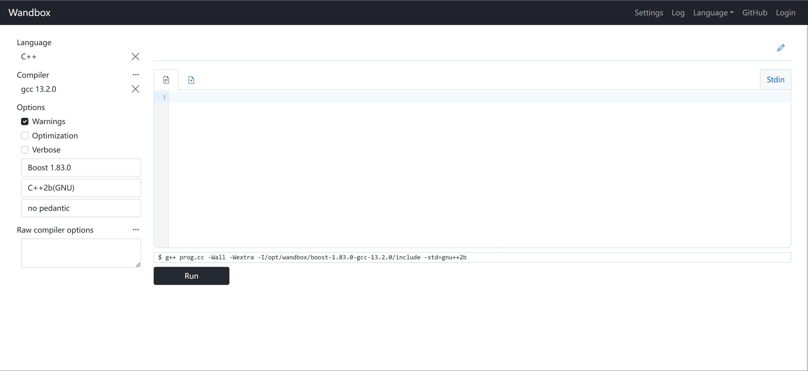
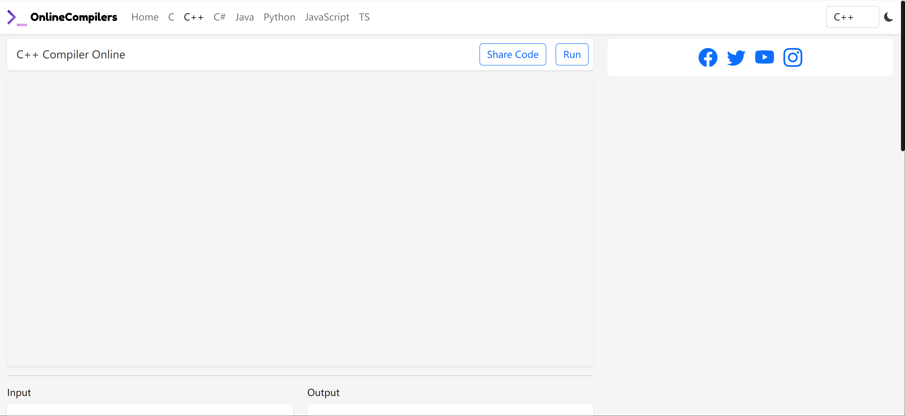
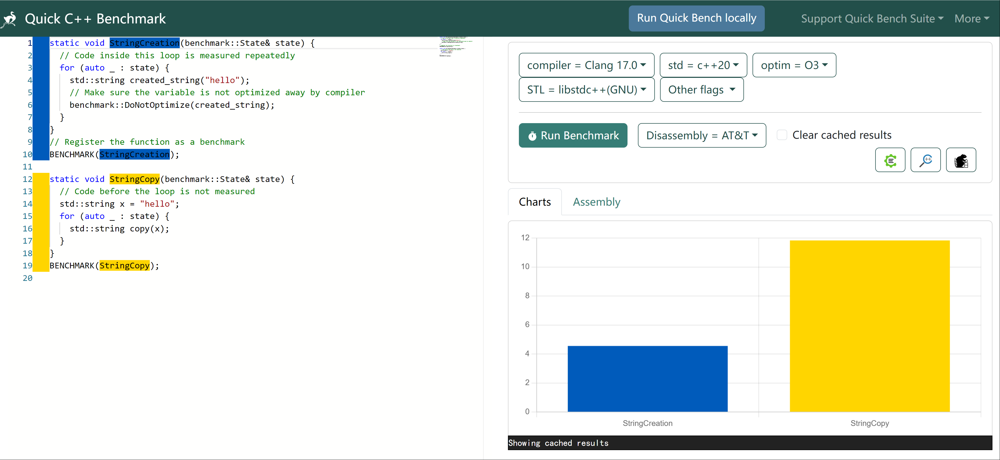
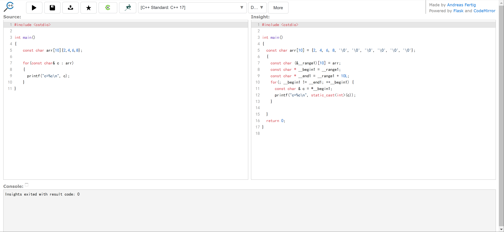
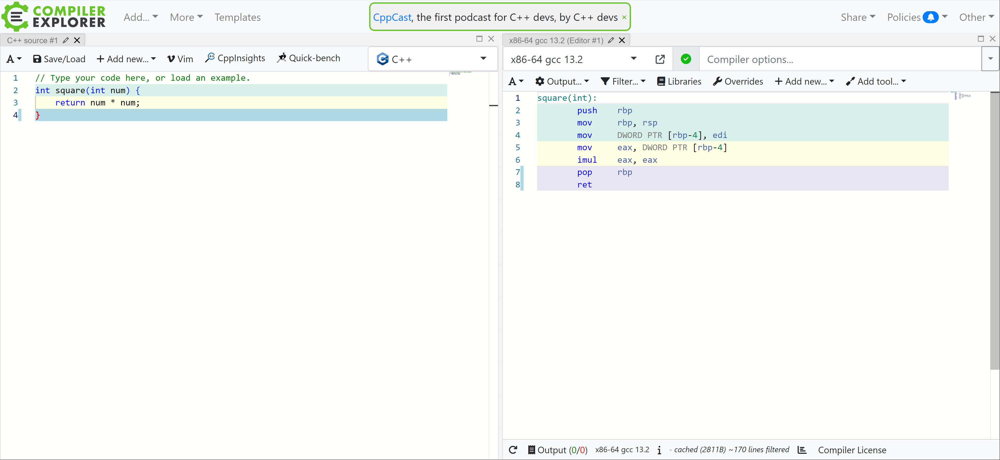
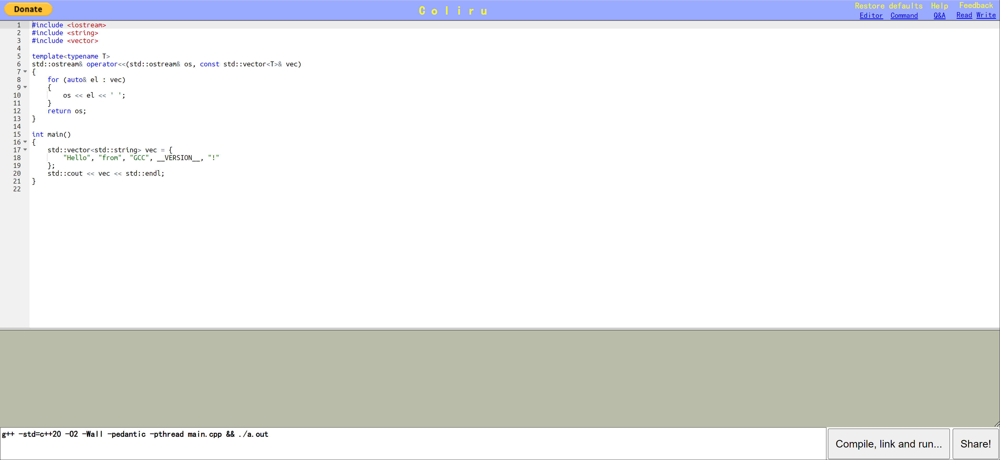
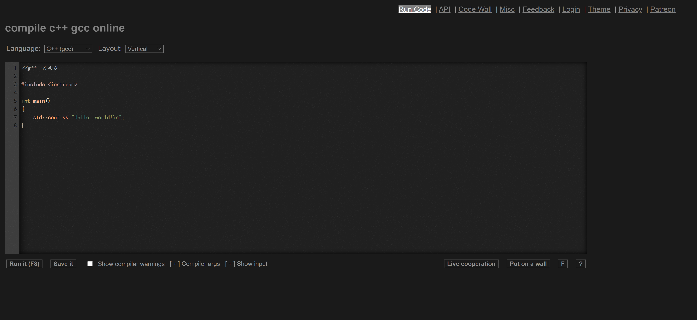
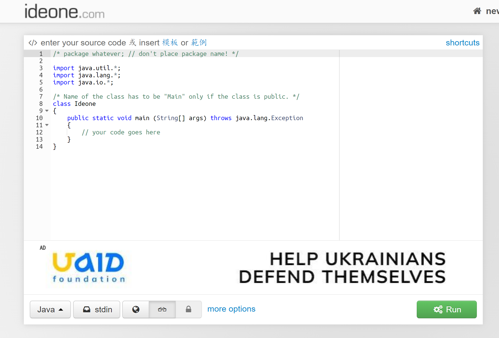
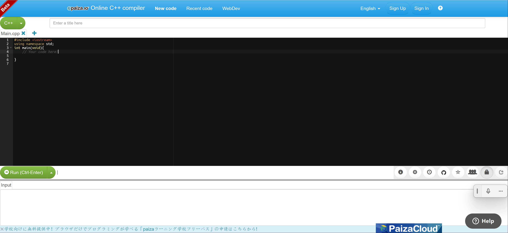
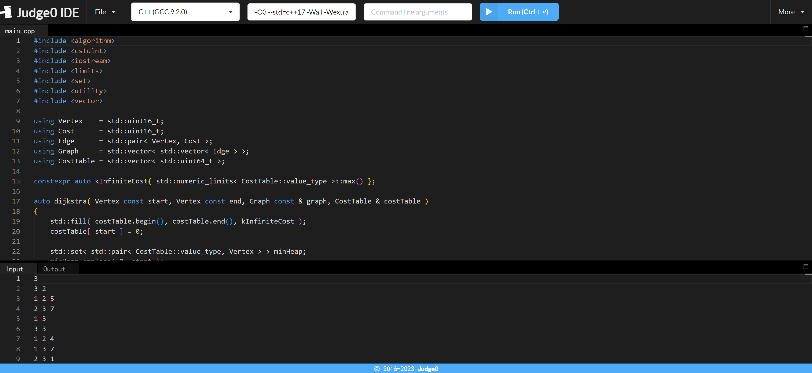

## 1、wanbox
特性：支持多种语言、**多个版本**，支持分享。

这个网站的特点在于支持的C++版本非常丰富，无需本地安装多个版本，在这个网站上就可以简单测试一些case，非常好用！

[https://wandbox.org/](https://wandbox.org/)

## 2、onlinecompilers
特性：精简，支持分享

这个网站的特点在于可以分享到社交媒体上，只有输入代码、运行，没有让用户去选择对应的版本，对于不关心C++标准/其他语言标准的小伙伴，可以用这个网站。

> [https://onlinecompilers.com/online-cpp-compiler](https://onlinecompilers.com/online-cpp-compiler)
>
> 

## 3、quick-bench
可以将google benchmark进行可视化，在里面可以编写自己的逻辑，运行之后可以看到可视化图表。

所以，如果是想要对自己的代码进行benchmark测试，那么这个网站非常推荐，同时会显示汇编代码！

此外，支持多个C++标准，简直太全了！

[https://quick-bench.com/](https://quick-bench.com/)

## 4、cppinsights
支持不同的C++标准进行编译，同时显示展开后的代码，可以了解自己写的代码发生了什么，非常好用。

[https://cppinsights.io/](https://cppinsights.io/)

## 5、godbolt

特性：支持vim、**工程代码**、有丰富的模版库、支持第三方库引入

这个网站的独特之处在于模版库，例如：想要一个CMAKE工程，可以选择一个模版，然后去写，简直牛逼！

[http://godbolt.org](http://godbolt.org)

## 6、coliru
这个网站非常精简，只支持编译、分享。

当然，如果想要用不同C++标准，不好意思，不支持～

[https://coliru.stacked-crooked.com/](https://coliru.stacked-crooked.com/)

## 7、rextester

支持多种语言，界面有黑色/白色主题，支持保存。

最牛逼的是，它支持API访问！

[https://rextester.com/l/cpp_online_compiler_gcc](https://rextester.com/l/cpp_online_compiler_gcc)

## 8、ideone
支持多种语言，C++支持到14标准，有个功能就是可以偷看别人的代码。

[https://ideone.com/](https://ideone.com/)

## 9、paiza
支持多种语言，最突出的特性是支持白板编程(群组共享)，非常适合远程面试场景，还可以设置当前环境访问权限。

[https://paiza.io/en/projects/new?language=cpp](https://paiza.io/en/projects/new?language=cpp)

## 10、judge0
界面非常好看，黑色系风格主题，支持C++的标准比较丰富，并支持多语言。

[https://ide.judge0.com/](https://ide.judge0.com/)

