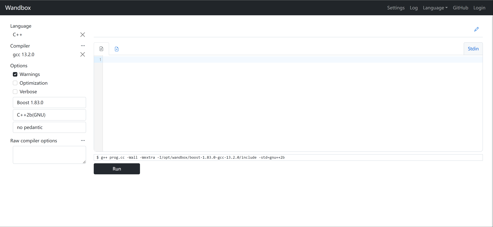
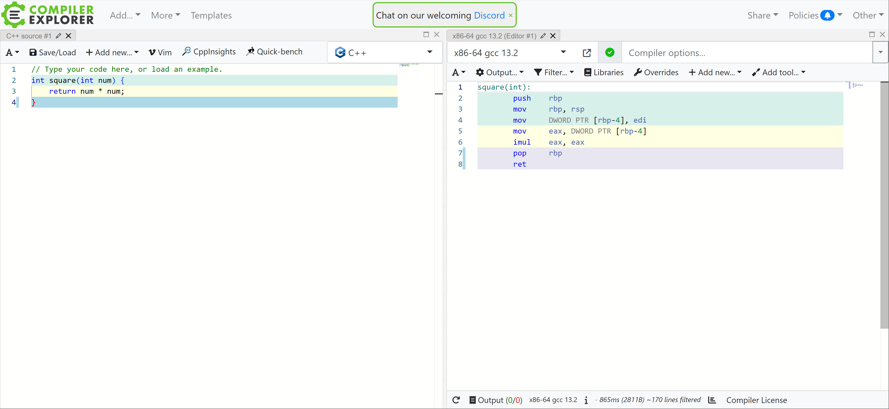
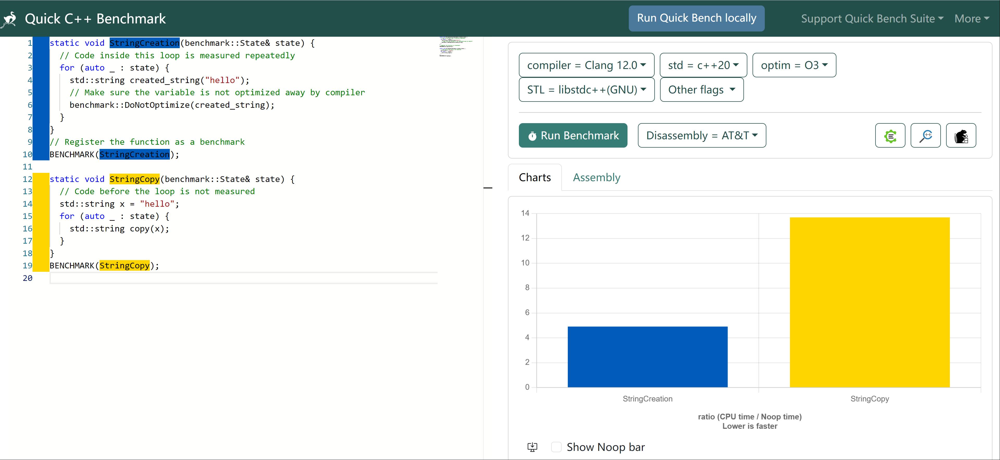
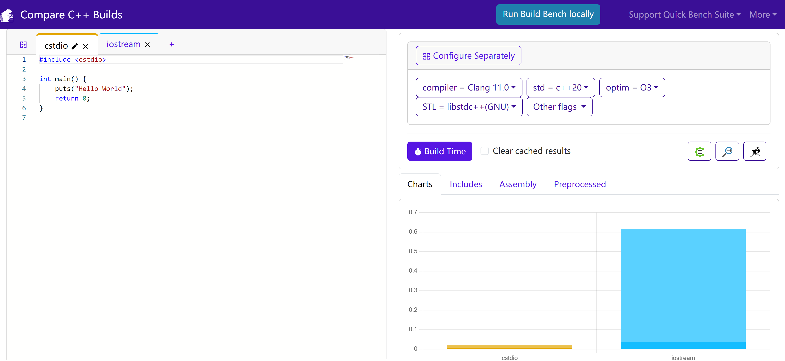

## C++提效网站
分享提高开发效率的一些网站。

[https://github.com/Light-City/CPlusPlusThings](https://github.com/Light-City/CPlusPlusThings)

给大家推荐C++日常工作/学习当中的一些网站，例如：编译、测试、性能等角度来推荐。

分别是：wanbox、godbolt、quick-bench与build-bench。

## 1、在线编译
不想在本地配置C++环境，那么这个网站很有用！

[https://wandbox.org/](https://wandbox.org/)

## 2、汇编
C++对应的汇编代码是什么呢？本地不会使用，同时也对应不上哪一行的汇编，那么这个网站帮你搞定。

[https://godbolt.org/](https://godbolt.org/)

## 3、基准测试

benchmark，go的test是支持的，那么在c++中，对一个函数或者接口测试的时候可以使用gtest，但是想要一个基准结果，就需要benchmark测试了。

[https://quick-bench.com/q/paKQEp0HMpgT6BpAW6TA4BoRo-M](https://quick-bench.com/q/paKQEp0HMpgT6BpAW6TA4BoRo-M)

需要使用benchmark库。

[https://github.com/google/benchmark](https://github.com/google/benchmark)

## 4、综合网站

不同编译对比，例如：使用cstdio与iostream的性能对比，此外，还可以看到汇编，上述网站的跳转，算是比较综合的网站了。

[https://www.build-bench.com/b/UisJAsK0HhePtnse9KODYslfVm0](https://www.build-bench.com/b/UisJAsK0HhePtnse9KODYslfVm0)

