## 裸奔状态：原始的 GDB 命令行
穿上各种衣服前，至少得先学会裸奔，找份简单的 GDB cheat sheet 对照一下：

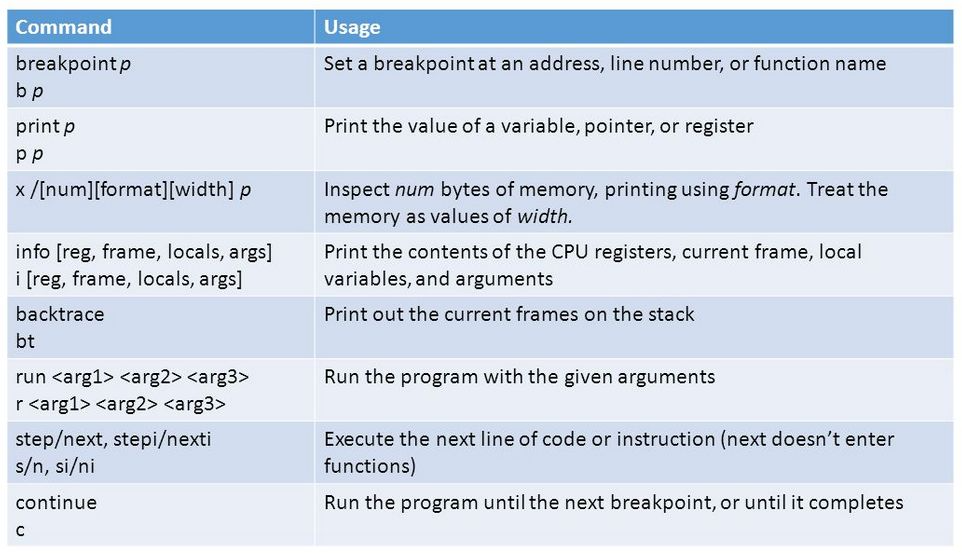<br />生产环境中出现崩溃时，因线上服务器一般没有开发环境，也无配套源代码，所以程序崩溃后，如果懒得把 core 文件拖回到开发机检查，可以先在线上服务器先简单gdb看一下。

GDB命令密密麻麻，常用的也就表格上那几条，比如进去以后第一步先用 bt 查看一下调用栈，info local查看一下本地变量，再配合 up/down 在整个调用栈的不同层次之间上下移动一下，检查各处局部变量的值，print 一下某个表达式，即便没代码，看下符号和反汇编，一般也能调试个七七八八。

碰到复杂点的 BUG，必须配合源代码了，那得把 core 文件拉到开发环境中，再用 gdb 对照源代码调试，配合 list [行号] 指令查看当前运行的源代码，再配合其他方法进行调试。

那么这时候，如果调试复杂度继续上升，需要不断的断点，每次 next / step 单步完后都需要 list 一下前后源代码，或者用 disassemble [函数名/地址] 查看一下指令的话，不少人会感觉到抓狂，这时需要给裸奔的 GDB 穿条内裤了。


## 穿上内裤：TUI
这是 gdb 自带的文本界面，使用 `gdb -tui` 命令启动，比如：
```bash
gdb -tui hello
```
即可打开文本界面：

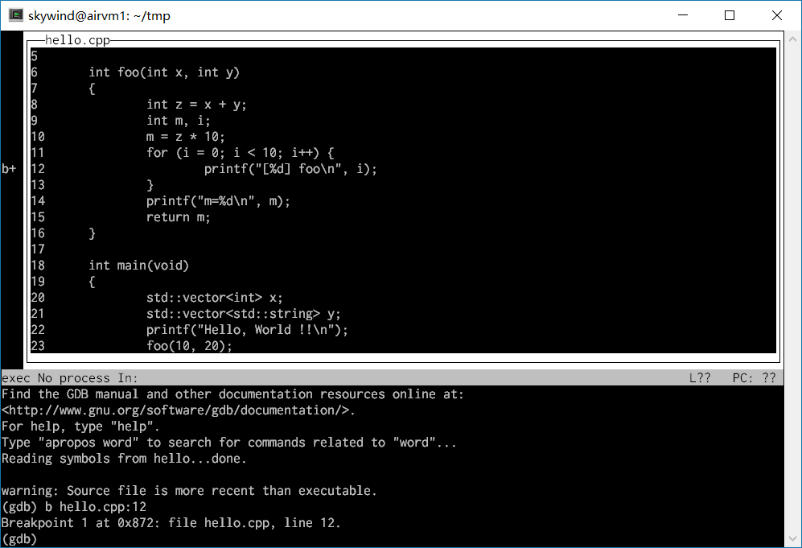

上方是源代码窗口，下面是 gdb 终端，窗口管理快捷键模仿 emacs，使用 c-x o 进行窗口切换，如果还想查看指令窗口，可以输入：`layout split`

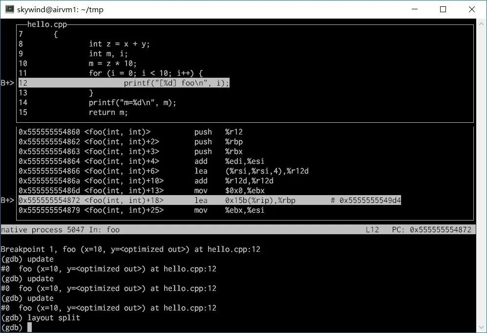

然后单步的时候上面的源代码窗口会跟着滚动，比之前不停的 list 方便不少吧，要看前后源代码可以继续 c-x o 切换窗口后上下滚动。

有时候 up/down 切换了栈帧后，上面的代码也许来不及更新，那么用 update 指令，让上面的代码窗口定位到你最新的执行位置，有时也需要 CTRL-L 重绘下整个界面。

在 gdb 自带的 tui 模式中，不但可以随时查看代码/指令，还可以查看寄存器。好吧，其实 gdb再简陋，本身还是配套了一条内裤的，只是很多人忘记拿出来穿了。


## 穿上内衣：gdbinit
如果上述文本 TUI的信息不够丰富的话，也许会对 .gdbinit 感兴趣，~/.gdbinit 是一个 gdb配置脚本，可以设定一些由 python 编写的插件，比如 peda：

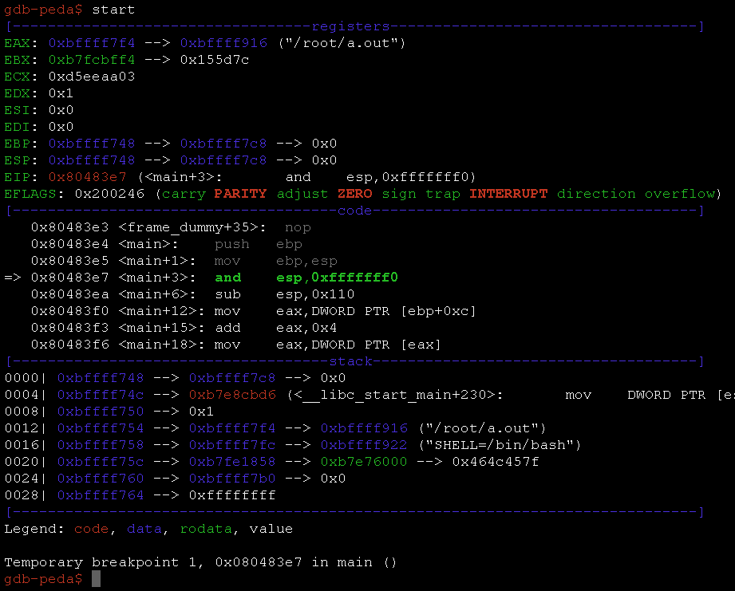<br />在 ~/.gdbinit 上面配置了 peda 后，可以看到命令提示符就从 (gdb) 变成了 gdb-peda$ 。每敲一个单步命令，peda 都会显示出无比丰富的信息，还可以配置添加更多，配合高亮，可以得到一个加强版的命令行。

不过这个用的并不多，因为它会影响 TUI 模式的界面，不喜欢在 gdb 里搞太多乱七八糟的东西。同时，当调试需求继续变得更加复杂，要不停的断点，频繁的单步，这些传统命令行里不停的输入各种指令显然已经让我们疲惫不堪了，能否直接在界面上查看源代码并且直接在代码上快捷键断点，快捷键单步呢？

可以啊，试试 cgdb。


## 穿上外套的：cgdb
CGDB 类似 gdb tui 分为终端窗口和代码窗口：

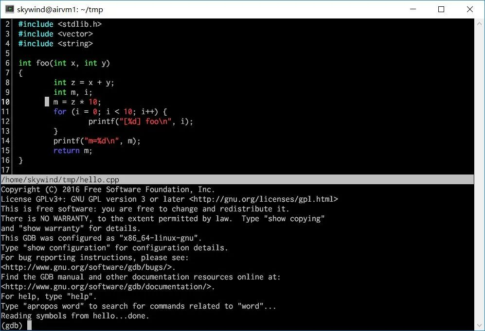<br />上面的代码窗口称为 cgdb mode, 下面的 gdb 窗口称为 gdb mode，调试就是不停的在两种模式间切换，按键模仿 vim，按 ESC 切换回 cgdb 模式，按 i 切换到 gdb 模式。<br />这看起来和 TUI gdb 差不多啊？除了语法高亮外它比 gdb tui 高效在哪里呢？答案是：大部分操作皆可在 cgdb mode 下（即源代码窗口)用快捷键操作。<br />方向键 或者 hjkl 移动光标，page-down/up 或 c-f / c-b 前后翻页，按 o键会列出当前可执行文件的源代码列表，可以切换查看其他相关代码文件，按 / 或者 ？ 可以进行文档搜索。<br />上面这些快捷键基本和 vim 对应，能方便的浏览源代码，同时在代码窗口可以用空格键来切换断点，还有其他一些快捷键：

- F5 - Send a run command to GDB.
- F6 - Send a continue command to GDB.
- F7 - Send a finish command to GDB.
- F8 - Send a next command to GDB.
- F10 - Send a step command to GDB.

更多快捷键见【这里】，这下单步和断点比原来轻松多啦，基本可以呆在源代码窗口里不出来，大部分时候不用再到 gdb 命令行里一条条 next/step 的输入了。<br />编辑一下 ~/.cgdb/cgdbrc ，简单调教下使用更方便：
```bash
set ignorecase
set ts=4
set wso=vertical
set eld=shortarrow
set hls
map <F9> :until<cr>
```
这里大概设置了搜索大小写不敏感，tab 大小，分屏方式（默认改为左右分屏），搜索高亮，以及加了一个 F9 的快捷键，用于跳出循环（默认没有这个快捷键）：<br />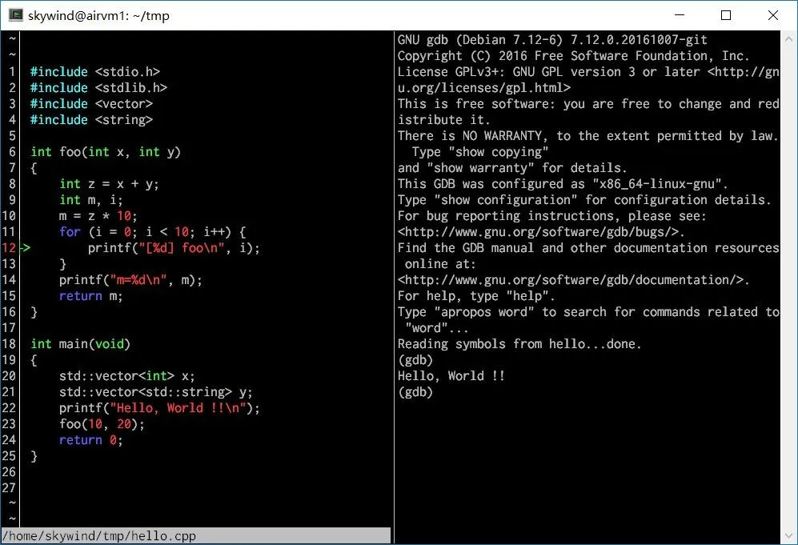<br />现在大家都是宽屏显示器了，默认改成左右分屏（要 cgdb 7.0才支持）舒服不少。<br />cgdb 还有更多功能，比如没有源文件时可以查看汇编，或者交叉查看源代码和汇编，设置 mark 等等，具体见它的官方文档吧。<br />这个小工具能将你从大量 gdb 命令行中解脱出来，配置文件还可以让你按喜好绑定各种命令到快捷键上。
<a name="nywJn"></a>
## 穿戴整齐：Emacs GDB
CGDB 虽然大部分操作可以用快捷键进行，但是仍然有不少时候需要切换回右边的 gdb mode 中去敲命令，比如当需要每单步一次就用 info local 查看一下局部变量或者 print 一下某个全局变量的值的时候，频繁的左右切换会让你疲于奔命。<br />所有在调试一些相对复杂的问题时，上面这些工具 hold 不住了，作用平时 Vim 写代码的人，也从不拒绝用 emacs 的 gdb mode 来调试一些复杂问题，毫无疑问 emacs 是目前终端下最强的 GDB 前端。<br />从来没用过 emacs 都没关系，只要安装一个 emacs 记得下面几条命令就可以调试了：

- 切换文件：c-x c-f （先按 ctrl_x 再按 ctrl_f），输入文件名时可以用 tab 补全
- 移动光标：方向键，或者 c-f, c-b, c-p, c-n；翻页 pgup/down 或者 c-v / m-v
- 切换缓存：c-x b 切换当前窗口里的缓存，c-x c-b 打开新窗口切换缓存。
- 窗口操作：c-x o 窗口切换，c-x 2 / c-x 3 上下/左右分屏，c-x 0 / c-x 1 关闭 / 独占
- 输入命令：m-x （按 ALT_x）输入命令可以用 tab 补全，c-g 退出命令输入。

当然，别忘记退出命令是 c-x c-c，这就够了，首先启动 emacs：<br />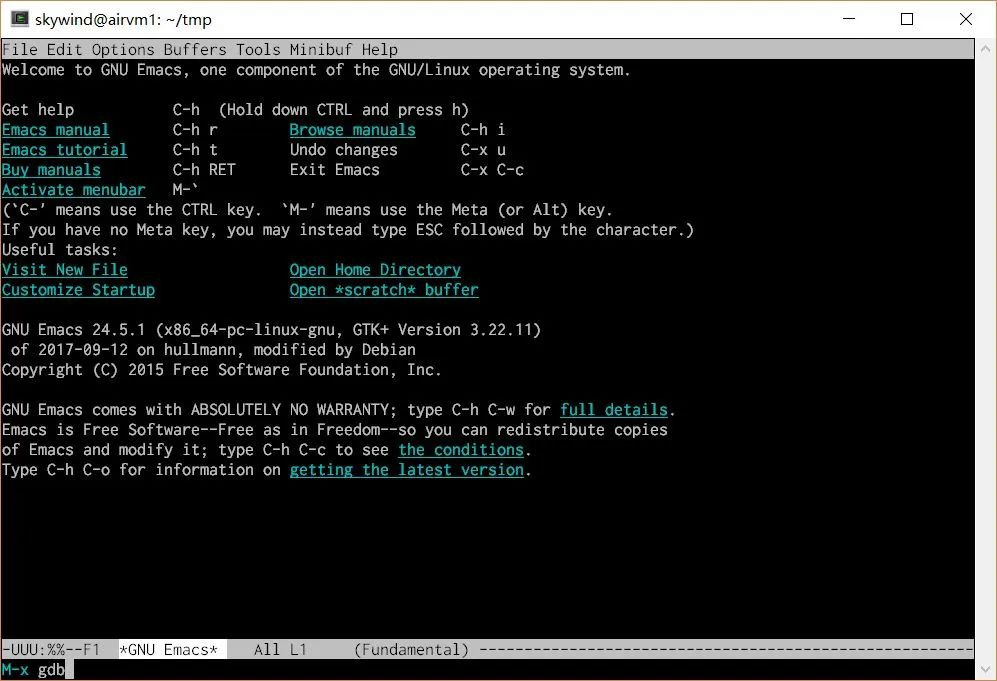<br />按下 m-x （alt+x），提示输入命令（如果终端软件 alt 键不灵，那可以设置一下终端软件，或者一秒内先按 ESC，再按 x键，在 xterm 终端下是等价的），键入 “gdb”敲回车：<br />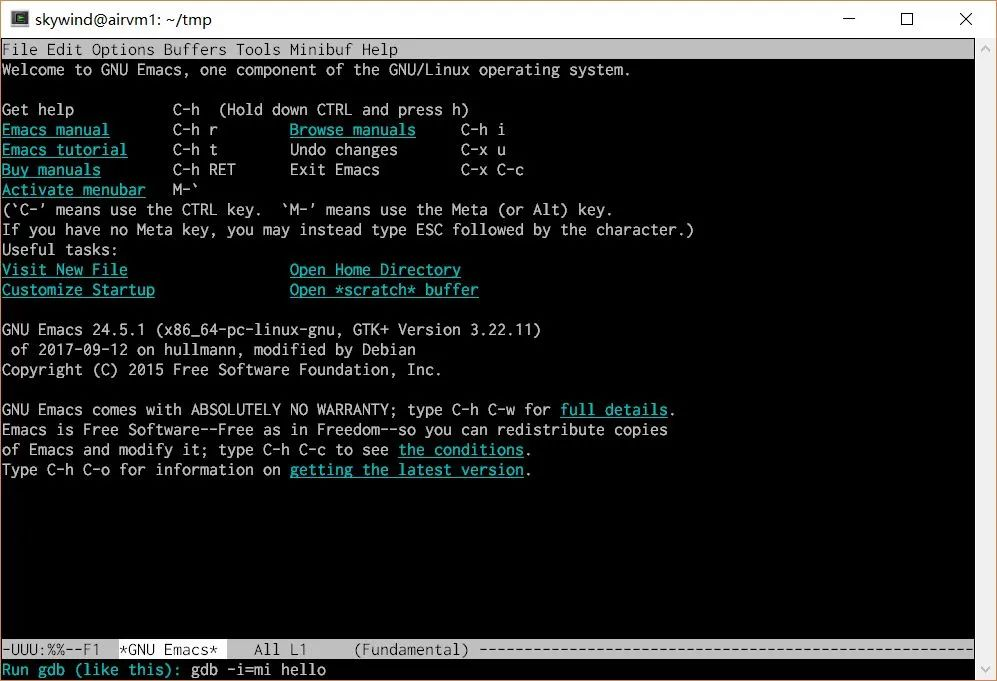<br />下面会问你怎么运行gdb，输入gdb的 shell 启动命令行回车后开始 gdb 模式：<br />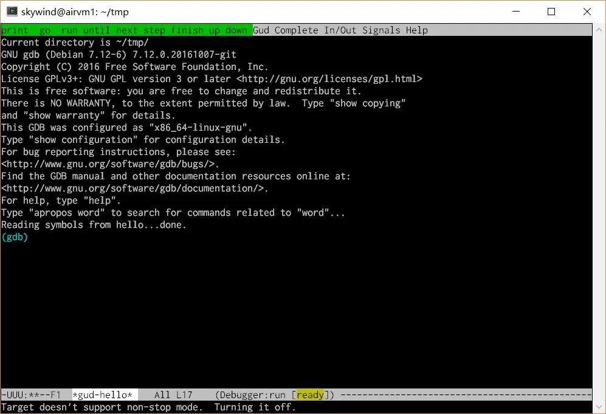<br />看到这里也许你会问，这和直接命令行 gdb 有区别么？别急，继续 m-x 输入命令：
```
gdb-many-windows
```
马上满足你：<br />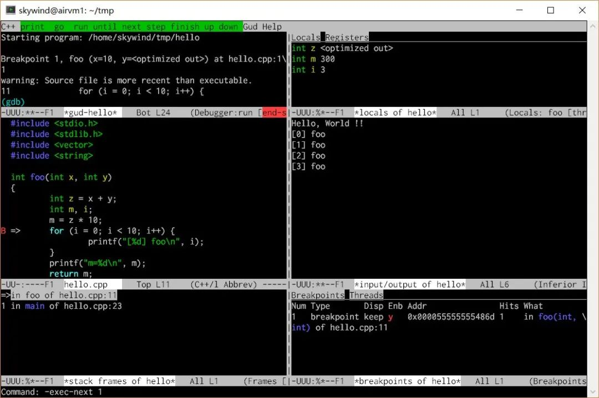<br />这些 gud- 开头的命令都是 emacs gdb-mode 下通用调试器的操作命令，他们和 gdb 命令一一对应，可以用 m-x 输入这些命令，还可以直接用快捷键操作。<br />如果想把某个窗口替换成反汇编或者寄存器的监控，那么可以用 m-x 输入：
```
gdb-display-disassembly-buffer
```
那么其中一个窗口就会被切换成反汇编窗口：<br />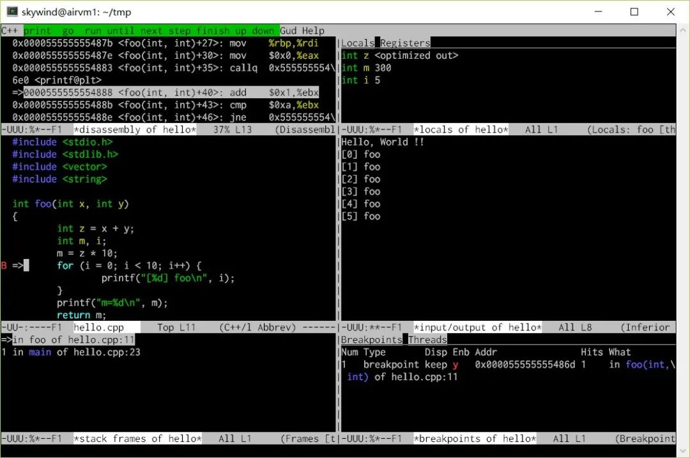左上角的 gdb 终端被切换成反汇编窗口了，看完后记得 c-x b 切换回 gdb 控制台，如果要避免某个窗口被切换走可以搜索 emacs 的 dedicated window。再者，可以自己用窗口管理快捷键按照喜好拆分布局：

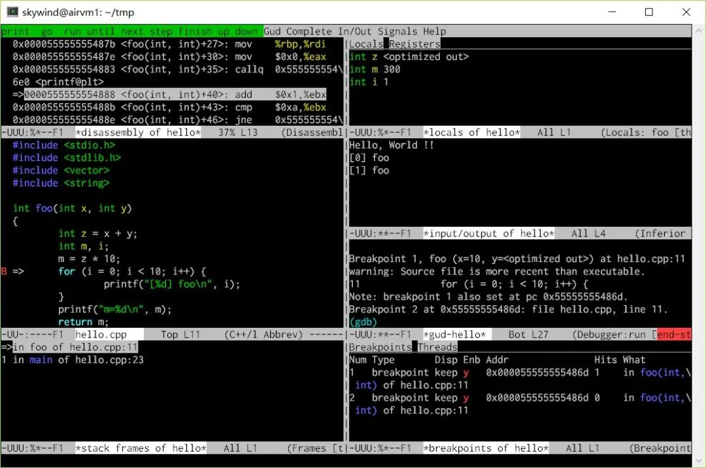

比如重新拆分了一下，把 gdb 终端挪到右边，输出窗口下面，把原来显示 gdb 终端的地方显示为反汇编。基本上在 IDE 上见得到的调试手段，在 emacs 中都可以操作，并且 emacs 还可以在 Windows 下用 gdb 调试 mingw 的程序。<br />那么也许你会抱怨 emacs 下操作是在太麻烦了，没关系，稍微调教一下即可。

## 调教 emacs gdb-mode
打开 ~/.emacs （windows下是 ~/_emacs）文件，输入如下内容：
```
(global-set-key [M-left] 'windmove-left)
(global-set-key [M-right] 'windmove-right)
(global-set-key [M-up] 'windmove-up)
(global-set-key [M-down] 'windmove-down)

(global-set-key [f5] 'gud-run)
(global-set-key [S-f5] 'gud-cont)
(global-set-key [f6] 'gud-jump)
(global-set-key [S-f6] 'gud-print)
(global-set-key [f7] 'gud-step)
(global-set-key [f8] 'gud-next)
(global-set-key [S-f7] 'gud-stepi)
(global-set-key [S-f8] 'gud-nexti)
(global-set-key [f9] 'gud-break)
(global-set-key [S-f9] 'gud-remove)
(global-set-key [f10] 'gud-until)
(global-set-key [S-f10] 'gud-finish)

(global-set-key [f4] 'gud-up)
(global-set-key [S-f4] 'gud-down)

(setq gdb-many-windows t)
```
解释一下，最上面设定了 ALT + 方向键就可以在窗口中跳转，如果终端 alt+方向不灵的话可以改成 C-left, C-right 等用 ctrl + 方向键移动窗口，后面设定了一些常用命令的快捷。<br />最后设置了默认打开 gdb-many-windows，最好增加下面一段，允许鼠标操作：
```
(require 'xt-mouse)
(xterm-mouse-mode)
(require 'mouse)
(xterm-mouse-mode t)
(defun track-mouse (e))

(setq mouse-wheel-follow-mouse 't)

(defvar alternating-scroll-down-next t)
(defvar alternating-scroll-up-next t)

(defun alternating-scroll-down-line ()
  (interactive "@")
    (when alternating-scroll-down-next
      (scroll-down-line))
    (setq alternating-scroll-down-next (not alternating-scroll-down-next)))

(defun alternating-scroll-up-line ()
  (interactive "@")
    (when alternating-scroll-up-next
      (scroll-up-line))
    (setq alternating-scroll-up-next (not alternating-scroll-up-next)))

(global-set-key (kbd "<mouse-4>") 'alternating-scroll-down-line)
(global-set-key (kbd "<mouse-5>") 'alternating-scroll-up-line)
```
这下 xterm 下可以自用的用鼠标点击切换窗口，点击按钮，用滚轮上下查看源代码了：<br />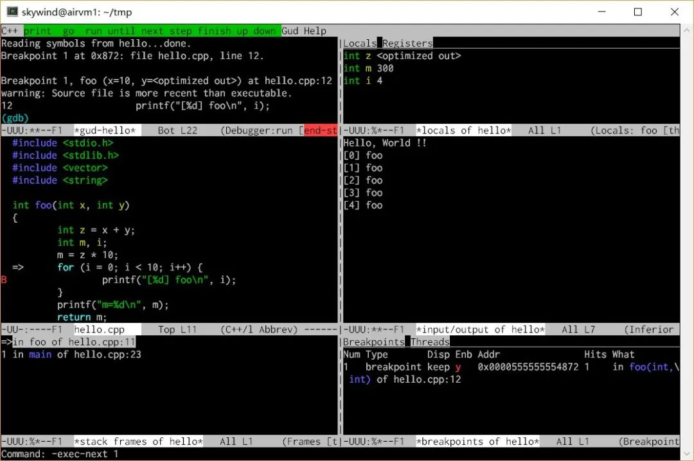<br />这下自由多了，ALT+方向或者鼠标点击，直接窗口跳转，并且用下面的命令操作：

- F5 - 运行，Shift + F5 - 继续
- F7/F8 代码级单步， 以及 Shift-F7/F8 指令级单步
- F9 - 设置断点，Shift-F9 删除断点
- F10 - 跳出循环，Shift-F10 跳出函数
- F4 - 移动到上一个调用栈帧，Shift-F4移动到下一个

右上角的本地变量窗口上面有两个按钮，可以鼠标点击切换显示本地变量还是寄存器。右下角的也有两个按钮切换显示断点还是线程。最上面绿色部分的按钮也可以直接鼠标点击。<br />终于比最初的版本好用多了，如果喜欢折腾的话，还可以定制 gdb-many-windows 的初始格局，比如更复杂的：<br />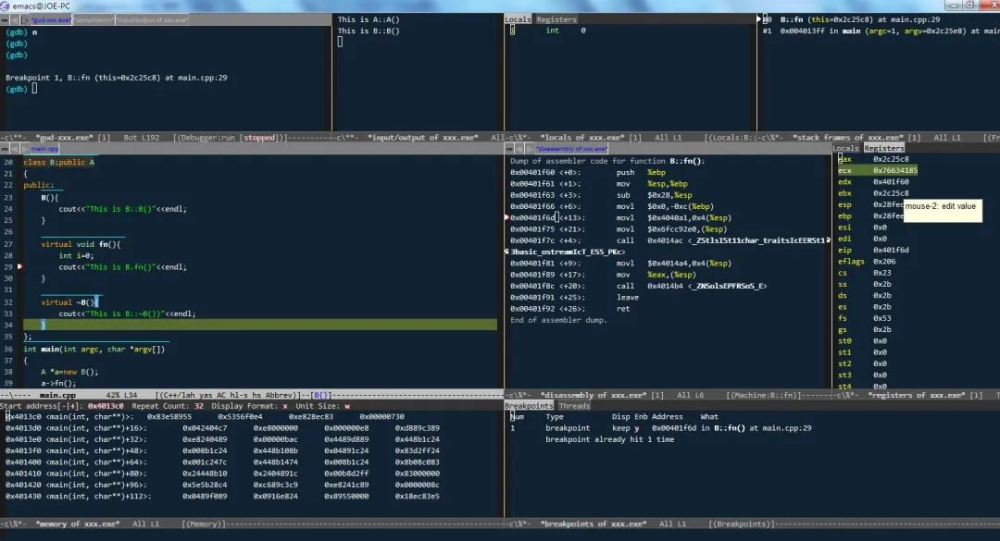<br />彻底满足你各种复杂的调试需求，这里不展开了，有兴趣见【这篇文章】。<br />最后每次调试时打开 emacs, m-x输入 gdb 再键入文件名很麻烦？调教一下 .bashrc：
```
gdbtool () { emacs --eval "(gdb \"gdb --annotate=3 -i=mi $*\")";}
```
好了，终端下对要调试的程序只需要输入：
```bash
$ gdbtool hello
```
就能自动打开 emacs 并且切换到 gdb-mode 下面，展开多窗口，开始调试了，是不是很愉快？<br />平时调试没环境会先使用 gdb-tui 先看看，有环境或者问题复杂了会打开 emacs 来调试。后来介绍了 cgdb 以后，gdb-tui 就退役了，无环境先用 cgdb 看个大概，碰到复杂问题打开 emacs，经过一番调教，十分顺手。

## 让 GDB 变得更性感一些
其实到 emacs 已经差不多了，但如果实在记不住这有限的几个快捷键或者 gdb 命令，那么还可以尝试一下 gdbgui：

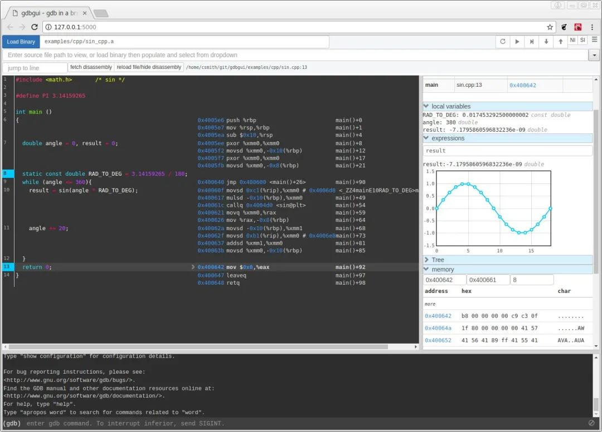python 开发的基于浏览器的 GDB 前端，pip 安装一下即可，使用时：

```bash
gdbgui --host 0.0.0.0 hello
```
就会监听本地 5000 端口，这时可以用浏览器打开服务器上的地址完全用鼠标进行调试。

中间是程序代码，下面是 GDB终端，上面可以切换源代码，可以控制运行/继续/单步等。右边可以实时查看：本地变量，调用栈帧，内存地址，断点，线程 等等。

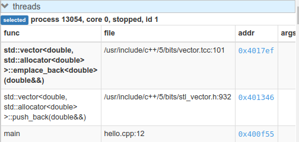

比如上面的调用栈和线程查看，以及下面的自定义结构体查询：

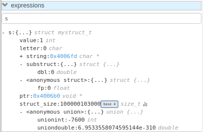

还能可视化查询数据结构：

鼠标点击代码左边就可以设置/删除断点，点击上面的按钮就能切换显示汇编代码。基本上把 GDB的主要功能都用可视化的方式，现代的网页界面展示在你的面前，不需要记住任何快捷键，鼠标点点点就可以了。<br />同时，这个 gdbgui 还支持 Windows 下的 gdb 调试。目前 gdbgui 还在活跃的开发中，作为最漂亮的 gdb 前端，相信它会越来越强大。


## 总结
从最开始 gdb 的命令行裸奔状态到终端下最完善的调试环境 emacs gdb-mode，再到性感的 gdbgui。GDB 的好处就在于对内可以引入各种插件，对外可以提供各种接口，自己做好调试的事情，前端界面可以完全交给其他程序来主导，不管是本地还是远程，所以才会有了各种各样丰富的 GDB Front End，还有各种远程 GDB 工具。

它不会限制你说你只能这样调试，或者只有唯一的一种 UI可以操作，所以 GDB 的组合方式千千万万，用不着一谈 GDB 就觉得只有原始的敲命令一种用法，对吧？上面么多用法，随便选两样，花不了半小时，即可让你终端下的调试工作加快不少。
