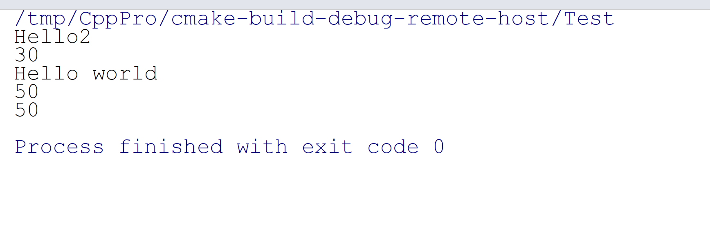
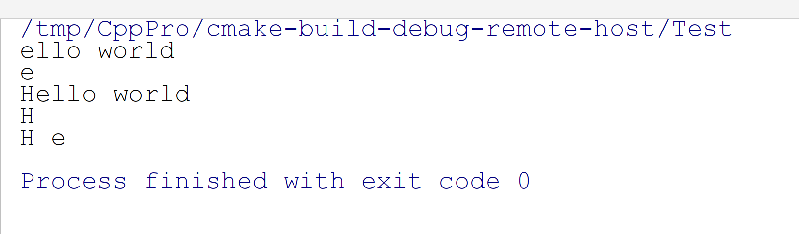
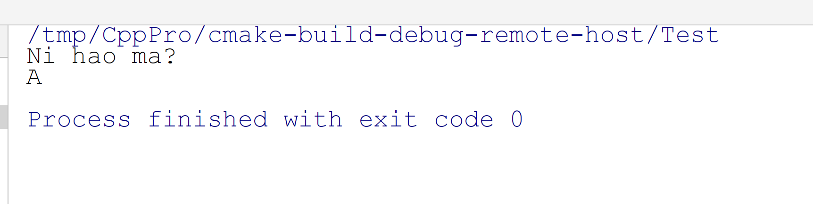

# CC++

## 1、一级指针变量的声明
简单的说指针就是虚拟内存的一个地址，指针变量是保存虚拟内存地址的变量。各类型指针大小一样，在32位机器上指针变量占用4个字节，在64位机器上指针变量占用8个字节，任何类型指针之间都可以互相转换，因为本质上指针就是一个虚拟内存的地址，但是不能互相解引用。先来看看指针如何声明，指针声明的格式：数据类型 + * + 变量名（函数指针除外）。
```cpp
int *Ptr = nullptr;  //声明一个int型指针变量
double *DPtr = nullptr;  //声明一个double型指针变量
long *LPtr = nullptr;  //声明一个long型指针变量
void (*FuncPtr)() = nullptr;  //声明一个函数指针变量
```


## 2、一级指针变量定义与赋值

指针变量赋值有两种方式，一种是在定义的时候赋初始值，另外一种先声明再赋值，新赋值会覆盖原来指针变量的值。拿代码作为示例。
```cpp
short SValue = 50;
short *SPtr = &SValue;  //初始化指针变量SPtr, 初始值是SValue的地址。

int Value = 10;
Ptr = &Value;  //赋值，Ptr指针变量保存Value的地址
int Value2 = 30;
Ptr = &Value2;  //重新赋值，Ptr指针变量保存Value2的地址
FuncPtr = Func;  //给函数指针变量赋值
void (*FuncPtr2)() = Func;  //声明并定义一个函数指针变量
const char *CStrPtr = "Ni Hao";  //声明并定义一个常量字符串指针
CStrPtr = "Hello world";  //常量字符型指针赋值，此时CStrPtr保存字符串常量Hello world的地址
```
从这里可以看出，除了函数指针和字符串指针外都需要取址运算符&获取变量的地址。


这里主要说明一下函数指针的声明方式，函数指针的声明方式：返回值 + (*函数指针变量名)(形参类型1, 形参类型2, ......)，举个简单的例子说明。

首先定义一个函数如下。

```cpp
int Func2(int Value1, char *Value2, float value3) {
    std::cout << "Hello2" << std::endl;
    return 0;
}
```
再声明并定义一个函数指针，指向Func2函数。
```cpp
int (*Func2Ptr)(int, char *, float) = Func2; //声明并定义一个函数指针
```

## 3、一维指针的使用
通过指针变量可以间接操作指针指向的变量，通过指针获取变量的值需要在指针变量的前面加`*`（函数指针除外）也可以通过下标间接引用指针指向的变量。
```cpp
Func2Ptr(0,  nullptr,  0);  //通过函数指针间接调用Func2函数
std::cout  << *Ptr <<  std::endl;  //解引用指针变量Ptr，输出Ptr指针指向的变量Value2的值。
std::cout  << CStrPtr <<  std::endl;  //通过指针输出字符串常量
*Ptr =  50;  //通过指针接引用指向的变量，赋值。实际上修改的是Value2的值。
std::cout  << *Ptr <<  std::endl;
std::cout  << Value2 <<  std::endl;
```
运行观察结果：



`*Ptr`解引用获取到了Value2的值，同时通过Ptr这个指针间接的修改了Value2的值。输出字符串指针则直接使用指针变量名即可，但是当对字符串指针解引用时，会得到单个字符，来看看示例代码。

```cpp
std::cout << *CStrPtr << std::endl; //输出单个字符N
```
通过下标引用也可以得到一样的效果，具体代码如下：
```cpp
std::cout << CStrPtr[0] << std::endl; //输出单个字符串
```

## 4、一维指针的寻址
指针是可以进行运算的，在对指针进行自增则指针向后移动被声明的数据类型占用空间大小，同理，自减则向前移动。也可以通过下标寻址，加1表示指针进行自增，减1表示指针自减。还是以代码作为示例讲解。
```cpp
++CStrPtr;  //CStrPtr声明为char型指针，++则CStrPtr指针保存的地址会向后移动sizeof(char)字节大小
std::cout << CStrPtr << std::endl;
std::cout << *CStrPtr << std::endl;
--CStrPtr;  //CStrPtr声明为char型指针，--则CStrPtr指针保存的地址会向前移动sizeof(char)字节大小
std::cout << CStrPtr << std::endl;
std::cout << *CStrPtr << std::endl;

std::cout << CStrPtr[0] << " " << CStrPtr[1] << std::endl;  //输出H和e
```
运行观察结果：<br />

## 5、一级指针在函数中的运用
指针数据类型既可以作为函数形参类型也可以作为函数返回值类型，现在编写两个函数，一个函数使用指针类型变量作为形参，另外一个函数返回一个指针型变量。
```cpp
void Func(const char *Ptr) {
    std::cout << Ptr << std::endl;
}

char *GetStringMem(int Size) {
    return (char *) malloc(Size);
}
```
代码中运用了`const`关键字修饰指针。但是要注意的是不能返回函数内的局部非静态变量的指针，因为函数内的局部非静态变量存储在栈上，在函数返回后栈被销毁，就会得到无效的指针。在主函数中调用代码如下：
```c
const char *CStrPtr2 = "Ni hao ma?";
Func(CStrPtr2);
char *MemPtr = GetStringMem(1024);
memset(MemPtr, 0, 1024);
MemPtr[0] = 'A';

std::cout << MemPtr << std::endl;
```
运行观察结果：


