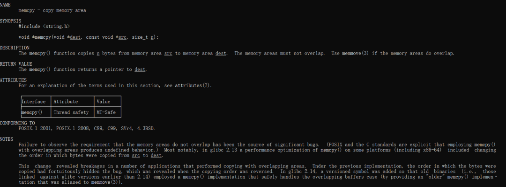
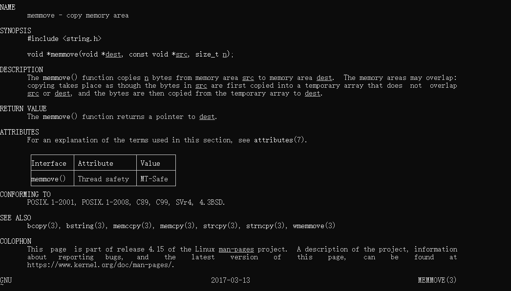
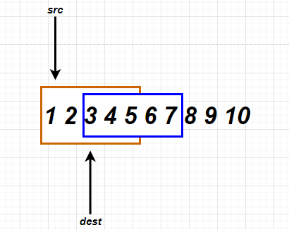
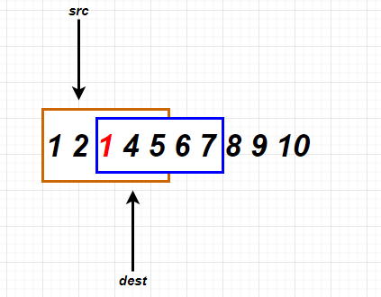
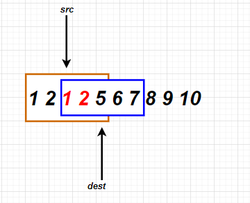
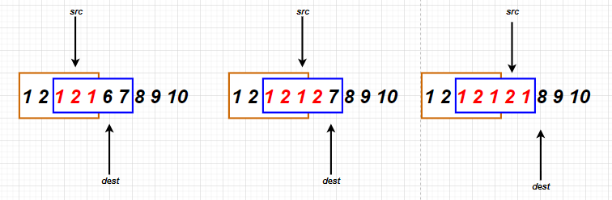
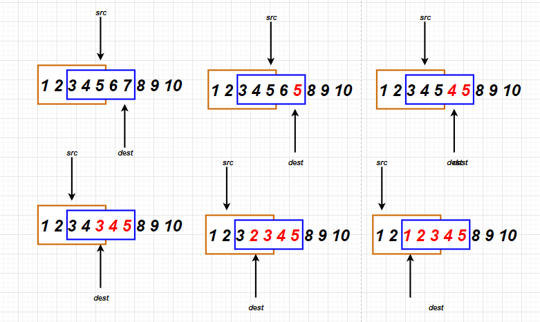

# C

<a name="BT4wu"></a>

### 基本概念阐述
memcpy和memmove都是 C 语言的库函数，相比于 `strcpy`和 `strncpy`只能针对于字符类型的数组（），这两个函数可以拷贝其他类型的数组，对于 `memcpy`和 `memmove`的区别是什么呢？这里，在 Linux 里通过 man命令查看两个函数的区别，查询的结果如下所示，首先是 `memcpy`函数的阐述。<br /><br />通过上述信息，可以知道，函数原型是：
```c
void *memcpy(void *dest, const void *src, size_t n);
```
这个函数的功能如上面所说，就是复制src存储区域 n个字节到dest区域，并且src和dest的内存区域不能够重叠。<br />紧接着来看`memmove`函数，同样的，来看Linux里的帮助手册：<br /><br />通过上述信息，可以知道，对于`memmove`的函数原型是:
```c
void *memmove(void *dest, const void *src, size_t n);
```
具体函数是什么意思呢？通过上图中的DESCRIPTION可以看到：<br />`memmove()` 函数将 n 个字节从内存区域 src 复制到内存区域 dest，但是相比于`memcpy`函数不同的是，他的内存区域可能会重叠：复制的过程就好比是将 src 中的字节首先被复制到一个不重叠的临时数组中src 或 dest中，然后将字节从临时数组复制到 dest。
<a name="qwrRp"></a>
### 实现 memcpy 和 memmove及原理介绍
关于前面所叙述的内存重叠的情况，会出现哪些问题呢？在论述这个问题之前，先来自己实现 `memcpy` 和 `memmove` 函数，当然自己实现的大多数情况是没有库实现的那么严谨和完备的。首先是`memcpy`函数的实现：
```c
void *memcpy(void *dest, const void *src, size_t count)  
{  
    if(dest == NULL || src == NULL || count <= 0)  return NULL;  
    char *d = (char *)dest;  
    char *s = (char *)src;  
    while(count--)  
    {  
        *d++ = *s++;  
    }  
    return dest;  
}
```
代码很容易理解，就不在这里进行赘述了，其中，有一点也是自己以前容易遗忘的一点，就是函数入口处对参数进行检查，不然会发生意想不到的错误。<br />接下来就是 `memmove`函数的实现：
```c
void *memmove(void *dest, const void *src, size_t count)  
{  
    if(dest == NULL || src == NULL || count <= 0)  return NULL;  
    if(dest < src)  
    {  
        char *d = (char *)dest;  
        char *s = (char *)src;  
        while (count--)  
        {  
            *d++ = *s++;  
        }  
    }  
    else  
    {  
        char *d = (char *)dest + count;  
        char *s = (char *)src + count;  
        while (count--)  
        {  
            *--d = *--s;  
        }  
    }      
    return dest;  
}
```
`memmove` 函数要相比于 `memcpy`函数的实现要复杂一点点：分成了目的地址在前还是在后两种情况，如果是目的地址在前，那么就必须将src地址所在的字符串从前往后拷贝，反之，则必须将src所在的字符串从后往前拷贝。<br />如何解释这一原因呢，从一个例子说起，下面是对应的代码：
```c
int main(int argc, char **argv) 
{
    int arr[] = { 1,2,3,4,5,6,7,8,9,10 };
    int i = 0;
    my_memcpy(arr + 2, arr, 20);

    for (i = 0; i < 10; i++) 
    {
        printf("%d ", arr[i]);
    }

    return 0;
}
```
可以看到代码所实现的功能是，将arr数组中12345拷贝到 34567所在的地址中去，按照这样一个思路，因该输出的是：
```
1 2 1 2 3 4 5 8 9 10
```
但是程序运行后输出的是：
```
1 2 1 2 1 2 1 8 9 10
```
这是为什么呢？这里来图解一下：<br /><br />首先，将src地址的值赋值给dest，然后指针后移动，继续下一次的赋值，此时数据就发生了变化，如下图所示：<br /><br />可以看到，此时 3 的位置变成了 1，继续移动指针，也就有了如下的变化：<br /><br />依据此原理，最后再移动三次指针，也就是如下所示的变化：<br /><br />最终也就得到了上述的结果。<br />这种情况也就是dest在后，然后src在前的一种情况，如果是从前往后拷贝的话，也就会造成上述的问题，而解决的办法就是从后往前拷贝，具体的过程，也如下图所示：<br /><br />可见，如果是此时 dest的地址在src的后面，那么就需要从后往前复制，这样才不会导致数据覆盖掉。<br />额外注意的一点，上文也提到了，就是说，对于 memmove 也不是一概而论的，如果是 dest的地址在前面，那么也还是需要从前往后复制才行。
