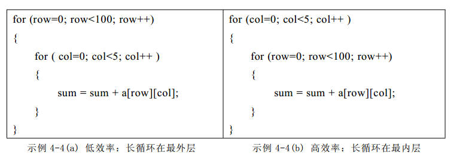
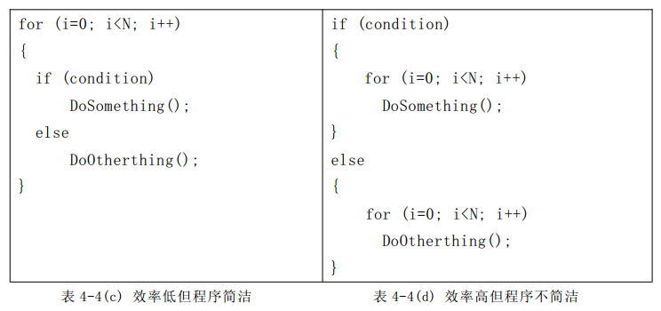
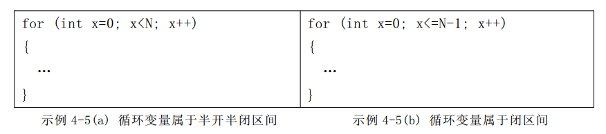

# C

## 一、变量与值得比较
### 1、布尔变量与零值的比较
不可将布尔变量直接与 TRUE、 FALSE或者 1、 0进行比较 。据布尔类型的语义，零值为“ 假”（记为 FALSE），任何非零值都是“ 真”（记为TRUE）。<br />TRUE的值究竟是什么并没有统一的标准。例如 Visual C++ 将 TRUE定义为 1， 而 Visual Basic则将 TRUE定义为-1 。<br />假设布尔变量名字为 flag，它与零值比较的标准 if语句如下：
```c
if (flag) // 表示flag为真
if (!flag) // 表示flag为假
```
其它的用法都属于不良风格，例如：
```c
if (flag == TRUE)
if (flag == 1 )
if (flag == FALSE)
if (flag == 0)
```

### 2、整形变量与零值的比较
应当将整型变量用“ ==” 或“ ！=” 直接与 0比较 。假设整型变量的名字为 value，它与零值比较的标准 if语句如下：
```c
if (value == 0)
if (value != 0)
```
不可模仿布尔变量的风格而写成：
```c
if (value) // 会让人误解 value是布尔变量
if (!value)
```

### 3、浮点变量与零值的比较
不可将浮点变量用“ ==” 或“ ！=” 与任何数字比较 。千万要留意， 无论是 float还是 double类型的变量， 都有精度限制。<br />所以一定要避免将浮点变量用“ ==” 或“ ！=” 与数字比较，应该设法转化成“ >=” 或“ <=” 形式。假设浮点变量的名字为 x，应当 将：
```c
if (x == 0.0) // 隐含错误的比
```
转化为：
```c
if ((x>=-EPSINON) && (x<=EPSINON))
```
其中 EPSINON是允许的误差（即精度） 。

### 4、指针变量与零值的比较
应当将指针变量用“ ==” 或“ ！=” 与 NULL比较 。指针变量的零值是“ 空”（记为 NULL）。<br />尽管 NULL 的值与 0相同，但是两者意义不同。假设指针变量的名字为 p，它与零值比较的标准 if语句如下：
```c
if (p == NULL) // p与 NULL显式比较，强调 p是指针变量
if (p != NULL)
```
不要写成：
```c
if (p == 0) // 容易让人误解 p是整型变量
if (p != 0)
```
或者：
```c
if (p) // 容易让人误解p是布尔变量
if (!p)
```

## 二、变量及基本运算
### 1、整型数
如果确定整数非负，就应该使用`unsigned int`而不是`int`。<br />有些处理器处理无符号`unsigned` 整形数的效率远远高于有符号signed整形数（这是一种很好的做法，也有利于代码具体类型的自解释）。

因此，在一个紧密循环中，声明一个int整形变量的最好方法是：

```c
registerunsignedint variable_name;
```
记住，整形in的运算速度高浮点型float，并且可以被处理器直接完成运算，而不需要借助于FPU（浮点运算单元）或者浮点型运算库。

尽管这不保证编译器一定会使用到寄存器存储变量，也不能保证处理器处理能更高效处理unsigned整型，但这对于所有的编译器是通用的。

例如在一个计算包中，如果需要结果精确到小数点后两位，可以将其乘以100，然后尽可能晚的把它转换为浮点型数字。


### 2、除法和取余数
在标准处理器中，对于分子和分母，一个32位的除法需要使用20至140次循环操作。<br />除法函数消耗的时间包括一个常量时间加上每一位除法消耗的时间。
```
Time (numerator / denominator) = C0 + C1* log2 (numerator / denominator)
     = C0 + C1 * (log2 (numerator) - log2 (denominator)).
```
对于ARM处理器，这个版本需要20+4.3N次循环。这是一个消耗很大的操作，应该尽可能的避免执行。<br />有时，可以通过乘法表达式来替代除法。例如，假如知道b是正数并且b*c是个整数，那么(a/b)>c可以改写为a>(c*b)。<br />如果确定操作数是无符号unsigned的，使用无符号unsigned除法更好一些，因为它比有符号signed除法效率高。

### 3、取模的一种替代方法
使用取余数操作符来提供算数取模。但有时可以结合使用if语句进行取模操作。考虑如下两个例子：
```c
uint modulo_func1 (uint count)
{
    return (++count % 60);
}

uint modulo_func2 (uint count)
{
    if (++count >= 60)
       count = 0;
    return (count);
}
```
优先使用if语句，而不是取余数运算符，因为if语句的执行速度更快。这里注意新版本函数只有在知道输入的count结余0至59时在能正确的工作。

### 4、使用数组下标
如果想给一个变量设置一个代表某种意思的字符值，可能会这样做：
```c
switch ( queue )
{
case 0 :   letter = 'W';
   break;
case 1 :   letter = 'S';
   break;
case 2 :   letter = 'U';
   break;
}
```
或者这样做：
```c
if ( queue == 0 )
    letter = 'W';
else if ( queue == 1 )
    letter = 'S';
else
    letter = 'U';
```
一种更简洁、更快的方法是使用数组下标获取字符数组的值。如下：
```c
static char *classes="WSU";
letter = classes[queue];
```
### 5、使用别名
考虑如下的例子：
```c
void func1( int *data )
{
    int i;

    for(i=0; i<10; i++)
    {
        anyfunc( *data, i);
    }
}
```
尽管*data的值可能从未被改变，但编译器并不知道anyfunc函数不会修改它，所以程序必须在每次使用它的时候从内存中读取它。如果知道变量的值不会被改变，那么就应该使用如下的编码：
```c
void func1( int *data )
{
    int i;
    int localdata;

    localdata = *data;
    for(i=0; i<10; i++)
    {
        anyfunc ( localdata, i);
    }
}
```
这为编译器优化代码提供了条件。
### 6、局部变量的类型
应该尽可能的不使用char和short类型的局部变量。对于char和short类型，编译器需要在每次赋值的时候将局部变量减少到8或者16位。<br />这对于有符号变量称之为有符号扩展，对于无符号变量称之为零扩展。这些扩展可以通过寄存器左移24或者16位，然后根据有无符号标志右移相同的位数实现，这会消耗两次计算机指令操作（无符号char类型的零扩展仅需要消耗一次计算机指令）。<br />可以通过使用int和unsigned int类型的局部变量来避免这样的移位操作。这对于先加载数据到局部变量，然后处理局部变量数据值这样的操作非常重要。无论输入输出数据是8位或者16位，将它们考虑为32位是值得的。<br />考虑下面的三个函数：
```c
int wordinc (int a)
{
    return a + 1;
}
short shortinc (short a)
{
    return a + 1;
}
char charinc (char a)
{
    return a + 1;
}
```
尽管结果均相同，但是第一个程序片段运行速度高于后两者。
<a name="VN5wN"></a>
## 三、循环语句
### 1、多重循环
在多重循环中， 如果有可能， 应当将最长的循环放在最内层， 最短的循环放在最外层，以减少 CPU 跨切循环层的次数。例如示例 4-4(b)的效率比示例4-4(a)的高 ：<br />
<a name="bmCsk"></a>
### 2、循环体内的判断
如果循环体内存在逻辑判断， 并且循环次数很大， 宜将逻辑判断移到循环体的外面。<br />示例 4-4(c)的程序比示例 4-4(d)多执行了 N-1次逻辑判断。并且由于前者老要进行逻辑判断，打断了循环“ 流水线” 作业，使得编译器不能对循环进行优化处理， 降低了效率。<br />如果N非常大， 最好采用示例 4-4(d)的写法， 可以提高效率。如果 N非常小，两者效率差别并不明显，采用示例 4-4(c)的写法比较好， 因为程序更加简洁。<br />
<a name="NAXX1"></a>
### 3、for 语句的循环控制变量
不可在 for 循环体内修改循环变量，防止 for 循环失去控制 。建议 for语句的循环控制变量的取值采用“ 半开半闭区间” 写法。<br />示例 4-5(a)中的 x值属于半开半闭区间“ 0 =< x < N”，起点到终点的间隔为 N，循环次数为 N。<br />示例 4-5(b)中的 x值属于闭区间“ 0 =< x <= N-1”，起点到终点的间隔为 N-1，循环次数为 N。<br />相比之下，示例 4-5(a)的写法更加直观，尽管两者的功能是相同的 。


<a name="mHQ6n"></a>
### 4、更快的`for()`循环
这是一个简单而高效的概念。通常编写for循环代码如下：
```c
for( i=0;  i<10;  i++){ ... }
```
i从0循环到9。如果不介意循环计数的顺序，可以这样写：
```c
for( i=10; i--; ) { ... }
```
这样快的原因是因为它能更快的处理i的值–测试条件是：i是非零的吗？如果这样，递减i的值。对于上面的代码，处理器需要计算“计算i减去10，其值非负吗？<br />如果非负，i递增并继续”。简单的循环却有很大的不同。这样，i从9递减到0，这样的循环执行速度更快。<br />这里的语法有点奇怪，但确实合法的。循环中的第三条语句是可选的（无限循环可以写为for(;;)）。如下代码拥有同样的效果：
```c
for(i=10; i; i--){}
```
或者更进一步的：
```c
for(i=10; i!=0; i--){}
```
这里需要记住的是循环必须终止于0（因此，如果在50到80之间循环，这不会起作用），并且循环计数器是递减的。使用递增循环计数器的代码不享有这种优化。
<a name="dZhnU"></a>
## 四、指针
应该尽可能的使用引用值的方式传递结构数据，也就是说使用指针，否则传递的数据会被拷贝到栈中，从而降低程序的性能。<br />函数通过参数接受结构数据的指针，如果确定不改变数据的值，需要将指针指向的内容定义为常量。例如：
```c
void print_data_of_a_structure ( const Thestruct  *data_pointer)
{
    ...printf contents of the structure...
}
```
这个示例告诉编译器函数不会改变外部参数的值（使用const修饰），并且不用在每次访问时都进行读取。<br />同时，确保编译器限制任何对只读结构的修改操作从而给予结构数据额外的保护。
<a name="xnS2E"></a>
## 五、懒检测开发
在`if(a>10 && b=4)`这样的语句中，确保AND表达式的第一部分最可能较快的给出结果（或者最早、最快计算），这样第二部分便有可能不需要执行。
<a name="lDGsP"></a>
## 六、用`switch()`函数替代if…else…
对于涉及if…else…else…这样的多条件判断，例如：
```c
if( val == 1)
    dostuff1();
else if (val == 2)
    dostuff2();
else if (val == 3)
    dostuff3();
```
使用switch可能更快：
```c
switch( val )
{
    case 1: dostuff1(); break;

    case 2: dostuff2(); break;

    case 3: dostuff3(); break;
}
```
在if()语句中，如果最后一条语句命中，之前的条件都需要被测试执行一次。switch允许不做额外的测试。如果必须使用if…else…语句，将最可能执行的放在最前面。
