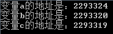
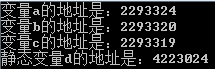
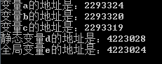
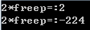

# C/C++ 内存管理

C 语言内存管理指对系统内存的分配、创建、使用这一系列操作。在内存管理中，由于是操作系统内存，使用不当会造成毕竟麻烦的结果。这里从系统内存的分配、创建出发，并且使用例子来举例说明内存管理不当会出现的情况及解决办法。


## 一、内存
在计算机中，每个应用程序之间的内存是相互独立的，通常情况下应用程序 A 并不能访问应用程序 B，当然一些特殊技巧可以访问。例如在计算机中，一个视频播放程序与一个浏览器程序，它们的内存并不能访问，每个程序所拥有的内存是分区进行管理的。

在计算机系统中，运行程序 A 将会在内存中开辟程序 A 的内存区域 1，运行程序 B 将会在内存中开辟程序 B 的内存区域 2，内存区域 1 与内存区域 2 之间逻辑分隔。


### 1.1 内存四区
在程序 A 开辟的内存区域 1 会被分为几个区域，这就是**内存四区**，内存四区分为栈区、堆区、数据区与代码区。<br />

​	栈区指的是存储一些临时变量的区域，临时变量包括了局部变量、返回值、参数、返回地址等，当这些变量超出了当前作用域时将会自动弹出。该栈的最大存储是有大小的，该值固定，超过该大小将会造成栈溢出。

​	堆区指的是一个比较大的内存空间，主要用于对动态内存的分配；在程序开发中一般是开发人员进行分配与释放，若在程序结束时都未释放，系统将会自动进行回收。

​	数据区指的是主要存放全局变量、常量和静态变量的区域，数据区又可以进行划分，分为全局区与静态区。全局变量与静态变量将会存放至该区域。

​	代码区就比较好理解了，主要是存储可执行代码，该区域的属性是只读的。


### 1.2 使用代码证实内存四区的底层结构
由于栈区与堆区的底层结构比较直观的表现，在此使用代码只演示这两个概念。首先查看代码观察栈区的内存地址分配情况：
```c
#include<stdio.h>
int main()
{
    int a = 0;
    int b = 0;
    char c='0';
    printf("变量a的地址是：%d\n变量b的地址是：%d\n变量c的地址是：%d\n", &a, &b, &c);
}
```
运行结果为：



可以观察到变量 a 的地址是 2293324 变量 b 的地址是 2293320，由于 int 的数据大小为 4 所以两者之间间隔为 4；再查看变量 c，发现变量 c 的地址为 2293319，与变量 b 的地址 2293320 间隔 1，因为 c 的数据类型为 char，类型大小为 1。在此观察发现，明明创建变量的时候顺序是 a 到 b 再到 c，为什么它们之间的地址不是增加而是减少呢？那是因为栈区的一种数据存储结构为先进后出，如图：<br /><br />首先栈的顶部为地址的“最小”索引，随后往下依次增大，但是由于堆栈的特殊存储结构，将变量 a 先进行存储，那么它的一个索引地址将会是最大的，随后依次减少；第二次存储的值是 b，该值的地址索引比 a 小，由于 int 的数据大小为 4，所以在 a 地址为 2293324 的基础上往上减少 4 为 2293320，在存储 c 的时候为 char，大小为 1，则地址为 2293319。由于 a、b、c 三个变量同属于一个栈内，所以它们地址的索引是连续性的，如果创建一个静态变量将会如何？在以上内容中说明了静态变量存储在静态区内，现在就来证实一下：

```c
#include<stdio.h>
int main()
{
    int a = 0;
    int b = 0;
    char c='0';
    static int d = 0;
    printf("变量a的地址是：%d\n变量b的地址是：%d\n变量c的地址是：%d\n", &a, &b, &c);
    printf("静态变量d的地址是：%d\n", &d);
}
```
运行结果如下：<br /><br />以上代码中创建了一个变量 d，变量 d 为静态变量，运行代码后从结果上得知，静态变量 d 的地址与一般变量 a、b、c 的地址并不存在连续，他们两个的内存地址是分开的。那接下来在此建一个全局变量，通过上述内容得知，全局变量与静态变量都应该存储在静态区，代码如下：
```c
#include<stdio.h>
int e = 0;
int main()
{
    int a = 0;
    int b = 0;
    char c='0';
    static int d = 0;
    printf("变量a的地址是：%d\n变量b的地址是：%d\n变量c的地址是：%d\n", &a, &b, &c);
    printf("静态变量d的地址是：%d\n", &d);
    printf("全局变量e的地址是：%d\n", &e);
}
```
运行结果如下：<br /><br />从以上运行结果中证实了上述内容的真实性，并且也得到了一个知识点，栈区、数据区都是使用栈结构对数据进行存储。<br />在以上内容中还说明了一点栈的特性，就是容量具有固定大小，超过最大容量将会造成栈溢出。查看如下代码：
```c
#include<stdio.h>
int main()
{
    char arr_char[1024*1000000];
    arr_char[0] = '0';
}
```
以上代码定义了一个字符数组 arr_char，并且设置了大小为 1024*1000000，设置该数据是方便查看大小；随后在数组头部进行赋值。运行结果如下：<br /><br />这是程序运行出错，原因是造成了栈的溢出。在平常开发中若需要大容量的内存，需要使用堆。<br />堆并没有栈一样的结构，也没有栈一样的先进后出。需要人为的对内存进行分配使用。代码如下：
```c
#include<stdio.h>
#include<string.h>
#include <malloc.h>
int main()
{
    char *p1 = (char *)malloc(1024*1000000);
    strcpy(p1, "这里是堆区");
    printf("%s\n", p1);
}
```
以上代码中使用了strcpy 往手动开辟的内存空间 p1 中传数据“这里是堆区”，手动开辟空间使用 malloc，传入申请开辟的空间大小 1024*1000000，在栈中那么大的空间必定会造成栈溢出，而堆本身就是大容量，则不会出现该情况。随后输出开辟的内存中内容，运行结果如下：<br /><br />在此要注意p1是表示开辟的内存空间地址。
<a name="Wlrhf"></a>
## 二、malloc 和 free
在 C 语言（不是 C++)中，malloc 和 free 是系统提供的函数，成对使用，用于从堆中分配和释放内存。malloc 的全称是 memory allocation 译为“动态内存分配”。
<a name="mNp8Y"></a>
### 2.1 malloc 和 free 的使用
在开辟堆空间时使用的函数为 malloc，malloc 在 C 语言中是用于申请内存空间，malloc 函数的原型如下：
```c
void *malloc(size_t size);
```
在 malloc 函数中，size 是表示需要申请的内存空间大小，申请成功将会返回该内存空间的地址；申请失败则会返回 NULL，并且申请成功也不会自动进行初始化。<br />该函数的返回值说明为 void *，在这里 void * 并不指代某一种特定的类型，而是说明该类型不确定，通过接收的指针变量从而进行类型的转换。在分配内存时需要注意，即时在程序关闭时系统会自动回收该手动申请的内存 ，但也要进行手动的释放，保证内存能够在不需要时返回至堆空间，使内存能够合理的分配使用。<br />释放空间使用 free 函数，函数原型如下：
```c
void free(void *ptr);
```
free 函数的返回值为 void，没有返回值，接收的参数为使用 malloc 分配的内存空间指针。一个完整的堆内存申请与释放的例子如下：
```c
#include<stdio.h>
#include<string.h>
#include <malloc.h>
int main() {
    int n, *p, i;
    printf("请输入一个任意长度的数字来分配空间:");
    scanf("%d", &n);

    p = (int *)malloc(n * sizeof(int));
    if(p==NULL){
        printf("申请失败\n");
        return 0;
    }else{
        printf("申请成功\n");
    } 

    memset(p, 0, n * sizeof(int));//填充0 

    //查看 
    for (i = 0; i < n; i++)
        printf("%d ", p[i]);
    printf("\n");
    free(p);
    p = NULL;
    return 0;
}
```
以上代码中使用了 malloc 创建了一个由用户输入创建指定大小的内存，判断了内存地址是否创建成功，且使用了 memset 函数对该内存空间进行了填充值，随后使用 for 循环进行了查看。最后使用了 free 释放了内存，并且将 p 赋值 NULL，这点需要主要，不能使指针指向未知的地址，要置于 NULL；否则在之后的开发者会误以为是个正常的指针，就有可能再通过指针去访问一些操作，但是在这时该指针已经无用，指向的内存也不知此时被如何使用，这时若出现意外将会造成无法预估的后果，甚至导致系统崩溃，在 malloc 的使用中更需要需要。
<a name="L75id"></a>
### 2.2 内存泄漏与安全使用实例
内存泄漏是指在动态分配的内存中，并没有释放内存或者一些原因造成了内存无法释放，轻度则造成系统的内存资源浪费，严重的导致整个系统崩溃等情况的发生。<br /><br />内存泄漏通常比较隐蔽，且少量的内存泄漏发生不一定会发生无法承受的后果，但由于该错误的积累将会造成整体系统的性能下降或系统崩溃。特别是在较为大型的系统中，如何有效的防止内存泄漏等问题的出现变得尤为重要。例如一些长时间的程序，若在运行之初有少量的内存泄漏的问题产生可能并未呈现，但随着运行时间的增长、系统业务处理的增加将会累积出现内存泄漏这种情况；这时极大的会造成不可预知的后果，如整个系统的崩溃，造成的损失将会难以承受。由此防止内存泄漏对于底层开发人员来说尤为重要。<br />C 程序员在开发过程中，不可避免的面对内存操作的问题，特别是频繁的申请动态内存时会及其容易造成内存泄漏事故的发生。如申请了一块内存空间后，未初始化便读其中的内容、间接申请动态内存但并没有进行释放、释放完一块动态申请的内存后继续引用该内存内容；如上所述这种问题都是出现内存泄漏的原因，往往这些原因由于过于隐蔽在测试时不一定会完全清楚，将会导致在项目上线后的长时间运行下，导致灾难性的后果发生。<br />如下是一个在子函数中进行了内存空间的申请，但是并未对其进行释放：
```c
#include<stdio.h>
#include<string.h>
#include <malloc.h>
void m() { 
    char *p1; 
    p1 = malloc(100); 
    printf("开始对内存进行泄漏...");
}

int main() {
    m();
    return 0;
}
```
如上代码中，使用 `malloc` 申请了 100 个单位的内存空间后，并没有进行释放。假设该 m 函数在当前系统中调用频繁，那将会每次使用都将会造成 100 个单位的内存空间不会释放，久而久之就会造成严重的后果。理应在 p1 使用完毕后添加 free 进行释放：
```c
free(p1);
```
以下示范一个读取文件时不规范的操作：
```c
#include<stdio.h>
#include<string.h>
#include <malloc.h>
int m(char *filename) { 
    FILE* f;
    int key; 
    f = fopen(filename, "r"); 
    fscanf(f, "%d", &key); 
    return key; 
}

int main() {
    m("number.txt");
    return 0;
}
```
以上文件在读取时并没有进行 `fclose`，这时将会产生多余的内存，可能一次还好，多次会增加成倍的内存，可以使用循环进行调用，之后在任务管理器中可查看该程序运行时所占的内存大小，代码为：
```c
#include<stdio.h>
#include<string.h>
#include <malloc.h>
int m(char *filename) { 
    FILE* f;
    int key; 
    f = fopen(filename, "r"); 
    fscanf(f, "%d", &key); 
    return key; 
}

int main() {
    int i;
    for(i=0;i<500;i++) {
        m("number.txt");
    }
    return 0;
}
```
可查看添加循环后的程序与添加循环前的程序做内存占用的对比，就可以发现两者之间添加了循环的代码将会成本增加占用容量。<br />未被初始化的指针也会有可能造成内存泄漏的情况，因为指针未初始化所指向不可控，如：
```c
int *p;
*p = val;
```
包括错误的释放内存空间：
```c
pp=p;
free(p); 
free(pp);
```
释放后使用，产生悬空指针。在申请了动态内存后，使用指针指向了该内存，使用完毕后通过 free 函数释放了申请的内存，该内存将会允许其它程序进行申请；但是使用过后的动态内存指针依旧指向着该地址，假设其它程序下一秒申请了该区域内的内存地址，并且进行了操作。当依旧使用已 free 释放后的指针进行下一步的操作时，或者所进行了一个计算，那么将会造成的结果天差地别，或者是其它灾难性后果。所以对于这些指针在生存期结束之后也要置为 null。查看一个示例，由于 free 释放后依旧使用该指针，造成的计算结果天差地别：
```c
#include<stdio.h>
#include<string.h>
#include <malloc.h>
int m(char *freep) { 
    int val=freep[0];
    printf("2*freep=:%d\n",val*2);
    free(freep);
    val=freep[0];
    printf("2*freep=:%d\n",val*2);
}

int main() {
    int *freep = (int *) malloc(sizeof (int));
    freep[0]=1;
    m(freep);
    return 0;
}
```
以上代码使用 malloc 申请了一个内存后，传值为 1；在函数中首先使用 val 值接收 freep 的值，将 val 乘 2，之后释放 free，重新赋值给 val，最后使用 val 再次乘 2，此时造成的结果出现了极大的改变，而且最恐怖的是该错误很难发现，隐蔽性很强，但是造成的后顾难以承受。运行结果如下：<br />
<a name="3VK9Z"></a>
## 三、new 和 delete
C++ 中使用 new 和 delete 从堆中分配和释放内存，new 和 delete 是运算符，不是函数，两者成对使用(后面说明为什么成对使用)。<br />new/delete 除了分配内存和释放内存（与 malloc/free），还做更多的事情，所有在 C++ 中不再使用 malloc/free 而使用 new/delete。
<a name="MRmS5"></a>
### 3.1 new 和 delete 使用
new 一般使用格式如下：

- 指针变量名 = new 类型标识符;
- 指针变量名 = new 类型标识符(初始值);
- 指针变量名 = new 类型标识符[内存单元个数];

在C++中new的三种用法包括：`plain new`， `nothrow new` 和 `placement new`。<br />`plain new` 就是最常使用的 new 的方式，在 C++ 中的定义如下：
```cpp
void* operator new(std::size_t) throw(std::bad_alloc);  
void operator delete( void *) throw();
```
`plain new` 在分配失败的情况下，抛出异常 std::bad_alloc 而不是返回 NULL，因此通过判断返回值是否为 NULL 是徒劳的。
```cpp
char *getMemory(unsigned long size)   
{    
    char * p = new char[size];   
    return p; 
}   
void main(void)   
{
    try{   
        char * p = getMemory(1000000);    // 可能发生异常
        // ...   
        delete [] p;   
    }   
    catch(const std::bad_alloc &amp; ex)   
    {
        cout &lt;&lt; ex.what();
    }   
}
```
nothrow new 是不抛出异常的运算符new的形式。nothrow new在失败时，返回NULL。定义如下：
```cpp
void * operator new(std::size_t, const std::nothrow_t&) throw();
void operator delete(void*) throw();
```
```cpp
void func(unsinged long length)   
{
    unsinged char * p = new(nothrow) unsinged char[length];   
    // 在使用这种new时要加(nothrow) ，表示不使用异常处理 。

    if (p == NULL)  // 不抛异常，一定要检查
        cout << "allocte failed !";   
    // ...   
    delete [] p;
}
```
`placement new` 意即“放置”，这种new允许在一块已经分配成功的内存上重新构造对象或对象数组。`placement new`不用担心内存分配失败，因为它根本不分配内存，它做的唯一一件事情就是调用对象的构造函数。定义如下：
```cpp
void* operator new(size_t, void*);
void operator delete(void*, void*);
```
palcement new 的主要用途就是反复使用一块较大的动态分配的内存来构造不同类型的对象或者他们的数组。placement new构造起来的对象或其数组，要显示的调用他们的析构函数来销毁，千万不要使用delete。
```cpp
void main()   
{  
    using namespace std;   
    char * p = new(nothrow) char [4];   
    if (p == NULL)   
    {
        cout << "allocte failed" << endl;  
        exit( -1 );
    }   
    // ...   
    long * q = new (p) long(1000);   
    delete []p;    // 只释放 p，不要用q释放。
}
```
p 和 q 仅仅是首址相同，所构建的对象可以类型不同。所“放置”的空间应小于原空间，以防不测。当”放置new”超过了申请的范围，Debug 版下会崩溃，但 Release 能运行而不会出现崩溃！<br />该运算符的作用是：只要第一次分配成功，不再担心分配失败。
```cpp
void main()   
{
    using namespace std;   
    char * p = new(nothrow) char [100];   
    if (p == NULL)   
    {  
        cout << "allocte failed" << endl;
        exit(-1);
    }   
    long * q1 = new (p) long(100);   
    // 使用q1  ...   
    int * q2 = new (p) int[100/sizeof(int)];   
    // 使用q2 ...   
    ADT * q3 = new (p) ADT[100/sizeof(ADT)];   
    // 使用q3  然后释放对象 ...   
    delete [] p;    // 只释放空间，不再析构对象。
}
```
注意：使用该运算符构造的对象或数组，一定要显式调用析构函数，不可用 delete 代替析构，因为 placement new 的对象的大小不再与原空间相同。
```cpp
void main()   
{  
    using namespace std;   
    char * p = new(nothrow) char [sizeof(ADT)+2];   
    if (p == NULL)   
    {  
        cout << "allocte failed" &lt;&lt; endl;
        exit(-1); 
    } 
    // ... 
    ADT * q = new (p) ADT; 
    // ... 
    // delete q; // 错误
    q->ADT::~ADT();  // 显式调用析构函数，仅释放对象
    delete [] p;     // 最后，再用原指针来释放内存
}
```
`placement new` 的主要用途就是可以反复使用一块已申请成功的内存空间。这样可以避免申请失败的徒劳，又可以避免使用后的释放。<br />特别要注意的是对于 `placement new` 绝不可以调用的 `delete`, 因为该 new 只是使用别人替它申请的地方。释放内存是 `nothrow new` 的事，即要使用原来的指针释放内存。`free/delete` 不要重复调用，被系统立即回收后再利用，再一次 `free/delete` 很可能把不是自己的内存释放掉，导致异常甚至崩溃。<br />上面提到 `new/delete` 比 `malloc/free` 多做了一些事情，`new` 相对于 `malloc` 会额外的做一些初始化工作，`delete` 相对于 `free` 多做一些清理工作。
```cpp
class A
{
 public:
     A()
     {
        cont<<"A()构造函数被调用"<<endl;
     }
     ~A()
     {
        cont<<"~A()构造函数被调用"<<endl;
     }
}
```
在 main 主函数中，加入如下代码：
```cpp
A* pa = new A();  //类 A 的构造函数被调用
delete pa;        //类 A 的析构函数被调用
```
可以看出：使用 new 生成一个类对象时系统会调用该类的构造函数，使用 delete 删除一个类对象时，系统会调用该类的析构函数。可以调用构造函数/析构函数就意味着 new 和 delete 具备针对堆所分配的内存进行初始化和释放的能力，而 malloc 和 free 不具备。
<a name="aTStY"></a>
### 2.2 delete 与 delete[] 的区别
c++ 中对 new 申请的内存的释放方式有 delete 和 delete[] 两种方式，到底这两者有什么区别呢？<br />通常从教科书上看到这样的说明：

- delete 释放 new 分配的单个对象指针指向的内存
- delete[] 释放 new 分配的对象数组指针指向的内存 那么，按照教科书的理解，看下下面的代码：
```cpp
int *a = new int[10];
delete a;        //方式1
delete[] a;     //方式2
```

1. 针对简单类型 使用 new 分配后的不管是数组还是非数组形式内存空间用两种方式均可 如：
```cpp
int *a = new int[10];
delete a;
delete[] a;
```
此种情况中的释放效果相同，原因在于：分配简单类型内存时，内存大小已经确定，系统可以记忆并且进行管理，在析构时，系统并不会调用析构函数。<br />它直接通过指针可以获取实际分配的内存空间，哪怕是一个数组内存空间(在分配过程中 系统会记录分配内存的大小等信息，此信息保存在结构体 _CrtMemBlockHeader 中，具体情况可参看 VC 安装目录下 CRTSRCDBGDEL.cpp)。

2. 针对类 Class，两种方式体现出具体差异

当通过下列方式分配一个类对象数组：
```cpp
class A
{
    private:
    char *m_cBuffer;
    int m_nLen;
    `` public:
    A(){ m_cBuffer = new char[m_nLen]; }
    ~A() { delete [] m_cBuffer; }
};
A *a = new A[10];
delete a;         //仅释放了a指针指向的全部内存空间 但是只调用了a[0]对象的析构函数 剩下的从a[1]到a[9]这9个用户自行分配的m_cBuffer对应内存空间将不能释放 从而造成内存泄漏
delete[] a;      //调用使用类对象的析构函数释放用户自己分配内存空间并且   释放了a指针指向的全部内存空间
```
所以总结下就是，如果 ptr 代表一个用new申请的内存返回的内存空间地址，即所谓的指针，那么：<br />delete ptr  代表用来释放内存，且只用来释放 ptr 指向的内存。delete[] rg   用来释放rg指向的内存，！还逐一调用数组中每个对象的destructor！<br />对于像 `int/char/long/int*/struct` 等等简单数据类型，由于对象没有 `destructor` ，所以用 `delete` 和 `delete []`是一样的！但是如果是 C++ 对象数组就不同了！<br />关于 `new[]` 和 `delete[]`，其中又分为两种情况：

- (1) 为基本数据类型分配和回收空间；
- (2) 为自定义类型分配和回收空间；

对于 (1)，上面提供的程序已经证明了 delete[] 和 delete 是等同的。但是对于 (2)，情况就发生了变化。<br />来看下面的例子，通过例子的学习了解 C++ 中的 delete 和 delete[] 的使用方法
```cpp
#include <iostream>
using namespace std;
class Babe
{
public:
    Babe()
    {
        cout << \"Create a Babe to talk with me\" << endl;
    }
    ~Babe()
    {
        cout << \"Babe don\'t Go away,listen to me\" << endl;
    }
};
int main()
{
    Babe* pbabe = new Babe[3];
    delete pbabe;
    pbabe = new Babe[3];
    delete[] pbabe;
    return 0;
}
```
结果是:
```
Create a babe to talk with me
Create a babe to talk with me
Create a babe to talk with me
Babe don\'t go away,listen to me
Create a babe to talk with me
Create a babe to talk with me
Create a babe to talk with me
Babe don\'t go away,listen to me
Babe don\'t go away,listen to me
Babe don\'t go away,listen to me
```
只使用 delete 的时候只出现一个 `Babe don’t go away,listen to me`，而使用 delete[] 的时候出现 3 个 `Babe don’t go away,listen to me`。不过不管使用 `delete` 还是` delete[]` 那三个对象的在内存中都被删除，既存储位置都标记为可写，但是使用 `delete` 的时候只调用了 `pbabe[0]` 的析构函数，而使用了 `delete[]` 则调用了 3 个 Babe 对象的析构函数。<br />不管怎样都是把存储空间释放了，那他们有什么区别呢。<br />答：关键在于调用析构函数上。此程序的类没有使用操作系统的系统资源（比如：Socket、File、Thread等），所以不会造成明显恶果。如果类使用了操作系统资源，单纯把类的对象从内存中删除是不妥当的，因为没有调用对象的析构函数会导致系统资源不被释放，这些资源的释放必须依靠这些类的析构函数。所以，在用这些类生成对象数组的时候，用 delete[] 来释放它们才是正确的。而用 delete 来释放也许不会出问题，也许后果很严重，具体要看类的代码了。
