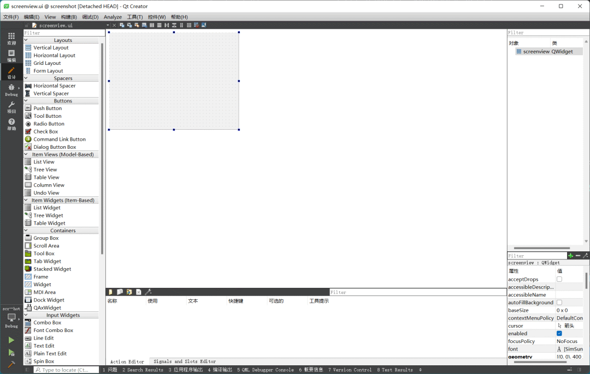

# C Qt


## 思路
首先先获取到当前桌面的完整图片，然后将其放到一个全屏的透明窗口之中，之后，在窗口上进行绘制矩形操作，然后获取到绘制的区域即可。
<a name="w1yqQ"></a>
## 核心代码
新建一个screenview的界面，设置为全屏窗口模式
```c
setWindowState(Qt::WindowActive|Qt::WindowFullScreen);
```
<br />获取到桌面的完成图片，保存图片，之前已经知道如何获取全屏图片。
```c
screen =QGuiApplication::primaryScreen();
if(const QWindow *window=windowHandle())
    screen=window->screen();
if(!screen)
    return ;
originalPixmap=screen->grabWindow(0);
```
重写四个方法`paintEvent`，`mousePressEvent`，`mouseMoveEvent`，`mouseReleaseEvent`，后面的3个鼠标方法，主要用来获取鼠标的位置，以便能够在绘制方法里头绘制出矩形区域。
```c
//截图
void screenview::paintEvent(QPaintEvent *event){
    painter.begin(this);
    painter.setPen(QPen(Qt::red,2));
    painter.drawPixmap(0,0,originalPixmap);
    if(sx>=0&&sy>=0)
    {
        painter.drawRect(QRect(sx,sy,ex-sx,ey-sy));
    }
    painter.end();
}

void screenview::mousePressEvent(QMouseEvent *event)
{
    if(event->button()==Qt::LeftButton){
        sx=event->x();
        sy=event->y();
        startpoint=event->pos();
    }
    update();
}

void screenview::mouseMoveEvent(QMouseEvent *event){
    ex=event->x();
    ey=event->y();
    endpoint=event->pos();
    update();
}

void screenview::mouseReleaseEvent(QMouseEvent *event){
    this->close();
    ex=event->x();
    ey=event->y();
    //获取到区域截图
    sourcePixmap=originalPixmap.copy(sx*Scale,sy*Scale,(ex-sx)*Scale,(ey-sy)*Scale);
}
```
<a name="TmIc3"></a>
## 完整代码
```c
//screenview.h
#ifndef SCREENVIEW_H
#define SCREENVIEW_H

#include <QWidget>
#include <QPainter>
#include <QScreen>
#include <QWindow>
#include <QPixmap>
#include <QMouseEvent>
#include <QRubberBand>
#include <QDateTime>
#include <QLabel>

#include "editwindow.h"
#include "mainwindow.h"

//添加
class QRubberBand;

namespace Ui {
class screenview;
}

class screenview : public QWidget
{
    Q_OBJECT

public:
    screenview(QWidget *parent = nullptr,QList<QRect> *ListRect=nullptr,int screentype=0);
    ~screenview();

protected:
    void paintEvent(QPaintEvent *event);
    void mousePressEvent(QMouseEvent *event);
    void mouseMoveEvent(QMouseEvent *event);

protected slots:
    void mouseReleaseEvent(QMouseEvent *event);
    void receiveData(QString str);   //接收传递过来的数据的槽

private:
    Ui::screenview *ui;
    QPainter painter;
    QPixmap originalPixmap;
    QPixmap sourcePixmap;

    QScreen *screen;
    QRubberBand *rubberBand;
    QPoint startpoint;
    QPoint endpoint;

    //记录鼠标位置
    int sx,sy,ex,ey;
    //记录矩形的大小
    int rw,rh;
    //截图类型
    int shottype;
    //固定截图的坐标
    int fixedx,fixedy;
    //固定大小的矩形
    QRect fixedRect;
    //窗口放大倍数
    float Scale;
    //保存所有的矩形
    QList<QRect> *ListRect;

    //当前选中的窗口
    QRect CurrentWindow;

signals:
    void senddata(QPixmap sourcePixmap);
};
#endif // SCREENVIEW_H
```
```c
#include "screenview.h"
#include "ui_screenview.h"

screenview::screenview(QWidget *parent,QList<QRect> *listRect,int screentype)
    :QWidget(parent),ui(new Ui::screenview)
{
    ui->setupUi(this);

    rubberBand=NULL;
    shottype=screentype;

    screen =QGuiApplication::primaryScreen();
    if(const QWindow *window=windowHandle())
        screen=window->screen();
    if(!screen)
        return ;
    originalPixmap=screen->grabWindow(0);
    //全屏窗口
    setWindowState(Qt::WindowActive|Qt::WindowFullScreen);
    //解决只有鼠标按下时才捕捉鼠标移动
    setMouseTracking(true);

    //获取系统设置的显示比例
    float swidth=this->width();
    float rwidth=originalPixmap.width();
    Scale=rwidth/swidth;
    ListRect=listRect;
}

screenview::~screenview()
{
    delete ui;
}

//截图
void screenview::paintEvent(QPaintEvent *event){
    painter.begin(this);
    painter.setPen(QPen(Qt::red,2));
    painter.drawPixmap(0,0,originalPixmap);

    if(shottype==1)
    {
        //固定窗口截图
        rw=300;
        rh=200;
        int fixx=(ex-rw/2)>0?(ex-rw/2):0;
        int fixy=(ey-rh/2)>0?(ey-rh/2):0;
        fixedRect=QRect(fixx,fixy,rw,rh);
        painter.drawRect(fixedRect);
        painter.setPen(QPen(Qt::black,2));
        painter.drawText(fixx,fixy+rh+10,"F2调整大小");
    }else if(shottype==0)
    {
        if(sx>=0&&sy>=0)
        {
            painter.drawRect(QRect(sx,sy,ex-sx,ey-sy));
        }
    }
    painter.end();
}

void screenview::mousePressEvent(QMouseEvent *event)
{
    if(event->button()==Qt::LeftButton){
        sx=event->x();
        sy=event->y();

        startpoint=event->pos();

        if(shottype==1){
            this->close();
            sourcePixmap=originalPixmap.copy(fixedRect.x()*Scale,fixedRect.y()*Scale,fixedRect.width()*Scale,fixedRect.height()*Scale);
            emit senddata(sourcePixmap);
        }
        else if(shottype==2){
            this->close();
            sourcePixmap=originalPixmap.copy(CurrentWindow.x()*Scale,CurrentWindow.y()*Scale,CurrentWindow.width()*Scale,CurrentWindow.height()*Scale);
            emit senddata(sourcePixmap);
        }
    }
    update();
}

void screenview::mouseMoveEvent(QMouseEvent *event){
    ex=event->x();
    ey=event->y();

    endpoint=event->pos();
    update();
}

void screenview::mouseReleaseEvent(QMouseEvent *event){
    this->close();

    ex=event->x();
    ey=event->y();

    sourcePixmap=originalPixmap.copy(sx*Scale,sy*Scale,(ex-sx)*Scale,(ey-sy)*Scale);
    //将获取到的图片内容发送到编辑窗口，可以直接保存到本地即可
    emit senddata(sourcePixmap);
}
```
