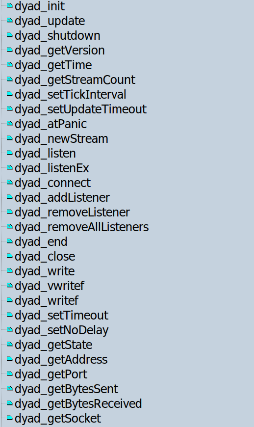
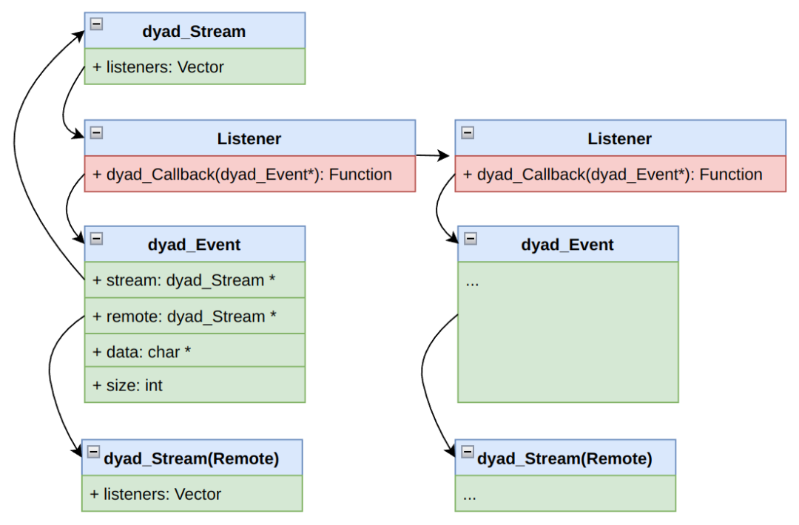
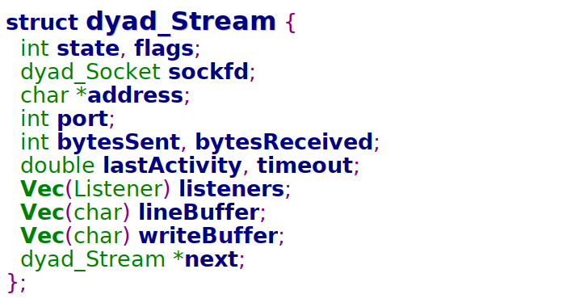
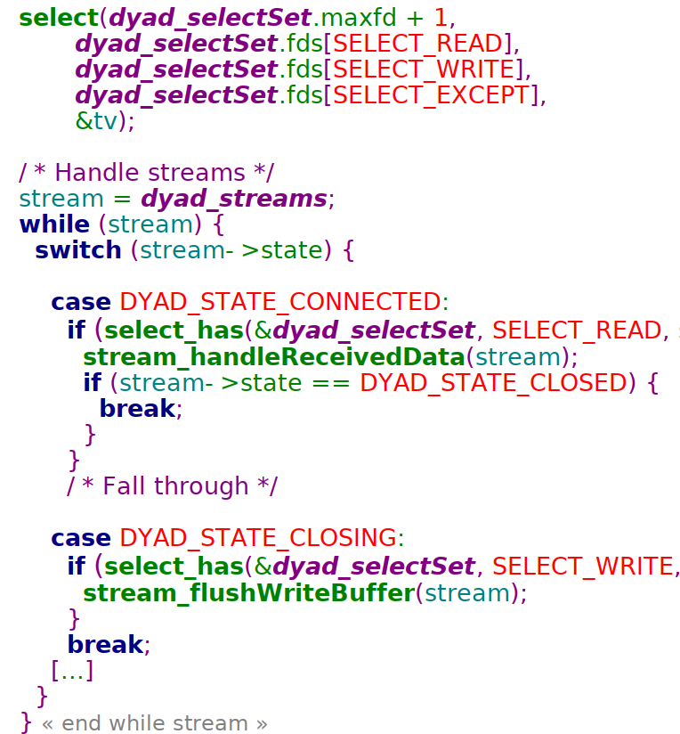

# C

## dyad 是什么？
Dyad 是一个基于 C 语言的异步网络库，旨在轻量级、可移植和易用。它既可用于创建小型独立服务器，也可用于为现有的项目提供网络支持。<br />**Github 链接**：[https://github.com/rxi/dyad](https://github.com/rxi/dyad)<br />**和 Mongoose 对比，Dyad 的特点是**：<br />代码更少，整个项目就一个 .c 文件和一个 .h 文件，加起来代码一共 1300 行。<br />功能更纯粹，仅支持 TCP 协议。<br />代码优雅，API 简洁易使用，非常适合初学者用来学习 Linux 网络编程和了解异步处理的本质。
<a name="MHsO1"></a>
## dyad 怎么用？
### 用 dyad 写一个 echo server：
echo server 的作用就是客户端给它发送什么，它就回复什么。例如说 “Hi”，echo server 就会回复 "Hi"，代码的主流程如下：
```c
int main(void)
{
    dyad_Stream *s;

    // 初始化 dyad
    dyad_init();

    // 创建流
    s = dyad_newStream();

    // 给流添加监听者，监听 ACCEPT 事件
    dyad_addListener(s, DYAD_EVENT_ACCEPT, onAccept, NULL);
    dyad_listen(s, 8000);

    // 睡眠以等待事件的发生
    while (dyad_getStreamCount() > 0) {
        dyad_update();
    }

    // 关闭 dyad
    dyad_shutdown();
    return 0;
}
```
当有客户端连接上来时，就触发了 ACCEPT 事件，对应的处理函数 `onAccept()` 就会被调用。在 `onAccept()` 里将监听 DATA 事件。
```c
static void onAccept(dyad_Event *e)
{
    dyad_addListener(e->remote, DYAD_EVENT_DATA, onData, NULL);
}
```
当客户端发数据过来时，就触发了 DATA 事件，对应的处理函数 `onData()` 就会被调用。在 `onData()` 进行写操作完成 echo 功能。
```c
static void onData(dyad_Event *e)
{
    dyad_write(e->stream, e->data, e->size);
}
```
简单到不用 Makefile 就可以编译：
```bash
$ gcc ../src/dyad.c echoserv.c -o echoserv -I../src
$ ./echoserv   # 启动 echo server
```
用 telnet 测试一下：
```bash
$ telnet 127.0.0.1 8000
Trying 127.0.0.1...
Connected to 127.0.0.1.
Escape character is '^]'.
Hello World!    # 发送给 echo server
Hello World!    # 从 echo server 接收
```
telnet 发送 "Hello World!" 后，能成功接收到 eco server 返回的 "Hello World!"。
<a name="jGQco"></a>
### API 简介：
虽然 dyad 的 API 大概有 20 来个：<br /><br />但是最常用的 API 就下面 5 个：
```c
dyad_init();
dyad_newStream();
dyad_addListener();
dyad_update();
dyad_shutdown();
```
如果不关心 dyad 的内部实现，只要熟悉 dyad 这几个 API， 就可以将 Linux 下的 TCP 网络通讯玩得很溜了。
<a name="AKDjk"></a>
## dyad 怎么实现？
作为一个爱学习好孩子，dyad 的代码绝对值得好好品读。

要理解 dyad 的内部实现，首先是要理解其数据结构的设计。

dyad 最重要的概念是 Stream，一个 Stream 可以对应多个 Listener，每一个 Listener 负责监听一种 Event ，当 Event 发生时，调用相应的 Callback 函数。


### Stream 是怎么设计的？
<br />分为 2 部分，其中一部分是 socket 相关的成员，另一部分是数据相关的成员。所有 Stream 都挂在一个链表下。当进入 eventloop 时，会遍历所有的 Stream，处理每一个 Streame 的 Event。

### 检测有无 Event 的 `dyad_update()` 是在干嘛？
本质就是用 `select()` 检测所有的 Stream 里的 socket 描述符。

当有 Event 发生时，根据事件类型，将事件分发给 Stream 上的等待相应 Event 的 Listener，本质就是调用 Listener 绑定的回调函数。




## 总结
dyad 是一个超级轻量级的 C 语言异步网络库。

它功能纯粹，API 简洁易使用，对于使用者而言，简直就是开箱即用，前提是需要的一个简单小巧的 TCP Server。

另外，其内部的代码实现优雅且巧妙，非常适合初学者用来学习 Linux 网络编程和了解异步处理的本质

如果需要的是高性能的服务器，那么应该考虑 libuv。
