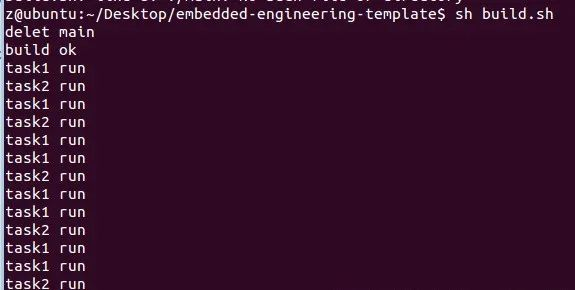

# C

## 一、介绍
调度器是常用的一种编程框架，也是操作系统的拆分多任务的核心，比如单片机的裸机程序框架，网络协议栈的框架如can网关、485网关等等，使用场合比较多，是做稳定产品比较常用的编程技术
## 二、原理
### 1、超级循环
```c
void main()
{
    while(1)
 {
     task1();
     task2();
     ...
     }
}
```

### 2、时间片与时标
1）把cpu执行时间分成一段一段的，每一段时间称为时间片 

2）时间片的时间计时由定时器完成，把定时器定的时间成为时标

### 3、调度算法介绍
1）时间片轮转调度 

2）强占试调度

### 4、注意事项
1）所有任务的执行时间不能超过时标的时间 

2）任务中不能有任何阻塞，比如使用延时函数 

3）任务中的延时或者长时间任务利用状态机拆分成多段

## 三、任务调度代码实现
这里拿linux来测试 schduler.c
```c
//~~~~~~~~~~~~~~~~~~~~~~~~~~~~~~~~~~~~~
//        头文件区
//~~~~~~~~~~~~~~~~~~~~~~~~~~~~~~~~~~~~~
#include <stdio.h>
#include "scheduler.h"

//~~~~~~~~~~~~~~~~~~~~~~~~~~~~~~~~~~~~~
//        接口定义区
//~~~~~~~~~~~~~~~~~~~~~~~~~~~~~~~~~~~~~
#define MAX_TASKS 10
static volatile unsigned char cur_task_num = 0;

//~~~~~~~~~~~~~~~~~~~~~~~~~~~~~~~~~~~~~
//        变量定义区
//~~~~~~~~~~~~~~~~~~~~~~~~~~~~~~~~~~~~~
static running_queue_def running_queue[MAX_TASKS] = {0};

//~~~~~~~~~~~~~~~~~~~~~~~~~~~~~~~~~~~~~
//        函数定义区
//~~~~~~~~~~~~~~~~~~~~~~~~~~~~~~~~~~~~~
int create_task(const void (*fun)(), unsigned short period)
{
    unsigned char i;

    if(cur_task_num >= MAX_TASKS)
 {
     printf("over limit max_tasks\n");
     return -1;
 }
    running_queue[i].fun = fun;
    running_queue[i].period = period;
    running_queue[i].cnt = 0;

    cur_task_num++;
    return 0;
}

int scheduler_run()
{
    unsigned char i;
    for(i = 0; i < cur_task_num; i++)
    {
        if(running_queue[i].cnt > 0)
        {
            running_queue[i].cnt--;
        }
        else
        {
            running_queue[i].cnt = running_queue[i].period;
            running_queue[i].fun();
        }
    }

    return 0;
}
```
schduler.h
```c
#ifndef __SCHEDULER_H
#define __SCHEDULER_H

typedef struct {
    void (*fun)();        //运行函数
    unsigned short period;//周期
    unsigned short cnt;
}running_queue_def;

int create_task(const void (*fun)(), unsigned short period);
int scheduler_run();

#endif
```
main.c
```c
#include "scheduler.h"
#include <unistd.h>
#include <stdio.h>

void task1()
{
    printf("task1 run\n");
}

void task2()
{
    printf("task2 run\n");
}

int main()
{
    create_task(task1, 1000);
    create_task(task2, 2000);
    while(1)
    {
        scheduler_run();
        usleep(1000);
    }

    return 0;
}
```
编译脚本

build.sh

```bash
echo "delet main"
rm -rf main
sleep 1

gcc main.c scheduler.c -o main  -w

echo "build ok "
./main
```

