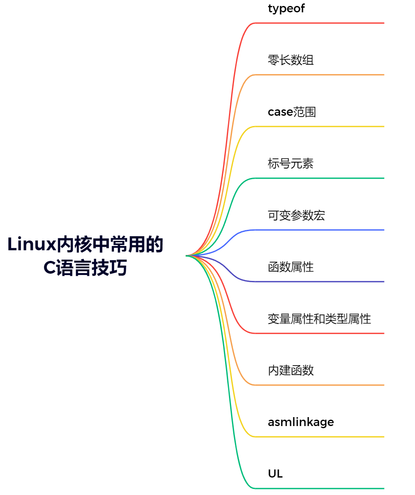

C<br /><br />Linux内核采用的是GCC编译器，GCC编译器除了支持ANSI C，还支持GNU C。在Linux内核中，许多地方都使用了GNU C语言的扩展特性，如`typeof`、`__attribute__`、`__aligned`、`__builtin_`等，这些都是GNU C语言的特性。
<a name="qFtDp"></a>
## typeof
下面是比较两个数大小返回最大值的经典宏写法：
```c
#define max(a,b) ((a) > (b) ? (a) : (b))
```
如果a传入i++，b传入j++，那么这个比较大小就会出错。例如：
```c
#define max(a,b) ((a)>(b)?(a):(b))

int x = 1, y = 2;
printf("max=%d\n", max(x++, y++));
printf("x = %d, y = %d\n", x, y);
```
输出结果：max=3，x=2，y=4。这是错误的结果，正常希望的是`max(1,2)`，返回max=2。如何修改这个宏呢？<br />在GNU C语言中，如果知道a和b的类型，可以在宏里面定义一个变量，将a, b赋值给变量，然后再比较。例如：
```c
#define max(a,b) ({   \
    int _a = (a);   \ 
    int _b = (b);   \
    _a > _b ? _a : _b; })
```
如果不知道具体的数据类型，可以使用`typeof`类转换宏，Linux内核中的例子：
```c
#define max(a, b) ({        \
    typeof(a) _a = (a);      \
    typeof(b) _b = (b);      \
    (void) (&_a == &_b);   \
    _a > _b ? _a : _b; })
```
`typeof(a) _a = (a)`：定义一个a类型的变量_a，将a赋值给_a<br />`typeof(b) _b = (b)`：定义一个b类型的变量_b，将b赋值给_b<br />`(void) (&_a == &_b)`：判断两个数的类型是否相同，如果不相同，会抛出一个警告。因为a和b的类型不一样，其指针类型也会不一样，两个不一样的指针类型进行比较操作，会抛出一个编译警告。<br />`typeof`用法举例：
```c
//typeof的参数可以是表达式或类型

//参数是类型
typeof(int *) a,b;//等价于：int *a,*b;

//参数是表达式
int foo();
typeof(foo()) var;//声明了int类型的var变量，因为表达式foo()是int类型的。由于表达式不会被执行，所以不会调用foo函数。
```
<a name="FT1TS"></a>
## 零长数组
零长数组，又叫**柔性数组**。而它的作用主要就是**为了满足需要变长度的结构体**，因此有时也习惯性地称为**变长数组**。<br />用法：**在一个结构体的最后, 申明一个长度为0的数组, 就可以使得这个结构体是可变长的**。<br />对于编译器来说，此时长度为0的数组并不占用空间，因为数组名本身不占空间，它只是一个偏移量，数组名这个符号本身代表了一个不可修改的地址常量<br />结构体中定义零长数组：
```c
<mm/percpu.c>
struct pcpu_chunk {
    struct list_head  list;
    unsigned long    populated[];  /* 变长数组 */
};
```
数据结构最后一个元素被定义为零长度数组，不占结构体空间。这样，可以根据对象大小动态地分配结构的大小。
```c
struct line {
    int length;
    char contents[0];
};

struct line *thisline = malloc(sizeof(struct line) + this_length);
thisline->length = this_length;
```
如上例所示，struct line数据结构定义了一个int length变量和一个变长数组`contents[0]`，这个struct line数据结构的大小**只包含int类型的大小，不包含contents的大小**，也就是`sizeof (struct line) = sizeof (int)`。<br />创建结构体对象时，可根据实际的需要指定这个可变长数组的长度，并分配相应的空间，如上述实例代码分配了this_length 字节的内存，并且可以通过`contents[index]`来访问第index个地址的数据。
<a name="CXGvt"></a>
## case范围
GNU C语言支持指定一个case的范围作为一个标签，如：
```c
case low ...high:
case 'A' ...'Z':
```
这里low到high表示一个区间范围，在ASCII字符代码中也非常有用。下面是Linux内核中的代码例子。
```c
<arch/x86/platform/uv/tlb_uv.c>
    
static int local_atoi(const char *name){
    int val = 0;
    for (;; name++) {
        switch (*name) {
            case '0' ...'9':
                val = 10*val+(*name-'0');
                break;
            default:
                return val;
        }
    }
}
```
另外，还可以用整形数来表示范围，但是这里需要**注意在“...”两边有空格**，否则编译会出错。
```c
<drivers/usb/gadget/udc/at91_udc.c>

static int at91sam9261_udc_init(struct at91_udc *udc){
    for (i = 0; i < NUM_ENDPOINTS; i++) {
        ep = &udc->ep[i];
        switch (i) {
            case 0:
                ep->maxpacket = 8;
                break;
            case 1 ... 3:
                ep->maxpacket = 64;
                break;
            case 4 ... 5:
                ep->maxpacket = 256;
                break;
        }
    }
}
```
<a name="X90d5"></a>
## 标号元素
GNU C语言可以通过**指定索引或结构体成员名来初始化**，不必按照原来的固定顺序进行初始化。<br />结构体成员的初始化在 Linux 内核中经常使用，如在设备驱动中初始化`file_operations`数据结构：
```c
<drivers/char/mem.c>
static const struct file_operations zero_fops = {
    .llseek      = zero_lseek,
    .read        = new_sync_read,
    .write       = write_zero,
    .read_iter     = read_iter_zero,
    .aio_write     = aio_write_zero,
    .mmap        = mmap_zero,
};
```
如上述代码中的`zero_fops`的成员llseek初始化为`zero_lseek`函数，read成员初始化为`new_sync_read`函数，依次类推。**当**`**file_operations**`**数据结构的定义发生变化时，这种初始化方法依然能保证已知元素的正确性，对于未初始化成员的值为0或者NULL**。
<a name="NonBZ"></a>
## 可变参数宏
在GNU C语言中，宏可以接受可变数目的参数，主要用在输出函数里。例如：
```c
<include/linux/printk.h>
#define pr_debug(fmt, ...) \
dynamic_pr_debug(fmt, ##__VA_ARGS__)
```
“...”代表一个可以变化的参数表，“`__VA_ARGS__`”是编译器保留字段，预处理时把参数传递给宏。当宏的调用展开时，实际参数就传递给`dynamic_pr_debug`函数了。
<a name="z93Hv"></a>
## 函数属性
GNU C语言允许声明**函数属性（Function Attribute）**、**变量属性（Variable Attribute）**和**类型属性（Type Attribute）**，以便编译器进行特定方面的优化和更仔细的代码检查。特殊属性语法格式为：
```c
__attribute__ ((attribute-list))
```
`attribute-list`的定义有很多，如`noreturn`、`format`以及`const`等。此外，还可以定义一些和处理器体系结构相关的函数属性，如ARM体系结构中可以定义`interrupt`、`isr`等属性。<br />下面是Linux内核中使用`format`属性的一个例子。
```c
<drivers/staging/lustru/include/linux/libcfs/>
int libcfs_debug_msg(struct libcfs_debug_msg_data *msgdata,const char *format1, ...)__attribute__ ((format (printf, 2, 3)));
```
`libcfs_debug_msg()`函数里声明了一个`format`函数属性，它会告诉编译器**按照printf的参数表的格式规则对该函数参数进行检查**。**数字2表示第二个参数为格式化字符串，数字3表示参数“...”里的第一个参数在函数参数总数中排在第几个**。<br />`noreturn`属性告诉编译器，该函数从不返回值，这可以消除一些不必要的警告信息。例如以下函数，函数不会返回：
```c
void __attribute__((noreturn)) die(void);
```
`const` 属性会让编译器只调用该函数一次，以后再调用时只需要返回第一次结果即可，从而提高效率。
```c
static inline u32 __attribute_const__ read_cpuid_cachetype(void){
    return read_cpuid(CTR_EL0);
}
```
Linux还有一些其他的函数属性，被定义在compiler-gcc.h文件中。
```c
#define __pure           __attribute__((pure))
#define __aligned(x)        __attribute__((aligned(x)))
#define __printf(a, b)      __attribute__((format(printf, a, b)))
#define __scanf(a, b)       __attribute__((format(scanf, a, b)))
#define noinline          __attribute__((noinline))
#define __attribute_const__   __attribute__((__const__))
#define __maybe_unused      __attribute__((unused))
#define __always_unused      __attribute__((unused))
```
<a name="M7skl"></a>
## 变量属性和类型属性
**变量属性可以对变量或结构体成员进行属性设置**。类型属性常见的属性有`alignment`、`packed`和`sections`等。<br />`alignment`属性规定变量或者结构体成员的最小对齐格式，以字节为单位。
```c
struct qib_user_info {
    __u32 spu_userversion;
    __u64 spu_base_info;
} __aligned(8);
```
在这个例子中，编译器以**8字节对齐**的方式来分配`qib_user_info`这个数据结构。<br />`packed`属性可以使变量或者结构体成员使用最小的对齐方式，**对变量是以字节对齐，对域是以位对齐**。
```c
struct test{
 char a;
    int x[2] __attribute__ ((packed));
};
```
x成员使用了`packed`属性，它会存储在变量a后面，所以**这个结构体一共占用9字节**。
<a name="qjNKb"></a>
## 内建函数
内建函数以“_builtin_”作为函数名前缀。下面介绍Linux内核常用的一些内建函数。<br />`__builtin_constant_p(x)`：判断x是否在编译时就可以被确定为常量。如果x为常量，该函数返回1，否则返回0。<br />`__builtin_expect(exp, c)`：
```c
#define __swab16(x)        \
(__builtin_constant_p((__u16)(x)) ?  \
___constant_swab16(x) :      \
__fswab16(x))__builtin_expect(exp, c)
```
`__builtin_expect(exp, c)`：这里的意思是exp==c的概率很大，用来引导GCC编译器进行**条件分支预测**。开发人员知道最可能执行哪个分支，并将最有可能执行的分支告诉编译器，让编译器优化指令序列，使指令尽可能地顺序执行，从而**提高CPU预取指令的正确率**。<br />Linux内核中经常见到`likely()`和`unlikely()`函数，本质也是`__builtin_expect()`：
```c
#define LIKELY(x) __builtin_expect(!!(x), 1) //x很可能为真
#define UNLIKELY(x) __builtin_expect(!!(x), 0) //x很可能为假
```
`__builtin_prefetch(const void *addr, int rw, int locality)`：**主动进行数据预取**，在使用地址addr的值之前就把其值加载到cache中，**减少读取的延迟，从而提高性能**。<br />该函数可以接受3个参数：

- 第一个参数`addr`表示要预取数据的地址；
- 第二个参数`rw`表示读写属性，1表示可写，0表示只读；
- 第三个参数`locality`表示数据在cache中的**时间局部性**，其中0表示读取完addr的之后不用保留在cache中，而1～3表示时间局部性逐渐增强。如下面的`prefetch()`和`prefetchw()`函数的实现。
```c
<include/linux/prefetch.h>
#define prefetch(x) __builtin_prefetch(x)
#define prefetchw(x) __builtin_prefetch(x,1)
```
下面是使用`prefetch()`函数进行优化的一个例子。
```c
<mm/page_alloc.c>
void __init __free_pages_bootmem(struct page *page, unsigned int order){
    unsigned int nr_pages = 1 << order;
    struct page *p = page;
    unsigned int loop;
    prefetchw(p);
    for (loop = 0; loop < (nr_pages - 1); loop++, p++) {
        prefetchw(p + 1);
        __ClearPageReserved(p);
        set_page_count(p, 0);
    }
    …
}
```
在处理struct page数据之前，**通过**`**prefetchw()**`**预取到cache中，从而提升性能**。
<a name="xPlfj"></a>
## asmlinkage
在标准C语言中，函数的形参在实际传入参数时会涉及参数存放问题。<br />对于x86架构，**函数参数**和**局部变量**被一起分配到函数的**局部堆栈**里。x86中对asmlinkage的定义：
```c
<arch/x86/include/asm/linkage.h>
#define asmlinkage CPP_ASMLINKAGE __attribute__((regparm(0)))
```
`**attribute**((regparm(0)))`：告诉编译器该函数不需要通过任何寄存器来传递参数，**只通过堆栈来传递**。<br />对于ARM来说，函数参数的传递有一套ATPCS标准，即**通过寄存器来传递**。ARM中的R0～R4寄存器存放传入参数，当参数超过5个时，多余的参数被存放在局部堆栈中。所以，**ARM平台没有定义asmlinkage**。
```c
<include/linux/linkage.h>
#define asmlinkage CPP_ASMLINKAGE
#define asmlinkage CPP_ASMLINKAGE
```
<a name="tG5up"></a>
## UL
在Linux内核代码中，经常会看到一些数字的定义使用了UL后缀修饰。<br />数字常量会被隐形定义为int类型，两个int类型相加的结果可能会发生溢出。<br />因此使用UL强制把int类型数据转换为`unsigned long`类型，这是为了保证运算过程不会因为`int`的位数不同而导致溢出。

- 1 ：表示有符号整型数字1
- UL：表示无符号长整型数字1
