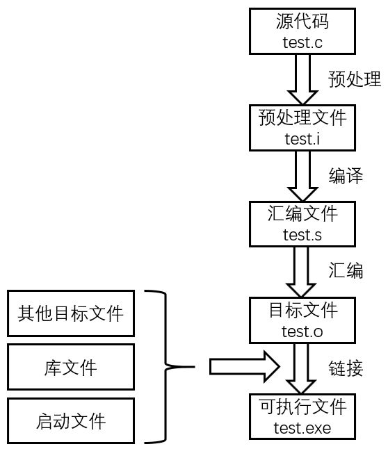
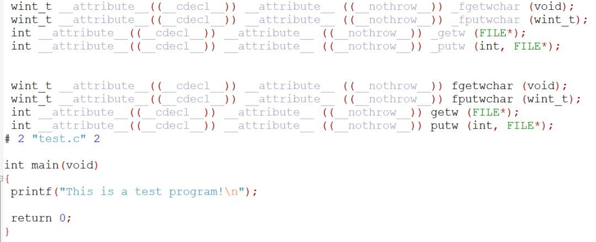
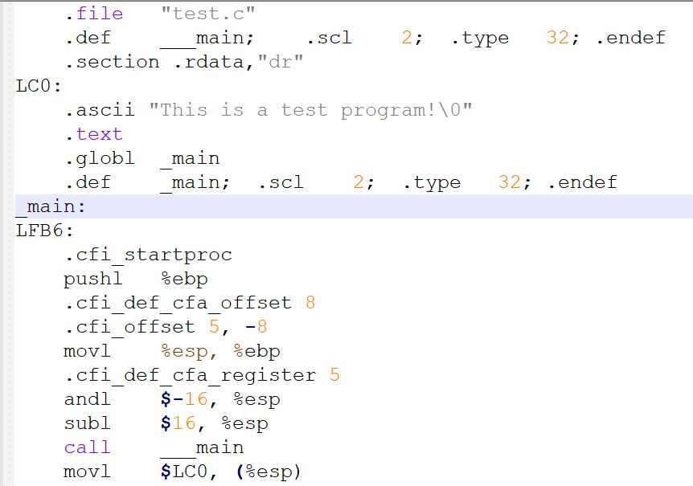
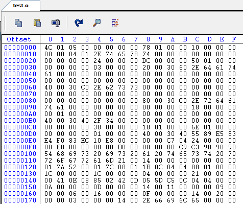
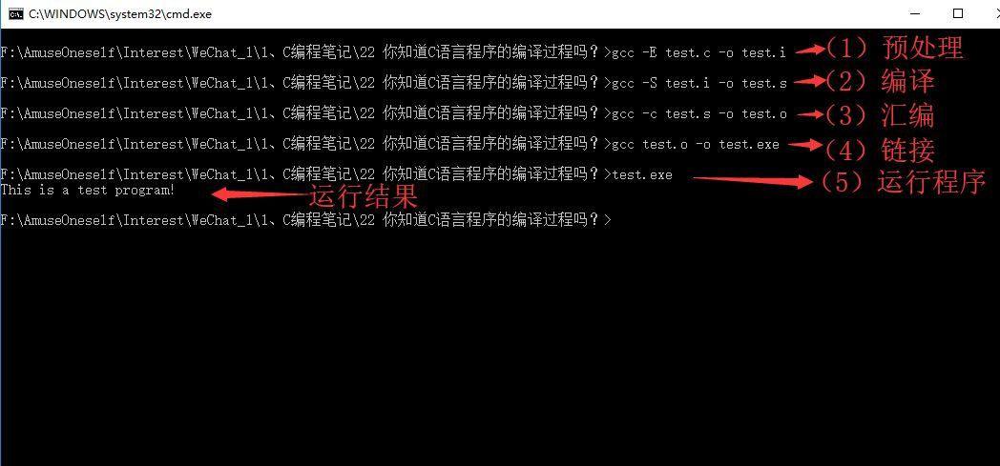

## 1、前言
如果使用的是集成开发环境，那么点击编译按钮就可生成可执行文件，然后点击运行即可运行。那么，你知道从源代码到可执行文件经历了哪些过程吗。仅仅是编译？

下面以windows环境下的test.c为例，test.c里的代码为：

```c
#include <stdio.h>
int main(void)
{
    printf("This is a test program!\n");
    return 0;
}
```
其经历如下过程：<br /><br />如图，编译生成可执行文件的过程实际包含四个过程：（1）预处理；（2）编译；（3）汇编；（4)链接。

## 2、预处理（Preprpcessing）
使用预处理器把源文件test.c经过预处理生成test.i文件，预处理用于将所有的#include头文件以及宏定义替换成其真正的内容。

预处理的命令为：

```bash
gcc -E test.c -o test.i
```
上述命令中-E是让编译器在预处理之后就退出，不进行后续编译过程；`-o`是指定输出文件名。<br />预处理之后得到的仍然是文本文件。test.i文件部分内容截图如下：<br />
<a name="yyRKT"></a>
##  3、编译（Compilation）
使用编译器将预处理文件test.i编译成汇编文件test.s。<br />编译的命令为：
```bash
gcc -S test.i -o test.s
```
上述命令中`-S`让编译器在编译之后停止，不进行后续过程；`-o`是指定输出文件名。汇编文件test.s是文本文件，部分内容截图如下：<br />
<a name="udC6g"></a>
## 4、汇编（Assemble）
使用汇编器将汇编文件test.s转换成目标文件test.o。<br />汇编过程的命令为：
```bash
gcc -c test.s -o test.o
```
上述命令中`-c`、`-o`让汇编器把汇编文件test.s转换成目标文件test.o。目标文件test.o是二进制文件，部分内容截图如下：<br />
<a name="nckUs"></a>
## 5、链接（Linking）
链接过程使用链接器将该目标文件与其他目标文件、库文件、启动文件等链接起来生成可执行文件。<br />链接过程的命令为：
```bash
gcc test.o -o test.exe
```
综上，生成可执行程序过程为：预处理、编译、汇编、链接。各个命令如下图所示：


