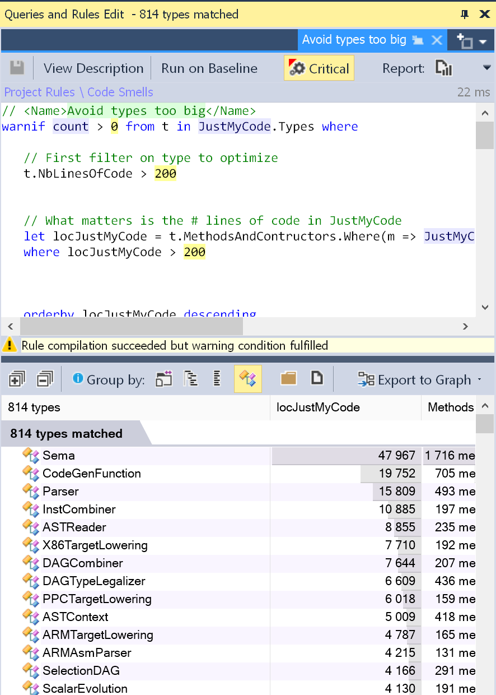
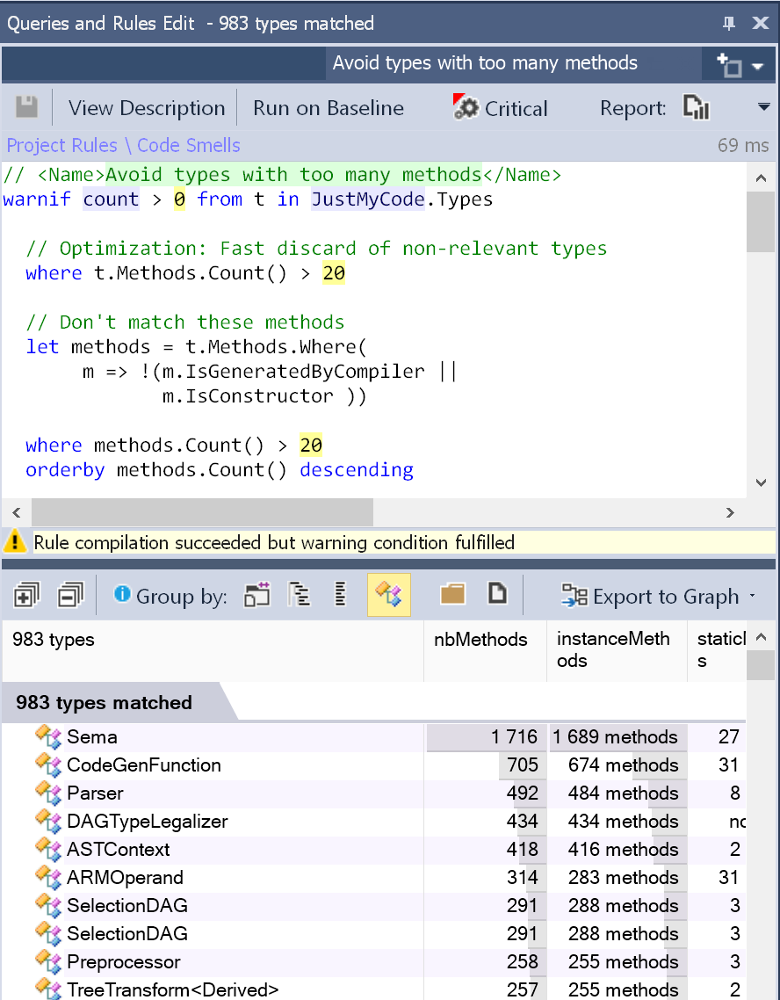
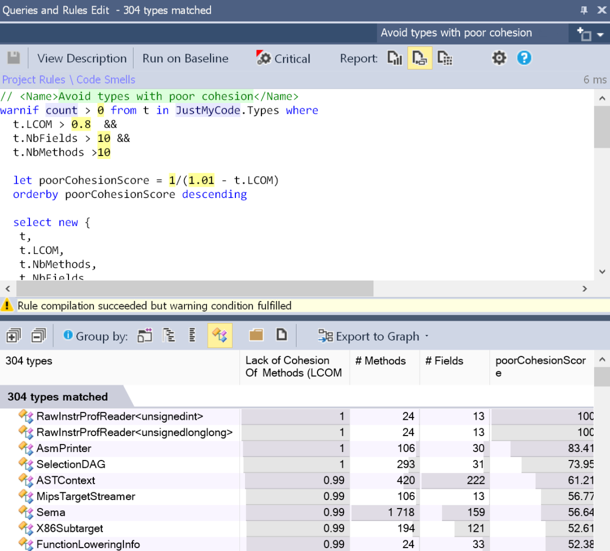

# C++ 

> _C++代码提供了足够的灵活性，因此对于大部分工程师来说都很难把握。本文介绍了写好C++代码需要遵循的10个最佳实践，并在最后提供了一个工具可以分析C++代码的健壮度。原文：_[_10 Best practices to design and implement a C++ class_](https://issamvb.medium.com/10-best-practices-to-design-and-implement-a-c-class-4326611827e1#:~:text=10%20Best%20practices%20to%20design%20and%20implement%20a,class%20as%20you%20can.%20...%20More%20items...%20)

### 1、尽可能尝试使用新的C++标准
到2022年，C++已经走过了40多个年头。新的C++标准实际上简化了许多令人沮丧的细节，提供了新的现代方法来改进C++代码，但让开发人员认识到这一点并不容易。 以内存管理为例，这可能是C++中受到最多批评的机制。多年来，对象分配都是由new关键字完成的，开发人员一定得记住在代码的某个地方调用delete。“现代C++”解决了这个问题，并促进了共享指针的使用。

###  2、使用命名空间模块化代码
现代C++库广泛使用命名空间来模块化代码库，它们利用“Namespace-by-feature”方法，按功能划分命名空间来反映功能集，将单个特性(且仅与该特性)相关的所有内容放到单个命名空间中。从而使得命名空间具有高内聚性和高模块化，并且耦合最小，紧耦合的项目被放在了一起。 Boost是按特性分组的最佳示例，其包含数千个命名空间，每个命名空间用于对特定的特性进行分组。

### 3、抽象
数据抽象是C++中面向对象编程最基本和最重要的特性之一。抽象意味着只显示基本信息而隐藏细节，数据抽象指的是仅向外部世界提供关于数据的基本信息，隐藏背景细节或实现。 尽管许多书籍、网络资源、会议演讲者和专家都推荐这种最佳实践，但在很多项目中，这条规则仍然被忽略了，许多类的细节并没有被隐藏。

### 4、类越小越好
具有多行代码的类型应该被划分为一组较小的类型。 需要很大的耐心重构一个大的类，甚至可能需要从头重新创建所有东西。以下是一些重构建议：

- BigClass中的逻辑必须被分成更小的类。这些较小的类最终可能成为嵌套在原始God Class中的私有类，God Class的实例对象由较小嵌套类的实例组成。
- 较小的类划分应该由God Class负责的多个职责驱动。要确定这些职责，通常需要查找与字段的子集强耦合的方法的子集。
- 如果BigClass包含的逻辑比状态多，一个好的选择是定义一个或几个不包含静态字段而只包含纯静态方法的静态类。纯静态方法是一种只根据输入参数计算结果的函数，它不读取或分配任何静态或实例字段。纯静态方法的主要优点是易于测试。
- 首先尝试维护BigClass的接口，并委托调用新提取的类。最后，BigClass应该是一个没有自己逻辑的纯接口，可以为了方便将其保留，也可以将其扔掉，并开始只使用新类。
- 单元测试可以提供帮助：在提取方法之前为每个方法编写测试，以确保不会破坏功能。

### 5、每个类尽量提供最少的方法
包含20个以上方法的类可能很难理解和维护。 一个类有许多方法可能是实现了太多责任的症状。 也许所面对的类控制了系统中太多的其他类，并且已经超出了应有的逻辑，成为了一个无所不能的类。

### 6、加强低耦合
低耦合是理想状态，可以在应用中进行较少的更改实现程序的某个变更。从长远来看，可以减少修改、添加新特性的大量时间、精力和成本。 低耦合可以通过使用抽象类或泛型类和方法来实现。

### 7、加强高内聚
单一责任原则规定一个类不应该有多于一个更改的理由，这样的类被称为内聚类。较高的LCOM值通常可以意味着类的内聚性较差。有几个LCOM指标，取值范围为[0-1]。LCOM HS (HS代表Henderson-Sellers)取值范围为[0-2]。LCOM HS值大于1时需要产生警惕。下面是计算LCOM指标： LCOM = 1 — (sum(MF)/M*F) LCOM HS = (M — sum(MF)/F)(M-1) 其中……

- M是类中方法的数量(包括静态方法和实例方法，它还包括构造函数、属性getter/setter、事件添加/删除方法)。
- F是类中实例字段的数量。
- MF是类访问特定实例字段的方法数量。
- Sum(MF)是该类所有实例字段的MF之和。

这些公式背后的基本思想可以表述如下：如果一个类的所有方法都使用它的所有实例字段，那么这个类就是完全内聚的，这意味着sum(MF)=M*F，然后LCOM = 0和LCOMHS = 0。 LCOMHS值大于1就需要警惕了。

### 8、只注释代码不能表达的内容
鹦鹉学舌的代码注释没有为读者提供任何额外的东西。代码库中充斥着嘈杂的注释和不正确的注释，促使程序员忽略所有的注释，或者采取积极的措施隐藏它们。

### 9、尽量不要用重复的代码
众所周知，重复代码的存在对软件开发和维护有负面影响。实际上，一个主要缺点是，当为了修复bug或添加新特性而更改重复代码的实例时，所有对应的代码必须同时更改。 产生重复代码最常见的原因是复制/粘贴操作，这种情况下，相似的源代码出现在两个或多个地方。许多文章、书籍和网站都警告不要采用这种做法，但有时实践这些建议并不容易，开发人员还是会选择简单的解决方案: 复制/粘贴大法。 使用适当的工具可以容易的从复制/粘贴操作中检测到重复代码，但是，在某些情况下，克隆代码很难被检测到。

### 10、不变性有助于多线程编程
基本上，如果对象在创建之后状态不变，那么这个对象就是不可变(immutable)的。如果一个类的实例是不可变的，那么该类就是不可变的。 不可变对象极大简化了并发编程，这是支持使用它的重要理由。想想看，为什么编写适当的多线程程序是一项艰巨的任务？因为同步线程访问资源(对象或其他操作系统资源)是很困难的。为什么同步这些访问很困难？因为很难保证多个线程对多个对象进行的多次写访问和读访问之间不会出现竞争条件。如果不再有写访问会怎么样？换句话说，如果被线程访问的对象的状态没有改变会怎么样？就不再需要同步了！ 关于不可变类的另一个好处是它们永远不会违反里氏替换原则(LSP, Liskov Subtitution Principle)，以下是维基百科对LSP的定义： Liskov的行为子类型的概念定义了可变对象可替换性的概念，也就是说，如果S是T的子类型，那么程序中T类型的对象可以被替换为S类型的对象，而不改变该程序的任何期望属性(例如，正确性)。 如果没有公共字段，没有可以更改其内部数据的方法，并且派生类方法无法更改其内部数据，那么引用对象类就是不可变的。因为值不可变，所以在所有情况下都可以引用相同的对象，不需要复制构造函数或赋值操作符。出于这个原因，建议将复制构造函数和赋值操作符设为私有，或者从`boost::noncopyable`继承，或者使用新的C++ 11特性“[显式默认和删除特殊成员函数](http://en.wikipedia.org/wiki/C%2B%2B11#Explicitly_defaulted_and_deleted_special_member_functions)”[2]。

#### 如何加强对这些最佳实践进行检查?
CppDepend[3]提供了名为CQLinq[4]的代码查询语言，可以像数据库一样查询代码库。开发人员、设计人员和架构师可以自定义查询，以便轻松找到容易出现bug的情况。 通过CQLinq，可以结合来自代码度量、依赖关系、API使用和其他模型的数据来定义非常高级的查询，以匹配容易出现bug的情况。 例如，分析clang源代码后，可以检测到大类：  检测到有大量方法的类：  或者检测到内聚性较差的类： 

### References：
10 Best practices to design and implement a C++ class: [https://issamvb.medium.com/10-best-practices-to-design-and-implement-a-c-class-4326611827e1#:~:text=10%20Best%20practices%20to%20design%20and%20implement%20a,class%20as%20you%20can.%20...%20More%20items...%20](https://issamvb.medium.com/10-best-practices-to-design-and-implement-a-c-class-4326611827e1#:~:text=10%20Best%20practices%20to%20design%20and%20implement%20a,class%20as%20you%20can.%20...%20More%20items...%20) Explicitly defaulted and deleted special member functions: [http://en.wikipedia.org/wiki/C%2B%2B11#Explicitly_defaulted_and_deleted_special_member_functions](http://en.wikipedia.org/wiki/C%2B%2B11#Explicitly_defaulted_and_deleted_special_member_functions) CppDepend: [http://www.cppdepend.com/](http://www.cppdepend.com/) CQLinq: [https://www.cppdepend.com/cqlinq](https://www.cppdepend.com/cqlinq)
