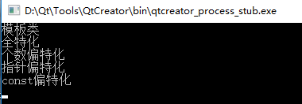
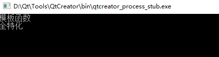

# C++模板

## 前言
模板（Template）指 C++ 程序设计设计语言中采用类型作为参数的程序设计，支持通用程序设计。C++ 的标准库提供许多有用的函数大多结合了模板的观念，如 STL 以及 IO Stream。模板是 C++ 支持参数化多态的工具，使用模板可以使用户为类或者函数声明一种一般模式，使得类中的某些数据成员或者成员函数的参数、返回值取得任意类型。

模板是一种对类型进行参数化的工具；通常有两种形式：函数模板和类模板：

- 函数模板 针对仅参数类型不同的函数；
- 类模板 针对仅数据成员和成员函数类型不同的类.

使用模板的目的就是能够让程序员编写与类型无关的代码.

## 一、函数模板
```cpp
template <class 形参名，class 形参名，......> 
返回类型 函数名(参数列表)
{
      函数体
}
```
其中 template 和 class 是关键字，class 可以用 typename  关键字代替，在这里 typename  和 class 没区别，<> 括号中的参数叫模板形参，模板形参和函数形参很相像，模板形参不能为空。一但声明了模板函数就可以用模板函数的形参名声明类中的成员变量和成员函数，即可以在该函数中使用内置类型的地方都可以使用模板形参名。模板形参需要调用该模板函数时提供的模板实参来初始化模板形参，一旦编译器确定了实际的模板实参类型就称他实例化了函数模板的一个实例。比如 swap 的模板函数形式为：
```cpp
template <class T> void swap(T& a, T& b){}，
```
当调用这样的模板函数时类型T就会被被调用时的类型所代替，比如  `swap(a,b)`  其中 a 和 b 是 int  型，这时模板函数 swap  中的形参  T  就会被 int  所代替，模板函数就变为 `swap(int &a, int &b)`。而当 `swap(c,d)` 其中 c 和 d 是 double 类型时，模板函数会被替换为 `swap(double &a, double &b)`，这样就实现了函数的实现与类型无关的代码。<br />注意：对于函数模板而言不存在 `h(int,int)` 这样的调用，不能在函数调用的参数中指定模板形参的类型，对函数模板的调用应使用实参推演来进行，即只能进行 `h(2,3)`  这样的调用，或者 `int a, b; h(a,b)`。
<a name="gSFWb"></a>
## 二、类模板
类模板的格式为：
```cpp
template<class  形参名，class 形参名，…>
class 类名{ ... };
```
类模板和函数模板都是以 template 开始后接模板形参列表组成，模板形参不能为空，一但声明了类模板就可以用类模板的形参名声明类中的成员变量和成员函数，即可以在类中使用内置类型的地方都可以使用模板形参名来声明。比如：
```cpp
template<class T> class A
{
	public: 
	T a;
	T b; 
	T hy(T c, T &d);
};
```
在类 A 中声明了两个类型为T的成员变量 a 和 b，还声明了一个返回类型为 T 带两个参数类型为 T 的函数 hy。<br />类模板对象的创建：比如一个模板类 A，则使用类模板创建对象的方法为 A m ;在类  A 后面跟上一个 <> 尖括号并在里面填上相应的类型，这样的话类 A 中凡是用到模板形参的地方都会被 int 所代替。当类模板有两个模板形参时创建对象的方法为 `A<int, double> m;` 类型之间用逗号隔开。<br />对于类模板，模板形参的类型必须在类名后的尖括号中明确指定。比如 A<2> m;用这种方法把模板形参设置为 int 是错误的（编译错误：error C2079: ‘a’ uses undefined class ‘A’），类模板形参不存在实参推演的问题。也就是说不能把整型值 2 推演为 int 型传递给模板形参。要把类模板形参调置为 int  型必须这样指定 A m。<br />在类模板外部定义成员函数的方法为：
```cpp
template<模板形参列表> 函数返回类型 类名<模板形参名>::函数名(参数列表){函数体}
```
比如有两个模板形参 T1，T2 的类 A 中含有一个 void h() 函数，则定义该函数的语法为：
```cpp
template<class T1,class T2> void A<T1,T2>::h(){}
```
注意：当在类外面定义类的成员时 template 后面的模板形参应与要定义的类的模板形参一致。模板的声明或定义只能在全局，命名空间或类范围内进行。即不能在局部范围，函数内进行，比如不能在 main 函数中声明或定义一个模板。
<a name="DHvc6"></a>
## 三、模板的非类型形参
1、非类型模板形参：模板的非类型形参也就是内置类型形参，如 `template<class T, int a> class B{} ;` 其中int a就是非类型的模板形参。<br />2、 非类型形参在模板定义的内部是常量值，也就是说非类型形参在模板的内部是常量。<br />3、非类型模板的形参只能是整型，指针和引用，像 double，String, String ** 这样的类型是不允许的。但是 double &，double *，对象的引用或指针是正确的。<br />4、调用非类型模板形参的实参必须是一个常量表达式，即他必须能在编译时计算出结果。<br />5、注意：任何局部对象，局部变量，局部对象的地址，局部变量的地址都不是一个常量表达式，都不能用作非类型模板形参的实参。全局指针类型，全局变量，全局对象也不是一个常量表达式，不能用作非类型模板形参的实参。<br />6、全局变量的地址或引用，全局对象的地址或引用 const 类型变量是常量表达式，可以用作非类型模板形参的实参。<br />7、sizeof 表达式的结果是一个常量表达式，也能用作非类型模板形参的实参。<br />8、当模板的形参是整型时调用该模板时的实参必须是整型的，且在编译期间是常量，比如 `template <class T, int a> class A{};` 如果有 int b，这时 `A<int, b> m;`将出错，因为 b 不是常量，如果 `const int b`，这时 `A<int, b> m;` 就是正确的，因为这时 b 是常量。<br />9、非类型形参一般不应用于函数模板中，比如有函数模板 `template<class T, int a> void h(T b){}` ，若使用 h(2) 调用会出现无法为非类型形参 a 推演出参数的错误，对这种模板函数可以用显示模板实参来解决，如用 h<int, 3>(2) 这样就把非类型形参 a 设置为整数 3。显示模板实参在后面介绍。<br />10、非类型模板形参的形参和实参间所允许的转换：

- 允许从数组到指针，从函数到指针的转换。如：`template <int *a> class A{}; int b[1]; A m;`即数组到指针的转换
- const 修饰符的转换。如：`template<const int *a> class A{}; int b; A<&b> m;` 即从 `int *` 到 `const int *` 的转换。
- 提升转换。如：`template class A{}; const short b=2;` A m; 即从 short 到 int 的提升转换
- 整值转换。如：`template class A{}; A<3> m;` 即从 int  到 unsigned int 的转换。
- 常规转换。
<a name="zaset"></a>
## 四、类模板的默认模板类型形参
1、可以为类模板的类型形参提供默认值，但不能为函数模板的类型形参提供默认值。函数模板和类模板都可以为模板的非类型形参提供默认值。<br />2、类模板的类型形参默认值形式为：`template<class T1, class T2=int> class A{};`为第二个模板类型形参T2提供int型的默认值。<br />3、 类模板类型形参默认值和函数的默认参数一样，如果有多个类型形参则从第一个形参设定了默认值之后的所有模板形参都要设定默认值，比如 `templateclass A{};`就是错误的，因为 T1 给出了默认值，而T2没有设定。<br />4、 在类模板的外部定义类中的成员时 template 后的形参表应省略默认的形参类型。比如 `template<class T1, class T2=int> class A{public: void h();}` ; 定义方法为`template<class T1,class T2> void A<T1,T2>::h(){}`。


## 五、模板的实例化
总结一下，C++ 只有模板显式实例化 (explicit instantiation)，隐式实例化 (implicit instantiation) ，特化 (specialization，也译作具体化，偏特化)。首先考虑如下模板函数代码：
```cpp
[cpp] view plaincopyprint?
template <typename T>  
void swap(T &a, T &b){  
...  
}
```
<a name="nHl3G"></a>
### 1、隐式实例化：
模板函数不是真正的函数定义，他只是如其名提供一个模板，模板只有在运行时才会生成相应的实例，隐式实例化就是这种情况:
```cpp
[cpp] view plaincopyprint?
int main(){  
    ....  
    swap<int>(a,b);  
    ....  
}  
```
它会在运行到这里的时候才生成相应的实例，很显然的影响效率 这里顺便提一下 `swap(a,b) ;`中的是可选的，因为编译器可以根据函数参数类型自动进行判断，也就是说如果编译器不不能自动判断的时候这个就是必要的。
<a name="JLCWh"></a>
### 2、显式实例化：
前面已经提到隐式实例化可能影响效率，所以需要提高效率的显式实例化，显式实例化在编译期间就会生成实例方法如下:
```cpp
[cpp] view plaincopyprint?
template void swap<int>(int &a,int &b);  
```
这样就不会影响运行时的效率，但编译时间随之增加。
<a name="uSTAf"></a>
### 3、特化：
这个 swap 可以处理一些基本类型如 long int double ，但是如果想处理用户自定义的类型就不行了，特化就是为了解决这个问题而出现的：
```cpp
[cpp] view plaincopyprint?
template <> void swap<job>(job a,job b){...}  
```
其中 job 是用户定义的类型.
<a name="qnUQQ"></a>
## 六、模板的特化（具体化）和偏特化
<a name="eLsbE"></a>
### 类模板：
测试代码如下：
```cpp
#include <iostream>
using namespace std;
template<typename T1,typename T2>
class Test{
public:
    Test(T1 i,T2 j):a(i),b(j){cout<<"模板类"<<endl;}
private:
    T1 a;
    T2 b;
};
template<>   //全特化，由于是全特化，参数都指定了，参数列表故为空。
class Test<int ,char>{
public:
    Test(int i,char j):a(i),b(j){cout<<"全特化"<<endl;}
private:
    int a;
    int b;
};
template<typename T2> //由于只指定了一部分参数，剩下的未指定的需在参数列表中，否则报错。
class Test<char,T2>{
public:
    Test(char i,T2 j):a(j),b(j){cout<<"个数偏特化"<<endl;}
private:
    char a;
    T2 b;
};
template<typename T1,typename T2> //这是范围上的偏特化
class Test<T1*,T2*>{
public:
    Test(T1* i,T2* j):a(i),b(j){cout<<"指针偏特化"<<endl;}
private:
    T1* a;
    T2* b;
};
template<typename T1,typename T2>//同理这也是范围上的偏特化
class Test<T1 const,T2 const>{
public:
    Test(T1 i,T2 j):a(i),b(j){cout<<"const偏特化"<<endl;}
private:
    T1 a;
    T2 b;
};
int main()
{
    int a;
    Test<double,double> t1(0.1,0.2);
    Test<int,char> t2(1,'A');
    Test<char,bool> t3('A',true);
    Test<int*,int*> t4(&a,&a);
    Test<const int,const int> t5(1,2);
    return 0;
}
```
结果：<br />
<a name="NQQrg"></a>
### 函数模板：
```cpp
#include <iostream>
using namespace std;
//模板函数
template<typename T1,typename T2>
void fun(T1 a,T2 b){
    cout<<"模板函数"<<endl;
}
//全特化
template<>
void fun(int a,char b){
    cout<<"全特化"<<endl;
}
//函数不存在偏特化，以下代码是错误的
/*
template<typename T2>
void fun(char a,T2 b){
    cout<<"偏特化"<<ednl;
}
*/
int main()
{
    int a=0;
    char b='A';
    fun(a,a);
    fun(a,b);
    return 0;
}
```
结果：<br />
<a name="SdjL9"></a>
## 七、模板类的继承
模板类的继承包括四种：

- 1、普通类继承模板类）
- 2、（模板类继承了普通类（非常常见））
- 3、类模板继承类模板
- 4、模板类继承类模板，即继承模板参数给出的基类

其中，普通类继承模板类比较简单，如：
```cpp
template<class T>
class TBase{
    T data;
	……
};
class Derived:public TBase<int>{
	……
};
```
模板类继承普通类：
```cpp
class TBase{
	……
};
template<class T>
class TDerived:public TBase{
	T data;
	……
};
```
类模板继承类模板：
```cpp
template<class T>
class TBase{
	T data1;
	……
};
template<class T1,class T2>
class TDerived:public TBase<T1>{
	T2 data2;
	……
};
```
模板类继承模板参数给出的基类 ——继承哪个基类由模板参数决定：
```cpp
#include<iostream>
using namespace std;


class BaseA{
	public:
	BaseA(){cout<<"BaseA founed"<<endl;}
};

class BaseB{
	public:
	BaseB(){cout<<"BaseB founed"<<endl;}
};

template<typename T, int rows>
class BaseC{
private:
T data;
public:
BaseC():data(rows){
cout<<"BaseC founed "<< data << endl;}
};

template<class T>
	class Derived:public T{
		public:
		Derived():T(){cout<<"Derived founed"<<endl;}
	};


void main()
{
	Derived<Base A> x;// BaseA作为基类
	Derived<Base B> y;// BaseB作为基类
	Derived<Base C<int, 3> > z; // BaseC<int,3>作为基类
	
}
```
<a name="o4Pex"></a>
## 八、模板实例化问题
在使用类模板时，只有当代码中使用了类模板的一个实例的名字，而且上下文环境要求必须存在类的定义时，这个类模板才被实例化：<br />1、声明一个类模板的指针和引用，不会引起类模板的实例化，因为没有必要知道该类的定义<br />2、定义一个类类型的对象时需要该类的定义，因此类模板会被实例化<br />3、在使用 `sizeof()` 时，它是计算对象的大小，编译器必须根据类型将其实例化出来，所以类模板被实例化.<br />4、 `new` 表达式要求类模板被实例化。<br />5、引用类模板的成员会导致类模板被编译器实例化<br />6、需要注意的是，类模板的成员函数本身也是一个模板。标准 C++ 要求这样的成员函数只有在被调用或者取地址的时候，才被实例化。用来实例化成员函数的类型，就是其成员函数要调用的那个类对象的类型。
