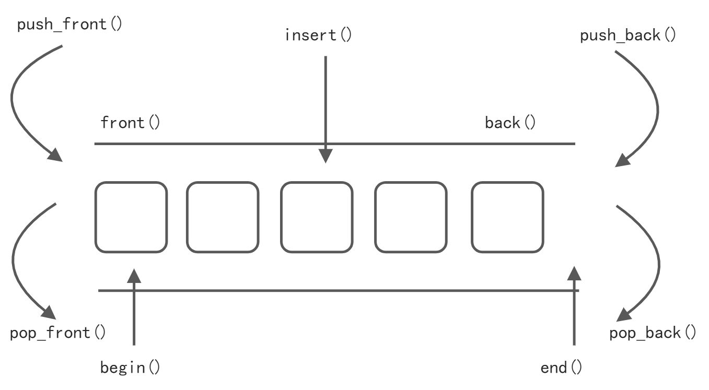

# C++ STL

<a name="cqafl"></a>

## 1、string 容器
<a name="fOl1m"></a>
### 1.1 string基本概念
<a name="YTEO6"></a>
#### 本质：

- string是C++风格的字符串，而string本质上是一个类。`string`和`char *` 区别：
- `char *` 是一个指针 ，string是一个类，类内部封装了`char *`，管理这个字符串，是一个char 型的容器。 -string管理char所分配的内存，不用担心复制越界和取值越界等，由类内部进行负责。
<a name="RnByf"></a>
### 1.2 string构造函数
<a name="b99Wh"></a>
#### 构造函数原型：
| 函数原型 | 功能 |
| --- | --- |
| `string();` | 创建一个空的字符串。 |
| `string(const char* s);` | 使用字符串s初始化。 |
| `string(const string& str);` | 使用一个string对象初始化另一个string对象。 |
| `string(int n, char c);` | 使用n个字符c初始化。 |

<a name="PbuU8"></a>
#### 示例：
```cpp
#include <iostream>;
#include<string>;

using namespace std;

void test01() {
    <!-- -->
            string
    s1;  //创建空字符串，调用无参构造函数
    const char *str = "Hello World";
    string s2(str);//把c_string转换成了string

    cout << s2 << endl;

    string s3(s2); //调用拷贝构造函数
    cout << s3 << endl;

    string s4(10, 'a');//使用10个字符‘a’初始化
    cout << s4 << endl;
}


int main() {
    <!-- -->
    test01();
    system("pause");
    return 0;
}
```
<a name="LGz3o"></a>
### 1.3 string赋值操作
<a name="qyEjp"></a>
#### 给string字符串进行赋值的函数原型：
| 函数原型 | 功能 |
| --- | --- |
| `string& operator=(const char* s);` | char*类型字符串赋值给当前的字符串。 |
| `string& operator=(const string &s);` | 把字符串s赋给当前的字符串。 |
| `string& operator=(char c);` | 字符赋值给当前的字符串。 |
| `string& assign(const char *s);` | 把字符串s赋给当前的字符串。 |
| `string& assign(const char *s, int n);` | 把字符串s的前n个字符赋给当前的字符串。 |
| `string& assign(const string &s);` | 把字符串s赋给当前字符串。 |
| `string& assign(int n, char c);` | 用n个字符c赋给当前字符串。 |

<a name="gatvq"></a>
#### 示例：
```cpp
#include <iostream>;
#include<string>;

using namespace std;

void test01() {
    <!-- -->
            string
    str1;
    str1 = "Hello world";

    string str2;
    str2 = str1;// 把字符串s赋给当前的字符串

    string str3;
    str3 = 'a';//字符赋值给当前的字符串

    string str4;
    str4.assign("Hello C++");// 把字符串s赋给当前的字符串

    string str5;
    str5.assign("Hello C++", 4);//把字符串s的前n个字符赋给当前的字符串

    string str6;
    str6.assign(str5);//把字符串s赋给当前字符串

    string str7;
    str7.assign(10, 'w');//用n个字符c赋给当前字符串

    cout << str1 << endl;
    cout << str2 << endl;
    cout << str3 << endl;
    cout << str4 << endl;
    cout << str5 << endl;
    cout << str6 << endl;
    cout << str7 << endl;
}


int main() {
    <!-- -->
    test01();
    system("pause");
    return 0;
}
```
<a name="DwlSt"></a>
### 1.4 string字符串拼接
<a name="rjhKX"></a>
#### 实现字符串末尾拼接字符串的函数原型：
| 函数原型 | 功能 |
| --- | --- |
| `string& operator+=(const char* str);` | 重载+=操作符。 |
| `string& operator+=(const char c);` | 重载+=操作符。 |
| `string& operator+=(const string& str);` | 重载+=操作符。 |
| `string& append(const char *s);` | 把字符串s连接到当前字符串结尾。 |
| `string& append(const char *s, int n);` | 把字符串s的前n个字符连接到当前字符串结尾。 |
| `string& append(const string &s);` | 把字符串s连接到当前字符串结尾。 |
| `string& append(const string &s, int pos, int n);` | 字符串s中从pos开始的n个字符连接到字符串结尾。 |

<a name="WEjqV"></a>
#### 示例：
```cpp
#include <iostream>;
#include <string>;

using namespace std;

void test01() {
    <!-- -->
            string
    str1 = "我";
    str1 += "爱学习";//重载+=操作符
    cout << str1 << endl;
    str1 += ':';//重载+=操作符
    cout << str1 << endl;

    string str2 = " Effective C++";
    str1 += str2;// 重载+=操作符
    cout << str1 << endl;

    string str3 = "I";
    str3.append(" love ");// 把字符串s连接到当前字符串结尾
    cout << str3 << endl;

    str3.append("study abcde", 5);// 把字符串s的前n个字符连接到当前字符串结尾
    cout << str3 << endl;

    str3.append(str2);//把字符串s连接到当前字符串结尾
    cout << str3 << endl;

    str3.append(str2, 0, 10);// 字符串s中从pos开始的n个字符连接到字符串结尾 
    cout << str3 << endl;
}

int main() {
    <!-- -->
    test01();
    system("pause");
    return 0;
}
```
<a name="jPWW0"></a>
### 1.5 string查找和替换
<a name="BckiH"></a>
#### 查找指定字符串的函数原型：
| 函数模型 | 功能 |
| --- | --- |
| `int find(const string& str, int pos = 0) const;` | 查找str第一次出现位置,从pos开始查找。 |
| `int find(const char* s, int pos = 0) const;` | 查找s第一次出现位置,从pos开始查找。 |
| `int find(const char* s, int pos, int n) const;` | 从pos位置查找s的前n个字符第一次位置。 |
| `int find(const char c, int pos = 0) const;` | 查找字符c第一次出现位置。 |
| `int rfind(const string& str, int pos = npos) const;` | 查找str最后一次位置,从pos开始查找。 |
| `int rfind(const char* s, int pos = npos) const;` | 查找s最后一次出现位置,从pos开始查找。 |
| `int rfind(const char* s, int pos, int n) const;` | 从pos查找s的前n个字符最后一次位置。 |
| `int rfind(const char c, int pos = 0) const;` | 查找字符c最后一次出现位置。 |

<a name="QmOaW"></a>
#### 示例：
```cpp
#include <iostream>;
#include<string>;

using namespace std;

//查找
void test01() {
    <!-- -->
            string
    str1 = "abcdefgde";

    int pos = str1.find("de");// 查找s第一次出现位置,从pos开始查找
    cout << pos << endl;

    pos = str1.rfind("de");//查找s最后一次出现位置,从pos开始查找 
    cout << pos << endl;

}


int main() {
    <!-- -->
    test01();
    system("pause");
    return 0;
}
```
<a name="dPpis"></a>
#### 在指定的位置替换字符串的函数模型：
| 函数原型 | 功能 |
| --- | --- |
| `string& replace(int pos, int n, const string& str);` | 替换从pos开始n个字符为字符串str。 |
| `string& replace(int pos, int n,const char* s);` | 替换从pos开始的n个字符为字符串s。 |

<a name="Oln6G"></a>
#### 示例：
```cpp
#include <iostream>;
#include<string>;

using namespace std;

//替换
void test02() {
    <!-- -->
            string
    str1 = "abcdefg";

    str1.replace(1, 3, "1111");//替换从pos开始的n个字符为字符串s 
    cout << str1 << endl;
}

int main() {
    <!-- -->
    test02();
    system("pause");
    return 0;
}
```
<a name="Wryrf"></a>
### 1.6 string字符串比较
<a name="iI7Af"></a>
#### 比较字符串大小的函数模型：
| 函数模型 | 功能 |
| --- | --- |
| `int compare(const string &s) const;` | 与字符串s比较。 |
| `int compare(const char *s) const;` | 与字符串s比较。 |

<a name="ASofk"></a>
#### 示例：
```cpp
#include <iostream>;
#include<string>;

using namespace std;

void test01() {
    <!-- -->
            string
    str1 = "hello";
    string str2 = "hello";

    //与字符串s比较 
    if (str1.compare(str2) == 0) cout << "=" << endl;
    else if (str1.compare(str2) >; 0) cout << ">;" << endl;
    else cout << "<" << endl;

}

int main() {
    <!-- -->
    test01();
    system("pause");
    return 0;
}
```
<a name="SLuPV"></a>
### 1.7 string字符存取
<a name="mHYD1"></a>
#### string中单个字符存取的函数模型：
| 函数模型 | 功能 |
| --- | --- |
| char& operator[ ] (int n); | 通过[]方式取字符。 |
| char& at(int n); | 通过at方法获取字符。 |

需要注意的是，这两种访问方法是有区别的：

- 下标操作符 [] 在使用时不检查索引的有效性，如果下标超出字符的长度范围，会示导致未定义行为。对于常量字符串，使用下标操作符时，字符串的最后字符（即 ‘\0’）是有效的。对应 string 类型对象（常量型）最后一个字符的下标是有效的，调用返回字符 ‘\0’。- 函数 at() 在使用时会检查下标是否有效。如果给定的下标超出字符的长度范围，系统会抛出 out_of_range 异常。
<a name="KVzJX"></a>
#### 示例：
```cpp
#include <iostream>;
#include<string>;

using namespace std;

void test01() {
    <!-- -->
            string
    str = "hello";

    for (int i = 0; i < str.size(); i++) {
        <!-- -->
                cout << str[i] << " ";// 通过[]方式取字符 
    }
    cout << endl;

    for (int i = 0; i < str.size(); i++) {
        <!-- -->
                cout << str.at(i) << " ";// 通过at方法获取字符 
    }
    cout << endl;

    str[0] = 'x';// 通过[]方式取字符 
    cout << str << endl;

    char c = str.at(2); //通过at方法获取字符
    cout << c << endl;

}

int main() {
    <!-- -->
    test01();
    system("pause");
    return 0;
}
```
<a name="apfq9"></a>
### 1.8 string插入和删除
<a name="gp4Xl"></a>
#### 对string字符串进行插入和删除字符操作的函数原型：
| 函数模型 | 功能 |
| --- | --- |
| string& insert(int pos, const char* s); | 插入字符串。 |
| string& insert(int pos, const string& str); | 插入字符串。 |
| string& insert(int pos, int n, char c); | 在指定位置插入n个字符c。 |
| string& erase(int pos, int n = npos); | 删除从Pos开始的n个字符。 |

注：插入和删除的起始下标都是从0开始。
<a name="Kfn5D"></a>
#### 示例：
```cpp
#include <iostream>;
#include<string>;

using namespace std;

void test01() {
    <!-- -->
            string
    str = "hello";
    str.insert(1, "111");//插入字符串
    cout << str << endl;

    str.erase(1, 3);// 删除从Pos开始的n个字符
    cout << str << endl;

    str.insert(1, 5, '1');// 插入从Pos开始的n个字符
    cout << str << endl;
}

int main() {
    <!-- -->
    test01();
    system("pause");
    return 0;
}
```
<a name="xuSdX"></a>
### 1.9 string子串
<a name="zDT8M"></a>
#### 从字符串中获取子串的函数模型：
| 函数模型 | 功能 |
| --- | --- |
| `string substr(int pos = 0, int n = npos) const;` | 返回由pos开始的n个字符组成的字符串。 |

<a name="sie33"></a>
#### 示例：
```cpp
#include <iostream>;
#include<string>;

using namespace std;

void test01() {
    <!-- -->
            string
    str = "hello";
    string subStr = str.substr(1, 3);//返回由pos开始的n个字符组成的字符串 
    cout << subStr << endl;
}

//实用操作
void test02() {
    <!-- -->
            string
    email = "hello@sina.com";

    //从邮件中 获取 用户名信息
    int pos = email.find('@');

    string user = email.substr(0, pos);//返回由pos开始的n个字符组成的字符串 
    cout << user << endl;
}

int main() {
    <!-- -->
    test01();
    //test02();
    system("pause");
    return 0;
}
```
<a name="VCKYW"></a>
## 2、vector 容器
<a name="YrU6n"></a>
### 2.1 vector基本概念
<a name="nKMQq"></a>

#### 功能：

- vector数据结构和数组非常相似，也称为单端数组。vector与普通数组区别：
- 不同之处在于数组是静态空间，而vector可以动态扩展。动态扩展：
- 并不是在原空间之后续接新空间，而是找更大的内存空间，然后将原数据拷贝新空间，释放原空间。


- vector容器的迭代器是支持随机访问的迭代器。
<a name="xzGMT"></a>
### 2.2 vector构造函数
<a name="sYHgt"></a>
#### 创建vector容器的函数原型：
| 函数模型 | 功能 |
| --- | --- |
| `vector v;` | 采用模板实现类实现，默认构造函数。 |
| `vector(v.begin(), v.end());` | 将`v[begin(), end())`区间中的元素拷贝给本身。 |
| `vector(n, elem);` | 构造函数将n个elem拷贝给本身。 |
| `vector(const vector &vec);` | 拷贝构造函数。 |

<a name="M7Mk2"></a>
#### 示例：
```cpp
#include <iostream>;
#include <vector>;

using namespace std;

//vector 的构造函数
void printVec(vector<int> &v) {
    <!-- -->
    for (vector<int>; ::iterator it = v.begin(); it != v.end();
    it++) {
        <!-- -->
                cout << *it << "   ";
    }
    cout << endl;
}

void test() {
    <!-- -->
            vector<int>;
    v1;//无参默认构造函数
    for (int i = 0; i < 10; i++) {
        <!-- -->
                v1.push_back(i);
    }
    printVec(v1);

    //通过区间来构造
    vector<int>;
    v2(v1.begin(), v1.end());//将v[begin(), end())区间中的元素拷贝给本身。
    printVec(v2);

    //n个elem 方式构造
    vector<int>;
    v3(10, 100);//构造函数将n个elem拷贝给本身。
    printVec(v3);//10个100

    //拷贝构造
    vector<int>;
    v4(v3);//拷贝构造函数。
    printVec(v4);


}

int main() {
    <!-- -->
    test();
    system("pause");
    return 0;
}
```
<a name="IvVzV"></a>
### 2.3 vector赋值操作
<a name="dPllx"></a>

#### vector容器进行赋值的函数原型：
| 函数原型 | 功能 |
| --- | --- |
| `vector& operator=(const vector &vec);` | 重载等号操作符。 |
| `assign(beg, end);` | 将[beg, end)区间中的数据拷贝赋值给本身。 |
| `assign(n, elem);` | 将n个elem拷贝赋值给本身。 |

<a name="YNLF6"></a>
#### 示例：
```cpp
#include<iostream>;
#include<vector>;

using namespace std;

void printVector(vector<int> &v) {
    <!-- -->
    for (vector<int>; ::iterator it = v.begin(); it != v.end();
    it++) {
        <!-- -->
                cout << *it << " ";
    }
    cout << endl;
}

void test01() {
    <!-- -->
            vector<int>;
    v1;
    for (int i = 0; i < 10; i++) {
        <!-- -->
                v1.push_back(i);
    }
    printVector(v1);

    vector<int>;
    v2;
    v2 = v1;//重载等号操作符
    printVector(v2);

    vector<int>;
    v3;
    v3.assign(v1.begin(), v1.end());// 将[beg, end)区间中的数据拷贝赋值给本身 
    printVector(v3);

    vector<int>;
    v4;
    v4.assign(10, 100);//将n个elem拷贝赋值给本身 
    printVector(v4);
}

int main() {
    <!-- -->
    test01();

    system("pause");
    return 0;
}
```
<a name="tBT5Q"></a>
### 2.4 vector容量和大小
<a name="FiycM"></a>
#### 对vector容器的容量和大小操作的函数模型：
| 函数原型 | 功能 |
| --- | --- |
| `empty();` | 判断容器是否为空。 |
| `capacity();` | 容器的容量。 |
| `size();` | 返回容器中元素的个数。 |
| `resize(int num);` | 重新指定容器的长度为num，若容器变长，则以默认值填充新位置；如果容器变短，则末尾超出容器长度的元素被删除。 |
| `resize(int num, elem);` | 功能同上。 |

<a name="ksVH5"></a>
#### 示例：
```cpp
#include<iostream>;
#include<vector>;

using namespace std;

void printVector(vector<int> &v) {
    <!-- -->
    for (vector<int>; ::iterator it = v.begin(); it != v.end();
    it++) {
        <!-- -->
                cout << *it << " ";
    }
    cout << endl;
}

void test01() {
    <!-- -->
            vector<int>;
    v1;
    for (int i = 0; i < 10; i++) {
        <!-- -->
                v1.push_back(i);
    }
    printVector(v1);

    if (v1.empty()) {
        <!-- -->
                cout << "v1为空" << endl;
    } else {
        <!-- -->
                cout << "v1不为空" << endl;
        cout << "v1的容量 = " << v1.capacity() << endl;
        cout << "v1的大小 = " << v1.size() << endl;
    }

    //resize 重新指定大小 ，若指定的更大，默认用0填充新位置，可以利用重载版本替换默认填充
    v1.resize(15, 10);
    printVector(v1);

    //resize 重新指定大小 ，若指定的更小，超出部分元素被删除
    v1.resize(5);
    printVector(v1);
}

int main() {
    <!-- -->
    test01();

    system("pause");
    return 0;
}
```
<a name="IofEF"></a>
### 2.5 vector插入和删除
<a name="P9Afu"></a>
#### 实现对vector容器进行插入、删除操作的函数原型：
| 函数原型 | 功能 |
| --- | --- |
| `push_back(ele);` | 尾部插入元素ele。 |
| `pop_back();` | 删除最后一个元素。 |
| `insert(const_iterator pos, ele);` | 迭代器指向位置pos插入元素ele。 |
| `insert(const_iterator pos, int count,ele);` | 迭代器指向位置pos插入count个元素ele。 |
| `erase(const_iterator pos);` | 删除迭代器指向的元素。 |
| `erase(const_iterator start, const_iterator end);` | 删除迭代器从start到end之间的元素。 |
| `clear();` | 删除容器中所有元素。 |

<a name="pIbS7"></a>
#### 示例：
```cpp
#include<iostream>;
#include<vector>;

using namespace std;

void printVector(vector<int> &v) {
    <!-- -->
    for (vector<int>; ::iterator it = v.begin(); it != v.end();
    it++) {
        <!-- -->
                cout << *it << " ";
    }
    cout << endl;
}

void test01() {
    <!-- -->
            vector<int>;
    v1;
    //尾插
    v1.push_back(10);//尾部插入元素ele
    v1.push_back(20);
    v1.push_back(30);
    v1.push_back(40);
    v1.push_back(50);
    printVector(v1);
    //尾删
    v1.pop_back();//删除最后一个元素
    printVector(v1);
    //插入
    v1.insert(v1.begin(), 100);//迭代器指向位置pos插入元素ele
    printVector(v1);


    v1.insert(v1.begin(), 2, 1000);//迭代器指向位置pos插入count个元素ele
    printVector(v1);

    //删除
    v1.erase(v1.begin());//删除迭代器指向的元素
    printVector(v1);

    //清空
    v1.erase(v1.begin(), v1.end());//删除迭代器从start到end之间的元素
    printVector(v1);


    v1.clear();//删除容器中所有元素
    printVector(v1);
}

int main() {
    <!-- -->
    test01();

    system("pause");
    return 0;
}
```
<a name="v7vJW"></a>
### 2.6 vector数据存取
<a name="uLodM"></a>
#### 实现对vector中的数据的存取操作的函数模型：
| 函数模型 | 功能 |
| --- | --- |
| `at(int idx);` | 返回索引idx所指的数据。 |
| `operator[];` | 返回索引idx所指的数据。 |
| `front();` | 返回容器中第一个数据元素。 |
| `back();` | 返回容器中最后一个数据元素。 |

<a name="ax6L7"></a>
#### 示例：
```cpp
#include<iostream>;
#include<vector>;

using namespace std;

void printVector(vector<int> &v) {
    <!-- -->
    for (vector<int>; ::iterator it = v.begin(); it != v.end();
    it++) {
        <!-- -->
                cout << *it << " ";
    }
    cout << endl;
}

void test01() {
    <!-- -->
            vector<int>;
    v1;
    for (int i = 0; i < 10; i++) {
        <!-- -->
                v1.push_back(i);
    }

    for (int i = 0; i < v1.size(); i++) {
        <!-- -->
                cout << v1[i] << " ";//返回索引idx所指的数据
    }
    cout << endl;

    for (int i = 0; i < v1.size(); i++) {
        <!-- -->
                cout << v1.at(i) << " ";//返回索引idx所指的数据
    }
    cout << endl;

    cout << "v1的第一个元素为： " << v1.front() << endl;//返回容器中第一个数据元素
    cout << "v1的最后一个元素为： " << v1.back() << endl;//返回容器中最后一个数据元素
}

int main() {
    <!-- -->
    test01();

    system("pause");
    return 0;
}
```
<a name="PzYyC"></a>
### 2.7 vector互换容器
<a name="d1wEd"></a>
#### 实现两个容器内元素进行互换的函数模型：
| 函数模型 | 功能 |
| --- | --- |
| `swap(vec);` | 将vec与本身的元素互换。 |

需要注意的是：`v1.swap(v2)`，实质上只是交换vector中用于指示空间的三个指针而已，也就是空间的交换实际是指针指向的交换。
<a name="EWJzi"></a>
#### 示例：
```cpp
#include<iostream>;
#include<vector>;

using namespace std;

void printVector(vector<int> &v) {
    <!-- -->
    for (vector<int>; ::iterator it = v.begin(); it != v.end();
    it++) {
        <!-- -->
                cout << *it << " ";
    }
    cout << endl;
}

void test01() {
    <!-- -->
            vector<int>;
    v1;
    for (int i = 0; i < 10; i++) {
        <!-- -->
                v1.push_back(i);
    }
    printVector(v1);

    vector<int>;
    v2;
    for (int i = 10; i >; 0;
    i--){
        <!-- -->
                v2.push_back(i);
    }
    printVector(v2);

    //互换容器
    cout << "互换后" << endl;
    v1.swap(v2);// 将vec与本身的元素互换
    printVector(v1);
    printVector(v2);
}

int main() {
    <!-- -->
    test01();
    system("pause");
    return 0;
}
```
<a name="E9aKh"></a>
### 2.8 vector预留空间
<a name="JIG8f"></a>
#### 控制vector在动态扩展容量时的扩展大小的函数原型：
| 函数原型 | 功能 |
| --- | --- |
| `reserve(int len);` | 容器预留len个元素长度，预留位置不初始化，元素不可访问。 |

<a name="LSEq5"></a>
#### 示例：
```cpp
#include <vector>;
#include <iostream>;

using namespace std;

void test01() {
    <!-- -->
            vector<int>;
    v;

    //预留空间
    v.reserve(100000);

    //记录开辟内存的次数
    int num = 0;
    //记录开辟空间的初始位置
    int *p = NULL;
    for (int i = 0; i < 100000; i++) {
        <!-- -->
                v.push_back(i);
        /* 若此时指针p指向的位置不是容器的初始位置
           说明已经开辟了新的空间
           因为p->;原容器首位，后来重新开辟空间
               p->;原位置，但容器首位的地址改变了！
         */
        if (p != &amp;v[0]) {
            <!-- -->
                    p = &amp;
            v[0];
            num++;
        }
    }
    cout << "num:" << num << endl;
}

int main() {
    <!-- -->

    test01();

    system("pause");

    return 0;
}
```
<a name="WOkqr"></a>
## 3、deque 容器
<a name="LlfWT"></a>
### 3.1 deque容器基本概念
<a name="jJQAt"></a>
#### 功能：

- 双端数组，可以对头端进行插入删除操作
<a name="LkfeK"></a>
#### deque与vector区别：

- vector对于头部的插入删除效率低，数据量越大，效率越低 -  deque相对而言，对头部的插入删除速度回比vector快 -  vector访问元素时的速度会比deque快,这和两者内部实现有关


<a name="tZzmz"></a>
#### deque内部工作原理:
deque内部有个中控器，维护每段缓冲区中的内容，缓冲区中存放真实数据中控器维护的是每个缓冲区的地址，使得使用deque时像一片连续的内存空间。<br />

- deque容器的迭代器也是支持随机访问的。
<a name="UJUm2"></a>
### 3.2 deque构造函数
<a name="eTPhC"></a>
#### deque容器构造的函数原型：
| 函数原型 | 功能 |
| --- | --- |
| `deque deqT;` | 默认构造形式。 |
| `deque(beg, end);` | 构造函数将[beg, end)区间中的元素拷贝给本身。 |
| `deque(n, elem);` | 构造函数将n个elem拷贝给本身。 |
| `deque(const deque &deq);` | 拷贝构造函数。 |

<a name="meUzL"></a>
#### 示例：
```cpp
#include <deque>;
#include <iostream>;

using namespace std;

void printDeque(const deque<int> &d) {
    <!-- -->
    for (deque<int>; ::const_iterator it = d.begin(); it != d.end();
    it++) {
        <!-- -->
                cout << *it << " ";

    }
    cout << endl;
}

//deque构造
void test01() {
    <!-- -->

            deque<int>;
    d1; //无参构造函数
    for (int i = 0; i < 10; i++) {
        <!-- -->
                d1.push_back(i);
    }
    printDeque(d1);
    deque<int>;
    d2(d1.begin(), d1.end());//构造函数将[beg, end)区间中的元素拷贝给本身。
    printDeque(d2);

    deque<int>;
    d3(10, 100);//构造函数将n个elem拷贝给本身。
    printDeque(d3);

    deque<int>;
    d4 = d3;//拷贝构造函数。
    printDeque(d4);
}

int main() {
    <!-- -->

    test01();

    system("pause");

    return 0;
}
```
<a name="IqEEr"></a>
### 3.3 deque赋值操作
<a name="A05ti"></a>
#### 对deque容器进行赋值的函数原型：
| 函数原型 | 功能 |
| --- | --- |
| `deque& operator=(const deque &deq);` | 重载等号操作符。 |
| `assign(beg, end);` | 将[beg, end)区间中的数据拷贝赋值给本身。 |
| `assign(n, elem);` | 将n个elem拷贝赋值给本身。 |

<a name="v295b"></a>
#### 示例：
```cpp
#include<iostream>;
#include<deque>;

using namespace std;

void printDeque(const deque<int> &d) {
    <!-- -->
    for (deque<int>; ::const_iterator it = d.begin(); it != d.end();
    it++)
    {
        <!-- -->
                cout << *it << " ";
    }
    cout << endl;
}

void test01() {
    <!-- -->
            deque<int>;
    d1;
    for (int i = 0; i < 10; i++) {
        <!-- -->
                d1.push_back(i);
    }
    printDeque(d1);
    deque<int>;
    d2;
    d2 = d1;//重载等号操作符。
    printDeque(d2);
    deque<int>;
    d3;
    d3.assign(d1.begin(), d1.end());//将[beg, end)区间中的数据拷贝赋值给本身。
    printDeque(d3);
    deque<int>;
    d4;
    d4.assign(10, 188);//将n个elem拷贝赋值给本身。
    printDeque(d4);
}

int main() {
    <!-- -->
    test01();
    system("pause");
    return 0;
}
```
<a name="KsSfM"></a>
### 3.4 deque大小操作
<a name="dPC3W"></a>
#### 对deque容器的大小进行操作的函数原型：
| 函数原型 | 功能 |
| --- | --- |
| `deque.empty();` | 判断容器是否为空。 |
| `deque.size();` | 返回容器中元素的个数。 |
| `deque.resize(num);` | 重新指定容器的长度为num,若容器变长，则以默认值填充新位置；如果容器变短，则末尾超出容器长度的元素被删除。 |
| `deque.resize(num, elem);` | 重新指定容器的长度为num,若容器变长，则以elem值填充新位置；如果容器变短，则末尾超出容器长度的元素被删除。 |

<a name="kUcVe"></a>
#### 示例：
```cpp
#include<iostream>;

using namespace std;

#include<deque>;

void printDeque(const deque<int> &d) {
    <!-- -->
    for (deque<int>; ::const_iterator it = d.begin(); it != d.end();
    it++)
    {
        <!-- -->
                cout << *it << " ";
    }
    cout << endl;
}

void test01() {
    <!-- -->
            deque<int>;
    d1;
    for (int i = 0; i < 10; i++) {
        <!-- -->
                d1.push_back(i);
    }
    if (d1.empty())//判断是否为空
    {
        <!-- -->
                cout << "d1为空" << endl;
    } else {
        <!-- -->
                cout << "d1不为空" << endl;
        //d1的大小
        cout << d1.size() << endl;
    }
    //重新指定大小
    d1.resize(16, 8);//重新指定容器的长度为num,若容器变长，则以elem值填充新位置；如果容器变短，则末尾超出容器长度的元素被删除。
    printDeque(d1);
    d1.resize(6);//重新指定容器的长度为num,若容器变长，则以默认值填充新位置；如果容器变短，则末尾超出容器长度的元素被删除。
    printDeque(d1);

}

int main() {
    <!-- -->
    test01();
    system("pause");
    return 0;
}
```
<a name="qX2RG"></a>
### 3.5 deque 插入和删除
<a name="dXTUt"></a>
#### 向deque容器中插入和删除数据的函数原型：
<a name="IFTFN"></a>
##### 两端插入操作：
| 函数原型 | 功能 |
| --- | --- |
| `push_back(elem);` | 在容器尾部添加一个数据。 |
| `push_front(elem);` | 在容器头部插入一个数据。 |
| `pop_back();` | 删除容器最后一个数据。 |
| `pop_front();` | 删除容器第一个数据。 |

<a name="ddh6r"></a>
##### 指定位置操作：
| 函数原型 | 功能 |
| --- | --- |
| `insert(pos,elem);` | 在pos位置插入一个elem元素的拷贝，返回新数据的位置。 |
| `insert(pos,n,elem);` | 在pos位置插入n个elem数据，无返回值。 |
| `insert(pos,beg,end);` | 在pos位置插入[beg,end)区间的数据，无返回值。 |
| `clear();` | 清空容器的所有数据。 |
| `erase(beg,end);` | 删除[beg,end)区间的数据，返回下一个数据的位置。 |
| `erase(pos);` | 删除pos位置的数据，返回下一个数据的位置。 |

<a name="SNhem"></a>
#### 示例：
```cpp
#include<iostream>;
#include<deque>;

using namespace std;

void printDeque(const deque<int> &d) {
    <!-- -->
    for (deque<int>; ::const_iterator it = d.begin(); it != d.end();
    it++)
    {
        <!-- -->
                cout << *it << " ";
    }
    cout << endl;
}

//两端操作
void test01() {
    <!-- -->
            deque<int>;
    d1;
    //尾插
    d1.push_back(10);
    d1.push_back(20);
    //头插
    d1.push_front(199);
    d1.push_front(18);
    //18 199 10 20
    printDeque(d1);
    //尾删
    d1.pop_back();
    //头删
    d1.pop_front();
    printDeque(d1);
}

void test02()//插入
{
    <!-- -->
            deque<int>;
    d;
    d.push_back(10);
    d.push_back(20);
    d.push_front(100);
    d.push_front(200);
    printDeque(d);
    d.insert(d.begin(), 10000);
    printDeque(d);
    d.insert(d.begin(), 3, 77);//开头插入3个77
    printDeque(d);
    deque<int>;
    d1;
    d1.push_back(1);
    d1.push_back(2);
    d1.push_back(3);
    d.insert(d.begin(), d1.begin(), d1.end());
    printDeque(d);
}

void test03()//删除
{
    <!-- -->
            deque<int>;
    d;
    d.push_back(10);
    d.push_back(20);
    d.push_front(100);
    d.push_front(200);
    printDeque(d);
    d.erase(d.begin());
    printDeque(d);
    d.erase(d.begin(), d.end());
    d.clear();
    printDeque(d);
}

int main() {
    <!-- -->

    test01();
    cout << "----------------" << endl;
    test02();
    cout << "-----------------" << endl;
    test03();
    system("pause");
    return 0;
}
```
<a name="z47ax"></a>
### 3.6 deque 数据存取
<a name="bJGT0"></a>
#### 对deque 中的数据的存取操作的函数原型：
| 函数原型 | 功能 |
| --- | --- |
| `at(int idx);` | 返回索引idx所指的数据。 |
| `operator[];` | 返回索引idx所指的数据。 |
| `front();` | 返回容器中第一个数据元素。 |
| `back();` | 返回容器中最后一个数据元素。 |

<a name="bPa2C"></a>
#### 示例：
```cpp
#include<iostream>;

using namespace std;

#include<deque>;

void printDeque(const deque<int> &d) {
    <!-- -->
    for (deque<int>; ::const_iterator it = d.begin(); it != d.end();
    it++)
    {
        <!-- -->
                cout << *it << " ";
    }
    cout << endl;
}

//两端操作
void test01() {
    <!-- -->

            deque<int>;
    d;
    d.push_back(10);
    d.push_back(20);
    d.push_front(100);
    d.push_front(200);
    for (int i = 0; i < d.size(); i++) {
        <!-- -->
                cout << d[i] << " ";
    }
    cout << endl;
    for (int i = 0; i < d.size(); i++) {
        <!-- -->
                cout << d.at(i) << " ";
    }
    cout << endl;
    cout << "front：" << d.front() << endl;
    cout << "back：" << d.back() << endl;
}

int main() {
    <!-- -->
    test01();
    system("pause");
    return 0;
}
```
<a name="aWKq9"></a>
### 3.7 deque 排序
<a name="XjKTh"></a>
#### 利用算法实现对deque容器进行排序的函数模型：
| 函数原型 | 功能 |
| --- | --- |
| `sort(iterator beg, iterator end);` | 对beg和end区间内元素进行排序。 |

<a name="lATh0"></a>
#### 示例：
```cpp
#include<iostream>;
#include<deque>;
#include<algorithm>;

using namespace std;

void printDeque(const deque<int> &d) {
    <!-- -->
    for (deque<int>; ::const_iterator it = d.begin(); it != d.end();
    it++)
    {
        <!-- -->
                cout << *it << " ";
    }
    cout << endl;
}

void test01() {
    <!-- -->
            deque<int>;
    d;
    d.push_back(10);
    d.push_back(20);
    d.push_front(188);
    d.push_front(37);
    //38 188 10 20
    printDeque(d);
    sort(d.begin(), d.end());
    printDeque(d);


}

int main() {
    <!-- -->
    test01();
    system("pause");
    return 0;
}
```
<a name="mheDr"></a>
## 4、stack 容器
<a name="PFBHn"></a>
### 4.1 stack 基本概念
概念：stack是一种先进后出(First In Last Out,FILO)的数据结构，它只有一个出口。<br /><br />栈中只有顶端的元素才可以被外界使用，因此栈不允许有遍历行为。<br />栈中进入数据称为 — 入栈 push<br />栈中弹出数据称为 — 出栈 pop
<a name="fgKSz"></a>
### 4.2 stack 常用操作
<a name="ealti"></a>
#### 构造函数：
| 函数原型 | 功能 |
| --- | --- |
| `stack stk;` | stack采用模板类实现， stack对象的默认构造形式。 |
| `stack(const stack &stk);` | 拷贝构造函数。 |

<a name="VmYB4"></a>
#### 赋值操作：
| 函数原型 | 功能 |
| --- | --- |
| `stack& operator=(const stack &stk);` | 重载等号操作符。 |

<a name="ox2i7"></a>
#### 数据存取：
| 函数原型 | 功能 |
| --- | --- |
| `push(elem);` | 向栈顶添加元素。 |
| `pop();` | 从栈顶移除第一个元素。 |
| `top();` | 返回栈顶元素。 |

<a name="ZzbQB"></a>
#### 大小操作：
| 函数原型 | 功能 |
| --- | --- |
| `empty();` | 判断堆栈是否为空。 |
| `size();` | 返回栈的大小。 |

<a name="aOZcm"></a>
#### 示例：
```cpp
#include<iostream>;
#include<stack>;

using namespace std;

void test1() {
    <!-- -->
            stack<int>;
    s;
    s.push(1);
    s.push(2);
    s.push(3);
    s.push(4);
    cout << "栈的大小： " << s.size() << endl; //4

    while (!s.empty()) {
        <!-- -->
                cout<<"栈顶元素： " << s.top() << endl;
        s.pop();
    }
    cout << "栈的大小： " << s.size() << endl;//0

}

int main() {
    <!-- -->
    test1();
    return 0;
}
```
<a name="vNn53"></a>
## 5、queue 容器
<a name="iKTPy"></a>
### 5.1 queue 基本概念
概念：Queue是一种先进先出(First In First Out,FIFO)的数据结构，它有两个出口。<br /><br />队列容器允许从一端新增元素，从另一端移除元素。<br />队列中只有队头和队尾才可以被外界使用，因此队列不允许有遍历行为。<br />队列中进数据称为 — 入队 push<br />队列中出数据称为 — 出队 pop
<a name="c3dI3"></a>
### 5.2 queue 常用操作
<a name="S0EKh"></a>
#### 构造函数：
| 函数原型 | 功能 |
| --- | --- |
| `queue que;` | queue采用模板类实现，queue对象的默认构造形式。 |
| `queue(const queue &que);` | 拷贝构造函数。 |

<a name="DDOYu"></a>
#### 赋值操作：
| 函数原型 | 功能 |
| --- | --- |
| `queue& operator=(const queue &que);` | 重载等号操作符。 |

<a name="qbeGF"></a>
#### 数据存取：
| 函数原型 | 功能 |
| --- | --- |
| `push(elem);` | 往队尾添加元素。 |
| `pop();` | 从队头移除第一个元素。 |
| `back();` | 返回最后一个元素。 |
| `front();` | 返回第一个元素。 |

<a name="ylZ8V"></a>
#### 大小操作：
| 函数原型 | 功能 |
| --- | --- |
| `empty();` | 判断堆栈是否为空 |
| `size();` | 返回栈的大小 |

<a name="FZL8J"></a>
#### 示例：
```cpp
#include <queue>;
#include <string>;
#include <iostream>;

using namespace std;

class Person {
    <!-- -->
public:
    Person(string name, int age) {
        <!-- -->
        this->;
        m_Name = name;
        this->;
        m_Age = age;
    }

    string m_Name;
    int m_Age;
};

void test01() {
    <!-- -->

    //创建队列
    queue<Person>;
    q;

    //准备数据
    Person p1("唐僧", 30);
    Person p2("孙悟空", 1000);
    Person p3("猪八戒", 900);
    Person p4("沙僧", 800);

    //向队列中添加元素  入队操作
    q.push(p1);
    q.push(p2);
    q.push(p3);
    q.push(p4);

    //队列不提供迭代器，更不支持随机访问
    while (!q.empty()) {
        <!-- -->
        //输出队头元素
        cout << "队头元素-- 姓名： " << q.front().m_Name
                              << " 年龄： " << q.front().m_Age << endl;

        cout << "队尾元素-- 姓名： " << q.back().m_Name
             << " 年龄： " << q.back().m_Age << endl;

        cout << endl;
        //弹出队头元素
        q.pop();
    }

    cout << "队列大小为：" << q.size() << endl;
}

int main() {
    <!-- -->

    test01();

    system("pause");

    return 0;
}
```
<a name="wABrE"></a>
## 6、list 容器
<a name="JBnIg"></a>
### 6.1 list基本概念
功能：将数据进行链式存储。<br />链表（list）是一种物理存储单元上非连续的存储结构，数据元素的逻辑顺序是通过链表中的指针链接实现的 。<br />链表的组成：链表由一系列结点组成 。<br />结点的组成：一个是存储数据元素的数据域，另一个是存储下一个结点地址的指针域STL中的链表是一个双向循环链表。<br />STL中的链表是一个双向循环链表：<br /><br />由于链表的存储方式并不是连续的内存空间，因此链表list中的迭代器只支持前移和后移，属于双向迭代器。<br />list的优点：

- 采用动态存储分配，不会造成内存浪费和溢出。-  链表执行插入和删除操作十分方便，修改指针即可，不需要移动大量元素。list的缺点：
- 链表灵活，但是空间(指针域) 和 时间（遍历）额外耗费较大 List有一个重要的性质，插入操作和删除操作都不会造成原有list迭代器的失效，这在vector是不成立的。
<a name="rG7Vk"></a>
### 6.2List构造函数
<a name="EiSoD"></a>
#### 创建list容器的函数原型：
| 函数原型 | 功能 |
| --- | --- |
| `list lst;` | list采用采用模板类实现,对象的默认构造形式。 |
| `list(beg,end);` | 构造函数将[beg, end)区间中的元素拷贝给本身。 |
| `list(n,elem);` | 构造函数将n个elem拷贝给本身。 |
| `list(const list &lst);` | 拷贝构造函数。 |

<a name="U9pDL"></a>
#### 示例：
```cpp
#include<iostream>;

using namespace std;

#include<list>;

//list容器构造函数

void printList(const list<int> &L) {
    <!-- -->
    for (list<int>; ::const_iterator it = L.begin(); it != L.end();
    it++)
    {
        <!-- -->
                cout << *it << " ";
    }
    cout << endl;
}

void test01() {
    <!-- -->
    //创建list容器
    list<int>;
    L1;  //默认构造

    //添加数据
    L1.push_back(10);
    L1.push_back(20);
    L1.push_back(30);
    L1.push_back(40);

    //遍历容器
    printList(L1);

    //区间构造方式
    list<int>;
    L2(L1.begin(), L1.end());
    printList(L2);

    //拷贝构造
    list<int>;
    L3(L2);
    printList(L3);

    //n个elem
    list<int>;
    L4(5, 1000);
    printList(L4);
}

int main() {
    <!-- -->
    test01();

    system("pause");

    return 0;
}
```
<a name="wex8T"></a>
### 6.3 list赋值和交换
<a name="JkK0G"></a>
#### 给list容器进行赋值，以及交换list容器的函数原型：
| 函数原型 | 功能 |
| --- | --- |
| `assign(beg, end);` | 将[beg, end)区间中的数据拷贝赋值给本身。 |
| `assign(n, elem);` | 将n个elem拷贝赋值给本身。 |
| `list& operator=(const list &lst);` | 重载等号操作符。 |
| `swap(lst);` | 将lst与本身的元素互换。 |

<a name="NV7Qh"></a>
#### 示例：
```cpp
#include<iostream>;
#include<list>;

using namespace std;

//list容器赋值和交换

void printList(const list<int> &L) {
    <!-- -->
    for (list<int>; ::const_iterator it = L.begin(); it != L.end();
    it++)
    {
        <!-- -->
                cout << *it << " ";
    }
    cout << endl;
}

//赋值
void test01() {
    <!-- -->
            list<int>;
    L1;
    L1.push_back(10);
    L1.push_back(20);
    L1.push_back(30);
    L1.push_back(40);
    printList(L1);

    list<int>;
    L2;
    L2 = L1;  //operator=赋值
    printList(L2);

    list<int>;
    L3;
    L3.assign(L2.begin(), L2.end());  //将[beg, end)区间中的数据拷贝赋值给本身
    printList(L3);

    list<int>;
    L4;
    L4.assign(10, 100);  //将n个elem拷贝赋值给本身
    printList(L4);
}

//交换
void test02() {
    <!-- -->
            list<int>;
    L1;
    L1.push_back(10);
    L1.push_back(20);
    L1.push_back(30);
    L1.push_back(40);

    list<int>;
    L2;
    L2.assign(10, 100);

    cout << "交换前：" << endl;
    printList(L1);
    printList(L2);

    L1.swap(L2);
    cout << "交换后：" << endl;
    printList(L1);
    printList(L2);
}

int main() {
    <!-- -->
    test01();
    test02();

    system("pause");

    return 0;
}
```

### 6.4 list大小操作
#### 对list容器的大小进行操作的函数原型：
| 函数模型 | 功能 |
| --- | --- |
| `size();` | 返回容器中元素的个数。 |
| `empty();` | 判断容器是否为空。 |
| `resize(num);` | 重新指定容器的长度为num，若容器变长，则以默认值填充新位置；如果容器变短，则末尾超出容器长度的元素被删除。 |
| `resize(num, elem);` | 重新指定容器的长度为num，若容器变长，则以elem值填充新位置；如果容器变短，则末尾超出容器长度的元素被删除。 |

<a name="enY0v"></a>
#### 示例：
```cpp
#include<iostream>;

using namespace std;

#include<list>;

//list大小操作

void printList(const list<int> &L) {
    <!-- -->
    for (list<int>; ::const_iterator it = L.begin(); it != L.end();
    it++)
    {
        <!-- -->
                cout << *it << " ";
    }
    cout << endl;
}

void test01() {
    <!-- -->
            list<int>;
    L1;
    L1.push_back(10);
    L1.push_back(20);
    L1.push_back(30);
    L1.push_back(40);

    printList(L1);

    //判断容器是否为空
    if (L1.empty()) {
        <!-- -->
                cout << "L1为空！" << endl;
    } else {
        <!-- -->
                cout << "L1不为空！" << endl;
        cout << "L1的元素个数为：" << L1.size() << endl;
    }
    //重新指定大小
    L1.resize(10, 10000);
    printList(L1);

    L1.resize(2);
    printList(L1);
}

int main() {
    <!-- -->
    test01();

    system("pause");

    return 0;
}
```
### 6.5list 插入和删除

#### 对list容器进行数据的插入和删除的函数原型：
| 函数原型 | 功能 |
| --- | --- |
| `push_back(elem);` | 在容器尾部加入一个元素。 |
| `pop_back();` | 删除容器中最后一个元素。 |
| `push_front(elem);` | 在容器开头插入一个元素。 |
| `pop_front();` | 从容器开头移除第一个元素。 |
| `insert(pos,elem);` | 在pos位置插elem元素的拷贝，返回新数据的位置。 |
| `insert(pos,n,elem);` | 在pos位置插入n个elem数据，无返回值。 |
| `insert(pos,beg,end);` | 在pos位置插入[beg,end)区间的数据，无返回值。 |
| `clear();` | 移除容器的所有数据。 |
| `erase(beg,end);` | 删除[beg,end)区间的数据，返回下一个数据的位置。 |
| `erase(pos);` | 删除pos位置的数据，返回下一个数据的位置。 |
| `remove(elem);` | 删除容器中所有与elem值匹配的元素。 |

<a name="cEyEp"></a>
#### 示例：
```cpp
#include<iostream>;

using namespace std;

#include<list>;

//list插入和删除

void printList(const list<int> &L) {
    <!-- -->
    for (list<int>; ::const_iterator it = L.begin(); it != L.end();
    it++)
    {
        <!-- -->
                cout << *it << " ";
    }
    cout << endl;
}

void test01() {
    <!-- -->
            list<int>;
    L;
    //尾插
    L.push_back(10);
    L.push_back(20);
    L.push_back(30);

    //头插
    L.push_front(100);
    L.push_front(200);
    L.push_front(300);

    printList(L);  //300 200 100 10 20 30

    //尾删
    L.pop_back();
    printList(L);  //300 200 100 10 20

    //头删
    L.pop_front();
    printList(L);  //200 100 10 20

    //insert插入
    L.insert(L.begin(), 1000);
    printList(L);  //1000 200 100 10 20

    list<int>;
    ::iterator it = L.begin();
    L.insert(++it, 20000);
    printList(L);  //1000 20000 200 100 10 20 

    //删除
    it = L.begin();
    L.erase(++it);
    printList(L);  //1000 200 100 10 20

    //移除
    L.push_back(10000);
    L.push_back(10000);
    L.push_back(10000);
    printList(L);  //1000 200 100 10 20 10000 10000 10000
    L.remove(10000);  //删除容器中所有与10000值匹配的元素
    printList(L);  //1000 200 100 10 20

    //清空
    L.clear();
    printList(L);  //打印一行空格
}

int main() {
    <!-- -->
    test01();

    system("pause");

    return 0;
}
```
<a name="iRG6V"></a>
### 6.6 list 数据存取
<a name="waiQR"></a>
#### 对list容器中数据进行存取的函数原型：
| 函数原型 | 功能 |
| --- | --- |
| `front();` | 返回第一个元素。 |
| `back();` | 返回最后一个元素。 |

<a name="IEBMi"></a>
#### 示例：
```cpp
#include<iostream>;

using namespace std;

#include&lt<t>;

//list数据存取
void test01() {
    <!-- -->
            list<int>;
    L1;

    L1.push_back(10);
    L1.push_back(20);
    L1.push_back(30);
    L1.push_back(40);

    //L1[0];  //错误，不可以用[]访问list容器中的元素
    //L1.at(0);  //错误，不可以用at访问list容器中的元素
    //上述两种方式均不能访问list容器中的元素的原因是list本质是链表，不是用连续线性空间访问存储数据，迭代器也是不支持随机访问的

    cout << "第一个元素为：" << L1.front() << endl;
    cout << "最后一个元素为：" << L1.back() << endl;

    //验证迭代器不支持随机访问
    list<int>;
    ::iterator it = L1.begin();

    it++;  //支持双向
    it--;
    //it = it + 1;  //错误，不支持随机访问
}

int main() {
    <!-- -->
    test01();

    system("pause");

    return 0;
}
```
<a name="BYnSK"></a>
### 6.7 list反转和排序
<a name="x4yf1"></a>
#### 将容器中的元素反转，以及将容器中的数据进行排序的函数原型：
| 函数原型 | 功能 |
| --- | --- |
| `reverse();` | 反转链表。 |
| `sort();` | 链表排序。 |

<a name="rqluF"></a>
#### 示例：
```cpp
#include<iostream>;

using namespace std;

#include<list>;

//list反转和排序

void printList(const list<int> &L) {
    <!-- -->
    for (list<int>; ::const_iterator it = L.begin(); it != L.end();
    it++)
    {
        <!-- -->
                cout << *it << " ";
    }
    cout << endl;
}

void test01() {
    <!-- -->
            list<int>;
    L1;

    L1.push_back(20);
    L1.push_back(10);
    L1.push_back(50);
    L1.push_back(40);
    L1.push_back(30);

    cout << "反转前：" << endl;
    printList(L1);
    L1.reverse();  // 反转
    cout << "反转后：" << endl;
    printList(L1);
}

bool myCompare(int v1, int v2) {
    <!-- -->
    //降序：让第一个数大于第二个数
    return v1 > ;
    v2;
}

void test02() {
    <!-- -->
            list<int>;
    L1;

    L1.push_back(20);
    L1.push_back(10);
    L1.push_back(50);
    L1.push_back(40);
    L1.push_back(30);

    cout << "排序前：" << endl;
    printList(L1);

    //sort(L1.begin(), L1.end());  //错误，所有不支持随机访问迭代器的容器，不可以用标准算法，但其内部会提供对应一些算法
    L1.sort();  // 排序：默认排序规则是从小到大，即升序
    cout << "排序后：" << endl;
    printList(L1);

    L1.sort(myCompare);  //降序
    printList(L1);
}

int main() {
    <!-- -->
    test01();
    test02();

    system("pause");

    return 0;
}
```
<a name="OkXiy"></a>
## 7、set/multiset 容器
<a name="ZTEwM"></a>
### 7.1 set基本概念
功能：<br />所有元素都会在插入时自动被排序。<br />本质：<br />set/multiset属于关联式容器，底层结构是用二叉树实现。<br />set和multiset区别：

- set不允许容器中有重复的元素。-  multiset允许容器中有重复的元素。
<a name="hsBpP"></a>
### 7.2 set构造和赋值
<a name="Q2M2T"></a>
#### 创建set容器以及赋值的函数模型：
构造：

| 函数模型 | 功能 |
| --- | --- |
| `set st;` | 默认构造函数。 |
| `set(const set &st);` | 拷贝构造函数。 |

赋值：

| 函数原型 | 功能 |
| --- | --- |
| `set& operator=(const set &st);` | 重载等号操作符。 |

<a name="R13Sz"></a>
#### 示例：
```cpp
#include <iostream>;
#include <set>;

using namespace std;


void printset(const set<int> &st) {
    <!-- -->
    for (set<int>; ::const_iterator it = st.begin(); it != st.end();
    it++)
    {
        <!-- -->
                cout << *it << " ";
    }
    cout << endl;
}


void test01() {
    <!-- -->
            set<int>;
    s1;

    //插入数据 只有insert方式
    s1.insert(10);
    s1.insert(40);
    s1.insert(20);
    s1.insert(30);
    s1.insert(20);
    printset(s1);

}

int main() {
    <!-- -->
    test01();

}
```
<a name="OFX2h"></a>
### 7.3 set大小和交换
<a name="NaPAm"></a>
#### 统计set容器大小以及交换set容器的函数原型：
| 函数原型 | 功能 |
| --- | --- |
| `size();` | 返回容器中元素的数目。 |
| `empty();` | 判断容器是否为空。 |
| `swap(st);` | 交换两个集合容器。 |

<a name="N4kSc"></a>
#### 示例：
```cpp
#include <iostream>;
#include <set>;

using namespace std;


void printset(const set<int> &st) {
    <!-- -->
    for (set<int>; ::const_iterator it = st.begin(); it != st.end();
    it++)
    {
        <!-- -->
                cout << *it << " ";
    }
    cout << endl;
}

void test01() {
    <!-- -->
            set<int>;
    s1;

    //插入数据 只有insert方式
    s1.insert(10);
    s1.insert(40);
    s1.insert(20);
    s1.insert(30);
    s1.insert(20);
    printset(s1);
    //判断容器是否为空
    if (s1.empty()) {
        <!-- -->
                cout << "s1为空";
    } else {
        <!-- -->
                cout << "s1不为空" << endl;
        cout << "s1的大小为： " << s1.size();
    }
}

void test02() {
    <!-- -->
            set<int>;
    s1;

    //插入数据 只有insert方式
    s1.insert(10);
    s1.insert(40);
    s1.insert(20);
    s1.insert(30);

    set<int>;
    s2;
    s2.insert(100);
    s2.insert(400);
    s2.insert(200);
    s2.insert(300);

    cout << "交换前： " << endl;
    printset(s1);
    printset(s2);

    cout << "交换后： " << endl;
    s1.swap(s2);
    printset(s1);
    printset(s2);
}

int main() {
    <!-- -->
    test01();
    test02();
}
```
<a name="j7I1A"></a>
### 7.4 set插入和删除
<a name="tIAu1"></a>
#### set容器进行插入数据和删除数据的函数原型：
| 函数原型 | 功能 |
| --- | --- |
| `insert();` | 在容器中插入元素。 |
| `clear();` | 清除所有元素。 |
| `erase(pos);` | 删除pos迭代器所指的元素，返回下一个元素的迭代器。 |
| `erase(beg,end);` | 删除区间[beg，end]的所有元素，返回下一个元素的迭代器。 |
| `erase(elem);` | 删除容器值中值为elem的元素。 |

<a name="EfsVH"></a>
#### 示例：
```cpp
#include <iostream>;
#include <set>;

using namespace std;


void printset(const set<int> &st) {
    <!-- -->
    for (set<int>; ::const_iterator it = st.begin(); it != st.end();
    it++)
    {
        <!-- -->
                cout << *it << " ";
    }
    cout << endl;
}

void test01() {
    <!-- -->
            set<int>;
    s1;

    //插入数据 只有insert方式
    s1.insert(30);
    s1.insert(40);
    s1.insert(20);
    s1.insert(10);
    printset(s1);
    //删除
    s1.erase(s1.begin());
    printset(s1);
    //删除重载版本
    s1.erase(30);
    printset(s1);

    //清空
    //s1.erase(s1.begin(),s1.end());
    s1.clear();
    printset(s1);

}


int main() {
    <!-- -->
    test01();
}
```
<a name="G5xbh"></a>
### 7.5 set查找和统计
<a name="etqw4"></a>
#### 对set容器进行查找数据以及统计数据的函数原型：
| 函数原型 | 功能 |
| --- | --- |
| `find(key);` | 查找key是否存在，若存在返回该元素的迭代器；若不存在，返回`set.end()`； |
| `count(key);` | 统计key元素的个数 |

<a name="cRRh9"></a>
#### 示例：
```cpp
#include <iostream>;
#include <set>;

using namespace std;


void printset(const set<int> &st) {
    <!-- -->
    for (set<int>; ::const_iterator it = st.begin(); it != st.end();
    it++)
    {
        <!-- -->
                cout << *it << " ";
    }
    cout << endl;
}

void test01() {
    <!-- -->
            set<int>;
    s1;

    //插入数据 只有insert方式
    s1.insert(30);
    s1.insert(40);
    s1.insert(20);
    s1.insert(10);
    printset(s1);

    //查找
    set<int>;
    ::iterator pos = s1.find(30);
    if (pos != s1.end()) {
        <!-- -->
                cout << "找到了元素： " << *pos << endl;
    } else {
        <!-- -->
                cout << "未找到元素" << endl;
    }

    //统计
    int num = s1.count(30);
    //对于set容器 统计结果 要么为0，要么为1
    cout << "num:30 个数 " << num << endl;

}


int main() {
    <!-- -->
    test01();
}
```
<a name="K3HmR"></a>
### 7.6 set和multiset区别
<a name="DSbHX"></a>
#### 二者的区别：

- set不可以插入重复数据，而multiset可以- set插入数据的同时会返回插入结果，表示插入是否成功- multiset不会检测数据，因此可以插入重复数据
<a name="m4Lfe"></a>
#### 示例：
```cpp
#include <iostream>;
#include <set>;

using namespace std;


void printset(const set<int> &st) {
    <!-- -->
    for (set<int>; ::const_iterator it = st.begin(); it != st.end();
    it++)
    {
        <!-- -->
                cout << *it << " ";
    }
    cout << endl;
}

void test01() {
    <!-- --> set<int>;
    s;
    pair<set < int>;
    ::iterator, bool >;
    ret = s.insert(10);

    if (ret.second) {
        <!-- -->
                cout << "第1次插入成功" << endl;
    } else {
        <!-- -->
                cout << "第1次插入失败" << endl;
    }

    ret = s.insert(10);
    if (ret.second) {
        <!-- -->
                cout << "第2次插入成功" << endl;
    } else {
        <!-- -->
                cout << "第2次插入失败" << endl;
    }

    multiset<int>;
    ms;
    ms.insert(10);
    ms.insert(10);

    for (multiset<int>; ::iterator it = ms.begin(); it != ms.end();
    it++)
    {
        <!-- -->
                cout << *it << " ";
    }
    cout << endl;

}


int main() {
    <!-- -->
    test01();
}
```
<a name="ZqIle"></a>
### 7.7 pair对组创建
<a name="JatYc"></a>
#### 成对出现的数据，利用对组可以返回两个数据的函数模型：
| 函数模型 | 功能 |
| --- | --- |
| `pair<type, type>; p(value1, value2);` | 返回两个数据。 |
| `pair<type, type>; p =make_pair(value1, value2);` | 返回两个数据。 |

<a name="pWvUV"></a>
#### 示例：
```cpp
#include <iostream>;
#include <string>;

using namespace std;


void test01() {
    <!-- -->
    //第一种方式
    pair<string, int>;
    p("TOM", 99);
    cout << "姓名： " << p.first << "年龄： " << p.second << endl;

    //第二种方式
    pair<string, int>;
    p2 = make_pair("Jerry", 88);
    cout << "姓名： " << p2.first << "年龄： " << p2.second << endl;

}


int main() {
    <!-- -->
    test01();
}

```
<a name="UOcAQ"></a>
### 7.8 set容器排序

- set容器默认排序为从小到大，掌握如何改变排序规则。
<a name="ogXDD"></a>
#### 主要技术点:

- 利用仿函数，可以改变排序规则。
<a name="VSB5h"></a>
#### 内置数据类型的示例如下：
```cpp
#include <iostream>;
#include <set>;

using namespace std;


class MyCompare {
    <!-- -->
public:
    bool operator()(int v1, int v2) const {
        <!-- -->
        return v1 > ;
        v2;
    }
};

void test01() {
    <!-- -->
            set<int>;
    s1;
    s1.insert(10);
    s1.insert(40);
    s1.insert(30);
    s1.insert(88);

    for (set<int>; ::iterator it = s1.begin(); it != s1.end();
    it++)
    {
        <!-- -->
                cout << *it << " ";
    }
    cout << endl;

    //指定排序规则为从大到小
    set<int, MyCompare>;
    s2;
    s2.insert(10);
    s2.insert(40);
    s2.insert(30);
    s2.insert(88);

    for (set<int, MyCompare>; ::iterator it = s2.begin(); it != s2.end();
    it++)
    {
        <!-- -->
                cout << *it << " ";
    }
    cout << endl;
}


int main() {
    <!-- -->
    test01();

}
```
<a name="WkmW4"></a>
#### 自定义数据类型的示例如下：
```cpp
#include <iostream>;
#include <set>;

using namespace std;


class Person {
    <!-- -->
public:
    Person(string name, int age) {
        <!-- -->
                m_name = name;
        m_age = age;
    }

    string m_name;
    int m_age;
};

class ComparePerson {
    <!-- -->
public:
    bool operator()(const Person &amp;

    p1,
    const Person &amp;
    p2)const
    {
        <!-- -->
        //按照年龄 降序
        return p1.m_age > ;
        p2.m_age;
    }
};

void test01() {
    <!-- -->
    //创建Person对象
    Person
    p1("刘备", 99);
    Person p2("关羽", 78);
    Person p3("赵云", 88);
    Person p4("张飞", 68);

    //自定义数据类型 需先指定排序规则
    set<Person, ComparePerson>;
    s;
    s.insert(p1);
    s.insert(p2);
    s.insert(p3);
    s.insert(p4);

    for (set<Person>; ::iterator it = s.begin(); it != s.end();
    it++)
    {
        <!-- -->
                cout << "姓名：" << (*it).m_name << " 年龄：" << (*it).m_age << endl;
    }
    cout << endl;

}


int main() {
    <!-- -->
    test01();
}
```
<a name="BAHlN"></a>
## 8、map/multimap 容器
<a name="Dewd7"></a>
### 8.1 map基本概念
<a name="fH7Ia"></a>
#### 功能：

- map中所有元素都是pair， pair中第一个元素为key（键值），起到索引作用，第二个元素为value（实值），所有元素都会根据元素的键值自动排序。
<a name="RSdRu"></a>
#### 本质：

- map/multimap属于关联式容器，底层结构是用二叉树实现。
<a name="tSSuC"></a>
#### 优点：

- 可以根据key值快速找到value值 。map和multimap区别：
- map不允许容器中有重复key值元素 -  multimap允许容器中有重复key值元素
<a name="NLfHW"></a>
### 8.2 map构造和赋值
<a name="tIrTU"></a>
#### 对map容器进行构造和赋值操作的函数原型：
构造：

| 函数原型 | 功能 |
| --- | --- |
| `map<T1, T2>; mp;` | map默认构造函数。 |
| `map(const map &mp);` | 拷贝构造函数。 |

<a name="txyL6"></a>
#### 赋值：
| 函数原型 | 功能 |
| --- | --- |
| `map& operator=(const map &mp);` | 重载等号操作符。 |

<a name="WvUsY"></a>
#### 示例：
```cpp
#include<iostream>;
#include<map>;

using namespace std;

void printMap(map<int, int> &m) {
    <!-- -->
    for (map<int, int>; ::iterator it = m.begin(); it != m.end();
    it++) {
        <!-- -->
                cout << "key=" << it->;
        first << "  value=" << it->;
        second << endl;
    }
    cout << endl;
}

void test01() {
    <!-- -->
            map<int, int>;
    m;
    m.insert(pair<int, int>;
    (1, 10));
    m.insert(pair<int, int>;
    (2, 20));
    m.insert(pair<int, int>;
    (3, 30));
    printMap(m);

    map<int, int>;
    m2(m);
    printMap(m2);

    map<int, int>;
    m3;
    m3 = m2;
    printMap(m3);

    cout << (m3.find(3))->;
    second << endl;
}

int main() {
    <!-- -->
    test01();

    system("pause");
    return 0;
}
```
<a name="LNqXE"></a>
### 8.3 map大小和交换
<a name="felFB"></a>
#### 统计map容器大小以及交换map容器的函数原型：
| 函数原型 | 功能 |
| --- | --- |
| `size();` | 返回容器中元素的数目。 |
| `empty();` | 判断容器是否为空。 |
| `swap(st);` | 交换两个集合容器。 |

<a name="jiszR"></a>
#### 示例：
```cpp
#include<iostream>;

using namespace std;

#include<map>;

//map大小和交换

void printMap(map<int, int> &m) {
    <!-- -->
    for (map<int, int>; ::iterator it = m.begin(); it != m.end();
    it++)
    {
        <!-- -->
                cout << "key = " << (*it).first << "    value = " << it->;
        second << endl;
    }
    cout << endl;
}

//大小
void test01() {
    <!-- -->
            map<int, int>;
    m1;
    m1.insert(pair<int, int>;
    (1, 10));
    m1.insert(pair<int, int>;
    (2, 20));
    m1.insert(pair<int, int>;
    (3, 30));

    if (m1.empty()) {
        <!-- -->
                cout << "m1为空！" << endl;
    } else {
        <!-- -->
                cout << "m1不为空！" << endl;
        cout << "m1的大小为：" << m1.size() << endl;
    }
}

//交换
void test02() {
    <!-- -->
            map<int, int>;
    m1;
    m1.insert(pair<int, int>;
    (1, 10));
    m1.insert(pair<int, int>;
    (2, 20));
    m1.insert(pair<int, int>;
    (3, 30));

    map<int, int>;
    m2;
    m2.insert(pair<int, int>;
    (4, 100));
    m2.insert(pair<int, int>;
    (5, 200));
    m2.insert(pair<int, int>;
    (6, 300));

    cout << "交换前：" << endl;
    printMap(m1);
    printMap(m2);

    cout << "交换后：" << endl;
    m1.swap(m2);
    printMap(m1);
    printMap(m2);
}

int main() {
    <!-- -->
    test01();
    test02();

    system("pause");

    return 0;
}
```
<a name="er1EE"></a>
### 8.4 map插入和删除
<a name="oGNDM"></a>
#### map容器进行插入数据和删除数据的函数原型：
| 函数原型 | 功能 |
| --- | --- |
| `insert(elem);` | 在容器中插入元素。 |
| `clear();` | 清除所有元素。 |
| `erase(pos);` | 删除pos迭代器所指的元素，返回下一个元素的迭代器。 |
| `erase(beg, end);` | 删除区间[beg,end)的所有元素 ，返回下一个元素的迭代器。 |
| `erase(key);` | 删除容器中值为key的元素。 |

<a name="lW0XE"></a>
#### 示例：
```cpp
#include<iostream>;

using namespace std;

#include<map>;

//map插入和删除

void printMap(map<int, int> &m) {
    <!-- -->
    for (map<int, int>; ::iterator it = m.begin(); it != m.end();
    it++)
    {
        <!-- -->
                cout << "key = " << it->;
        first << "    value = " << it->;
        second << endl;
    }
    cout << endl;
}

void test01() {
    <!-- -->
            map<int, int>;
    m;

    //插入
    //第一种方式
    m.insert(pair<int, int>;
    (1, 10));

    //第二种方式
    m.insert(make_pair(2, 20));

    //第三种方式
    m.insert(map < int, int >;
    ::value_type(3, 30));

    //第四种方式（[]不建议用于插数，用途为可以利用key访问value）
    m[4] = 40;
    //cout << m[4] << endl;

    printMap(m);

    //删除
    m.erase(m.begin());
    printMap(m);

    m.erase(3);  //按照key删除，删掉key为3的数据
    printMap(m);

    //清空
    //m.erase(m.begin(), m.end());

    m.clear();
    printMap(m);
}

int main() {
    <!-- -->
    test01();

    system("pause");

    return 0;
}
```
<a name="O4PeE"></a>
### 8.5 map查找和统计
<a name="MT3uH"></a>
#### 对map容器进行查找数据以及统计数据的函数原型：
| 函数原型 | 功能 |
| --- | --- |
| `find(key);` | 查找key是否存在,若存在，返回该键的元素的迭代器；若不存在，返回set.end()。 |
| `count(key);` | 统计key的元素个数。 |

<a name="aN2X9"></a>
#### 示例：
```cpp
#include<iostream>;

using namespace std;

#include<map>;

//map统计和查找

void test01() {
    <!-- -->
            map<int, int>;
    m;

    m.insert(pair<int, int>;
    (1, 10));
    m.insert(pair<int, int>;
    (2, 20));
    m.insert(pair<int, int>;
    (3, 30));
    m.insert(pair<int, int>;
    (3, 40));

    //查找
    map<int, int>;
    ::iterator pos = m.find(3);

    if (pos != m.end()) {
        <!-- -->
                cout << "查找到元素 key = " << (*pos).first << "    value = " << (*pos).second << endl;
    } else {
        <!-- -->
                cout << "未找到元素！" << endl;
    }

    //统计
    int num = m.count(3);  //map不允许插入重复的key元素，对于map而言，count结果要么为0，要么为1
    cout << "num = " << num << endl;
}

int main() {
    <!-- -->
    test01();

    system("pause");

    return 0;
}
```
<a name="qkcxX"></a>
### 8.6 map容器排序

- map容器默认排序规则为 按照key值进行 从小到大排序，掌握如何改变排序规则。
<a name="SpBWn"></a>
#### 主要技术点:

- 利用仿函数，可以改变排序规则。
<a name="UO2la"></a>
#### map存放内置数据类型的示例如下：
```cpp
#include<iostream>;

using namespace std;

#include<map>;

//map排序

//仿函数
class compareMap {
    <!-- -->
public:
    bool operator()(int v1, int v2) {
        <!-- -->
        return v1 > ;
        v2;  //降序
    }
};

void test01() {
    <!-- -->
            map<int, int, compareMap>;
    m;

    m.insert(make_pair(2, 20));
    m.insert(make_pair(1, 10));
    m.insert(make_pair(5, 50));
    m.insert(make_pair(3, 30));
    m.insert(make_pair(4, 40));

    for (map<int, int, compareMap>; ::iterator it = m.begin(); it != m.end();
    it++)
    {
        <!-- -->
                cout << "key = " << it->;
        first << "    value = " << it->;
        second << endl;
    }
}

int main() {
    <!-- -->
    test01();

    system("pause");

    return 0;
}
```
<a name="MgpNx"></a>
#### map存放自定义数据类型的示例如下：
```cpp
#include<iostream>;

using namespace std;

#include<map>;
#include<string>;

//map排序

class Person {
    <!-- -->
public:
    Person(string name, int age) {
        <!-- -->
        this->;
        m_Name = name;
        this->;
        m_Age = age;
    }

    string m_Name;
    int m_Age;
};

class compareMap {
    <!-- -->
public:
    bool operator()(const Person p1, const Person p2) {
        <!-- -->
        return p1.m_Age > ;
        p2.m_Age;  //降序
    }
};

void test01() {
    <!-- -->
            map<Person, int, compareMap>;
    m;

    //创建Person对象
    Person p1("刘备", 24);
    Person p2("关羽", 28);
    Person p3("张飞", 25);
    Person p4("赵云", 21);

    m.insert(pair<Person, int>;
    (p1, 1));
    m.insert(make_pair(p2, 2));
    m.insert(make_pair(p3, 3));
    m.insert(make_pair(p4, 4));

    for (map<Person, int, compareMap>; ::iterator it = m.begin(); it != m.end();
    it++)
    {
        <!-- -->
                cout << "序号： " << it->;
        second << "    姓名 " << it->;
        first.m_Name << "    年龄：" << it->;
        first.m_Age << endl;
    }
}

int main() {
    <!-- -->
    test01();

    system("pause");

    return 0;
}
```
<a name="RnMbm"></a>
## 9、STL 常用算法
<a name="dZpCS"></a>
### 概述:

- 算法主要是由头文件 组成。-  是所有STL头文件中最大的一个，范围涉及到比较、 交换、查找、遍历操作、复制、修改等等 -  体积很小，只包括几个在序列上面进行简单数学运算的模板函数 -  定义了一些模板类,用以声明函数对象。
<a name="ijN3W"></a>
### 9.1 常用遍历算法
<a name="dkHUv"></a>
#### 掌握常用的遍历算法的函数模型：
| 函数原型 | 功能 | 参数说明 |
| --- | --- | --- |
| `for_each(iterator beg, iterator end, _func);` | 遍历算法，遍历容器元素。 | beg 开始迭代器， end 结束迭代器， _func 函数或者函数对象 |
| `transform(iterator beg1, iterator end1, iterator beg2, _func);` | 搬运容器到另一个容器中。 | beg1 源容器开始迭代器， end1 源容器结束迭代器， beg2 目标容器开始迭代器， _func 函数或者函数对象 |

`for_each`示例：
```cpp
#include <algorithm>;
#include <vector>;

//普通函数
void print01(int val) {
    <!-- -->
            cout << val << " ";
}

//函数对象
class print02 {
    <!-- -->
public:
    void operator()(int val) {
        <!-- -->
                cout << val << " ";
    }
};

//for_each算法基本用法
void test01() {
    <!-- -->

            vector<int>;
    v;
    for (int i = 0; i < 10; i++) {
        <!-- -->
                v.push_back(i);
    }

    //遍历算法
    for_each(v.begin(), v.end(), print01);
    cout << endl;

    for_each(v.begin(), v.end(), print02());
    cout << endl;
}

int main() {
    <!-- -->

    test01();

    system("pause");

    return 0;
}
```
`transform`示例：
```cpp
#include<vector>;
#include<algorithm>;

//常用遍历算法  搬运 transform

class TransForm {
    <!-- -->
public:
    int operator()(int val) {
        <!-- -->
        return val;
    }

};

class MyPrint {
    <!-- -->
public:
    void operator()(int val) {
        <!-- -->
                cout << val << " ";
    }
};

void test01() {
    <!-- -->
            vector<int>;
    v;
    for (int i = 0; i < 10; i++) {
        <!-- -->
                v.push_back(i);
    }

    vector<int>;
    vTarget; //目标容器

    vTarget.resize(v.size()); // 目标容器需要提前开辟空间

    transform(v.begin(), v.end(), vTarget.begin(), TransForm());

    for_each(vTarget.begin(), vTarget.end(), MyPrint());
}

int main() {
    <!-- -->

    test01();

    system("pause");

    return 0;
}
```
<a name="P9cna"></a>
### 9.2 常用查找算法
<a name="y5KtN"></a>
#### 掌握常用的查找算法的函数模型：
| 函数模型 | 功能 | 参数说明 |
| --- | --- | --- |
| `find(iterator beg, iterator end, value);` | 按值查找元素，找到返回指定位置迭代器，找不到返回结束迭代器位置。 | beg 开始迭代器， end 结束迭代器， value 查找的元素 |
| `find_if(iterator beg, iterator end, _Pred);` | 按值查找元素，找到返回指定位置迭代器，找不到返回结束迭代器位置。 | beg 开始迭代器， end 结束迭代器， value 查找的元素，_Pred 函数或者谓词（返回bool类型的仿函数） |
| `adjacent_find(iterator beg, iterator end);` | 查找相邻重复元素，返回相邻元素的第一个位置的迭代器。 | beg 开始迭代器， end 结束迭代器 |
| `bool binary_search(iterator beg, iterator end, value);` | 查找指定的元素，查到返回true，否则false。 | beg 开始迭代器， end 结束迭代器， value 查找的元素 |
| `count(iterator beg, iterator end, value);` | 统计元素个数。 | beg 开始迭代器， end 结束迭代器， value 查找的元素 |
| `count_if(iterator beg, iterator end, _Pred);` | 按条件统计元素个数。 | beg 开始迭代器， end 结束迭代器，_Pred 函数或者谓词（返回bool类型的仿函数） |

<a name="f3Dr2"></a>
#### `find`示例：
```cpp
#include<iostream>;

using namespace std;

#include<vector>;
#include<algorithm>;
#include<string>;

//常用查找算法：find

//1. 查找内置数据类型
void test01() {
    <!-- -->
            vector<int>;
    v;
    for (int i = 0; i < 10; i++) {
        <!-- -->
                v.push_back(i);
    }

    //查找容器中是否有5这个元素
    vector<int>;
    ::iterator it = find(v.begin(), v.end(), 5);
    if (it == v.end()) {
        <!-- -->
                cout << "未找到等于5的元素！" << endl;
    } else {
        <!-- -->
                cout << "找到等于5的元素：" << *it << endl;
    }
}

//2. 查找自定义数据类型（必须重载==）
class Person {
    <!-- -->
public:
    Person(string name, int age) {
        <!-- -->
        this->;
        m_Name = name;
        this->;
        m_Age = age;
    }

    //重载==使得底层find知道如何对比Person数据类型
    bool operator==(const Person &amp;

    p)
    {
        <!-- -->
        if (this->;m_Name == p.m_Name & amp & this->;
        m_Age == p.m_Age)
        {
            <!-- -->
            return true;
        }
        else
        {
            <!-- -->
            return false;
        }
    }

    string m_Name;
    int m_Age;
};

void test02() {
    <!-- -->
            vector<Person>;
    v;

    //创建数据
    Person p1("aaa", 10);
    Person p2("bbb", 20);
    Person p3("ccc", 30);
    Person p4("ddd", 40);

    //放到容器中
    v.push_back(p1);
    v.push_back(p2);
    v.push_back(p3);
    v.push_back(p4);

    //查找容器中是否有p2这个人
    vector <Person>;
    ::iterator it = find(v.begin(), v.end(), p2);
    if (it == v.end()) {
        <!-- -->
                cout << "未找到p2！" << endl;
    } else {
        <!-- -->
                cout << "找到p2！姓名：" << it->;
        m_Name << "    年龄：" << it->;
        m_Age << endl;
    }
}

int main() {
    <!-- -->
    test01();
    test02();

    system("pause");

    return 0;
}
```
<a name="RZYz1"></a>
#### `find_if`示例：
```cpp
#include<iostream>;

using namespace std;

#include<vector>;
#include<algorithm>;
#include<string>;

//常用查找算法：find_if

//1. 查找内置数据类型
class GreaterFive {
    <!-- -->
public:
    bool operator()(int val) {
        <!-- -->
        return val > ;
        5;
    }
};

void test01() {
    <!-- -->
            vector<int>;
    v;
    for (int i = 0; i < 10; i++) {
        <!-- -->
                v.push_back(i);
    }

    //查找容器中是否有大于5的元素
    vector<int>;
    ::iterator it = find_if(v.begin(), v.end(), GreaterFive());
    if (it == v.end()) {
        <!-- -->
                cout << "未找到大于5的元素！" << endl;
    } else {
        <!-- -->
                cout << "找到大于5的元素：" << *it << endl;
    }
}

//2. 查找自定义数据类型（必须重载==）
class Person {
    <!-- -->
public:
    Person(string name, int age) {
        <!-- -->
        this->;
        m_Name = name;
        this->;
        m_Age = age;
    }

    //重载==使得底层find知道如何对比Person数据类型
    bool operator==(const Person &amp;

    p)
    {
        <!-- -->
        if (this->;m_Name == p.m_Name & amp & this->;
        m_Age == p.m_Age)
        {
            <!-- -->
            return true;
        }
        else
        {
            <!-- -->
            return false;
        }
    }

    string m_Name;
    int m_Age;
};

class Greater20 {
    <!-- -->
public:
    bool operator()(Person &amp;

    p)
    {
        <!-- -->
        return p.m_Age > ;
        20;
    }
};

void test02() {
    <!-- -->
            vector<Person>;
    v;

    //创建数据
    Person p1("aaa", 10);
    Person p2("bbb", 20);
    Person p3("ccc", 30);
    Person p4("ddd", 40);

    //放到容器中
    v.push_back(p1);
    v.push_back(p2);
    v.push_back(p3);
    v.push_back(p4);

    //查找容器中是否有年龄大于20的人
    vector <Person>;
    ::iterator it = find_if(v.begin(), v.end(), Greater20());
    if (it == v.end()) {
        <!-- -->
                cout << "未找到年龄大于20的人！" << endl;
    } else {
        <!-- -->
                cout << "找到年龄大于20的人！姓名：" << it->;
        m_Name << "    年龄：" << it->;
        m_Age << endl;
    }
}

int main() {
    <!-- -->
    test01();
    test02();

    system("pause");

    return 0;
}
```
<a name="Sggut"></a>
#### `adjacent_find`示例：
```cpp
#include<iostream>;

using namespace std;

#include<vector>;
#include<algorithm>;
#include<string>;

//常用查找算法：adjacent_find

void test01() {
    <!-- -->
            vector<int>;
    v;

    v.push_back(0);
    v.push_back(2);
    v.push_back(0);
    v.push_back(3);
    v.push_back(1);
    v.push_back(4);
    v.push_back(3);
    v.push_back(3);

    //查找容器中是否有相邻重复元素
    vector<int>;
    ::iterator it = adjacent_find(v.begin(), v.end());
    if (it == v.end()) {
        <!-- -->
                cout << "未找到相邻重复元素！" << endl;
    } else {
        <!-- -->
                cout << "找到相邻重复元素：" << *it << endl;
    }
}

int main() {
    <!-- -->
    test01();

    system("pause");

    return 0;
}
```
<a name="aJjwp"></a>
#### `binary_search`示例：
```cpp
#include<iostream>;

using namespace std;

#include<vector>;
#include<algorithm>;
#include<string>;

//常用查找算法：binary_search

void test01() {
    <!-- -->
            vector<int>;
    v;

    for (int i = 0; i < 10; i++) {
        <!-- -->
                v.push_back(i);
    }
    //v.push_back(2);  //如果是无序序列，结果未知！

    //查找容器中是否有9这个元素
    bool ret = binary_search(v.begin(), v.end(), 9);  //注意：binary_search使用时，容器必须是有序序列
    if (ret) {
        <!-- -->
                cout << "找到等于9的元素！" << endl;
    } else {
        <!-- -->
                cout << "未找到等于9的元素！" << endl;
    }
}

int main() {
    <!-- -->
    test01();

    system("pause");

    return 0;
}
```
<a name="w6z0w"></a>
#### `count`示例：
```cpp
#include<iostream>;

using namespace std;

#include<vector>;
#include<algorithm>;
#include<string>;

//常用查找算法：count

//1. 统计内置数据类型

void test01() {
    <!-- -->
            vector<int>;
    v;

    v.push_back(10);
    v.push_back(40);
    v.push_back(30);
    v.push_back(40);
    v.push_back(20);
    v.push_back(40);

    int num = count(v.begin(), v.end(), 40);
    cout << "40的元素个数为：" << num << endl;
}

//2. 统计自定义数据类型
class Person {
    <!-- -->
public:
    Person(string name, int age) {
        <!-- -->
        this->;
        m_Name = name;
        this->;
        m_Age = age;
    }

    bool operator==(const Person &amp;

    p)
    {
        <!-- -->
        if (this->;m_Age == p.m_Age) {
            <!-- -->
            return true;
        } else {
            <!-- -->
            return false;
        }
    }

    string m_Name;
    int m_Age;
};

void test02() {
    <!-- -->
            vector<Person>;
    v;

    Person p1("刘备", 35);
    Person p2("关羽", 35);
    Person p3("张飞", 35);
    Person p4("赵云", 30);
    Person p5("曹操", 40);

    v.push_back(p1);
    v.push_back(p2);
    v.push_back(p3);
    v.push_back(p4);
    v.push_back(p5);

    Person p("诸葛亮", 35);

    int num = count(v.begin(), v.end(), p);

    cout << "与诸葛亮同岁的人员个数为：" << num << endl;
}

int main() {
    <!-- -->
    test01();
    test02();

    system("pause");

    return 0;
}
```
<a name="bquph"></a>
#### `count_if`示例：
```cpp
#include<iostream>;

using namespace std;

#include<vector>;
#include<algorithm>;
#include<string>;

//常用查找算法：count_if

//1. 统计内置数据类型
class Greater20 {
    <!-- -->
public:
    bool operator()(int val) {
        <!-- -->
        return val > ;
        20;
    }
};

void test01() {
    <!-- -->
            vector<int>;
    v;

    v.push_back(10);
    v.push_back(40);
    v.push_back(30);
    v.push_back(40);
    v.push_back(20);
    v.push_back(40);

    //统计大于20的元素的个数
    int num = count_if(v.begin(), v.end(), Greater20());
    cout << "大于20的元素个数为：" << num << endl;
}

//2. 统计自定义数据类型
class Person {
    <!-- -->
public:
    Person(string name, int age) {
        <!-- -->
        this->;
        m_Name = name;
        this->;
        m_Age = age;
    }

    string m_Name;
    int m_Age;
};

class AgeGreater20 {
    <!-- -->
public:
    bool operator()(Person &amp;

    p)
    {
        <!-- -->
        return p.m_Age > ;
        20;
    }
};

void test02() {
    <!-- -->
            vector<Person>;
    v;

    Person p1("刘备", 35);
    Person p2("关羽", 35);
    Person p3("张飞", 35);
    Person p4("赵云", 30);
    Person p5("曹操", 20);

    v.push_back(p1);
    v.push_back(p2);
    v.push_back(p3);
    v.push_back(p4);
    v.push_back(p5);

    //统计大于20岁的人员个数
    int num = count_if(v.begin(), v.end(), AgeGreater20());

    cout << "年龄大于20岁的人员个数为：" << num << endl;
}

int main() {
    <!-- -->
    test01();
    test02();

    system("pause");

    return 0;
}
```
<a name="yq2La"></a>
### 9.3 常用排序算法
<a name="sxX40"></a>
#### 掌握常用的排序算法的函数原型：
| 函数原型 | 功能 | 参数说明 |
| --- | --- | --- |
| `sort(iterator beg, iterator end, _Pred);` | 对容器内元素进行排序。 | beg 开始迭代器， end 结束迭代器， _Pred 函数或者谓词（返回bool类型的仿函数） |
| `random_shuffle(iterator beg, iterator end);` | 指定范围内的元素随机调整次序。 | beg 开始迭代器， end 结束迭代器 |
| `merge(iterator beg1, iterator end1, iterator beg2, iterator end2, iterator dest);` | 容器元素合并，并存储到另一容器中。 | beg1 容器1开始迭代器， end1 容器1结束迭代器,beg2 容器2开始迭代器， end2 容器2结束迭代器, dest 目标容器开始迭代器 |
| `reverse(iterator beg, iterator end);` | 反转指定范围的元素。 | beg 开始迭代器， end 结束迭代器 |

<a name="C9vLR"></a>
#### `sort`示例：
```cpp
#include <algorithm>;
#include <vector>;

void myPrint(int val) {
    <!-- -->
            cout << val << " ";
}

void test01() {
    <!-- -->
            vector<int>;
    v;
    v.push_back(10);
    v.push_back(30);
    v.push_back(50);
    v.push_back(20);
    v.push_back(40);

    //sort默认从小到大排序
    sort(v.begin(), v.end());
    for_each(v.begin(), v.end(), myPrint);
    cout << endl;

    //从大到小排序
    sort(v.begin(), v.end(), greater<int>;
    ());
    for_each(v.begin(), v.end(), myPrint);
    cout << endl;
}

int main() {
    <!-- -->

    test01();

    system("pause");

    return 0;
}
```
<a name="AOKhZ"></a>
#### `random_shuffle`示例：
```cpp
#include <algorithm>;
#include <vector>;
#include <ctime>;

class myPrint {
    <!-- -->
public:
    void operator()(int val) {
        <!-- -->
                cout << val << " ";
    }
};

void test01() {
    <!-- -->
            srand((unsigned int) time(NULL));
    vector<int>;
    v;
    for (int i = 0; i < 10; i++) {
        <!-- -->
                v.push_back(i);
    }
    for_each(v.begin(), v.end(), myPrint());
    cout << endl;

    //打乱顺序
    random_shuffle(v.begin(), v.end());
    for_each(v.begin(), v.end(), myPrint());
    cout << endl;
}

int main() {
    <!-- -->

    test01();

    system("pause");

    return 0;
}
```
<a name="qqn4y"></a>
#### `merge`示例：
```cpp
#include <algorithm>;
#include <vector>;

class myPrint {
    <!-- -->
public:
    void operator()(int val) {
        <!-- -->
                cout << val << " ";
    }
};

void test01() {
    <!-- -->
            vector<int>;
    v1;
    vector<int>;
    v2;
    for (int i = 0; i < 10; i++) {
        <!-- -->
                v1.push_back(i);
        v2.push_back(i + 1);
    }

    vector<int>;
    vtarget;
    //目标容器需要提前开辟空间
    vtarget.resize(v1.size() + v2.size());
    //合并  需要两个有序序列
    merge(v1.begin(), v1.end(), v2.begin(), v2.end(), vtarget.begin());
    for_each(vtarget.begin(), vtarget.end(), myPrint());
    cout << endl;
}

int main() {
    <!-- -->

    test01();

    system("pause");

    return 0;
}
```
<a name="Kn7yt"></a>
#### `reverse`示例：
```cpp
#include <algorithm>;
#include <vector>;

class myPrint {
    <!-- -->
public:
    void operator()(int val) {
        <!-- -->
                cout << val << " ";
    }
};

void test01() {
    <!-- -->
            vector<int>;
    v;
    v.push_back(10);
    v.push_back(30);
    v.push_back(50);
    v.push_back(20);
    v.push_back(40);

    cout << "反转前： " << endl;
    for_each(v.begin(), v.end(), myPrint());
    cout << endl;

    cout << "反转后： " << endl;

    reverse(v.begin(), v.end());
    for_each(v.begin(), v.end(), myPrint());
    cout << endl;
}

int main() {
    <!-- -->

    test01();

    system("pause");

    return 0;
}/**/
```
<a name="riwo5"></a>
### 9.4 常用拷贝和替换算法
<a name="UHI29"></a>
#### 掌握常用的拷贝和替换算法的函数模型：
| 函数模型 | 功能 | 参数说明 |
| --- | --- | --- |
| `copy(iterator beg, iterator end, iterator dest);` | 容器内指定范围的元素拷贝到另一容器中。 | beg 容器开始迭代器， end 容器结束迭代器，dest 目标容器开始迭代器 |
| `replace(iterator beg, iterator end, oldvalue, newvalue);` | 将区间内旧元素替换成新元素。 | beg 开始迭代器， end 结束迭代器， oldvalue 旧的元素，newvalue 新的元素 |
| `replace_if(iterator beg, iterator end, _pred, newvalue);` | 按条件替换元素，满足条件的替换成指定元素。 | beg 开始迭代器， end 结束迭代器，_Pred 函数或者谓词（返回bool类型的仿函数），value 替换的新元素 |
| `swap(container c1, container c2);` | 互换两个容器的元素。 | c1 容器1，c2容器2 |

<a name="F5fsX"></a>
#### `copy`示例：
```cpp
#include <algorithm>;
#include <vector>;

class myPrint {
    <!-- -->
public:
    void operator()(int val) {
        <!-- -->
                cout << val << " ";
    }
};

void test01() {
    <!-- -->
            vector<int>;
    v1;
    for (int i = 0; i < 10; i++) {
        <!-- -->
                v1.push_back(i + 1);
    }
    vector<int>;
    v2;
    v2.resize(v1.size());
    copy(v1.begin(), v1.end(), v2.begin());

    for_each(v2.begin(), v2.end(), myPrint());
    cout << endl;
}

int main() {
    <!-- -->

    test01();

    system("pause");

    return 0;
}
```
<a name="uGBlv"></a>
#### `replace`示例：
```cpp
#include <algorithm>;
#include <vector>;

class myPrint {
    <!-- -->
public:
    void operator()(int val) {
        <!-- -->
                cout << val << " ";
    }
};

void test01() {
    <!-- -->
            vector<int>;
    v;
    v.push_back(20);
    v.push_back(30);
    v.push_back(20);
    v.push_back(40);
    v.push_back(50);
    v.push_back(10);
    v.push_back(20);

    cout << "替换前：" << endl;
    for_each(v.begin(), v.end(), myPrint());
    cout << endl;

    //将容器中的20 替换成 2000
    cout << "替换后：" << endl;
    replace(v.begin(), v.end(), 20, 2000);
    for_each(v.begin(), v.end(), myPrint());
    cout << endl;
}

int main() {
    <!-- -->

    test01();

    system("pause");

    return 0;
}
```
<a name="Ucw20"></a>
#### `replace_if`示例：
```cpp
#include <algorithm>;
#include <vector>;

class myPrint {
    <!-- -->
public:
    void operator()(int val) {
        <!-- -->
                cout << val << " ";
    }
};

class ReplaceGreater30 {
    <!-- -->
public:
    bool operator()(int val) {
        <!-- -->
        return val > ;= 30;
    }

};

void test01() {
    <!-- -->
            vector<int>;
    v;
    v.push_back(20);
    v.push_back(30);
    v.push_back(20);
    v.push_back(40);
    v.push_back(50);
    v.push_back(10);
    v.push_back(20);

    cout << "替换前：" << endl;
    for_each(v.begin(), v.end(), myPrint());
    cout << endl;

    //将容器中大于等于的30 替换成 3000
    cout << "替换后：" << endl;
    replace_if(v.begin(), v.end(), ReplaceGreater30(), 3000);
    for_each(v.begin(), v.end(), myPrint());
    cout << endl;
}

int main() {
    <!-- -->

    test01();

    system("pause");

    return 0;
}
```
<a name="JELm4"></a>
#### `swap`示例：
```cpp
#include <algorithm>;
#include <vector>;

class myPrint {
    <!-- -->
public:
    void operator()(int val) {
        <!-- -->
                cout << val << " ";
    }
};

void test01() {
    <!-- -->
            vector<int>;
    v1;
    vector<int>;
    v2;
    for (int i = 0; i < 10; i++) {
        <!-- -->
                v1.push_back(i);
        v2.push_back(i + 100);
    }

    cout << "交换前： " << endl;
    for_each(v1.begin(), v1.end(), myPrint());
    cout << endl;
    for_each(v2.begin(), v2.end(), myPrint());
    cout << endl;

    cout << "交换后： " << endl;
    swap(v1, v2);
    for_each(v1.begin(), v1.end(), myPrint());
    cout << endl;
    for_each(v2.begin(), v2.end(), myPrint());
    cout << endl;
}

int main() {
    <!-- -->

    test01();

    system("pause");

    return 0;
}
```
<a name="qEAhW"></a>
### 9.5 常用算术生成算法
<a name="Eg0C7"></a>
#### 掌握常用的算术生成算法的函数模型：
| 函数模型 | 功能 | 参数说明 |
| --- | --- | --- |
| `accumulate(iterator beg, iterator end, value);` | 计算容器元素累计总和。 | beg 开始迭代器， end 结束迭代器， value 起始值 |
| `fill(iterator beg, iterator end, value);` | 向容器中填充元素。 | beg 开始迭代器， end 结束迭代器， value 填充的值 |

<a name="xNBI6"></a>
#### `accumulate`示例：
```cpp
#include<iostream>;

using namespace std;

#include<string>;
#include <vector>;
#include<algorithm>;
#include<numeric>;//算术生成算法

void test01() {
    <!-- -->
            vector<int>;
    v1;
    for (int i = 0; i < 100; i++) {
        <!-- -->
                v1.push_back(i);
    }
    int total1 = accumulate(v1.begin(), v1.end(), 1000);
    cout << "total1: " << total1 << endl;
    int total2 = accumulate(v1.begin(), v1.end(), 0);
    cout << "total2: " << total2 << endl;
}

int main() {
    <!-- -->
    test01();
    system("pause");
    return 0;
}
```
<a name="dApJ8"></a>
#### `fill`示例：
```cpp
#include<iostream>;

using namespace std;

#include <vector>;
#include<algorithm>;

class MyPrint {
    <!-- -->
public:
    void operator()(int val) {
        <!-- -->
                cout << val << " ";
    }
};

void test01() {
    <!-- -->
            vector<int>;
    v1;
    v1.resize(10);
    fill(v1.begin(), v1.end(), 100);
    for_each(v1.begin(), v1.end(), MyPrint());
    cout << endl;
}

int main() {
    <!-- -->
    test01();
    system("pause");
    return 0;
}
```
<a name="P37XK"></a>
### 9.6 常用集合算法
<a name="FZldk"></a>
#### 掌握常用的集合算法的函数模型：
| 函数模型 | 功能 | 参数说明 |
| --- | --- | --- |
| `set_intersection(iterator beg1, iterator end1, iterator beg2, iterator end2, iterator dest);` | 求两个集合的交集。 | beg1 容器1开始迭代器，end1 容器1结束迭代器，beg2 容器2开始迭代器，end2 容器2结束迭代器，dest 目标容器开始迭代器 |
| `set_union(iterator beg1, iterator end1, iterator beg2, iterator end2, iterator dest);` | 求两个集合的并集。 | beg1 容器1开始迭代器，end1 容器1结束迭代器，beg2 容器2开始迭代器，end2 容器2结束迭代器，dest 目标容器开始迭代器 |
| `set_difference(iterator beg1, iterator end1, iterator beg2, iterator end2, iterator dest);` | 求两个集合的差集。 | beg1 容器1开始迭代器，end1 容器1结束迭代器，beg2 容器2开始迭代器，end2 容器2结束迭代器，dest 目标容器开始迭代器 |

<a name="nCScM"></a>
#### `set_intersection`示例：
```cpp
#include <iostream>;
#include <vector>;
#include <numeric>;
#include <algorithm>;

using namespace std;


class myPrint {
    <!-- -->
public:
    void operator()(int val) {
        <!-- -->
                cout << val << " ";
    }
};

void test01() {
    <!-- -->
            vector<int>;
    v1;
    vector<int>;
    v2;
    for (int i = 0; i < 10; i++) {
        <!-- -->
                v1.push_back(i);
        v2.push_back(i + 5);
    }
    for_each(v1.begin(), v1.end(), myPrint());
    cout << endl;
    for_each(v2.begin(), v2.end(), myPrint());
    cout << endl;
    vector<int>;
    v3;
    v3.resize(min(v1.size(), v2.size()));
    vector<int>;
    ::iterator itEnd = set_intersection(v1.begin(), v1.end(), v2.begin(), v2.end(), v3.begin());

    for_each(v3.begin(), itEnd, myPrint());
    cout << endl;
}

int main() {
    <!-- -->
    test01();
    return 0;
}
```
<a name="qV3TD"></a>
#### `set_union`示例：
```cpp
#include <iostream>;
#include <vector>;
#include <numeric>;
#include <algorithm>;

using namespace std;


class myPrint {
    <!-- -->
public:
    void operator()(int val) {
        <!-- -->
                cout << val << " ";
    }
};

void test01() {
    <!-- -->
            vector<int>;
    v1;
    vector<int>;
    v2;
    for (int i = 0; i < 10; i++) {
        <!-- -->
                v1.push_back(i);
        v2.push_back(i + 5);
    }
    for_each(v1.begin(), v1.end(), myPrint());
    cout << endl;
    for_each(v2.begin(), v2.end(), myPrint());
    cout << endl;
    vector<int>;
    v3;
    v3.resize(v1.size() + v2.size());
    vector<int>;
    ::iterator itEnd = set_union(v1.begin(), v1.end(), v2.begin(), v2.end(), v3.begin());

    for_each(v3.begin(), itEnd, myPrint());
    cout << endl;
}

int main() {
    <!-- -->
    test01();
    return 0;
}
```
<a name="GGD55"></a>
#### `set_difference`示例：
```cpp
#include <iostream>;
#include <vector>;
#include <numeric>;
#include <algorithm>;

using namespace std;


class myPrint {
    <!-- -->
public:
    void operator()(int val) {
        <!-- -->
                cout << val << " ";
    }
};

void test01() {
    <!-- -->
            vector<int>;
    v1;
    vector<int>;
    v2;
    for (int i = 0; i < 10; i++) {
        <!-- -->
                v1.push_back(i);
        v2.push_back(i + 5);
    }
    for_each(v1.begin(), v1.end(), myPrint());
    cout << endl;
    for_each(v2.begin(), v2.end(), myPrint());
    cout << endl;
    vector<int>;
    v3;
    v3.resize(max(v1.size(), v2.size()));
    //v1和v2的差集
    vector<int>;
    ::iterator itEnd = set_difference(v1.begin(), v1.end(), v2.begin(), v2.end(), v3.begin());

    for_each(v3.begin(), itEnd, myPrint());
    cout << endl;
    cout << "---------------------------------------" << endl;
    //v2和v1的差集
    vector<int>;
    ::iterator itEnd02 = set_difference(v2.begin(), v2.end(), v1.begin(), v1.end(), v3.begin());
    for_each(v3.begin(), itEnd02, myPrint());
    cout << endl;

}

int main() {
    <!-- -->
    test01();
    return 0;
}
```
