# C++ STL

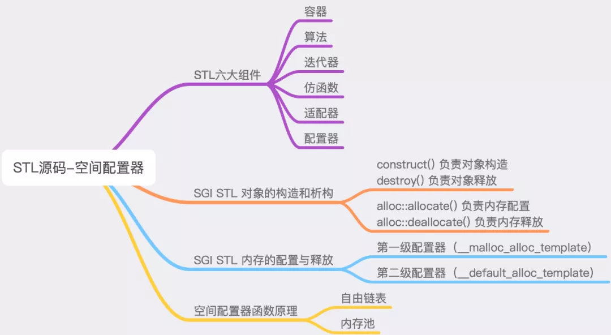

## 1、STL 六大组件
在深入配置器之前，有必要了解下 STL 的背景知识： 标准模板库（英文：Standard Template Library，缩写：STL），是一个 C++ 软件库。 STL 的价值在于两个方面，就底层而言，STL 带来一套极具实用价值的零部件以及一个整合的组织；除此之外，STL 还带来一个高层次的、以泛型思维 (Generic Paradigm) 为基础的、系统化的“软件组件分类学”。 STL 提供六大组件，了解这些为接下来的阅读打下基础。 1、容器（containers）:各种数据结构，如 vector, list, deque, set, map 用来存放数据。从实现的角度来看，STL 容器是一种 class template。 2、算法（algorithms）：各种常用的算法如 sort, search, copy, erase…从实现角度来看，STL 算法是一种 function template。 3、迭代器（iterators）：扮演容器与算法之间的胶合剂，是所谓的“泛型指针”。从实现角度来看，迭代器是一种将 operator *, operator ->, operator++, operator– 等指针相关操作予以重载的class template。 4、仿函数（functors）：行为类似函数，可以作为算法的某种策略。从实现角度来看，仿函数是一种重载了 operator() 的 class 或class template。 5、适配器（adapters）：一种用来修饰容器或仿函数或迭代器接口的东西。例如 STL 提供的 queue 和 stack，虽然看似容器，其实只能算是一种容器适配器，因为它们的底部完全借助 deque，所有操作都由底层的 deque 供应。 6、配置器（allocator）：负责空间配置与管理，从实现角度来看，配置器是一个实现了动态空间配置、空间管理、空间释放的 class template。 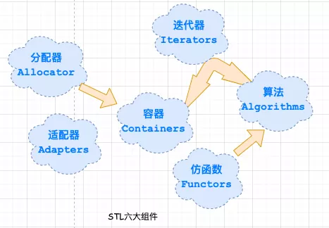

## 2、何为空间配置器

### 2.1 为何需要先了解空间配置器？
从使用 STL 层面而言，空间配置器并不需要介绍 ，因为容器底层都包装好了，但若是从 STL 实现角度出发，空间配置器是首要理解的。 作为 STL 设计背后的支撑，空间配置器总是在默默地付出着。为什么可以使用算法来高效地处理数据，为什么可以对容器进行各种操作，为什么用迭代器可以遍历空间，这一切的一切，都有“空间配置器”的功劳。

### 2.2 SGI STL 专属空间配置器
SGI STL 的空间配置器与众不同，且与 STL 标准规范不同。 其名为 alloc，而非 allocator。 虽然 SGI 也配置了 allocatalor，但是它自己并不使用，也不建议使用，原因是效率比较感人，因为它只是在基层进行配置/释放空间而已，而且不接受任何参数。 SGI STL 的每一个容器都已经指定缺省的空间配置器是 alloc。 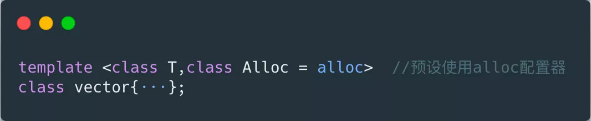 在 C++ 里，当调用 `new` 和 `delete` 进行对象的创建和销毁的时候，也同时会有内存配置操作和释放操作: 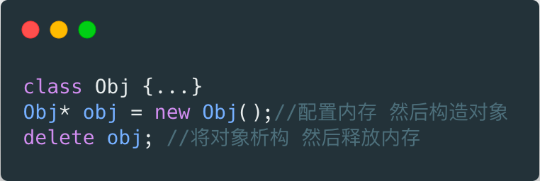 这其中的 new 和 delete 都包含两阶段操作： a. 对于 new 来说，编译器会先调用 ::operator new 分配内存；然后调用 Obj::Obj() 构造对象内容。 b. 对于 delete 来说，编译器会先调用 Obj::~Obj() 析构对象；然后调用  ::operator delete 释放空间。 为了精密分工，STL allocator 决定将这两个阶段操作区分开来。 c. 对象构造由 ::construct() 负责；对象释放由 ::destroy() 负责。 d. 内存配置由 alloc::allocate() 负责；内存释放由 alloc::deallocate() 负责； STL配置器定义在 <memory> 中，下图直观的描述了这一框架结构： 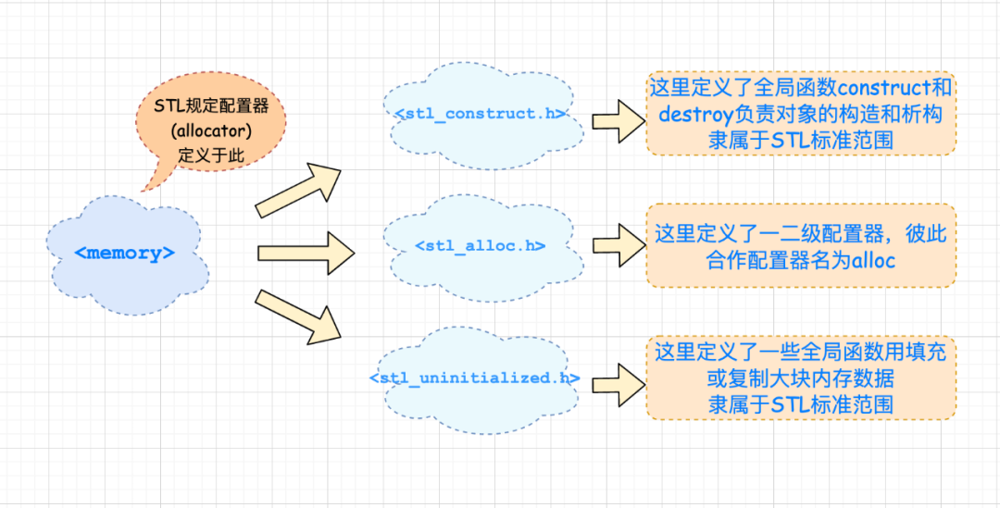

## 3、构造和析构源码
程序内存的申请和释放离不开基本的构造和析构基本工具：`construct()` 和 `destroy()` 。  在 STL 里面，`construct()` 函数接受一个指针 P 和一个初始值 value，该函数的用途就是将初值设定到指针所指的空间上。 `destroy()` 函数有两个版本，第一个版本接受一个指针，准备将该指针所指之物析构掉。直接调用析构函数即可。 第二个版本接受 first 和 last 两个迭代器，将[first,last)范围内的所有对象析构掉。 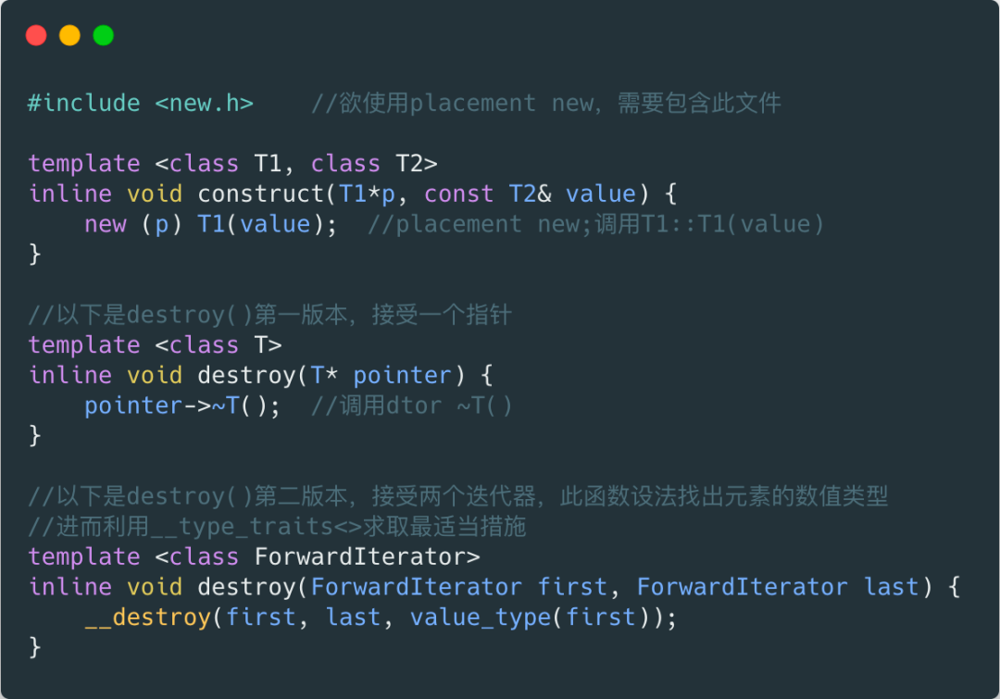 其中 `destroy()` 只截取了部分源码，全部实现还考虑到特化版本，比如判断元素的数值类型 (value type) 是否有 trivial destructor 等限于篇幅，完整代码请参阅《STL 源码剖析》。 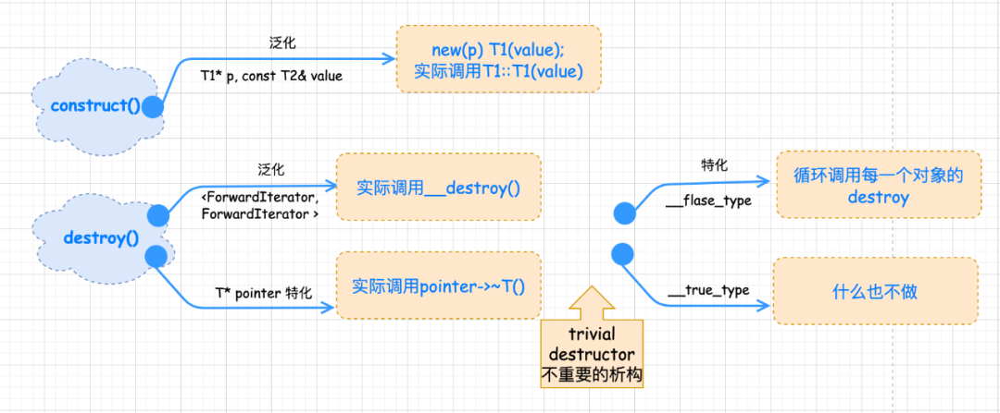

## 4、内存的配置与释放
前面所讲都是对象的构造和析构，接下来要讲的是对象构造和析构背后的故事—（内存的分配与释放），这块是才真正的硬核，不要搞混了哦。

### 4.1 真· alloc 设计奥义
对象构造和析构之后的内存管理诸项事宜，由 <stl_alloc.h> 一律负责。SGI 对此的设计原则如下： a. 向 system heap 要求空间 b. 考虑多线程 (multi-threads) 状态 c. 考虑内存不足时的应变措施 d. 考虑过多“小型区块”可能造成的内存碎片 (fragment) 问题 考虑到小型区块可能造成的内存破碎问题，SGI 为此设计了双层级配置器。当配置区块超过 128bytes 时，称为足够大，使用第一级配置器，直接使用 malloc() 和 free()。 当配置区块不大于 128bytes 时，为了降低额外负担，直接使用第二级配置器，采用复杂的 memory pool 处理方式。 无论使用第一级配接器（__malloc_alloc_template）或是第二级配接器（__default_alloc_template），alloc 都为其包装了接口，使其能够符合 STL 标准。 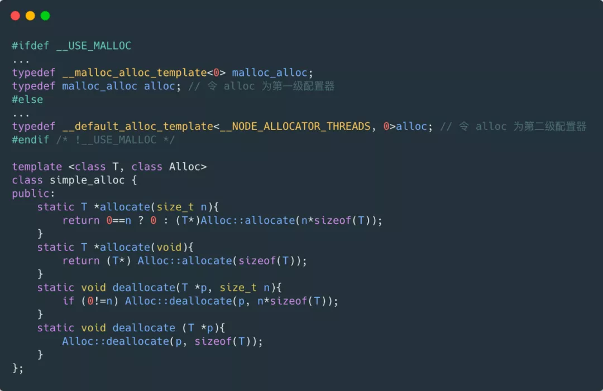 其中， `__malloc_alloc_template` 就是第一级配置器; `__default_alloc_template` 就是第二级配置器。 看下图。 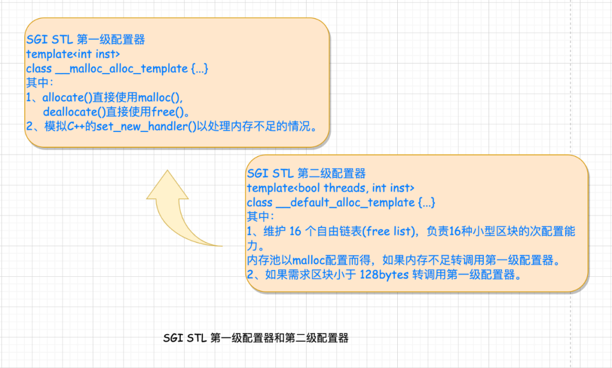 其中 SGI STL 将配置器多了一层包装使得 Alloc 具备标准接口。 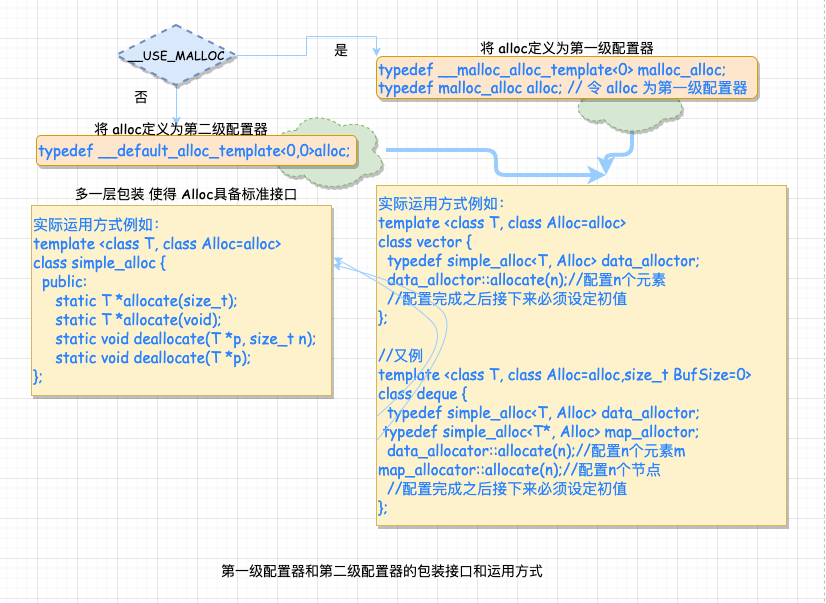

## 5、alloc 一级配置器源码解读
这里截取部分（精华）解读 （1）第一级配置器以 `malloc()`, `free()`, `realloc()` 等 C 函数执行实际的内存配置、释放和重配置操作，并实现类似 C++ new-handler 的机制（因为它并非使用 `::operator new` 来配置内存，所以不能直接使用C++ new-handler 机制）。 （2）SGI 第一级配置器的 `allocate()` 和 `reallocate()` 都是在调用`malloc()` 和 `realloc()` 不成功后，改调用 `oom_malloc()` 和`oom_realloc()`。 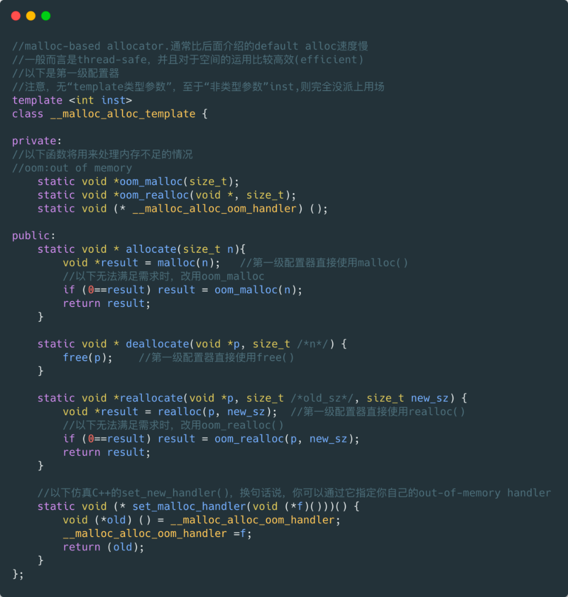 （3）`oom_malloc()` 和 `oom_realloc()` 都有内循环，不断调用“内存不足处理例程”，期望某次调用后，获得足够的内存而圆满完成任务，哪怕有一丝希望也要全力以赴申请啊，如果用户并没有指定“内存不足处理程序”，这个时候便无力乏天，真的是没内存了，STL 便抛出异常。或调用`exit(1)` 终止程序。 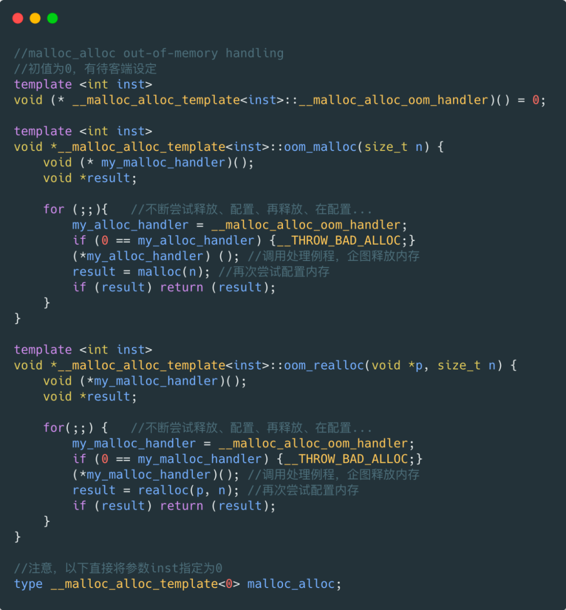

## 6、alloc 二级配置器源码解读
还是截取部分（精华）源码解读。 第二级配置器多了一些机制，专门针对内存碎片。内存碎片化带来的不仅仅是回收时的困难，配置也是一个负担，额外负担永远无法避免，毕竟系统要划出这么多的资源来管理另外的资源，但是区块越小，额外负担率就越高。 

### 6.1 SGI 第二级配置器到底解决了多少问题呢？
简单来说 SGI第二级配置器的做法是：sub-allocation （层次架构）： 前面也说过了，SGI STL 的第一级配置器是直接使用 malloc()， free(), realloc() 并配合类似 C++ new-handler 机制实现的。第二级配置器的工作机制要根据区块的大小是否大于 128bytes 来采取不同的策略：  继续跟上节奏，上面提到了 memory pool ，相信程序员朋友们很熟悉这个名词了，没错，这就是二级配置器的精髓所在，如何理解？请看下图： 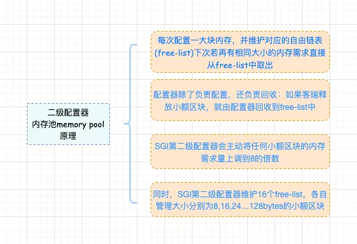 有了内存池，是不是就可以了，当然没有这么简单。上图中还提到了自由链表，这个又是何方神圣？ 来一探究竟！

### 6.2 自由链表自由在哪？又该如何维护呢？
一方面，自由链表中有些区块已经分配给了客端使用，所以 free_list 不需要再指向它们；另一方面，为了维护 free-list，每个节点还需要额外的指针指向下一个节点。 那么问题来了，如果每个节点有两个指针？这不就造成了额外负担吗？本来设计 STL 容器就是用来保存对象的，这倒好，对象还没保存之前，已经占据了额外的内存空间了。那么，有方法解决吗？当然有！再来感受一次大师的智慧！ （1）在这之前先来了解另一个概念——union（联合体/共用体），对 union 已经熟悉的读者可以跳过这一部分的内容；如果忘记了也没关系，趁此来回顾一下： （a）共用体是一种特殊的类，也是一种构造类型的数据结构。 （b）共用体表示几个变量共用一个内存位置，在不同的时间保存不同的数据类型和不同长度的变量。 （c）所有的共用体成员共用一个空间，并且同一时间只能储存其中一个成员变量的值。例如如下： 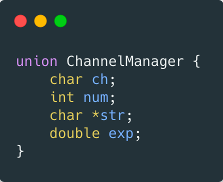 一个union 只配置一个足够大的空间以来容纳最大长度的数据成员，以上例而言，最大长度是 double 类型， 所以 ChannelManager 的空间大小就是 double 数据类型的大小。在 C++ 里，union 的成员默认属性页为 public。union 主要用来压缩空间，如果一些数据不可能在同一时间同时被用到，则可以使用 union。 （2）了解了 union 之后，可以借助 union 的帮助，先来观察一下 free-list 节点的结构 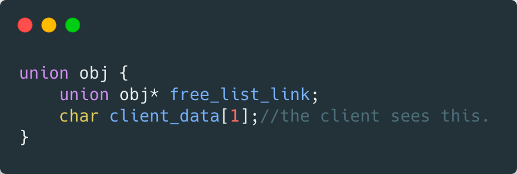 来深入了解 free_list 的实现技巧，请看下图。 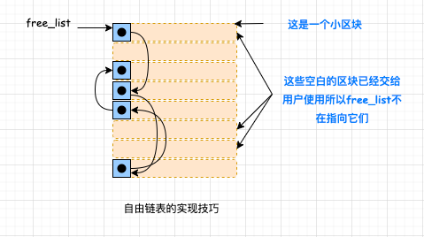 在 union obj 中，定义了两个字段，再结合上图来分析： 从第一个字段看，obj 可以看做一个指针，指向链表中的下一个节点； 从第二个字段看，obj 可以也看做一个指针，不过此时是指向实际的内存区。 一物二用的好处就是不会为了维护链表所必须的指针而造成内存的另一种浪费，或许这就是所谓的自由奥义所在！大师的智慧跃然纸上。

### 6.3 第二级配置器的部分实现内容
到这里，已经基本了解了第二级配置器中 free_list 的工作原理了。附上第二级配置器的部分实现内容源码： 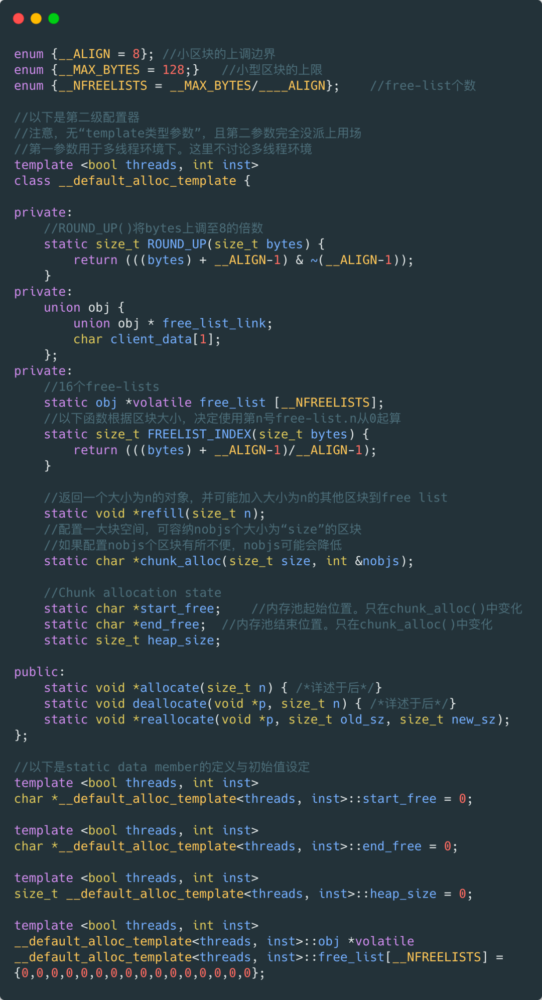

## 7、空间配置器函数allocate源码解读
第二级配置器拥有配置器的标准接口函数 allocate()。此函数首先判断区块的大小，如果大于 128bytes –> 调用第一级配置器；小于128bytes–> 就检查对应的 free_list（如果没有可用区块，就将区块上调至 8 倍数的边界，然后调用 `refill()`, 为 free list 重新填充空间。

### 7.1 空间申请
调用标准接口函数 allocate()： 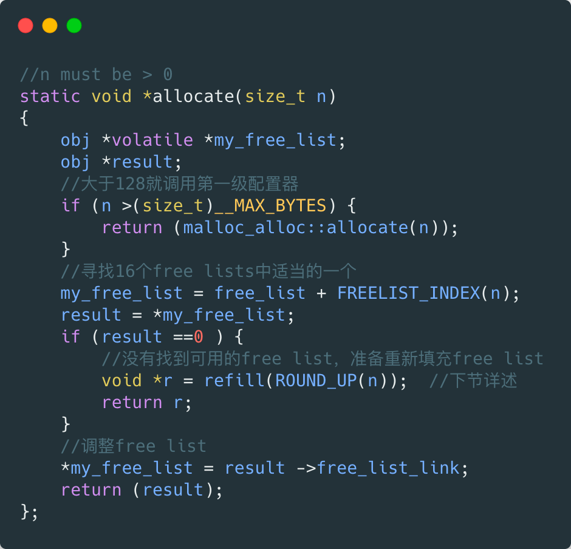 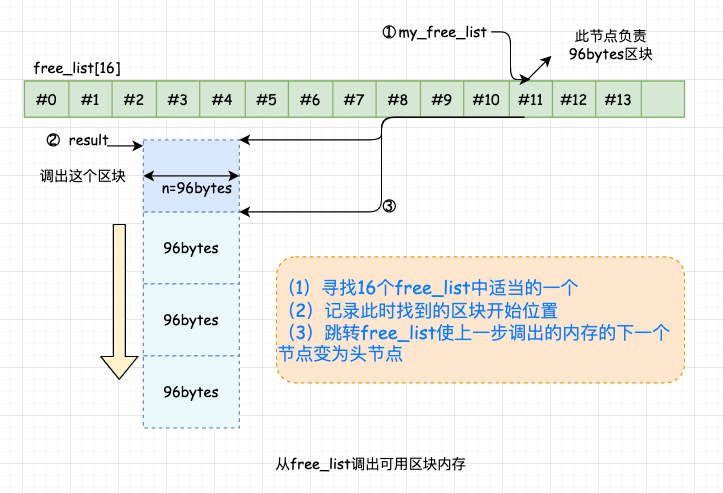 NOTE：每次都是从对应的 free_list 的头部取出可用的内存块。然后对free_list 进行调整，使上一步拨出的内存的下一个节点变为头结点。

### 7.2 空间释放
同样，作为第二级配置器拥有配置器标准接口函数 deallocate()。该函数首先判断区块大小，大于 128bytes 就调用第一级配置器。小于 128bytes 就找出对应的 free_list，将区块回收。 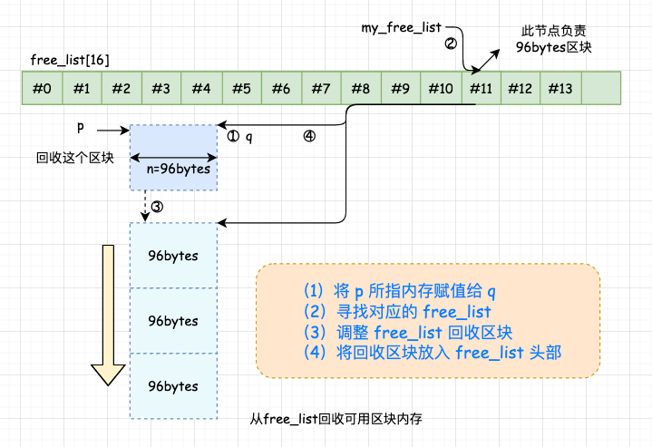 NOTE：通过调整free_ list链表将区块放入free list的头部。 区块回收纳入 free_list 的操作，如图所示：

### 7.3 重新填充 free_lists
（1）当发现 free list 中没有可用区块时，就会调用 refill() 为free_list 重新填充空间； （2）新的空间将取自内存池（经由 chunk_alloc() 完成）； （3）缺省取得20个新节点（区块），但万一内存池空间不足，获得的节点数可能小于 20。 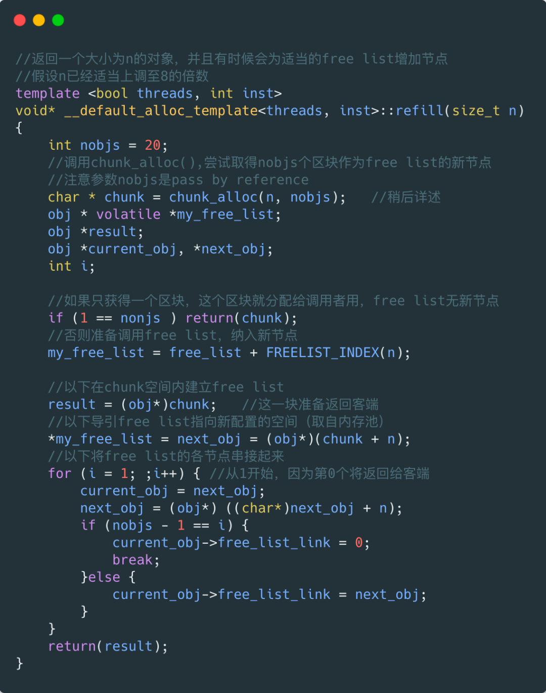

### 7.4 内存池（memory pool）
在前面提到了 memory pool，现在终于轮到这个大 boss 上场。 首先，要知道从内存池中取空间给 free_list 使用，是 `chunk_alloc()` 在工作，它是怎么工作的呢？ 先来分析 `chunk_alloc()` 的工作机制： `chunk_alloc()` 函数以 end_free – start_free 来判断内存池的“水量”。 具体逻辑都在下面的图里了，很形象吧。

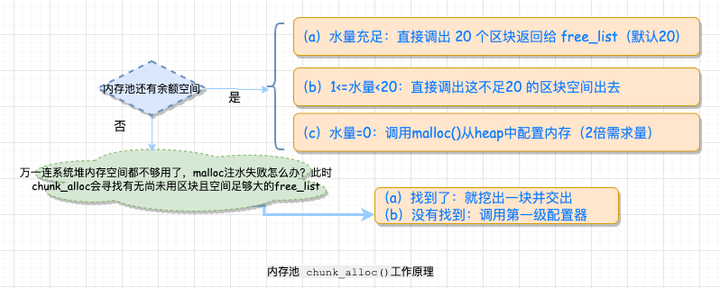 如果第一级配置器的 malloc() 也失败了，就发出 bad_alloc 异常。 说了这么多来看一下 STL 的源码吧。 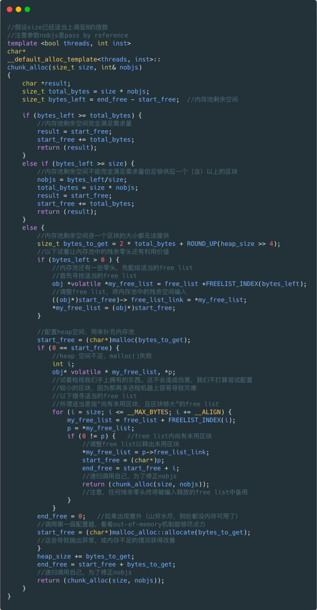 太长了，又看懵逼了吧，没关系，请看下图。 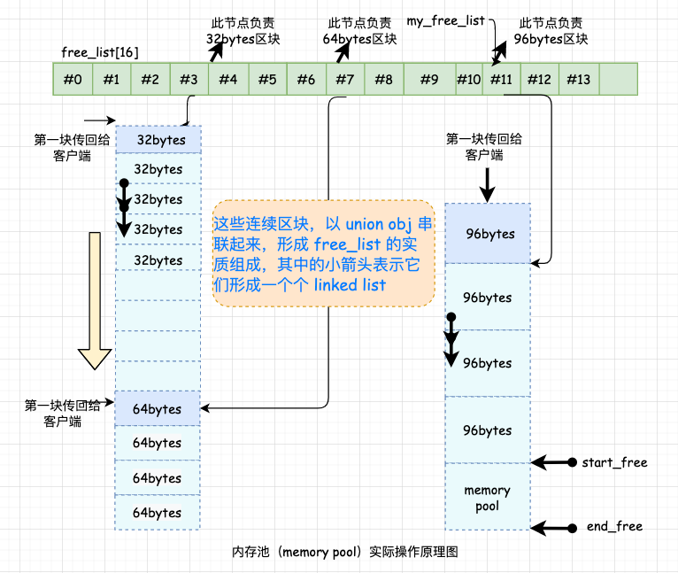 NOTE：上述就是 STL 源码当中实际内存池的操作原理，可以看到其实以共用体串联起来共享内存形成了free_list的实质组成。
