# C++ STL

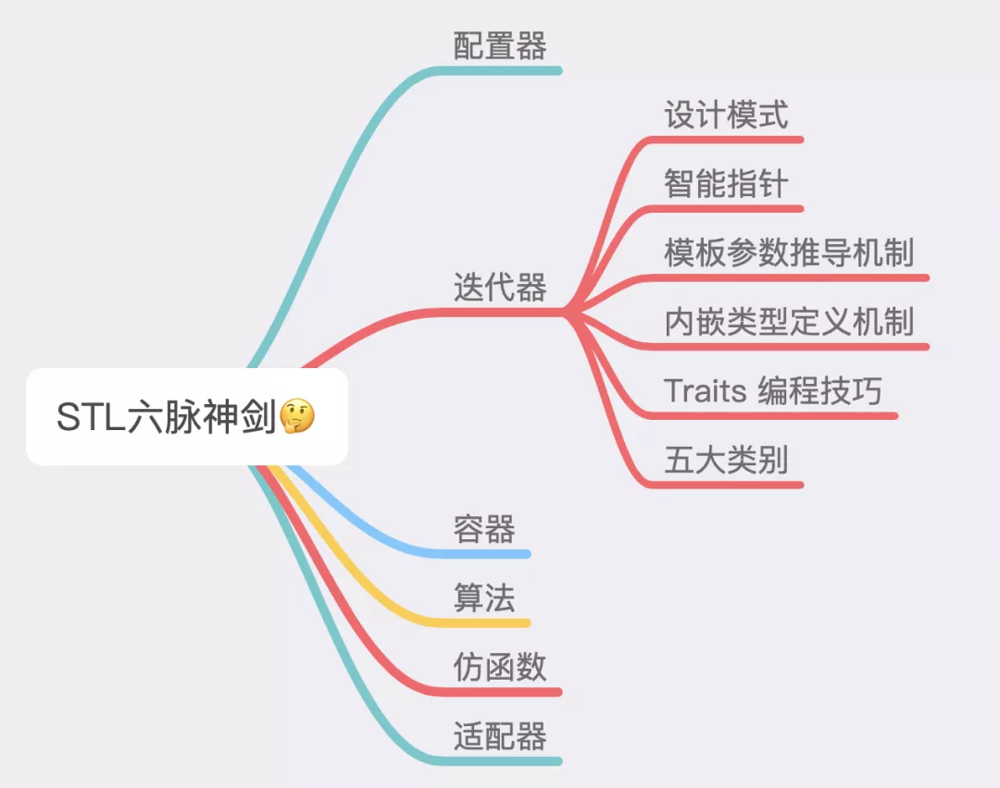<br />在 STL 编程中，容器和算法是独立设计的，容器里面存的是数据，而算法则是提供了对数据的操作，在算法操作数据的过程中，要用到迭代器，迭代器可以看做是容器和算法中间的桥梁。<br />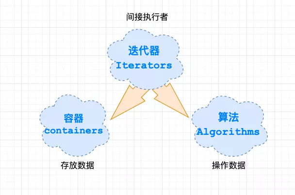
<a name="UxxTP"></a>

## 1、迭代器设计模式
为何说迭代器的时候，还谈到了设计模式？这个迭代器和设计模式又有什么关系呢？<br />其实，在《设计模式：可复用面向对象软件的基础》（GOF）这本经典书中，谈到了 23 种设计模式，其中就有 iterator 迭代模式，且篇幅颇大。<br />在研究 STL 源码的时候，同样的发现有 iterator 迭代器，而且还占据了一章的篇幅。<br />在设计模式中，关于 iterator 的描述如下：一种能够顺序访问容器中每个元素的方法，使用该方法不能暴露容器内部的表达方式。而类型萃取技术就是为了要解决和 iterator 有关的问题的。<br />有了上面这个基础，就知道了迭代器本身也是一种设计模式，其设计思想值得仔细体会。<br />那么 C++ STL 实现 iterator 和 GOF 介绍的迭代器实现方法什么区别呢？ 那首先需要了解 C++ 中的两个编程范式的概念，OOP（面向对象编程）和 GP（泛型编程）。<br />在 C++ 语言里面，可用以下方式来简单区分一下 OOP 和 GP <br />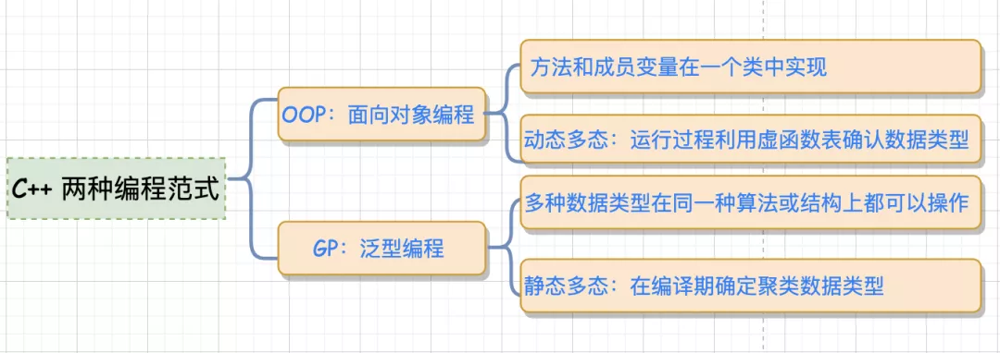<br />OOP：将 methods 和 datas 关联到一起 （通俗点就是方法和成员变量放到一个类中实现），通过继承的方式，利用虚函数表（virtual）来实现运行时类型的判定，也叫"动态多态"，由于运行过程中需根据类型去检索虚函数表，因此效率相对较低。<br />GP：泛型编程，也被称为"静态多态"，多种数据类型在同一种算法或者结构上皆可操作，其效率与针对某特定数据类型而设计的算法或者结构相同， 具体数据类型在编译期确定，编译器承担更多，代码执行效率高。在 STL 中利用 GP 将 methods 和 datas 实现了分而治之。<br />而 C++ STL 库的整个实现采用的就是 GP（Generic Programming），而不是 OOP（Object Oriented Programming）。而 GOF 设计模式采用的就是继承关系实现的，因此，相对来讲，C++ STL 的实现效率会相对较高，而且也更有利于维护。<br />在 STL 编程结构里面，迭代器其实也是一种模板 class ，迭代器在 STL 中得到了广泛的应用，通过迭代器，容器和算法可以有机的绑定在一起，只要对算法给予不同的迭代器，比如 `vector::iterator`、`list::iterator`，`std::find()`  就能对不同的容器进行查找，而无需针对某个容器来设计多个版本。<br />这样看来，迭代器似乎依附在容器之下，那么，有没有独立而适用于所有容器的泛化的迭代器呢？这个问题先留着，在后面会看到，在 STL 编程结构里面，它是如何把迭代器运用的炉火纯青。
<a name="EBb3t"></a>
## 2、智能指针
STL  是泛型编程思想的产物，是以泛型编程为指导而产生的。具体来说，STL 中的迭代器将范型算法 `(find, count, find_if)` 等应用于某个容器中，给算法提供一个访问容器元素的工具，iterator  就扮演着这个重要的角色。<br />稍微看过 STL 迭代器源码的，就明白迭代器其实也是一种智能指针，因此，它也就拥有了一般指针的所有特点—— 能够对其进行 *和 -> 操作。
```cpp
template<typename T>
class ListIterator {//mylist迭代器
public:
    ListIterator(T *p = 0) : m_ptr(p){} //构造函数
    T& operator*() const { return *m_ptr;}  //取值，即dereference
    T* operator->() const { return m_ptr;} //成员访问，即member access
    //...
};
```
但是在遍历容器的时候，不可避免的要对遍历的容器内部有所了解，所以，干脆把迭代器的开发工作交给容器的设计者，如此以来，所有实现细节反而得以封装起来不被使用者看到，这也正是为什么每一种 STL 容器都提供有专属迭代器的缘故。<br />比如笔者自己实现的 list  迭代器在这里使用的好处主要有：

- (1) 不用担心内存泄漏（类似智能指针，析构函数释放内存）；
- (2) 对于 list ，取下一个元素不是通过自增而是通过 next  指针来取，使用智能指针可以对自增进行重载，从而提供统一接口。
<a name="afHxh"></a>
## 3、模板参数推导
参数推导能解决什么问题呢？<br />在算法中，可能会定义一个简单的中间变量或者设定算法的返回变量类型，这时候，可能会遇到这样的问题：<br />假如需要知道迭代器所指元素的类型是什么，进而获取这个迭代器操作的算法的返回类型，但是问题是 C++   没有 `typeof` 这类判断类型的函数，也无法直接获取，那该如何是好？<br />注意是类型，不是迭代器的值，虽然 C++  提供了一个 `typeid()`  操作符，这个操作符只能获得型别的名称，但不能用来声明变量。要想获得迭代器型别，这个时候又该如何是好呢？<br />`function template`  的参数推导机制是一个不错的方法。<br />例如：<br />如果 I  是某个指向特定对象的指针，那么在 func 中需要指针所指向对象的型别的时候，怎么办呢？这个还比较容易，模板的参数推导机制可以完成任务，
```cpp
template <class I>
inline void func(I iter) {
    func_imp(iter, *iter); // 传入 iter 和 iter 所指的值，class 自动推导
}
```
通过模板的推导机制，就能轻而易举的获得指针所指向的对象的类型。
```cpp
template <class I, class T>
void func_imp(I iter, T t) {
        T tmp; // 这里就是迭代器所指物的类别
        // ... 功能实现
}
int main() {
    int i;
    func(&i);//这里传入的是一个迭代器（原生指针也是一种迭代器）
}
```
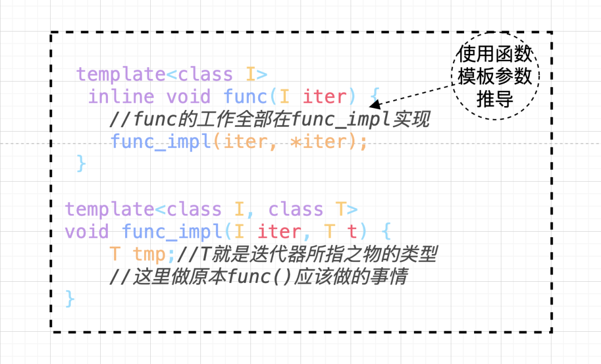上面的做法呢，通过多层的迭代，很巧妙地导出了 `T` ，但是却很有局限性，比如，希望 `func()`  返回迭代器的 `value type`  类型返回值， 函数的 `template`  参数推导机制" 推导的只是参数，无法推导函数的返回值类型。万一需要推导函数的返回值，好像就不行了，那么又该如何是好？<br />这就引出了下面的内嵌型别。
<a name="wo2WL"></a>
## 4、声明内嵌型别
上述所说的 迭代器所指对象的型别，称之为迭代器的 `value type` 。<br />尽管在 `func_impl`  中可以把 T  作为函数的返回值，但是问题是用户需要调用的是 `func` 。<br />如果在参数推导机制上加上内嵌型别 `(typedef)`  呢？为指定的对象类型定义一个别名，然后直接获取，这样来看一下实现：
```cpp
template<typename T>
class MyIter {
public:
    typedef T value_type; //内嵌类型声明
    MyIter(T *p = 0) : m_ptr(p) {}
    T& operator*() const { return *m_ptr;}
private:
    T *m_ptr;
};

//以迭代器所指对象的类型作为返回类型
//注意typename是必须的，它告诉编译器这是一个类型
template<typename MyIter>
typename MyIter::value_type Func(MyIter iter) {
    return *iter;
}

int main(int argc, const  char *argv[]) {
    MyIter<int> iter(new int(666));
    std::cout<<Func(iter)<<std::endl;  //print=> 666
}
```
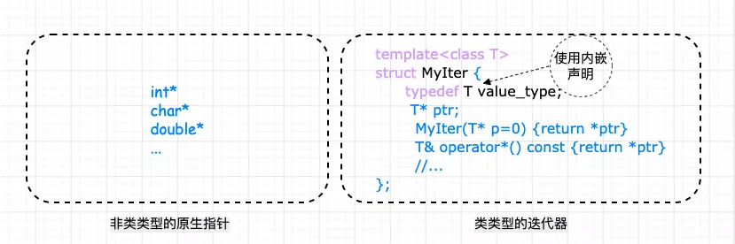<br />上面的解决方案看着可行，但其实呢，实际上还是有问题，这里有一个隐晦的陷阱：实际上并不是所有的迭代器都是 `class type` ，原生指针也是一种迭代器，由于原生指针不是 `class type` ，所以没法为它定义内嵌型别。<br />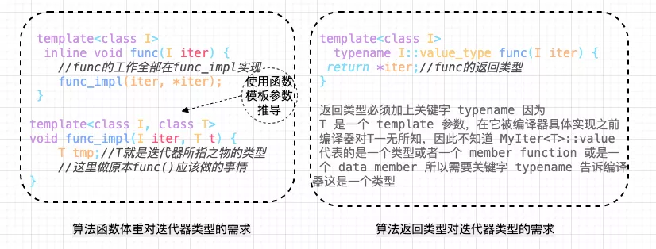<br />因为 `func`  如果是一个泛型算法，那么它也绝对要接受一个原生指针作为迭代器，下面的代码编译没法通过：
```cpp
int *p = new int(5);
cout<<Func(p)<<endl; // error
```
要解决这个问题，Partial specialization （模板偏特化）就出场了。
<a name="v1W3u"></a>
## 5、Partial specialization 模板偏特化
所谓偏特化是指如果一个 `class template`  拥有一个以上的 `template`  参数，可以针对其中某个（或多个，但不是全部）`template`  参数进行特化，比如下面这个例子：
```cpp
template <typename T>
class C {...}; //此泛化版本的 T 可以是任何类型
template <typename T>
class C<T*> {...}; //特化版本，仅仅适用于 T 为“原生指针”的情况，是泛化版本的限制版
```
所谓特化，就是特殊情况特殊处理，第一个类为泛化版本，T  可以是任意类型，第二个类为特化版本，是第一个类的特殊情况，只针对原生指针。
<a name="hYEri"></a>
### 5.1 原生指针怎么办？——特性 “萃取” traits
还记得前面说过的参数推导机制+内嵌型别机制获取型别有什么问题吗？问题就在于原生指针虽然是迭代器但不是class ，无法定义内嵌型别，而偏特化似乎可以解决这个问题。<br />有了上面的认识，再看看 STL  是如何应用的。STL  定义了下面的类模板，它专门用来“萃取”迭代器的特性，而value type  正是迭代器的特性之一：<br />traits  在 `bits/stl_iterator_base_types.h` 这个文件中：
```cpp
template<class _Tp>
struct iterator_traits<_Tp*> {
    typedef ptrdiff_t difference_type;
    typedef typename _Tp::value_type value_type;
    typedef typename _Tp::pointer pointer;
    typedef typename _Tp::reference reference;
    typedef typename _Tp::iterator_category iterator_category;
};

template<typename Iterator>
struct iterator_traits {  //类型萃取机
 typedef typename Iterator::value_type value_type; //value_type 就是 Iterator 的类型型别
}
```
加入萃取机前后的变化：
```cpp
template<typename Iterator> //萃取前
typename Iterator::value_type  func(Iterator iter) {
    return *iter;
}

//通过 iterator_traits 作用后的版本
template<typename Iterator>  //萃取后
typename iterator_traits<Iterator>::value_type  func(Iterator iter) { 
    return *iter;
}
```
看到这里也许会问了，这个萃取前和萃取后的 `typename ：iterator_traits::value_type`  跟 `Iterator::value_type`  看起来一样啊，为什么还要增加 `iterator_traits`  这一层封装，岂不是多此一举？<br />回想萃取之前的版本有什么缺陷：不支持原生指针。而通过萃取机的封装，可以通过类模板的特化来支持原生指针的版本！如此一来，无论是智能指针，还是原生指针，iterator_traits::value_type 都能起作用，这就解决了前面的问题。
```cpp
//iterator_traits的偏特化版本，针对迭代器是原生指针的情况
template<typename T>
struct iterator_traits<T*> {
    typedef T value_type;
};
```
看到这里，不得不佩服的 STL 的设计者们，用下面这张图来总结一下前面的流程：<br />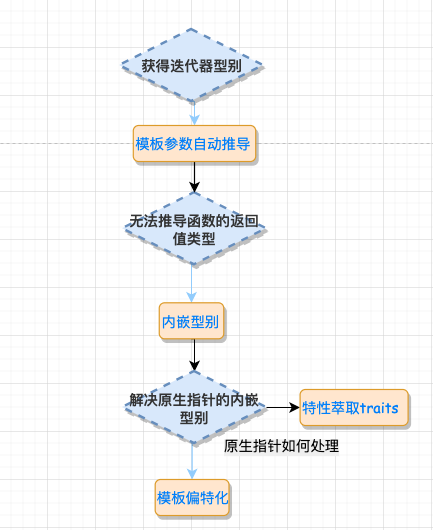
<a name="CrnEr"></a>
### 5.2 `const` 偏特化
通过偏特化添加一层中间转换的 traits 模板 class，能实现对原生指针和迭代器的支持，对于指向常数对象的指针又该怎么处理呢？比如下面的例子：
```cpp
iterator_traits<const int*>::value_type  // 获得的 value_type 是 const int，而不是 int
```
const 变量只能初始化，而不能赋值（这两个概念必须区分清楚）。这将带来下面的问题：
```cpp
template<typename Iterator>
typename iterator_traits<Iterator>::value_type  func(Iterator iter) { 
    typename iterator_traits<Iterator>::value_type tmp; 
    tmp = *iter; // 编译 error
}

int val = 666 ;
const int *p = &val;
func(p); // 这时函数里对 tmp 的赋值都将是不允许的
```
那该如何是好呢？答案还是偏特化，来看实现：
```cpp
template<typename T>
struct iterator_traits<const T*> { //特化const指针
    typedef T value_type; //得到T而不是const T
}
```
<a name="rY4WP"></a>
## 6、traits编程技法
所谓的 traits 编程技法无非 就是增加一层中间的模板 class，以解决获取迭代器的型别中的原生指针问题。利用一个中间层 `iterator_traits` 固定了 `func` 的形式，使得重复的代码大量减少，唯一要做的就是稍稍特化一下 `iterator_tartis`  使其支持  `pointer`  和  `const pointer` 。<br />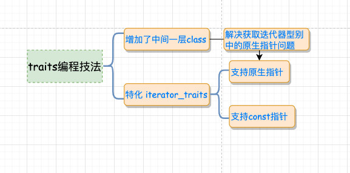
```cpp
#include <iostream>

template <class T>
struct MyIter {
    typedef T value_type; // 内嵌型别声明
    T* ptr;
    MyIter(T* p = 0) : ptr(p) {}
    T& operator*() const { return *ptr; }
};
// class type
template <class T>
struct my_iterator_traits {
    typedef typename T::value_type value_type;
};
// 偏特化 1
template <class T>
struct my_iterator_traits<T*> {
    typedef T value_type;
};
// 偏特化 2
template <class T>
struct my_iterator_traits<const T*> {
    typedef T value_type;
};

// 首先询问 iterator_traits<I>::value_type,如果传递的 I 为指针,则进入特化版本,iterator_traits 直接回答;如果传递进来的 I 为 class type,就去询问 T::value_type.
template <class I>
typename my_iterator_traits<I>::value_type Func(I ite) {
    std::cout << "normal version" << std::endl;
    return *ite;
}
int main(int argc, const  char *argv[]) {
    MyIter<int> ite(new int(6));
    std::cout << Func(ite)<<std::endl;//print=> 6
    int *p = new int(7);
    std::cout<<Func(p)<<std::endl;//print=> 7
    const int k = 8;
    std::cout<<Func(&k)<<std::endl;//print=> 8
}
```
上述的过程是首先询问 `iterator_traits::value_type`，如果传递的 I 为指针,则进入特化版本, `iterator_traits` 直接回答`T`；如果传递进来的 I 为 class type ，就去询问 `T::value_type`。<br />通俗的解释可以参照下图：<br />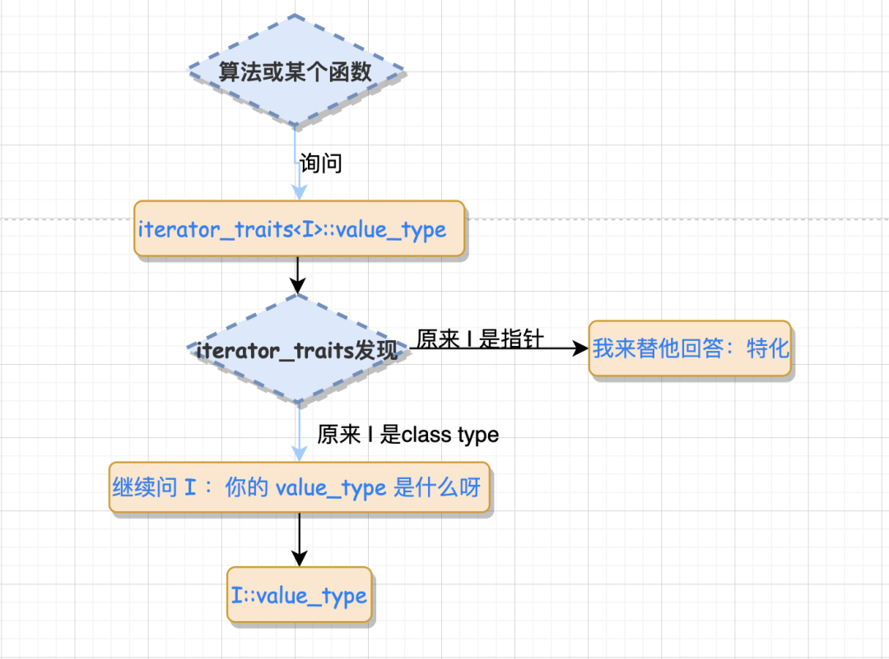<br />总结：核心知识点在于 模板参数推导机制+内嵌类型定义机制， 为了能处理原生指针这种特殊的迭代器，引入了偏特化机制。traits 就像一台 “特性萃取机”，把迭代器放进去，就能榨取出迭代器的特性。<br />这种偏特化是针对可调用函数 func 的偏特化，想象一种极端情况，假如 func 有几百万行代码，那么如果不这样做的话，就会造成非常大的代码污染。同时增加了代码冗余。<br />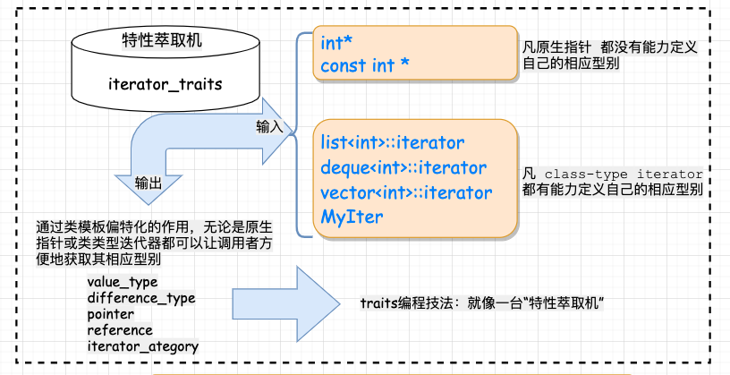
<a name="tufFe"></a>
## 7、迭代器的型别和分类
<a name="OxPPb"></a>
### 7.1 迭代器的型别
再来看看迭代器的型别，常见迭代器相应型别有 5 种：

- `value_type`：迭代器所指对象的类型，原生指针也是一种迭代器，对于原生指针 `int*`，int 即为指针所指对象的类型，也就是所谓的 `value_type `。
- `difference_type`：用来表示两个迭代器之间的距离，对于原生指针，STL 以 C++ 内建的 `ptrdiff_t` 作为原生指针的 `difference_type`。
- `reference_type`：是指迭代器所指对象的类型的引用，`reference_type` 一般用在迭代器的 * 运算符重载上，如果 `value_type` 是 `T`，那么对应的 `reference_type` 就是 `T&`；如果 `value_type` 是 const T，那么对应的`reference_type` 就是 `const T&`。
- `pointer_type`：就是相应的指针类型，对于指针来说，最常用的功能就是 operator* 和 operator-> 两个运算符。
- `iterator_category`：的作用是标识迭代器的移动特性和可以对迭代器执行的操作，从 `iterator_category` 上，可将迭代器分为 Input Iterator、Output Iterator、Forward Iterator、Bidirectional Iterator、Random Access Iterator 五类，这样分可以尽可能地提高效率。
```cpp
template<typename Category,
         typename T,
         typename Distance = ptrdiff_t,
         typename Pointer = T*,
         typename Reference = T&>
struct iterator //迭代器的定义
{
    typedef Category iterator_category;
    typedef T value_type;
    typedef Distance difference_type;
    typedef Pointer pointer;
    typedef Reference reference;
};
```
iterator class 不包含任何成员变量，只有类型的定义，因此不会增加额外的负担。由于后面三个类型都有默认值，在继承它的时候，只需要提供前两个参数就可以了。这个类主要是用来继承的，在实现具体的迭代器时，可以继承上面的类，这样子就不会漏掉上面的 5 个型别了。<br />对应的迭代器萃取机设计如下：
```cpp
tempalte<typename I>
struct iterator_traits {//特性萃取机，萃取迭代器特性
    typedef typename I::iterator_category iterator_category;
    typedef typename I::value_type value_type;
    typedef typeanme I:difference_type difference_type;
    typedef typename I::pointer pointer;
    typedef typename I::reference reference;
};

//需要对型别为指针和 const 指针设计特化版本看
```
<a name="D7EfX"></a>
### 7.2 迭代器的分类
最后，来看看，迭代器型别 `iterator_category` 对应的迭代器类别，这个类别会限制迭代器的操作和移动特性。除了原生指针以外，迭代器被分为五类：

- Input Iterator：此迭代器不允许修改所指的对象，是只读的。支持 ==、!=、++、*、-> 等操作。
- Output Iterator：允许算法在这种迭代器所形成的区间上进行只写操作。支持 ++、* 等操作。
- Forward Iterator：允许算法在这种迭代器所形成的区间上进行读写操作，但只能单向移动，每次只能移动一步。支持 Input Iterator  和 Output Iterator 的所有操作。
- Bidirectional Iterator：允许算法在这种迭代器所形成的区间上进行读写操作，可双向移动，每次只能移动一步。支持 Forward Iterator 的所有操作，并另外支持 –  操作。
- Random Access Iterator：包含指针的所有操作，可进行随机访问，随意移动指定的步数。支持前面四种  Iterator  的所有操作，并另外支持 [n] 操作符等操作。

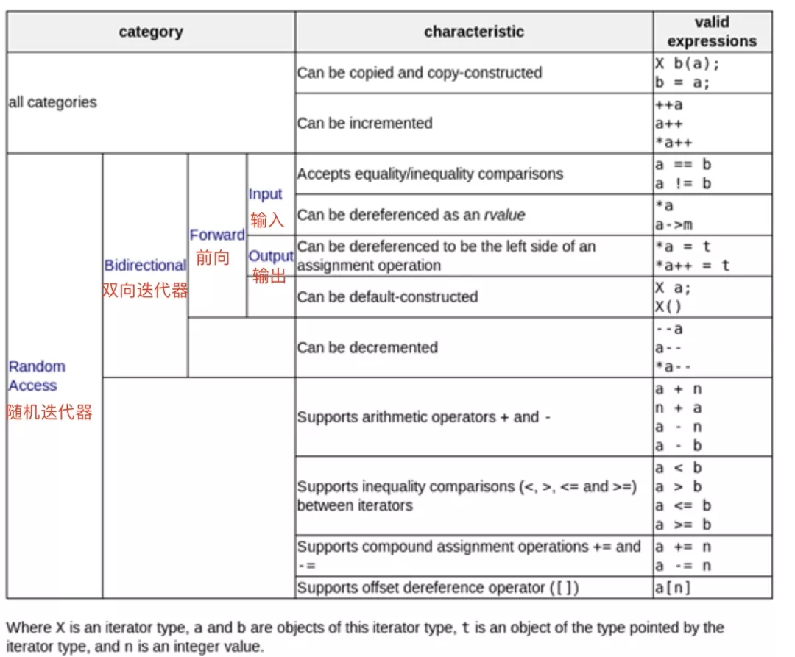<br />再来回顾一下六大组件的关系：<br />这六大组件的交互关系：<br />container（容器） 通过 allocator（配置器） 取得数据储存空间，algorithm（算法）通过 iterator（迭代器）存取 container（容器） 内容，functor（仿函数） 可以协助 algorithm（算法） 完成不同的策略变化，adapter（配接器） 可以修饰或套接 functor（仿函数）。
